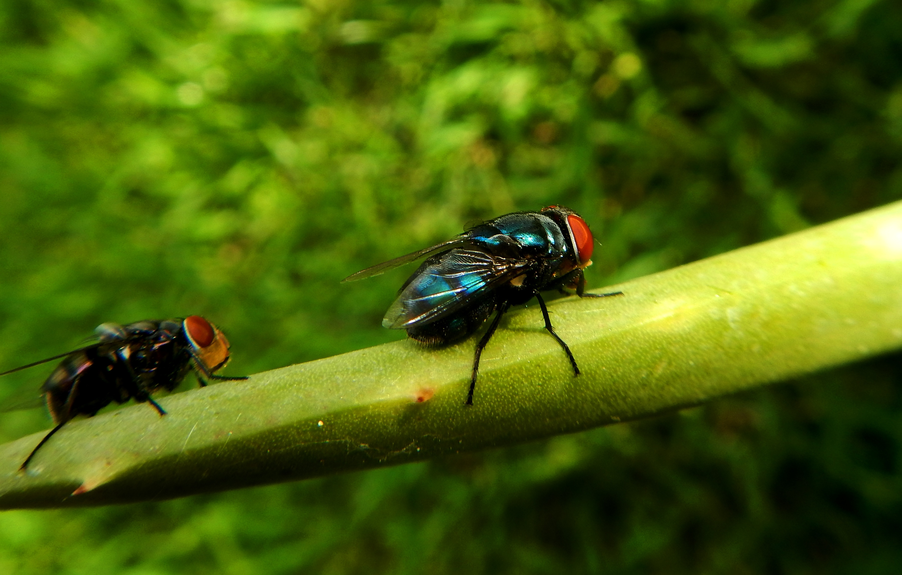
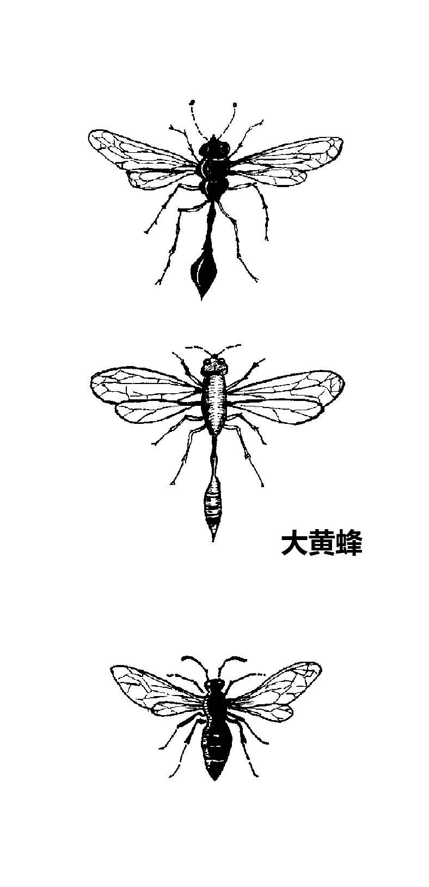

# Animals in the Bible

## License Information

Animals in the Bible © United Bible Societies, 2025. Adapted from: <cite>All Creatures Great and Small: Living Things in the Bible</cite>, by Edward R. Hope © 2005 United Bible Societies. This work is licensed under Creative Commons Attribution-ShareAlike 4.0 International (<a href="https://creativecommons.org/licenses/by-sa/4.0/">https://creativecommons.org/licenses/by-sa/4.0/</a>).

--------------------------------

## 标题：昆虫、蜘蛛和蠕虫 (id: FAUNA:6)

6 标题：昆虫、蜘蛛和蠕虫
=============

* [6\.1 蚂蚁（ant）](#FAUNA:6.1)
* [6\.2 蜜蜂（bee）](#FAUNA:6.2)
* [6\.3 跳蚤、虼蚤（flea）](#FAUNA:6.3)
* [6\.4 苍蝇（fly）](#FAUNA:6.4)
* [6\.5 牛虻（gadfly）](#FAUNA:6.5)
* [6\.6 蚊蚋、蚊子、虱子（gnat, mosquito, mouse）](#FAUNA:6.6)
* [6\.7 大黄蜂、黄蜂（hornet, wasp）](#FAUNA:6.7)
* [6\.8 水蛭（leech）](#FAUNA:6.8)
* [6\.9 蝗虫、蚱蜢、蟋蟀（locust, grasshopper, cricket）](#FAUNA:6.9)
* [6\.10 飞蛾（moth）](#FAUNA:6.10)
* [6\.11 蝎子（scorpion）](#FAUNA:6.11)
* [6\.12 蜘蛛（spider）](#FAUNA:6.12)
* [6\.13 蠕虫、蛆（worm, maggot）](#FAUNA:6.13)

## 标题：蚂蚁（ant） (id: FAUNA:6.1)

6\.1 标题：蚂蚁（ant）
===============

经文出处
----

Hebrew 来：נְמָלָה (音译：nemalah)

[PRO 6:6](https://ref.ly/Prov6:6), [PRO 30:25](https://ref.ly/Prov30:25)

讨论
--

这个希伯来文名称很可能涵盖了所有种类的蚂蚁，但最符合圣经背景的种类显然是收获蚁（学名*Messor semirufus* ），这种蚂蚁在以色列各地很常见。夏天，收获蚁收集成熟的谷物和草籽，并储存在蚁穴中以备过冬。

描述
--

收获蚁是一种体型较大的深褐色蚂蚁。和大多数蚂蚁一样，收获蚁的蚁穴是蚁后、工蚁和兵蚁的家；兵蚁的职责是保护蚁穴。蚁穴位于地下，入口很容易辨认，通常会有多条通向蚁穴的细小路径，以及许多蚂蚁留在入口附近的糠秕。蚂蚁能扛起超过自身重量许多倍的东西。

特殊意义或象征意义
---------

蚂蚁是殷勤和努力工作的象征。

翻译
--

最好的译法可能就是蚂蚁的统称，但是如果有必要，使用当地一种会将食物运回蚁穴的蚂蚁名称也很合适。

* **Associated Passages:** 箴言 6:6; 箴言 30:25

## 标题：蜜蜂（bee） (id: FAUNA:6.2)

6\.2 标题：蜜蜂（bee）
===============

经文出处
----

Hebrew 来：דְּבוֹרָה (音译：devorah)

[DEU 1:44](https://ref.ly/Deut1:44), [JDG 14:8](https://ref.ly/Judg14:8), [PSA 118:12](https://ref.ly/Ps118:12), [ISA 7:18](https://ref.ly/Isa7:18)

Greek 希：μέλισσα (音译：melissa)

[SIR 11:3](https://ref.ly/Wis11:3)

讨论
--

圣经时期，在以色列地生存的蜜蜂显然非常凶悍，因为大多数提到蜜蜂的经文都描述它们成群地移动，并且会攻击人。现今在蜂场饲养的蜜蜂都是通过特别挑选蜂王进行繁殖的，已经相当驯服，但是以前的蜜蜂很可能要凶猛得多。大多数圣经经文都是指"野蜂"，即天然蜂窝中的蜜蜂，而不是指养在人造蜂箱中的蜜蜂。然而，当时的以色列可能也有饲养蜜蜂的蜂场，因为在很早的时候，埃及、希腊和罗马等地的人就经常养蜂。

希伯来文*devash* 指蜂蜜，也指从无花果、枣椰、葡萄或某些种类的棕榈树提取出来的糖浆。"流奶与蜜之地"这个短语指的是一片肥沃的土地，因此有丰富的牧草、水果、谷物，以及可供蜜蜂酿蜜的花。

描述
--

蜜蜂是一种会飞的昆虫，采集各种花蜜，然后将其转化为蜂蜜。蜜蜂群聚生活，每个蜂群通常有几千只蜜蜂，在空心原木、岩石缝隙、地底下的洞穴、白蚁弃置的蚁穴，或者其他地方筑窝。在蜂窝里面，蜜蜂用蜂蜡建造蜂巢。蜂巢中有很多小房间（蜂房），蜂王在最靠近蜂窝中心的蜂房产卵，幼蜂便在蜂房里长大，蜂蜜则储存在较靠外边的蜂房。蜜蜂会螫人，当它们感到自己的蜂窝受到威胁时就会采取行动。当一只蜜蜂螫刺后，发出的气味会使蜂窝中其他的蜜蜂也变得有攻击性。

翻译
--

由于全世界都有蜜蜂，因此翻译时通常没有什么问题。在翻译[JDG 14:8](https://ref.ly/Judg14:8) 时，如果目标语言没有表示"蜂"的统称，那么可以使用表示"蜜蜂"的特定名称，或是能酿造可食用蜂蜜的蜂类名称。但在圣经其他所有提到蜂的地方，都应该使用群聚飞行，并且会螫刺入侵者的蜂类名称。

备注：NEB (New English Bible (1970)) 英文意为"他们包围我，就像蜜蜂围着蜜一样"，这肯定是错误的。这里的意思不是蜜蜂围绕着蜜，而是蜜蜂群集，准备攻击。

* **Associated Passages:** 申命记 1:44; 士师记 14:8; 诗篇 118:12; 以赛亚书 7:18; 德训篇 11:3

## 标题：跳蚤、虼蚤（flea） (id: FAUNA:6.3)

6\.3 标题：跳蚤、虼蚤（flea）
===================

经文出处
----

Hebrew 来：פַּרְעֹשׁ (音译：par‘osh)

[1SA 24:15](https://ref.ly/1Sam24:15), [1SA 26:20](https://ref.ly/1Sam26:20)

描述
--

致痒蚤（学名*Pulex irritans* ）是一种寄生在人身上的跳蚤，但还有其他亚种会寄生在狗、骆驼和其他哺乳动物的身上。跳蚤非常小（长约1\.25毫米或0\.05英寸），身体呈黑色，能够跳跃，在成虫阶段会吸食血液，叮咬的地方会致痒。如果搔抓被叮咬的地方，很容易引起感染。跳蚤的后腿很适合跳跃，跳跃所需的绷紧力是由一种特殊的黏性蛋白质产生的。跳蚤绷紧腿部以对抗这种黏性物质，而当它双腿猛然弹开时，就释放出惊人的能量。身长不到一毫米的跳蚤可以跳跃超过一米，也就是身长的一千多倍。

跳蚤是一种很麻烦的害虫，在泥土和灰尘中繁殖。圣经时代的人没有防御跳蚤的能力，尤其是在有泥地的房子里，很难解决这个麻烦。如果跳蚤问题实在太严重，除了搬到另一间房子外，别无选择。

另一种跳蚤是印度鼠蚤（学名*Xonopsylla cheopis* ），寄生在黑鼠身上，是淋巴腺鼠疫的带菌者。参[2\.27 老鼠、耗子 (mouse, rat)](#FAUNA:2.27) 。

特殊意义或象征意义
---------

跳蚤象征无足轻重、爱惹麻烦的人，或是微不足道的讨厌鬼。

翻译
--

在翻译[1SA 24:14](https://ref.ly/1Sam24:14) 时，应该表明大卫是在贬低自己，而不是在对扫罗王不敬。他是在称自己为"跳蚤"。那些将大卫的整段话都译成问句的译本，通常都没有充分传达出这个自贬的意思。比较好的译法是先提出一个问题，后面加上该问题的两个回答："王发现了什么呢？一只死狗！一只跳蚤！"有些语言可能需要译成："我只是一只死狗！我只是一只跳蚤！"

[1SA 26:14](https://ref.ly/1Sam26:14) 有一个很难解决的文本问题，至于哪一个是更好的文本，学者的意见平分秋色。RSV (Revised Standard Version (1952)) 和JB (Jerusalem Bible (1966)) 遵循《七十士译本》，把这个词译成"我的命"，而其他译本遵循《马索拉文本》，译成"跳蚤"。如果译成"跳蚤"，那么最好增加一个脚注，指出《七十士译本》不作"跳蚤"，而是作"我的命"。

* **Associated Passages:** 撒母耳记上 24:15; 撒母耳记上 26:20; 撒母耳记上 24:14; 撒母耳记上 26:14

## 标题：苍蝇（fly） (id: FAUNA:6.4)

6\.4 标题：苍蝇（fly）
===============

经文出处
----

Hebrew 来：זְבוּב (音译：zevuv)

[2KI 1:2](https://ref.ly/2Kgs1:2), [2KI 1:3](https://ref.ly/2Kgs1:3), [2KI 1:6](https://ref.ly/2Kgs1:6), [2KI 1:16](https://ref.ly/2Kgs1:16), [ECC 10:1](https://ref.ly/Eccl10:1), [ISA 7:18](https://ref.ly/Isa7:18)

Hebrew 来：עָרֹב (音译：‘arov)

[EXO 8:17](https://ref.ly/Exod8:17), [EXO 8:18](https://ref.ly/Exod8:18), [EXO 8:20](https://ref.ly/Exod8:20), [EXO 8:25](https://ref.ly/Exod8:25), [EXO 8:27](https://ref.ly/Exod8:27), [PSA 78:45](https://ref.ly/Ps78:45), [PSA 105:31](https://ref.ly/Ps105:31)

Greek 希：μυῖα (音译：muia)

[WIS 16:9](https://ref.ly/EsthGr16:9)

讨论
--

苍蝇在埃及和中东很常见，并且种类很多。几乎在每家的房子里，以及所有养牛、绵羊或山羊的地方，都可以看到家蝇（学名*Musca domestica* ）。

描述
--

常见的家蝇是一种双翅昆虫，长着很大的复眼，以多种蔬菜和蛋白质物质为食，经常聚集在食物、腐烂的水果或肉类、粪便和生活垃圾上。因此，苍蝇会把各种来源的细菌和病毒携带到人的食物上，并且可能引起与食物污染有关的疾病。

苍蝇常在食物来源上面或附近产卵，例如在腐烂的植物或肉类等蛋白质物质上面产卵，肉的温度会由于细菌的活动而升高。蝇卵孵化成蛆，然后蛆就以腐烂的物质为食。有几种苍蝇会在人类或动物皮肤上的疮附近产卵，这时蛆就以疮上的肉为食。

特殊意义或象征意义
---------

苍蝇与腐烂和不干净相关联。

翻译
--

家蝇遍布世界各地，要找到当地语言的对等词应该不难。

[2KI 1:2](https://ref.ly/2Kgs1:2) 记载，以革伦神明的名字叫巴力•西卜（Baal\-zebub），意思可能是"苍蝇之王"；换句话说，巴力•西卜是保护人们免受苍蝇引起的疮和其他疾病伤害的神明。然而，这个名字可能与乌加列文\*zebul\*（西布勒，意为"至高者"）有关。因此，这个名字最初可能是巴力•西布勒，迦南话相当于"至高的主"，但是以色列人讽刺地将其改成巴力•西卜，即"苍蝇之王"。因为对"巴力•西卜"一词的正确词源仍存疑问，所以最好音译这个名称，而不要尝试翻译出它的意思，并增加以下脚注："这个名字的意思是‘苍蝇之王’，可能是有意篡改该神明的真名巴力•西布勒，以表示讽刺"（比较JB (Jerusalem Bible (1966)) ）。

希伯来文*‘arov* 的字面意思是"混合"，实际上并没有指称任何特定的昆虫。由于这个原因，《新犹太译本》和NASB (New American Standard Bible) 将这个词译为"成群的昆虫"，而法文《大公圣经版本》（*Traduction oecuménique* de la Bible）和德文GECL (German Common Language Version (Gute Nachricht Bibel)) 都译为"害虫"。大多数的英文译本将这个词译为"苍蝇"，然而有些译本译作一种会叮咬的苍蝇，如"马蝇"或"牛虻"（比较《马丁路德译本》、DUCL (Dutch Common Language Version) 、NJB (New Jerusalem Bible (1985)) 和SPCL (Spanish Common Language Version (Dios Habla Hoy)) ）。在翻译[EXO 8:17](https://ref.ly/Exod8:17) （《和》8:21）时，SPCL (Spanish Common Language Version (Dios Habla Hoy)) 加上了脚注："经文所指的昆虫种类不详，很可能只是使用一个统称来表示各种昆虫的可怕侵袭。"

备注：在[ISA 51:6](https://ref.ly/Isa51:6) 中，NIV (New International Version (1984)) 和REB (Revised English Bible (1989)) 译为"像苍蝇一样死亡"，这是一个正确的英语成语（意思是"成批死亡"），但请参考[6\.6 蚊蚋、蚊子、虱子 (gnat, mosquito, mouse)](#FAUNA:6.6) 。

* **Associated Passages:** 列王纪下 1:2; 列王纪下 1:3; 列王纪下 1:6; 列王纪下 1:16; 传道书 10:1; 以赛亚书 7:18; 出埃及记 8:17; 出埃及记 8:18; 出埃及记 8:20; 出埃及记 8:25; 出埃及记 8:27; 诗篇 78:45; 诗篇 105:31; 智慧篇 16:9; 以赛亚书 51:6

## 标题：牛虻（gadfly） (id: FAUNA:6.5)

6\.5 标题：牛虻（gadfly）
==================

经文出处
----

Hebrew 来：קֶרֶץ (音译：qerets)

[JER 46:20](https://ref.ly/Jer46:20)

讨论和描述
-----

牛虻，也称为马蝇和水蝇，有许多种类，属于会叮咬的蝇类，以恒温动物或人类的血液为食。有些种类会传播疾病。圣经中提到的牛虻很可能是普通马蝇（学名*Stomoxys calcitrans* ），在中东、西亚，澳大利亚和非洲很常见。这种马蝇非常执着，除非被刷掉或打掉，否则绝对不离开宿主。它们迅速地叮咬，然后被叮者只会发痒一会儿。

特殊意义或象征意义
---------

"牛虻"在圣经中只出现一次，代表能成功制造麻烦的次要敌人。

翻译
--

如果当地有会叮咬人的苍蝇，就可以使用其中一种比较常见的苍蝇种类的名称。如果没有这类苍蝇，可以采用简短的描述性短语，比如"叮人的苍蝇"、"刺蝇"、"灼烧人的苍蝇"等。

* **Associated Passages:** 耶利米书 46:20

## 标题：蚊蚋、蚊子、虱子（gnat, mosquito, mouse） (id: FAUNA:6.6)

6\.6 标题：蚊蚋、蚊子、虱子（gnat, mosquito, mouse）
=======================================

经文出处
----

Hebrew 来：כֵּן, כִּנָּם (音译：ken, kinam)

[EXO 8:12](https://ref.ly/Exod8:12), [EXO 8:13](https://ref.ly/Exod8:13), [EXO 8:14](https://ref.ly/Exod8:14), [PSA 105:31](https://ref.ly/Ps105:31), [ISA 51:6](https://ref.ly/Isa51:6)

Greek 希：κώνωψ (音译：kōnōps)

[MAT 23:24](https://ref.ly/Matt23:24)

Greek 希：σκνίψ (音译：sknips)

[WIS 19:10](https://ref.ly/EsthGr19:10)

讨论
--

学者对于希伯来文*ken* 的含义仍然存有很大的疑问。这个词可能源于一个意为"使稳固"或"建立"，可能还有"牢牢依附"意思的词根。英文译本采用的几种译法都有根据。

这个词在圣经中出现了五次，其中四次与以色列人出埃及之前，埃及遭受的灾祸有关。下面讨论的是学者认为可能的一些昆虫：

**蚊蚋／蚊子** ："蚊蚋"是一个相当古老的词汇，指多种小飞虫，例如蚊子、湖蝇，以及称为"蠓虫"的小苍蝇。这些昆虫在埃及的自然环境中有很多，特别是在尼罗河谷。因此，希伯来文*ken* 所指的害虫可能是叮人的蚊子，在这里应该是疟蚊（学名*Anopheles* ）。霍特（Hort）赞同这种看法；他指出，一旦埃及的青蛙全部死亡，蚊子和苍蝇必然会滋生到前所未有的数量。

蚊子是种小飞虫，在飞行时会发出特有的嗡嗡声。只要有积水和植被，蚊子就会滋生。有些种类在白天活动，其余则在夜间较为活跃。蚊子在池塘和水坑的水面，或潮湿的植被上产卵。卵孵化成很小的、像蠕虫一样的幼虫，称为孑孓。孑孓长着毛发般的尾巴，并且藉由尾巴来呼吸。大多数种类的孑孓生活在水中，但是必须升到水面上才能呼吸。幼虫发育成熟后，会从水中出来，等待新长出的翅膀干燥，然后飞走觅食。许多种类的雌蚊以人或动物的血液为食，有些蚊子会传播疟疾和登革热等疾病。

**虱子** ：这种无翅的微小昆虫属于虱科（学名*Siphunculata (Anoplura)* ）。通常，这些微小、白色的虫子寄生在人类、动物或鸟类的身上，从宿主的皮肤里吸血。体虱（学名*Pediculus humanus* ）通常出现在人的头部和有毛发的部位。虱子会到处爬行，但不像跳蚤那样会跳跃。如果人的居住状况比较拥挤，那么虱子会极为常见，因为它们很容易从一个人身上爬到另一个人身上。虱子会把很小的卵产在毫不知情的宿主毛发内。

虱子在灰尘和污垢中繁殖，并且由于第一灾的时候河水"变成了血"，埃及人很可能有一段时间没沐浴，环境条件可能比平常更脏。另外，虱子也是致命疾病斑疹伤寒的带菌者。然而，有些学者反对*ken* 是虱子的意见，因为经文指明*kinim* 同时攻击人和牲畜，但虱子通常不会对牲畜构成严重威胁，只会稍微造成烦扰。

KJV (King James Version (1611)) 译为"lice"（"虱子"），这种译法有著名的动物考古学家博登海默（F.S. Bodenheimer）、拉比传统，以及约瑟夫等古代评论家的支持。

**蛆** ：许多热带国家都有蛆，这些蛆是各种蝇类的幼虫。苍蝇将卵产在衣服上或皮肤的伤口里。这些卵很快就孵化成为很小的蠕虫，钻进周围的肉里面，以肉为食。蠕虫越长越大，在皮肤下面形成像疖子一样的肿块。然后，成熟的幼虫爬出来，在皮肤表面形成疮口。因此，这些蛆一方面与苍蝇关联，另一方面与疖子关联。这点似乎很重要，因为埃及在虱灾之后，接下来三个灾祸当中的两个便是蝇灾和疮灾（起泡或长疖子灾）。这在逻辑上是可能的，因此成为NEB (New English Bible (1970)) 和REB (Revised English Bible (1989)) 所用译法的主要支持。另参[6\.13 蠕虫、蛆 (worm, maggot)](#FAUNA:6.13) 。

**壁虱** 是蛛形纲（学名*Arachnida* ）的小型八足动物，蛛形纲还包括蜘蛛和蝎子等动物。然而，壁虱比同纲中的其他物种小得多，并且外形不像蜘蛛或蝎子。它们会非常牢固地附着在人、动物、爬行动物或鸟类的皮肤上，并且吸血（请跟"牢固附着"这个意思做比较，有些学者认为这是*ken* 的词根）。吸血后，雌虫会膨胀到约为原来大小的一百倍，然后掉落在地，并产下许多卵。卵孵化后，会冒出数百个壁虱幼虫，定居在灰尘中或附着在草茎上。幼虫可以这样存活许多个月，以等待适合的人、动物或鸟儿经过。一旦它们附着在宿主身上，就会四处爬行，直到感觉到比较靠近皮肤表面的血管。然后，它们就咬破宿主的皮肤，开始吸血，被它们叮咬的地方会变得非常痒，甚至可能会变成疮。

在埃及和其他许多亚热带及热带国家，壁虱是常见的害虫。人被叮咬之后，可能会出现热带壁虱热（也称为回归热）等危险病症，动物可能会染上得克萨斯牛热或犬瘟热等。目前还没有英文圣经译本采用"虱子"作为希伯来文*ken* 的译词，但其实这种译法与NEB (New English Bible (1970)) 和REB (Revised English Bible (1989)) 的译法一样合理。伍德（J.G. Wood）和坎斯代尔（G.S. Cansdale）等学者都支持这种翻译。

希腊文*sknips* 的意思是"虱子"。

特殊意义或象征意义
---------

*Ken* 象征小规模但却能致命的瘟疫，或者是一个影响不大，但却相当难以解决的麻烦事。

在[MAT 23:24](https://ref.ly/Matt23:24) 中，*kōnōps* 是指那些非常琐碎、无关紧要的事。

翻译
--

除了一些沙漠地区之外，蚊子、虱子、壁虱和蛆虫几乎遍布世界各地。翻译者需要决定正文采用哪一种译法，并在脚注中指出其他可能的译法。脚注可以写成："这个希伯来文词语的含义不确定，可能是……，或是……，或是……。"

[ISA 51:6](https://ref.ly/Isa51:6) ：在这节经文的中间部分，希伯来文本的内容如下：

虽然诸天必像烟云消散

地必如衣服渐渐破旧

其上的居民要像*ken* 一样消散……。

许多学者认为，这里的希伯来文原稿应该是*kinim* ，而不是*ken* ，因此这句话应该是"像蚊子／虱子／壁虱一样消散。"在这处经文中，这个词应该是指很多（也许是令人厌恶的）寿命短暂的小昆虫。因此，NIV (New International Version (1984)) 、TEV (Today's English Version (Good News Bible)) 、REB (Revised English Bible (1989)) 和NAB (New American Bible (1970)) 都译为"像苍蝇一样死亡"；RSV (Revised Standard Version (1952)) 译为"像蚊蚋一样死亡"；JB (Jerusalem Bible (1966)) 译为"像害虫一样死亡"。有些非英文译本译为"像蚂蚁一样死亡"或"像跳蚤一样死亡"。

[MAT 23:24](https://ref.ly/Matt23:24) 中提到"滤掉蚊蚋"（RSV (Revised Standard Version (1952)) ；"蚊蚋"在《和》、《和修》作"蠓虫"），古时的犹太人在喝酒或喝水之前通常会先过滤，以避免因为吞下蚊子或其他昆虫而在礼仪上不洁净，这是依照[LEV 11:0](https://ref.ly/Lev11:0) 的规定。TEV (Today's English Version (Good News Bible)) 将这个词翻译为"苍蝇"，因为对于说英文的读者来说，苍蝇是一种肮脏的昆虫。然而，耶稣的重点不在于这种昆虫的不洁净，而是在于它既小又不重要。在许多语言中，译为"蚊子"就足够了；但在有些语言中，可能需要采用"极小的蚊子"等短语，以确保读者正确理解经文的言外之意。

* **Associated Passages:** 出埃及记 8:12; 出埃及记 8:13; 出埃及记 8:14; 诗篇 105:31; 以赛亚书 51:6; 马太福音 23:24; 智慧篇 19:10; 利未记 11:0

## 标题：大黄蜂、黄蜂（hornet, wasp） (id: FAUNA:6.7)

6\.7 标题：大黄蜂、黄蜂（hornet, wasp）
============================

经文出处
----

Hebrew 来：צִרְעָה (音译：tsir‘ah)

[EXO 23:28](https://ref.ly/Exod23:28), [DEU 7:20](https://ref.ly/Deut7:20), [JOS 24:12](https://ref.ly/Josh24:12)

Greek 希：σφήξ (音译：sfēx)

[WIS 12:8](https://ref.ly/EsthGr12:8)

讨论
--

这些希伯来文和希腊文词语都是指大黄蜂和黄蜂，学者对此几乎没有疑问。NEB (New English Bible (1970)) 和REB (Revised English Bible (1989)) 的译词是"panic"（"恐慌"），然而没有得到太多支持，因为该译法将这个词溯源至阿拉伯文*dara'‘a* ，但这个说法是非常有争议的。

描述
--

大黄蜂和黄蜂是近缘物种。大黄蜂的体型比黄蜂大。大黄蜂和黄蜂与蜜蜂同属于动物学分类中的膜翅目（学名*Hymenoptera* ），这表示它们具有坚韧、透明、薄膜状的翅膀。大黄蜂通常是黑色或棕色的，有些种类有黄色条纹。黄蜂则常呈淡绿色，也可能有黄色或浅绿色的条纹。较大的大黄蜂身长可达30—40毫米（1—1\.5英寸）。

大黄蜂和黄蜂的胸腹之间长着很长的细腰。所有的黄蜂都有螫针；因为螫针很大，所以螫人会非常疼痛，甚至带来危险。大黄蜂和黄蜂的螫针与蜜蜂不同，并不会与身体分离，因此可反复叮刺。它们以昆虫、毛毛虫和蜘蛛为食。许多种类的黄蜂会叮刺猎物，然后将已经麻痹但仍然活着的昆虫或蜘蛛放在黄蜂的卵附近；这样，幼虫孵化出来之后，很容易就可获得食物。有些种类的黄蜂就在已经麻痹的猎物身上产卵。

东方大黄蜂（学名*Vespa orientalis* ）通常生活在它挖掘的地下巢穴中。一个巢穴包含多个蜂巢，蜂群生活在其中。虽然地下的巢穴最为常见，但也有一些纸质的蜂巢建在保护性的空洞中，如空心树内。东方大黄蜂呈红褐色，腹部有明显的黄色粗条纹，头部两眼之间有黄色斑块。通过声音振动来交流，捕食其他昆虫，如蚱蜢、苍蝇、蜜蜂、胡蜂等，并用来喂养蜂群的后代。另外，它们还会为幼蜂收集其他动物蛋白，如新鲜或变质的肉和鱼。成蜂吃碳水化合物，如花蜜、蜜露和水果。大黄蜂是蜜蜂的主要害虫，会攻击蜜蜂群以获取蜂蜜和动物蛋白。东方大黄蜂的螫刺对人类来说是相当痛苦的，并且有些人对螫刺过敏。东方大黄蜂的外表与欧洲大黄蜂（学名*Vespa crabro* ）相似，并且不应与东亚的亚洲大黄蜂（学名*Vespa mandarinia* ）相混淆。

特殊意义或象征意义
---------

毫无疑问，大黄蜂在圣经中象征危险的敌人或是前来攻击的军队。

翻译
--

虽然大多数气候温暖的国家都有大黄蜂或黄蜂，但是一些看起来很危险的大型大黄蜂相对来说是无害的。例如，在整个非洲都能发现的黑色家居大黄蜂并非成群生活，而是独居。这种大黄蜂会在墙壁上或屋顶下筑泥巢，它们的体型很大，也有螫针，但没有攻击性，很少螫刺任何人或动物。因此，翻译者需要谨慎选择一种成群生活，且非常危险的大黄蜂的名称作为译词。假如当地所有大黄蜂或黄蜂都相对无害的话，可以使用描述性的短语，例如"战士大黄蜂"、"战斗大黄蜂"、"军队大黄蜂"、"死亡大黄蜂"，或类似的短语。

* **Associated Passages:** 出埃及记 23:28; 申命记 7:20; 约书亚记 24:12; 智慧篇 12:8

## 标题：水蛭（leech） (id: FAUNA:6.8)

6\.8 标题：水蛭（leech）
=================

经文出处
----

Hebrew 来：עֲלוּקָה (音译：‘aluqah)

[PRO 30:15](https://ref.ly/Prov30:15)

讨论
--

少数学者认为*‘aluqah* 是一个恶魔的名字，据说这个恶魔会吸人的血，但是这个意见并没有得到太多的支持，因此可以置之不理。也有学者提出类似的看法，认为这个词指的是吸血蝙蝠，这种建议也可以不予考虑。这些蝙蝠只能在拉丁美洲找到，因此圣经作者不会知道。对于这个词，普遍接受的意见是指水蛭。这个希伯来文词语的词根意思是"附着"或"吮吸"。

描述
--

水蛭外形像蠕虫，属于蛭纲（学名*Hirudinea* ），生活在溪流、沼泽或潮湿的地面上，但也能够生活在干地。中东最大的水蛭是尼罗河水蛭（学名*Limnatis nilotica* ）。水蛭的嘴非常特别，能够在受害者的皮肤上划出小切口，受害者可能是人、动物、爬行动物，甚至鱼类；然后，它们会紧紧吸住切口周围的皮肤，恣意吸血。水蛭的皮肤上有许多小皱褶。随着不断吸食，水蛭的身体会膨胀到原来的许多倍；吸饱之后，水蛭会自己松口掉落。

如果强行将水蛭从皮肤上扯下，小切口会大量出血。水蛭对放在它们皮肤上的盐份很敏感，因此从很早的时候人就已经懂得将盐撒在它们身上，然后水蛭便会自行脱落，伤口也几乎不会出血。

自古以来，医生就用水蛭使患者适量出血。

特殊意义或象征意义
---------

圣经提到水蛭只有一次，象征贪婪。

翻译
--

水蛭遍布世界各地，生活在温暖潮湿的环境中，因此在这些地方，应该不难找到指称水蛭的当地用语。在其他地方，可以使用意为"吸血蠕虫"的短语，或者可以从当地的贸易语言或国际语言中借用词语。

* **Associated Passages:** 箴言 30:15

## 标题：蝗虫、蚱蜢、蟋蟀（locust, grasshopper, cricket） (id: FAUNA:6.9)

6\.9 标题：蝗虫、蚱蜢、蟋蟀（locust, grasshopper, cricket）
==============================================

经文出处
----

Hebrew 来：אַרְבֶּה (音译：’arbeh)

[EXO 10:4](https://ref.ly/Exod10:4), [EXO 10:12](https://ref.ly/Exod10:12), [EXO 10:13](https://ref.ly/Exod10:13), [EXO 10:14](https://ref.ly/Exod10:14), [EXO 10:14](https://ref.ly/Exod10:14), [EXO 10:19](https://ref.ly/Exod10:19), [EXO 10:19](https://ref.ly/Exod10:19), [LEV 11:22](https://ref.ly/Lev11:22), [DEU 28:38](https://ref.ly/Deut28:38), [JDG 6:5](https://ref.ly/Judg6:5), [JDG 7:12](https://ref.ly/Judg7:12), [1KI 8:37](https://ref.ly/1Kgs8:37), [2CH 6:28](https://ref.ly/2Chr6:28), [JOB 39:20](https://ref.ly/Job39:20), [PSA 78:46](https://ref.ly/Ps78:46), [PSA 105:34](https://ref.ly/Ps105:34), [PSA 109:23](https://ref.ly/Ps109:23), [PRO 30:27](https://ref.ly/Prov30:27), [JER 46:23](https://ref.ly/Jer46:23), [JOL 1:4](https://ref.ly/Joel1:4), [JOL 1:4](https://ref.ly/Joel1:4), [JOL 2:25](https://ref.ly/Joel2:25), [NAM 3:15](https://ref.ly/Nah3:15), [NAM 3:17](https://ref.ly/Nah3:17)

Hebrew 来：גֵּב, גּוֹב, גֹּבַי (音译：gev, gov, govay)

[ISA 33:4](https://ref.ly/Isa33:4), [AMO 7:1](https://ref.ly/Amos7:1), [NAM 3:17](https://ref.ly/Nah3:17), [NAM 3:17](https://ref.ly/Nah3:17)

Hebrew 来：גָּזָם (音译：gazam)

[JOL 1:4](https://ref.ly/Joel1:4), [JOL 2:25](https://ref.ly/Joel2:25), [AMO 4:9](https://ref.ly/Amos4:9)

Hebrew 来：חָגָב (音译：chagav)

[LEV 11:22](https://ref.ly/Lev11:22), [NUM 13:33](https://ref.ly/Num13:33), [2CH 7:13](https://ref.ly/2Chr7:13), [ECC 12:5](https://ref.ly/Eccl12:5), [ISA 40:22](https://ref.ly/Isa40:22)

Hebrew 来：חָסִיל (音译：chasil)

[1KI 8:37](https://ref.ly/1Kgs8:37), [2CH 6:28](https://ref.ly/2Chr6:28), [PSA 78:46](https://ref.ly/Ps78:46), [ISA 33:4](https://ref.ly/Isa33:4), [JOL 1:4](https://ref.ly/Joel1:4), [JOL 2:25](https://ref.ly/Joel2:25)

Hebrew 来：חַרְגֹּל (音译：chargol)

[LEV 11:22](https://ref.ly/Lev11:22)

Hebrew 来：יֶלֶק (音译：yeleq)

[PSA 105:34](https://ref.ly/Ps105:34), [JER 51:14](https://ref.ly/Jer51:14), [JER 51:27](https://ref.ly/Jer51:27), [JOL 1:4](https://ref.ly/Joel1:4), [JOL 1:4](https://ref.ly/Joel1:4), [JOL 2:25](https://ref.ly/Joel2:25), [NAM 3:15](https://ref.ly/Nah3:15), [NAM 3:15](https://ref.ly/Nah3:15), [NAM 3:16](https://ref.ly/Nah3:16)

Hebrew 来：סָלְעָם (音译：sol‘am)

[LEV 11:22](https://ref.ly/Lev11:22)

Hebrew 来：צְלָצַל (音译：tselatsal)

[DEU 28:42](https://ref.ly/Deut28:42), [ISA 18:1](https://ref.ly/Isa18:1)

Greek 希：ἀκρίς (音译：akris)

[MAT 3:4](https://ref.ly/Matt3:4), [MRK 1:6](https://ref.ly/Matt1:6), [REV 9:3](https://ref.ly/Jude9:3), [REV 9:7](https://ref.ly/Jude9:7), [JDT 2:20](https://ref.ly/Tob2:20), [WIS 16:9](https://ref.ly/EsthGr16:9), [SIR 43:17](https://ref.ly/Wis43:17)

Latin 拉：locusta

[2ES 4:24](https://ref.ly/1Esd4:24)

讨论
--

蝗虫是圣经中最重要的昆虫，提及的次数比任何其他昆虫都多。圣经中总共有九个希伯来文词语都是指蝗虫，其中最常用的是*’arbeh* ，在希腊文中的对等词是*akris* ，拉丁文中的对等词是*locusta* 。可以确定这些词是指蝗虫，而非蚱蜢。所有的蝗虫和蚱蜢都属于"直翅目"（学名*Orthoptera* ）下的蝗科（学名*Acrididae* ）。在以色列和埃及有许多种蝗虫，其中最重要的是飞蝗（学名*Locusta migratoria* ）、沙漠蝗虫（学名*Schistocerca gregaria* ），以及摩洛哥蝗虫（学名*Dociostaurus moroccanus* ）。这三种蝗虫都是当地重要的食物，在圣经中很可能都被称作*’arbeh* 。

描述
--

**蚱蜢和蝗虫** 都是六足、有翅膀的昆虫，特点是第三对足特别长，适合跳跃。这些足的下半部有一排钉刺，用于发出声音和防御。前翅狭长，直而坚韧。在不飞行的时候，前翅会遮盖薄膜状的后翅；后翅要大得多、颜色更深，像折扇一样折叠在一起。当蝗虫或蚱蜢要飞行时，会向空中一跃，同时展开翅膀。飞行时，坚韧的前翅会互相撞击，发出轻微的咔哒声。

蝗虫与蚱蜢的不同之处主要在于：蝗虫会在特定的时期群聚，并迁移到其他地区生存，其他时候则独自生活，或是形成小群。蝗虫的繁殖能力随着气候条件不同而变化。卵囊产在土壤中，孵化与湿度有关。在干旱时期只有少数卵粒能够孵化，但在降雨充沛的时候，会突然孵出大量的蝗虫。

蝗虫与大多数的昆虫不同，并没有幼虫或毛虫的阶段，从卵孵化之后即成为若虫，就是很小的无翅蝗虫，跳跃足尚未发育完全。若虫只能到处爬行，以绿色植被为食，每天所消耗的食物是自身体重的许多倍。随着渐渐长大和发育，若虫会蜕皮。它们的跳跃足比翅膀更早发育，因此会经过一个只能跳、不会飞的阶段。在这个阶段，它们被称为"蝻子"，不像若虫阶段那么密集群聚，而是稍微分散；但是，蝻子比若虫阶段吃得更多，所以仍然可能会对农作物造成相当大的损害。发育为成虫之后，它们就可以跳跃和飞翔。如果气候条件合适，同时又有大量蝻子长到这个成熟的阶段，便会彻底毁坏它们成长环境中的植被。之后，它们会开始聚集，准备成群行动。换句话说，它们会聚集在一起，然后整群集体飞行，一同迁移到有着更多绿色植被的地方。在这个聚集的阶段，也就是在迁移期间和之后，它们会对作物和其他植被构成重大威胁，因为它们会不停地进食。

一个蝗虫群可能有几亿只蝗虫。坎斯代尔引用了一份报告：1889年，一个蝗虫群遮盖了大约5,500平方公里（2,000平方英里）的面积。当然，即使在近现代，蝗虫群也可能庞大到像巨大的黑云那样遮住太阳。当蝗虫群迫近时，它们的翅膀所发出的咔哒声让人一旦听过就不会忘记。不管蝗虫群落在何处，即使只是短暂歇脚，那个地方所有的绿色灌木或草丛都会被攻击，并且它们咀嚼树叶的声音清晰可闻，有时候会持续数小时。之后，几乎看不到任何一片绿叶或草叶，甚至许多灌木因树皮被吃掉而变得光秃秃的。

面对数目如此庞大的蝗虫群，古代的人绝对会感到无助，他们完全没有办法阻止蝗虫的破坏。把草点着所产生的火光，只能起非常小的作用。讽刺的是，当蝗虫以这样的密度群聚时，也很容易被大量捕捉和食用。人们经常用毯子、渔网和篮子抓住蝗虫，先折断蝗虫后腿的下半截，然后可以烘、烤、炸或炒。有些地方的人也生吃蝗虫。如果先烤再用盐腌，味道会有点像咸花生。

有些解经家指出，埃及的蝗灾很可能为住在阿拉伯沙漠和西奈旷野的以色列人提供了食物，因为这是该地区的蝗虫通常会走的迁移路线。

几个主要蝗虫种类的生长发育周期摘要如下：若虫，只能爬行，会继续发育到跳蝻阶段；等到蝻子发育出翅膀，就成为蝗虫的成虫；如果气候条件合适，成虫会聚集成群，并迁移到新的地方；雌虫产卵，然后整个周期不断重复。因此，蝗虫有四个发育阶段：若虫、蝻子、定居的成虫，以及成群飞行或迁移的成虫。*Chasil* 可能是指爬行的若虫，*yeleq* 指跳蝻，*’arbeh* 指定居的成虫，*gazam* 指成群迁移的成虫。然而，这种区分并没有得到证实，因为在提到蝗灾时，这些词似乎可以互换使用。

**蟋蟀和螽斯** ：蟋蟀是蝗虫和蚱蜢的无翅夜行近缘动物，通常呈黑色或棕色，身体相对较短、较圆，白天躲在石头或原木下面，而常称为蝼蛄的昆虫则躲在自己挖的洞中。晚上，蟋蟀会发出特有的高频唧唧声，可以传到非常远的地方。每种蟋蟀发出的声音略有不同。它们跟蝗虫和蚱蜢一样，以植物为食，通常是吃叶子。

螽斯与蟋蟀外形相似，但通常是绿色的，有翅膀，夜间活跃，会发出像蟋蟀一样的唧唧声，白天则在树叶下歇息。螽斯的翅膀呈绿色，形状很像叶子，形成极佳的伪装。有些螽斯也以其他昆虫为食。

蟋蟀和螽斯都有极长的触角。

特殊意义或象征意义
---------

蝗虫数量众多，且具有成群移动的特性，因此象征庞大、完全没有办法抵御的攻击军队。蝗虫也象征着上帝的惩罚。

在出现*chagav* 的五节经文中，有两处经文的用法是比喻性的，表示微小且无足轻重的东西。因此，TEV (Today's English Version (Good News Bible)) 在[ISA 40:22](https://ref.ly/Isa40:22) 中将这个词译为"像蚂蚁一样微小"。

在希伯来文本中，[ECC 12:5](https://ref.ly/Eccl12:5) 字面直译作"蚱蜢只能爬行"，然而*chagav* 在这里的意思是有争议的。这句诗是在描绘老年人的光景，*chagav* 所指的显然是人衰老的一个标记。解经家通常有两种解释：（1）指老年人的行动困难；（2）对男性丧失性能力的玩笑话。如果接受第一种解释，"蚱蜢"就是形容人活力充沛（但现在已是步履蹒跚）；如果接受第二种解释，这个词便是指男性的性器官。

翻译
--

除了北美洲，全世界许多地方都能见到飞蝗（学名*Locusta migratoria* ）。在这些地区，应该可以很容易找到一个合适的当地译词。然而，在一些降雨量很大的国家，飞蝗和其他蝗虫种类并不像中东和非洲干旱地区的蝗虫那样群聚。在这些国家中，有些上下文可能需要使用像"成群的蝗虫"这样的短语，而不是仅仅译为"蝗虫"。在不知道蝗虫的地区，通常可以用"大型／巨型蚱蜢"这样的短语来替代。

希伯来文*gev* 、*gov* 和*govay* 等词与一个意为"群集"或"聚集在一起"的动词有关，因此几乎可以肯定这些词是指蝗虫。

在[DEU 28:42](https://ref.ly/Deut28:42) 和[ISA 18:1](https://ref.ly/Isa18:1) 中，*tselatsal* 一词形容昆虫翅膀发出的声音，很可能是指一大群蝗虫所发出的声音。有些英文译本将这个词译为"呼呼"或"嗡嗡"，就是想要反映出这一点，不过，"嗡嗡声"并不足以形容一大群蝗虫所发出的声音。因此，"咔哒"、"刷刷"、"呼呼"或"啪啪"最接近希伯来文所表示的声音。

NEB (New English Bible (1970)) 和REB (Revised English Bible (1989)) 将这个词译为"mole cricket"（"蝼蛄"），然而其他译本都没有采用这种译法。蝼蛄这种昆虫顶多带来轻微的滋扰，不会像蝗虫群那样造成灾害。在[ISA 18:1](https://ref.ly/Isa18:1) 中，这两个译本没有依循《马索拉文本》的译法，而是遵循《七十士译本》，将这个词译为"帆船"。

建议将这个词译为：（1）蝗虫群；（2）大群蝗虫发出的声音。在英文译本中，《申命记》和《以赛亚书》的两处经文译作"翅膀刷刷作响的蝗虫群"。在非洲许多的班图语中，以及其他用拟声词来表达成千上万只翅膀鼓动发声的语言中，这样的拟声词就是很好的对等词。如果没有这类拟声词，可以使用类似英文的名词短语，并用一个状语来修饰。

在大多数情况下，*chagav* 的意思似乎是"蚱蜢"，唯一的例外是[2CH 7:13](https://ref.ly/2Chr7:13) ，该处经文指的是蝗虫。在[NUM 13:33](https://ref.ly/Num13:33) 和[ISA 40:22](https://ref.ly/Isa40:22) 这两处经文中，蚱蜢象征着小且无足轻重的东西，如果按字面翻译，可能无法传达正确的引申意。在这种情况下，翻译者可以使用当地文化中象征小且无足轻重的其他昆虫的名称，例如"蚂蚁"、"虱子"、"跳蚤"等。如果没有任何昆虫名称带有这种象征意义，则可以使用具有正确涵义的某种动物的名称，例如"老鼠"或"松鼠"。

经节中如果只出现一个表示"蝗虫"的希伯来文词语，通常没有什么问题，可以使用当地语言中表示"蚱蜢"或"蝗虫"的词语。然而，如果经文同时出现多个表示"蝗虫"的词语，则需要特别谨慎，如下文所述：

[LEV 11:22](https://ref.ly/Lev11:22) ：这节经文包含了四种礼仪上洁净的昆虫。在整本圣经中，*sol‘am* 和*chargol* 这两个希伯来文词语只在这里出现了一次，所以很难确定其含义。因此，下文仅尝试提出一些翻译建议。

根据这段经文所述洁净昆虫的特征，可以推断这四种昆虫全部都有专门用来跳跃的腿。这表明蝗虫（*’arbeh* ）、蚱蜢（*chagav* ）和蟋蟀（可能是*chargol* ）可以被列入清单，因为这三种昆虫的多个品种都是在中东、非洲和亚洲部分地区经常食用的。另外，清单中出现了第四个名称*sol‘am* ，NIV (New International Version (1984)) 将其翻译为"katydid"（"螽斯"），而NAB (New American Bible (1970)) 将*chargol* 翻译为"katydids"（"螽斯"），将*sol‘am* 译作"grasshoppers"（"蚱蜢"）。"螽斯"是一种夜间活动的、善跳跃的昆虫，在许多方面与蚱蜢类似，但通常长着绿色的叶状翅膀。然而，螽斯通常都是独居，且不容易捕捉，因此通常不是食物来源。RSV (Revised Standard Version (1952)) （可能还有TEV (Today's English Version (Good News Bible)) ）认为*sol‘am* 是一种蝗虫，因此这两种译本的清单中包含了两种蝗虫，再加上蚱蜢和蟋蟀。

NEB (New English Bible (1970)) 和REB (Revised English Bible (1989)) 则选择了四种不同的蝗虫，将其称为"大蝗虫"（"great locust"；*’arbeh* ）、"长头蝗虫"（"long\-headed locust"；*sol‘am* ）、"绿蝗虫"（"green locust"；*chargol* ）和"沙漠蝗虫"（"desert locust"；*chagav* ）。这些名称的选择是基于学者假定的这些词的词源，即这些希伯来文词语所源于的古代闪族语言的词根。然而，根据词源来确定词语的意思是非常不可靠的，并且这些词源在学术界也基本没有得到支持。NAB (New American Bible (1970)) 将*chagav* 译为"cricket"（"蟋蟀"）。

关于这个在礼仪上洁净的昆虫的清单，可以肯定的只有一点：蝗虫、蚱蜢和蟋蟀极有可能包含在内。将这个清单译为"所有种类的蝗虫，所有种类的蚱蜢，和所有种类的蟋蟀"，可能是最安全的；另外还应该加上一个脚注："在希伯来文本中，这个清单有四种昆虫。有些学者认为这些昆虫是四种不同的蝗虫。"

[1KI 8:37](https://ref.ly/1Kgs8:37) ；[2CH 6:28](https://ref.ly/2Chr6:28) ：在希伯来文本中，这两节经文所记的灾难清单中都有*’arbeh* 和*chasil* 这两个词，所指对象很可能是成年和幼年蝗虫，因此常译成"蝗虫和蚱蜢"、"大小蝗虫"、"成年和幼年蝗虫"等。

[PSA 78:46](https://ref.ly/Ps78:46) ：在希伯来文本中，这节经文中也同样出现了*’arbeh* 和*chasil* 这两个词，并且也很可能是指成年和幼年蝗虫，因此可以翻译如下：

他将他们的（或译：新近发芽的）田地给了蚱蜢（或译：幼年蝗虫／小蝗虫），

将他们（或译：成熟的）的庄稼给了蝗虫（或译：成年蝗虫／大蝗虫）。

[PSA 105:34](https://ref.ly/Ps105:34) ：这节经文出现了*’arbeh* 和*yeleq* 两个词，意思与[PSA 78:46](https://ref.ly/Ps78:46) 类似：

他说话，蝗虫就来了，

幼年的蝗虫／蚱蜢不计其数。

[ISA 33:4](https://ref.ly/Isa33:4) ：在这节经文中，表示"蝗虫"的两个词是*chasil* 和*gev* ，如上所述，这两个词似乎是指幼年和成年蝗虫：

他们的财物被掠夺，好像被蚱蜢（或译：幼年的蝗虫）敛尽一样，

人为他们的货物聚集，好像（成年的）蝗虫一样。

[JOL 1:4](https://ref.ly/Joel1:4) ，[JOL 2:25](https://ref.ly/Joel2:25) ：在这两节经文中，都有至少四个表示"蝗虫"的词语：*gazam* 、*’arbeh* 、*yeleq* 和*chasil* 。大多数解经家认为，这是指蝗虫四个不同的发育阶段：群集的成年蝗虫、定居的成年蝗虫、无翅的跳蝻，以及爬行的若虫。然而从上文可见，虽然*yeleq* 和*chasil* 都用来指幼年蝗虫，但却不可能指出哪个是指若虫，哪个是指跳蝻。

TEV (Today's English Version (Good News Bible)) 在[JOL 1:4](https://ref.ly/Joel1:4) 的英文意为，"一群蝗虫留下的，被下一群蝗虫吞噬了"；这种译法基本上表达出了作者的意思，但严格来说是不准确的，因为这里的希伯来文词语并不一定都是指大量群集的蝗虫。更为准确的翻译是：

群集的蝗虫所留下的，定居的蝗虫吃了；

定居的蝗虫所留下的，跳跃的蝻子吃了；

跳跃的蝻子所留下的，爬行的若虫吃了。

[NAM 3:15](https://ref.ly/Nah3:15) ，[NAM 3:16](https://ref.ly/Nah3:16) ，[NAM 3:17](https://ref.ly/Nah3:17) ：这是一段希伯来诗歌，其中采用的平行修辞出现了三个表示蝗虫的词语：*’arbeh* 、*yeleq* 和*gov* 。经文中还有几个表示不同官员的词语，无论这些词语的确切意思是什么，那三个指蝗虫的词显然是同义词，喻指：（1）很大的数量，（2）破坏性，（3）短暂的事物（临时访客）。在许多语言中，表示蝗虫的词语只有一个。因此，为了避免过分重复同一个单词，可以使用略微不同的短语。下面的翻译示例不仅反映出诗歌体结构，而且使用了三个不同的短语来翻译三个表示"蝗虫"的词语：

15在那里，火要吞灭你，

刀必杀戮你。

它将吞噬你，如同蚱蜢吞吃植物。

你增多吧，

像蚱蜢一样！

你增多吧，

像蝗虫一样！

16你增添商贾（或译：部队）的数目，

直到比天空中的星星还多。

蝗虫袭击，然后飞走。

17你的军官（或译：王子）好像蚱蜢，

你的外交官仿佛成群的蝗虫

聚集在石墙上，

在寒冷的日子里。

太阳出来，

它们就飞走。

他们都去了哪里？

无人知道。

大多数学者认为：*gazam* 是指成年蝗虫，而*yeleq* 和*chasil* 是指成虫前的形态。然而，少数学者相信，这些词语是指不同种类的蝗虫，而不是指蝗虫的不同生长阶段。在[JOL 1:4](https://ref.ly/Joel1:4) 、[JOL 2:25](https://ref.ly/Joel2:25) 、[NAM 3:15](https://ref.ly/Nah3:15) 和[NAM 3:16](https://ref.ly/Nah3:16) 中，KJV (King James Version (1611)) 采用了"palmerworm"（"突然成群出现吃庄稼的毛虫"）和"cankerworm"（"尺蠖"），可以用来替代"caterpillar"（"蝶、蛾的幼虫"）；几乎可以肯定，"caterpillar"不是其中任何一个希伯来文词语。

有些解经家和圣经译本认为，在[MAT 3:4](https://ref.ly/Matt3:4) 和[MRK 1:6](https://ref.ly/Matt1:6) 的希腊文本中，*akris* （《和》、《和修》译作"蝗虫"）可能是误写了某个单词，该词意思是"角豆荚"，是当地的一种食物；参《圣经中的动物和植物》（*Fauna and Flora of the Bible* ），第103—104页。然而，这种说法没有任何抄本的支持。当前的文本完全合乎情理，因为这些蝗虫无论出现在哪里，都会被人当作食物享用。实际上，蝗虫配上蜂蜜是相当好的饮食，含有蛋白质、碳水化合物、维生素和微量元素。

* **Associated Passages:** 出埃及记 10:4; 出埃及记 10:12; 出埃及记 10:13; 出埃及记 10:14; 出埃及记 10:19; 利未记 11:22; 申命记 28:38; 士师记 6:5; 士师记 7:12; 列王纪上 8:37; 历代志下 6:28; 约伯记 39:20; 诗篇 78:46; 诗篇 105:34; 诗篇 109:23; 箴言 30:27; 耶利米书 46:23; 约珥书 1:4; 约珥书 2:25; 那鸿书 3:15; 那鸿书 3:17; 以赛亚书 33:4; 阿摩司书 7:1; 阿摩司书 4:9; 民数记 13:33; 历代志下 7:13; 传道书 12:5; 以赛亚书 40:22; 耶利米书 51:14; 耶利米书 51:27; 那鸿书 3:16; 申命记 28:42; 以赛亚书 18:1; 马太福音 3:4; 马可福音 1:6; 启示录 9:3; 启示录 9:7; 友弟德传 2:20; 智慧篇 16:9; 德训篇 43:17; 厄斯德拉下 4:24

## 标题：飞蛾（moth） (id: FAUNA:6.10)

6\.10 标题：飞蛾（moth）
=================

经文出处
----

Hebrew 来：עָשׁ (音译：‘ash)

[JOB 4:19](https://ref.ly/Job4:19), [JOB 9:9](https://ref.ly/Job9:9), [JOB 13:28](https://ref.ly/Job13:28), [JOB 27:18](https://ref.ly/Job27:18), [PSA 39:12](https://ref.ly/Ps39:12), [ISA 50:9](https://ref.ly/Isa50:9), [ISA 51:8](https://ref.ly/Isa51:8), [HOS 5:12](https://ref.ly/Hos5:12)

Hebrew 来：סָס (音译：sas)

[ISA 51:8](https://ref.ly/Isa51:8)

Greek 希：σής (音译：sēs)

[MAT 6:19](https://ref.ly/Matt6:19), [MAT 6:20](https://ref.ly/Matt6:20), [LUK 12:33](https://ref.ly/Mark12:33), [SIR 42:13](https://ref.ly/Wis42:13)

讨论
--

学者普遍认为，《希伯来圣经》中的*‘ash* 指的是飞蛾，*sas* 指的是飞蛾的幼虫阶段，而新约中的*sēs* 也是指飞蛾。提及飞蛾的上下文总是与破坏或损坏衣服有关，因此显然是指一种在衣服上产卵的蛾，这就把该种飞蛾限定在谷蛾科（学名*Tineidae* ）里的衣蛾中的一种，很可能就是网衣蛾（学名*Tineola biselliella* ）。虽然圣经将这种损害归咎于飞蛾，但实际上是蛾的幼虫破坏了衣物。圣经使用*‘ash* 一词的时候，有可能是同时指蛾及其幼虫。

描述
--

衣蛾是棕色或灰色的小飞蛾，会在衣服或衣料上面产卵。卵孵化成非常小的毛虫，而且几乎一孵化出来就立即开始吃布的纤维。毛虫发育到一定程度后结茧，只有头部伸出茧外，最后羽化成飞蛾。

特殊意义或象征意义
---------

飞蛾是腐烂、荒废和缓慢毁灭的象征。

翻译
--

[JOB 4:19](https://ref.ly/Job4:19) ：对于这节经文的最后一部分，大多数译本都依照希伯来文本来翻译，"他们像飞蛾一样，很容易就被压碎了。"

[JOB 27:18](https://ref.ly/Job27:18) ：对于这节经文的前半部分，大多数译本都遵循《七十士译本》和《叙利亚文译本》，解作"他把房屋建造的像蜘蛛网一样"，而不是像希伯来文所写的："他像蛾一样建造房屋。"然而，如果蛾蛹也称为*‘ash* ，那么这段希伯来文可以解作"他把房屋建造的像蛾茧一样"，基本上就与希腊文和叙利亚文译本的诗歌意象相同。

[JAS 5:2](https://ref.ly/Heb5:2) ：这节经文使用了一个动词，意思是"被飞蛾吃了"，其中包含*sēs* 这个名词的衍生词。

* **Associated Passages:** 约伯记 4:19; 约伯记 9:9; 约伯记 13:28; 约伯记 27:18; 诗篇 39:12; 以赛亚书 50:9; 以赛亚书 51:8; 何西阿书 5:12; 马太福音 6:19; 马太福音 6:20; 路加福音 12:33; 德训篇 42:13; 雅各书 5:2

## 标题：蝎子（scorpion） (id: FAUNA:6.11)

6\.11 标题：蝎子（scorpion）
=====================

经文出处
----

Hebrew 来：עַקְרָב (音译：‘aqrav)

[NUM 34:4](https://ref.ly/Num34:4), [DEU 8:15](https://ref.ly/Deut8:15), [JOS 15:3](https://ref.ly/Josh15:3), [JDG 1:36](https://ref.ly/Judg1:36), [1KI 12:11](https://ref.ly/1Kgs12:11), [1KI 12:14](https://ref.ly/1Kgs12:14), [2CH 10:11](https://ref.ly/2Chr10:11), [2CH 10:14](https://ref.ly/2Chr10:14), [EZK 2:6](https://ref.ly/Ezek2:6)

Greek 希：σκορπίος (音译：scorpios)

[LUK 10:19](https://ref.ly/Mark10:19), [LUK 11:12](https://ref.ly/Mark11:12), [REV 9:3](https://ref.ly/Jude9:3), [REV 9:5](https://ref.ly/Jude9:5), [REV 9:10](https://ref.ly/Jude9:10), [SIR 26:7](https://ref.ly/Wis26:7), [SIR 39:30](https://ref.ly/Wis39:30)

讨论
--

学者一致同意这些词是指蝎子。许多学者认为，*‘aqrav* 也是一种用来惩罚罪犯的鞭子的别称。

描述
--

蝎子是一种八足动物。在以色列地，蝎子的体长大约为13厘米（5英寸），但在一些热带国家，长度可达18厘米（7英寸）。蝎子的第一对足有螯，与螃蟹相似；尾巴可以拱起弯到头部上方，上面长着毒刺。蝎子以其他的昆虫和小型爬虫为食，例如小蜥蜴。蝎子用螯抓住猎物，并用尾巴螫刺，这样能杀死猎物，或者使其麻痹。

特殊意义或象征意义
---------

在《希伯来圣经》中，蝎子代表着恶劣、不适合居住的生活环境。

翻译
--

《列王纪上》和《历代志下》经文中出现的"蝎子"一词，很可能是指一种打人特别痛的鞭子，因此NEB (New English Bible (1970)) 将这个词译为"lash"（"鞭子"），JB (Jerusalem Bible (1966)) 译为"loaded scourge"（"重重的鞭打"），TEV (Today's English Version (Good News Bible)) 译为"bullwhips"（"赶牛鞭"）。许多非英文译本译为"蝎子鞭"之类的短语。

[NUM 34:4](https://ref.ly/Num34:4) 、[JOS 15:3](https://ref.ly/Josh15:3) 和[JDG 1:36](https://ref.ly/Judg1:36) 提到一个名为*ma‘aleh ‘aqrabim* （意为"蝎子通道"）的地方，但因为在翻译地名时通常不将字义翻译出来，因此通常译成"亚克拉滨斜坡"。

除了北极苔原和一些岛屿之外，蝎子几乎遍布全球，因此在大多数地方，都可以找到对等的译词。

* **Associated Passages:** 民数记 34:4; 申命记 8:15; 约书亚记 15:3; 士师记 1:36; 列王纪上 12:11; 列王纪上 12:14; 历代志下 10:11; 历代志下 10:14; 以西结书 2:6; 路加福音 10:19; 路加福音 11:12; 启示录 9:3; 启示录 9:5; 启示录 9:10; 德训篇 26:7; 德训篇 39:30

## 标题：蜘蛛（spider） (id: FAUNA:6.12)

6\.12 标题：蜘蛛（spider）
===================

经文出处
----

Hebrew 来：עַכָּבִישׁ (音译：‘akavish)

[JOB 8:14](https://ref.ly/Job8:14), [ISA 59:5](https://ref.ly/Isa59:5)

讨论
--

这个词在《希伯来圣经》中出现两次，都是在短语"蜘蛛网"里面。学者对这个词的解释持一致的意见。

描述
--

蜘蛛是长着八条腿的动物，通常会吐丝，丝可用来织网（如：圆蛛）、做巢的内层，以及覆盖卵；活板门蜘蛛还会用丝来制造活板门的枢纽。圆蛛似乎就是圣经中提到的蜘蛛，它们会吐丝结网，以捕捉猎物，主要是苍蝇、蚱蜢等飞虫。以色列有几十种不同的蜘蛛，但*‘akavish* 不是指其中的任何一种，而是所有蜘蛛的统称。

特殊意义或象征意义
---------

在圣经中，蜘蛛网象征脆弱、短暂、容易被破坏的东西。

翻译
--

蜘蛛遍布世界各地。然而，在目标语言的文化中，蜘蛛网有可能不被视为短暂或容易破坏的东西。因此，NEB (New English Bible (1970)) 将[ISA 59:5](https://ref.ly/Isa59:5) 翻译为"他们编织讨厌的、无用的蜘蛛网"（"cobwebs"），而不是译为"他们编织蜘蛛网"（"spider’s web"）。对于许多的语言，像"他们编织脆弱的蜘蛛网"之类的表达，应该是比较好的对等译法。[JOB 8:14](https://ref.ly/Job8:14) 中有一个含义不明的希伯来文词语，但所要表达的意思相当清楚：

他所仰赖的对象十分脆弱；

他所倚靠的不过是一张脆弱的蜘蛛网。

* **Associated Passages:** 约伯记 8:14; 以赛亚书 59:5

## 标题：蠕虫、蛆（worm, maggot） (id: FAUNA:6.13)

6\.13 标题：蠕虫、蛆（worm, maggot）
===========================

经文出处
----

Hebrew 来：רִמָּה (音译：rimah)

[EXO 16:24](https://ref.ly/Exod16:24), [JOB 7:5](https://ref.ly/Job7:5), [JOB 17:14](https://ref.ly/Job17:14), [JOB 21:26](https://ref.ly/Job21:26), [JOB 24:20](https://ref.ly/Job24:20), [JOB 25:6](https://ref.ly/Job25:6), [ISA 14:11](https://ref.ly/Isa14:11)

Hebrew 来：תּוֹלֵעָה, תּוֹלַעַת (音译：tole‘ah, tola‘ath)

[EXO 16:20](https://ref.ly/Exod16:20), [DEU 28:39](https://ref.ly/Deut28:39), [JOB 25:6](https://ref.ly/Job25:6), [PSA 22:7](https://ref.ly/Ps22:7), [ISA 14:11](https://ref.ly/Isa14:11), [ISA 41:14](https://ref.ly/Isa41:14), [ISA 66:24](https://ref.ly/Isa66:24), [JON 4:7](https://ref.ly/Jonah4:7)

Greek 希：σκώληξ, σκωληκόβρωτος (音译：skōlēx)

[MRK 9:48](https://ref.ly/Matt9:48), [ACT 12:23](https://ref.ly/John12:23), [JDT 16:17](https://ref.ly/Tob16:17), [SIR 7:17](https://ref.ly/Wis7:17), [SIR 10:11](https://ref.ly/Wis10:11), [SIR 19:3](https://ref.ly/Wis19:3), [1MA 2:62](https://ref.ly/Bel2:62), [2MA 9:9](https://ref.ly/1Macc9:9)

讨论
--

在中文的用法里，"蠕虫"是一个统称，"蛆"指的是蠕虫状的苍蝇幼虫，以腐烂的人体或动物的肉为食。希伯来文的*tole‘ah* 和*tola‘ath* 是统称，指各种蠕虫，无论以什么为食。

在《出埃及记》、《利未记》和《民数记》中，出现了*tola‘ath shani* 这个短语，字面意思是"猩红色的蠕虫"。这个希伯来文名称是指"猩红色"以及"染制这种颜色的染料"。这种染料是用亚拉腊地区发现的胭脂虫（学名*Coccus ilicis* ）制成的。腓尼基人贩卖这种染料，将其运往中东、北非、欧洲南部和美索不达米亚，甚至更远的地方。

希伯来文*tole‘ah* 和*tola‘ath* 是蠕虫的统称，然而*rimah* 及其希腊文对等词*skōlēx* 在圣经中专指吃肉的蠕虫，换句话说，就是指蛆。有些现代英文译本使用了"worm"（"蠕虫"）或"vermin"（"害虫"）作为译词，主要是因为在英语文化中，若说自己的身体被蛆覆盖，这是令人厌恶和不礼貌的。不过，这种顾虑在其他文化中可能并不存在。

描述
--

蠕虫和蛆的身体很小、柔软、无足、呈管状，并且没有骨头或壳，它们通常以过熟的水果、腐烂的肉类，以及其他类似的东西为食。这类生物中的大多数实际上是昆虫的幼虫，从苍蝇或某些甲虫产下的卵中孵化出来的。它们大多数会发育成蛹，然后变为成虫。

特殊意义或象征意义
---------

在圣经中，蠕虫和蛆是不洁、腐败和无足轻重的象征。在[PSA 22:7](https://ref.ly/Ps22:7) （《和》22:6）和[ISA 41:14](https://ref.ly/Isa41:14) 中，*tola‘ath* 用来表示一个非常微不足道的人甚或国家。在翻译时，如果把一个人比作蠕虫或蛆并不能传达这个意思，那么可能需要选择其他象征"无足轻重"的昆虫。如果将人比作任何昆虫都不能表达无足轻重的意思，则可以采用"像蠕虫一样软弱无助"等译法（参GECL (German Common Language Version (Gute Nachricht Bibel)) 对[ISA 41:14](https://ref.ly/Isa41:14) 的翻译）。

蛆是不洁、腐烂和死亡的象征。在[JOB 25:6](https://ref.ly/Job25:6) 中，蛆象征令人厌恶、微不足道的人。

翻译
--

蠕虫和蛆各地都有，因此找到对等词应该不会太难。然而在许多语言中，不同种类的蠕虫或蛆是用特定的词语来表达，但却没有包含全部种类的统称。在这种情况下，翻译者需要仔细考察上下文以找出合适的译词。如果经文是指破坏葡萄或橄榄的蠕虫，则应采用适合这种情况的词语；如果经文指的是以尸体为食的蛆，则应选用适合这些情境的词。根据具体的上下文选择合适的译词，优于每次都使用同一个译词来翻译某个希伯来文或希腊文词语。

在所有上下文中，都可以使用表示"吃肉的蠕虫或蛆"的词语。

在《马索拉文本》中，[JOB 24:20](https://ref.ly/Job24:20) 非常模糊和难以理解，其中包含了*rimah* 一词。RSV (Revised Standard Version (1952)) 支持修正希伯来文本的作法，将*rimah* （"蛆"）改为*shemo* （"他的名字"）。然而，许多解经家和大多数现代英文译本并没有作出这种改变，翻译示例如下：

子宫（意即"他的母亲"）忘记他，

蠕虫饱餐他的肉（或译：将他吸干）。

邪恶的人也要如此被遗忘，

好像折断的树。

[MRK 9:44](https://ref.ly/Matt9:44) （参《和修》脚注）和[MRK 9:46](https://ref.ly/Matt9:46) （参《和修》脚注）也提到了蛆，不过，这两节经文并没有出现在最好的希腊文抄本中，因此通常只放在译本的脚注中。

[ACT 12:23](https://ref.ly/John12:23) 中有一个希腊文动词*skōlēkobrōtos* ，意思是"被蛆吃"。希律•亚基帕的死亡被视为上帝对邪恶生命的惩罚，因为他是被蛆吃掉的。经文这样说可能是指亚基帕的疮没有痊愈，比如患了坏疽、糖尿病，梅毒或热带溃疡，又因为环境不卫生而感染生蛆，最终导致血液感染而死。另一种解释是这里的"蛆"指肠道寄生虫，例如绦虫或肝吸虫，从而导致亚基帕的健康状况欠佳，最终致死。

另参[6\.4 苍蝇 (fly)](#FAUNA:6.4) 。

* **Associated Passages:** 出埃及记 16:24; 约伯记 7:5; 约伯记 17:14; 约伯记 21:26; 约伯记 24:20; 约伯记 25:6; 以赛亚书 14:11; 出埃及记 16:20; 申命记 28:39; 诗篇 22:7; 以赛亚书 41:14; 以赛亚书 66:24; 约拿书 4:7; 马可福音 9:48; 使徒行传 12:23; 友弟德传 16:17; 德训篇 7:17; 德训篇 10:11; 德训篇 19:3; 玛加伯上 2:62; 玛加伯下 9:9; 马可福音 9:44; 马可福音 9:46

