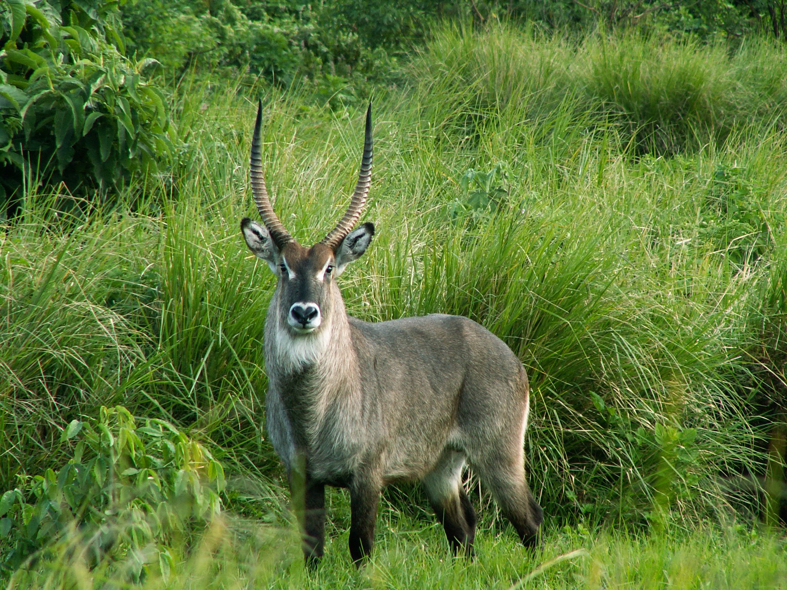

# Animals in the Bible

## License Information

Animals in the Bible © United Bible Societies, 2025. Adapted from: <cite>All Creatures Great and Small: Living Things in the Bible</cite>, by Edward R. Hope © 2005 United Bible Societies. This work is licensed under Creative Commons Attribution-ShareAlike 4.0 International (<a href="https://creativecommons.org/licenses/by-sa/4.0/">https://creativecommons.org/licenses/by-sa/4.0/</a>).

--------------------------------

## 標題：羚羊（antelope） (id: FAUNA:2.2)

2\.2 標題：羚羊（antelope）
====================

經文出處
----

Hebrew 來：דִּישׁוֹן (音譯：dishon)

[DEU 14:5](https://ref.ly/Deut14:5)

討論
--

希臘文《七十士譯本》將這個詞譯為*pugargos* （KJV (King James Version (1611)) 音譯為"pygarg"），意思是「白色的臀部」。這個希臘文名稱可能是指水羚屬（學名*Kobus* ）的羚羊，包括非洲大羚羊、迪氏水羚（學名*Kobus defassa* ）和白耳水羚（大角驢羚；學名*Kobus megaceros* ），牠們的臀部周圍都有一個白色的環狀條紋。聖經時期的人很熟悉迪氏水羚和白耳水羚。大多數種類的瞪羚，其臀部也是白色的。

然而，認為這個希伯來文名稱是指另一種羚羊「旋角羚」（學名*Addax nasomaculatus* ），這幾乎已經成為傳統，而且奇怪的是，這種羚羊並沒有白色的臀部（比較NAB (New American Bible (1970)) ）。旋角羚是非洲西北部的物種，並且沒有確鑿的證據顯示牠們曾在利比亞以東的野外出現過。然而，埃及人很可能曾經飼養成群的旋角羚，就像歐洲人在鹿園中飼養鹿那樣，但埃及人是把旋角羚當作祭物和食物。所羅門可能也圈養過旋角羚。

許多學者認為*dishon* 這個名稱與希伯來文詞根*d\-w\-sh* 有關聯，從而使這個名稱的意思有點像「腳步沉重緩慢的人」。這個名稱與旋角羚的特徵相符，因為旋角羚的蹄子很大，行走通常很有節奏。有些學者基於一些證據提出，*dishon* 就是阿拉伯大羚羊或白劍羚（學名*Oryx leucoryx* ）。他們援引的語言學證據來自劍羚的阿卡德文名稱*da\-as\-su* ，有學者認為這個詞的詞根與希伯來文詞根*d\-sh\-n* 相近。然而，另一個希伯來文*te’o* 也被動物學家解釋為「劍羚」，同時也出現在這節經文關於潔淨動物的清單中，因此*dishon* 不太可能也是「劍羚」的意思。翻譯者可以選擇旋角羚或水羚屬羚羊作為譯詞，並且任何一個選擇似乎都沒有絕對的說服力（另參[2\.7 北非狷羚（麅子） (bubal hartebeest \[roe deer])](#FAUNA:2.7) ）。

描述
--

水羚屬（學名*Kobus* ）羚羊的體型相當大，肩高約1\.3米（4英呎），毛很長。公羚羊有角，從根部沿著與水平線約呈45度角的方向生長出去，然後向上、向前彎曲。角的長度經常超過半米（20英吋）。非洲大羚羊和迪氏水羚呈灰色或灰褐色，白耳水羚是紅色的。牠們成小群（白耳水羚通常是大群）生活在河流或沼澤附近，以草和水草為食。

旋角羚長著螺旋狀的角和寬大的蹄子，冬天時毛色為淺棕色，但夏天幾乎是白色的，大小跟驢差不多。

特殊意義或象徵意義
---------

這是一種在禮儀上潔淨的動物。

翻譯
--

[DEU 14:5](https://ref.ly/Deut14:5) 所記的潔淨動物清單包含了七個名稱。TEV (Today's English Version (Good News Bible)) 將其縮減成四個，譯作"deer, wild sheep, wild goats, or antelopes"（「鹿、野綿羊、野山羊或羚羊」）。這些名稱都是集合名詞，實際上並未包含原文中提到的所有動物，例如瞪羚就被省略了。在很難找到七個名稱的情況下，這也可以作為一種解決方案。

在撒哈拉以南的非洲地區，非洲大羚羊、驢羚、迪氏水羚和白耳水羚為人熟知，可採用其中任何一個名稱。與旋角羚相似的羚羊有大彎角羚（學名*Strepsiceros strepsiceros* ）和小彎角羚（學名*Strepsiceros imberbis* ）。

在印度次大陸，最接近的對等譯詞是藍牛羚（學名*Boselaphus tragocamelus* ）。

其他地方可以採用「白臀羚羊」等短語，或者採用音譯。

* **Associated Passages:** 申命記 14:5

