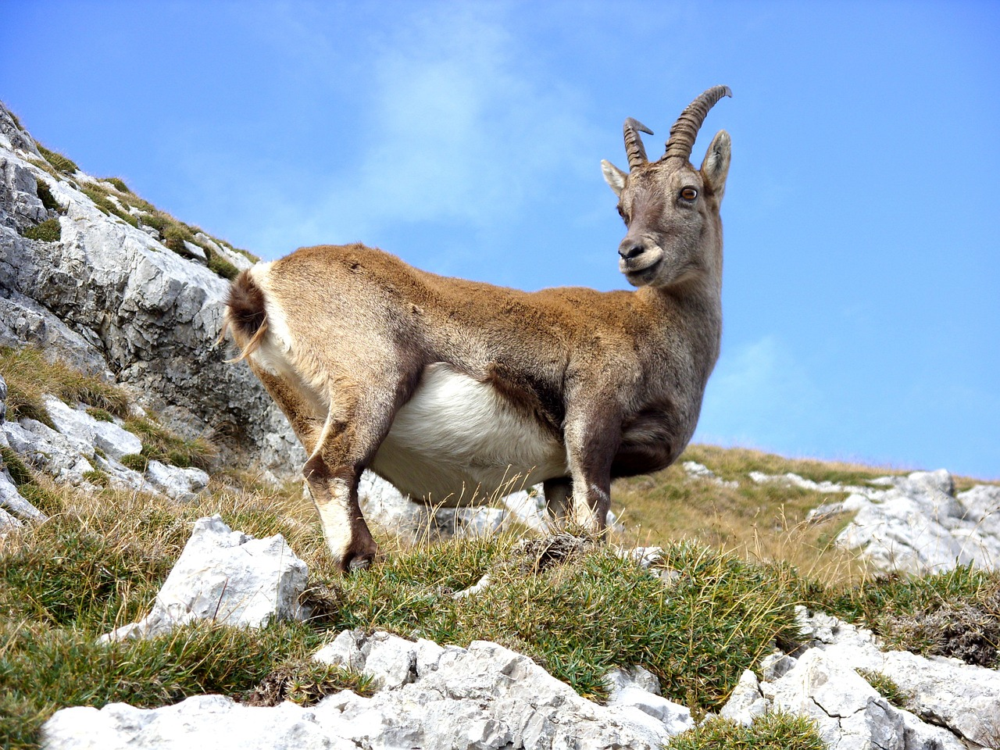

# Animals in the Bible

## License Information

Animals in the Bible © United Bible Societies, 2025. Adapted from: <cite>All Creatures Great and Small: Living Things in the Bible</cite>, by Edward R. Hope © 2005 United Bible Societies. This work is licensed under Creative Commons Attribution-ShareAlike 4.0 International (<a href="https://creativecommons.org/licenses/by-sa/4.0/">https://creativecommons.org/licenses/by-sa/4.0/</a>).

--------------------------------

## 標題：野山羊、羱羊、高山山羊（ibex, wild goat, mountain goat） (id: FAUNA:2.21)

2\.21 標題：野山羊、羱羊、高山山羊（ibex, wild goat, mountain goat）
====================================================

經文出處
----

Hebrew 來：אַקּוֹ (音譯：’aqo)

[DEU 14:5](https://ref.ly/Deut14:5)

Hebrew 來：יָעֵל, יַעֲלָה (音譯：ya‘el, ya‘alah)

[1SA 24:3](https://ref.ly/1Sam24:3), [JOB 39:1](https://ref.ly/Job39:1), [PSA 104:18](https://ref.ly/Ps104:18), [PRO 5:19](https://ref.ly/Prov5:19)

討論
--

在以色列地發現的野山羊是努比亞羱羊（學名*Capra ibex nubiana* ），從遠古時代起就生活在這個地區的群山之中，並且直到不久以前還是一種非常常見的動物。羱羊曾經生活在以色列的山區、西奈半島、阿拉伯半島和埃及，現今在這些地方仍然還有一些。在埃塞俄比亞和厄立特里亞有一個近緣物種西敏羱羊（學名*Capra walie* ）。

目前，羱羊是在以色列發現的唯一一種野生山羊。另一種野生山羊曾經生活在那裡，但早在亞伯拉罕之前的石器時代就消失了。希伯來文*ya‘el* 和*’aqo* 都是指這種動物。因此，在[DEU 14:5](https://ref.ly/Deut14:5) 關於潔淨動物的清單中，RSV (Revised Standard Version (1952)) 、NIV (New International Version (1984)) 、NEB (New English Bible (1970)) 和REB (Revised English Bible (1989)) 等譯本包含了兩種野生山羊，這可能是不正確的。

更多討論參[2\.1 潔淨的動物（申14:4–6）](#FAUNA:2.1) 。

描述
--

努比亞羱羊是一種體型相當大的野山羊，成羊的肩高約有90厘米（3英呎）。牠們的皮毛在一年中的大部分時間是灰色的，但到了冬天會變成灰棕色。雄羊的角又粗又長，超過130厘米（4英呎），向後彎曲成半圓形。雌羊的角要細得多且短得多，僅40厘米（15英吋）。羊角只有最末端的幾厘米是光滑的，其餘部分有許多道凸起的環脊。這些羱羊在山區群居，喜歡懸崖峭壁，以生長在上面的灌木叢為食。羱羊肉比山羊肉和鹿肉更加肥嫩多汁。許多個世紀以來，牠們一直是極受歡迎的狩獵動物。

[1SA 24:2](https://ref.ly/1Sam24:2) 中提到的「野山羊磐石」可能是隱基底附近納哈亞魯哥（Nahal Arugot）的池塘和溪流周圍的岩石地區。這個地區已被劃為自然保護區，羱羊和其他當地動物在那裡得到保護。「隱基底」這個名字的意思就是「小山羊的綠洲」或「小山羊的水泉」，可能是指一隻小羱羊。

特殊意義或象徵意義
---------

羱羊與遠方的高山有密切的聯繫。在希伯來文化和阿拉伯文化中，牠被視為所有動物中離人最遙遠的（比較[JOB 39:1](https://ref.ly/Job39:1) ），這可能就是為什麼許多譯本把*ya‘el* 譯為「高山山羊」的原因。羱羊以其在陡岩峭壁上仍然腳步穩健而出名，不過聖經並沒有提到這個特點。

在上面提到的兩種文化中，雌羱羊是優雅和美麗的象徵；優雅源於牠們在懸崖上站立、行走和跳躍時的完美平衡，美麗可能源於牠們長著像人那樣的大眼睛。在英語文化和許多其他文化中，[PRO 5:19](https://ref.ly/Prov5:19) 的翻譯存在一個問題，因為山羊在這些文化中並不是美麗的象徵。一些藏緬文化認為野生鬣羚是所有動物中最醜陋的。在這些語言中，把婦女稱為「野山羊」是一種侮辱。因此，有些譯本將這個詞譯為「母鹿」而不是「野山羊」。

翻譯
--

在世界以下地區可以找到當地野山羊：

歐洲東南部、小亞細亞、巴基斯坦 \- 野山羊 \- 學名*Capra hircus*

歐洲西南部 \- 比利牛斯羱羊 \- 學名*Capra pyrenaica*

歐洲阿爾卑斯地區 \- 阿爾卑斯羱羊、石羚 \- 學名*Capra ibex*

埃及、中東 \- 努比亞羱羊 \- 學名*Capra ibex nubiana*

埃塞爾比亞、厄立特里亞 \- 西敏羱羊 \- 學名*Capra walie*

中亞、西伯利亞 \- 喜馬拉雅羱羊 \- 學名*Capra sibirica*

阿富汗、克什米爾 \- 捻角山羊 \- 學名*Capra falconeri*

尼泊爾、印度北部 \- 喜馬拉雅塔爾羊 \- 學名*Hemitragus jemlahicus*

印度南部 \- 尼爾吉里塔爾羊 \- 學名*Hemitragus hylocrius*

喜馬拉雅、中國、韓國 \- 斑羚 \- 學名*Nemorhaedus*

喜馬拉雅、中國西部 \- 羚牛 \- 學名*Budorcas taxicolor*

印度東北部、緬甸、泰國、馬來西亞、老撾、中國、台灣、日本 \- 鬣羚 \- 學名*Capricornis indica*

北美洲 \- 落基山山羊、白山羊 \- 學名*Oreamnos americanus*

撒哈拉沙漠以南的非洲地區沒有真正的野山羊。與之最相似的動物是一種生活在懸崖上的小型岩羚（學名*Oreotragus oreotragus* ）。這種動物在當地很常見，而且為人所熟知，許多非洲譯本使用牠的當地名稱來翻譯*ya‘el* 和*’aqo* 。

在沒有發現當地野山羊的其他國家，或是在沒有表示野山羊的專用詞語的國家，翻譯者通常可以使用「野山羊」或「野生高山山羊」等短語。後一個短語可能更好，因為在西非，「叢林山羊」是指霓羚，這是一種與高山無關的小型羚羊。

[PRO 5:19](https://ref.ly/Prov5:19) ：這節經文出現在一系列箴言的中間，這些箴言論到性約束的價值和婚姻中的忠誠。書卷的作者／編者勸告讀者只可以從妻子那裡得到性的滿足。妻子則被稱為「可愛（或迷人）的鹿，優雅的羱羊」。

討論
--

前文已經提到，在許多文化中，把女性稱為「野山羊」是一種侮辱而不是讚美。在這種情況下，翻譯者應找到一個象徵優雅、能與「鹿」平行的動物作為比喻。

[DEU 14:4](https://ref.ly/Deut14:4); [DEU 14:5](https://ref.ly/Deut14:5) ：在這個潔淨動物的清單中，翻譯者應避免使用兩個表示野山羊的詞語。然而，建議把*’aqo* （即清單中的第七個名稱）譯為「羱羊」或「野山羊」。

* **Associated Passages:** 申命記 14:5; 撒母耳記上 24:3; 約伯記 39:1; 詩篇 104:18; 箴言 5:19; 撒母耳記上 24:2; 申命記 14:4

