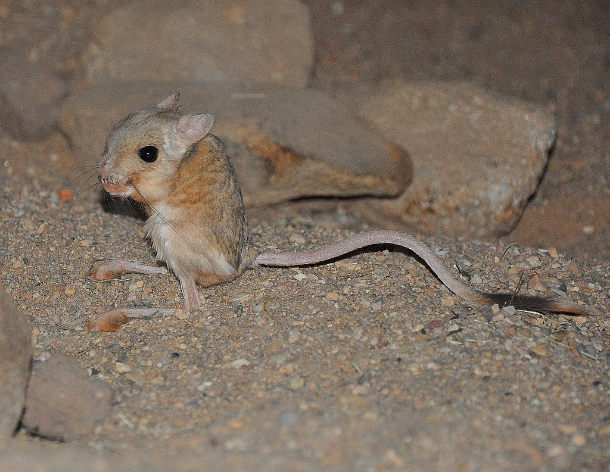

# Animals in the Bible

## License Information

Animals in the Bible © United Bible Societies, 2025. Adapted from: <cite>All Creatures Great and Small: Living Things in the Bible</cite>, by Edward R. Hope © 2005 United Bible Societies. This work is licensed under Creative Commons Attribution-ShareAlike 4.0 International (<a href="https://creativecommons.org/licenses/by-sa/4.0/">https://creativecommons.org/licenses/by-sa/4.0/</a>).

--------------------------------

## 標題：老鼠、耗子（mouse, rat） (id: FAUNA:2.27)

2\.27 標題：老鼠、耗子（mouse, rat）
==========================

經文出處
----

Hebrew 來：עַכְבָּר (音譯：‘akbar)

[LEV 11:29](https://ref.ly/Lev11:29), [1SA 6:4](https://ref.ly/1Sam6:4), [1SA 6:5](https://ref.ly/1Sam6:5), [1SA 6:11](https://ref.ly/1Sam6:11), [1SA 6:18](https://ref.ly/1Sam6:18), [ISA 66:17](https://ref.ly/Isa66:17)

討論
--

希伯來文*‘akbar* 是一個非常寬泛的詞，包括所有小型嚙齒動物。因此，這個詞包括家鼠、田鼠、鼷鼠、睡鼠、跳鼠、沙鼠、黑鼠、棕鼠、倉鼠等。迦南人獵捕較大的嚙齒動物作為食物，如跳鼠和沙鼠（儘管牠們叫「沙鼠」，但實際上並不是老鼠），現今中東的許多沙漠部落也還是這樣。

描述
--

我們不能在這本手冊中描述希伯來文*‘akbar* 涵蓋的所有嚙齒動物，因此這裡的描述僅限於耗子、鼷鼠、跳鼠和沙鼠。家鼠和田鼠在世界各地都為人所知，因此就不再贅述了。

**耗子** 比老鼠大（連尾巴有25—30厘米或1英呎長），但其他方面看起來很像老鼠。黑鼠（學名*Rattus rattus* ）和棕鼠（學名*Rattus norvegicus* ）都有不同的毛色，從黑色到灰褐色不等，另外棕鼠的口鼻稍短。黑鼠是一種跳蚤的宿主，而這種跳蚤是可怕的黑死病的攜帶者。在20世紀60年代，雖然動物學家們認為*Rattus rattus* 起源於亞洲，但在以色列也發現了這種耗子的遺骸，時間可追溯至史前。棕色挪威鼠是在20世紀30年代才出現在這片土地上的。

**黎凡特田鼠** （學名*Microtus socialis guentheri* ）：田鼠與小老鼠的區別很小，只是頰齒的形狀不同，因此對於大多數人來說，兩者看起來就是老鼠。田鼠的身體較小，毛呈灰褐色，肚子為淺白色，以草莖及小麥、大麥等穀物的莖稈為食。田鼠在白天和晚上都很活躍，每次活動約兩三個小時，每天吃的食物有自己的體重那麼多，甚至更多。田鼠每年最多可產16窩仔，一窩多達12隻。因此，在食物充足並且有掩護物來躲避食肉動物的季節裡，田鼠的數量會暴增，對農作物構成非常嚴重的威脅。在所有鼠類中，田鼠是最具破壞性的。

**埃及小跳鼠** （學名*Jaculus jaculus* ）：這個學名的意思是「跳躍者」。跳鼠比大多數老鼠略大，後腿很長，前腿很短；像袋鼠那樣跳躍，甚至被（錯誤地）稱為「袋鼠鼠」。跳鼠的尾巴很長，末端有一簇毛，用來在跳躍時保持平衡。牠們生活在沙漠和半沙漠地區，身體也呈沙色。跳鼠只在晚上活動，眼睛和耳朵都很大，以彌補夜間活動的困難。牠們以種子為食，可以長時間不喝水。

**巴勒斯坦沙鼠** （學名*Gerbillus andersoni allenbyi* ）：沙鼠和跳鼠非常相似，但體型較小。受到驚嚇時，沙鼠的移動非常之快，每一下跳躍可達3米（10英呎）遠。但從嚴格意義上來說，沙鼠並不是鼠。

特殊意義或象徵意義
---------

在[LEV 11:29](https://ref.ly/Lev11:29) 中，*‘akbar* 被列為禮儀上不潔淨的動物。至於是所有「鼠」都不潔淨，還是只有某些種類不潔淨，目前尚不清楚，並且猶太教學者經常對此進行爭論。在中東的沙漠部落中，跳鼠、沙鼠和倉鼠都是常見的食物，現今已不歸類為「鼠」。

翻譯
--

[LEV 11:29](https://ref.ly/Lev11:29) ：翻譯者要做的主要解經選擇是，這條禁令是針對所有種類的小型嚙齒動物，還是只針對其中一部分種類。解經家在這個問題上意見不一。NEB (New English Bible (1970)) 、JB (Jerusalem Bible (1966)) 、NIV (New International Version (1984)) 和REB (Revised English Bible (1989)) 都將這一禁令應用到具體的物種：耗子（JB (Jerusalem Bible (1966)) 和NIV (New International Version (1984)) ）或跳鼠（NEB (New English Bible (1970)) 和REB (Revised English Bible (1989)) ）。「耗子」是一個可以理解的選擇，因為耗子，尤其是黑鼠，是眾所周知的疾病攜帶者。TEV (Today's English Version (Good News Bible)) 認為禁令包括所有物種，譯為「耗子、老鼠」。KJV (King James Version (1611)) 、RSV (Revised Standard Version (1952)) 和NAB (New American Bible (1970)) 譯為「老鼠」，不過這個譯法涵蓋的範圍可能更廣，而不是更窄。

[1SA 5:6](https://ref.ly/1Sam5:6) ：這節經文有一個文本問題。《馬索拉文本》只提到一種瘟疫，稱為「腫瘤」。KJV (King James Version (1611)) 、RSV (Revised Standard Version (1952)) 、JB (Jerusalem Bible (1966)) 、NIV (New International Version (1984)) 和TEV (Today's English Version (Good News Bible)) 都依循這個文本。《七十士譯本》和《武加大譯本》提到兩種瘟疫，即「腫塊」和「耗子／老鼠」。有些學者認為後一種文本更好，因為這種差異可以解釋為抄寫員在抄寫時遺漏了一行希伯來文文本。（這是一種很常見的錯誤。）NEB (New English Bible (1970)) 、REB (Revised English Bible (1989)) 和NAB (New American Bible (1970)) 依循這個文本。該文本也解釋了為什麼下一章提到兩種瘟疫。即使文本中只保留了一種瘟疫，大多數註釋書都將其解作與黑鼠有關的黑死病。

如果接受《七十士譯本》的文本，那就有兩種可能的解釋。如果認為這兩種瘟疫緊密聯繫，即腫塊與耗子有關，而瘟疫是黑死病，那麼，在這裡和[1SA 6:0](https://ref.ly/1Sam6:0) 翻譯成耗子是正確的。（TEV (Today's English Version (Good News Bible)) 在第6章的腳註中標明該瘟疫是黑死病，但卻出人意料地將*‘akbarim* 譯為「老鼠」！）然而，如果不把「老鼠」和腫瘤聯繫起來，那麼第二種瘟疫可能是指田鼠這種破壞性極強的動物突然數目激增。

[ISA 66:17](https://ref.ly/Isa66:17) ：這節經文和[LEV 11:29](https://ref.ly/Lev11:29) 應使用同一個譯詞。

* **Associated Passages:** 利未記 11:29; 撒母耳記上 6:4; 撒母耳記上 6:5; 撒母耳記上 6:11; 撒母耳記上 6:18; 以賽亞書 66:17; 撒母耳記上 5:6; 撒母耳記上 6:0

