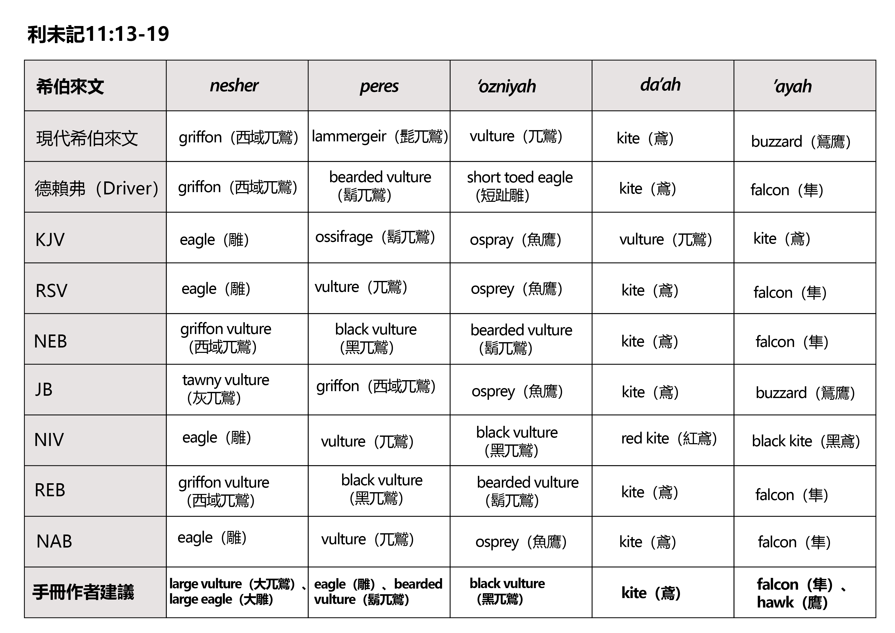
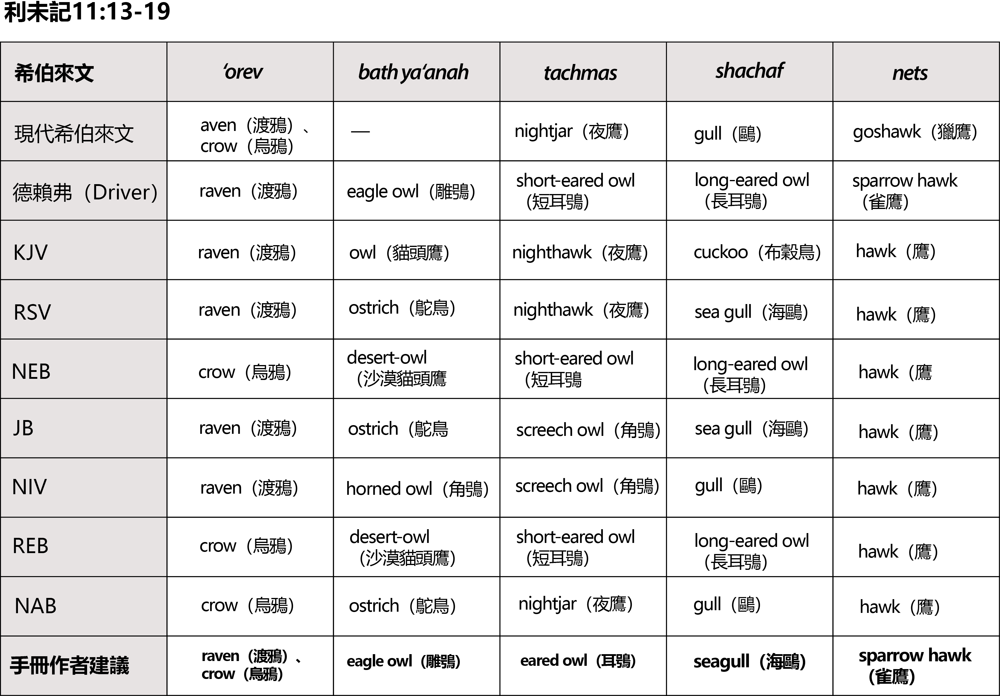
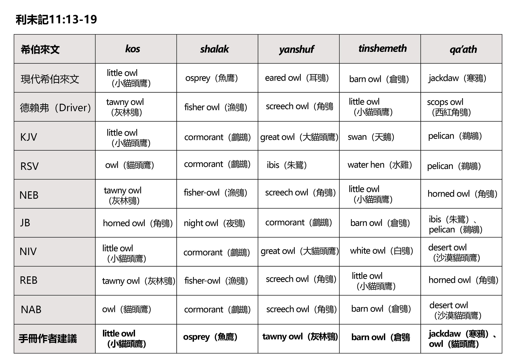
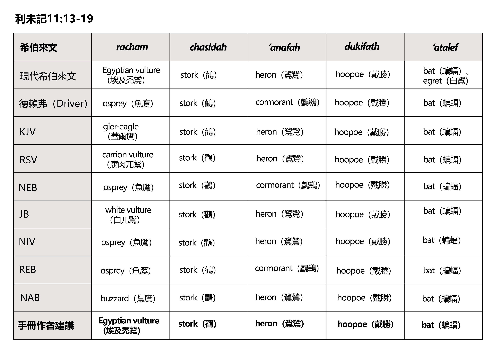
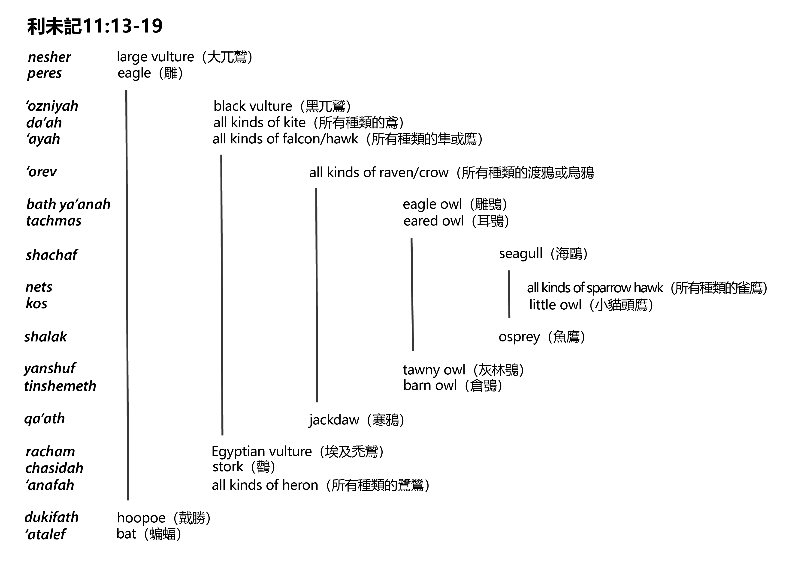
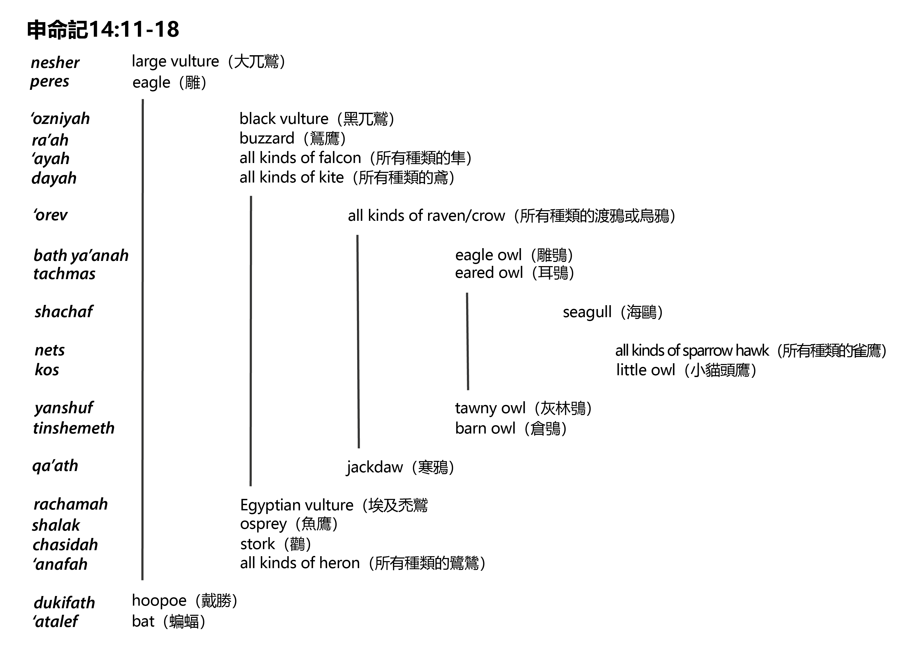

# Animals in the Bible

## License Information

Animals in the Bible © United Bible Societies, 2025. Adapted from: <cite>All Creatures Great and Small: Living Things in the Bible</cite>, by Edward R. Hope © 2005 United Bible Societies. This work is licensed under Creative Commons Attribution-ShareAlike 4.0 International (<a href="https://creativecommons.org/licenses/by-sa/4.0/">https://creativecommons.org/licenses/by-sa/4.0/</a>).

--------------------------------

## 標題：禮儀上潔淨的鳥和不潔淨的鳥（birds, clean and unclean） (id: FAUNA:3.2)

3\.2 標題：禮儀上潔淨的鳥和不潔淨的鳥（birds, clean and unclean）
===============================================

區分走獸和鳥類在禮儀上潔淨與否的基本原則是：如果牠們吃不潔淨的食物，就為不潔淨。如果對牠們吃什麼東西存有疑問，也為不潔淨。因此，如果某種鳥吃血或吃帶血的肉、垃圾、不潔淨的水中生物或不潔淨的昆蟲，這種鳥就是不潔淨的。此外，任何與埃及或迦南神明相關聯的鳥類，或者形態習性似乎有些「不自然的」鳥也是不潔淨的。

因此，在禮儀上不潔淨的鳥類清單中，我們看到有鵰、兀鷲，以及所有其他食肉大鳥，如鵟鷹、隼和鷹，以及烏鴉、鳶、海鷗、貓頭鷹、鸛、鷺鷥和翠鳥等食腐鳥類，尤其是那些以青蛙、蜥蜴和蛇為食的鷙鳥更在此列。由於朱鷺與埃及神明相關聯，並以蠕蟲和蝌蚪爲食，因此也應屬於不潔浄的鳥類。貓頭鷹也與一個埃及神明相關聯，所以貓頭鷹是在雙重意義上不潔淨。此外，我們知道古代以色列人雖然把蝙蝠歸為鳥類，但他們認爲蝙蝠是鳥類和老鼠的不自然的後代，所以蝙蝠也應該是不潔淨的。

然而，那些吃種子或植物的鳥類不會被視為不潔淨，除非牠們與異教神明有關聯。

遺憾的是，在聖經所列清單中，有許多希伯來文詞語的含義頗具爭議。除了幾個詞之外，其他的詞我們只是討論「可能的」意思，而不是討論其確定的含義。下面的表格比較了不同譯本中的用詞清單，其中省略了TEV (Today's English Version (Good News Bible)) ，該譯本用15個英文單詞總結了20個希伯來文單詞。每個表格中的第一行是用現代希伯來文表示的詞語含義。最後一行（ERH）是本手冊作者的建議，這些建議的依據是各個英文譯本的對比、鳥類目錄、注釋書，以及其他討論鳥類名稱語源的文獻。在討論具體鳥類的相關章節中，作者詳細說明了每種建議譯法的合理之處。

在辨識這些鳥類時，一個重要的指導因素是清單的結構編排。這些清單顯然是要人記憶的，並且很可能是按著方便人記憶的方式來編排的。德賴弗（G. R. Driver）在研究這些清單時，就使用了類似的方法，按照體型由大到小排序，這樣在每一種類別中，先提到體型較大的鳥，然後是體型比較小的鳥。他認為，清單是由十五種陸鳥、三種水鳥和兩種雜鳥這三個部分組成。因此在清單的每一個部分，當面臨選擇時，德賴弗會選擇比前面的種類更小的鳥。然而，這種方法所得到的結果有時頗有爭議，特別是因為這些結果假定當時的以色列人已經熟知不同貓頭鷹之間的微小差異。

從以色列地區的鳥類學角度來看，本手冊建議的清單（如下文所示）同樣很有道理。這份清單清楚呈現出一個整齊的結構，即希伯來文獻中常見的「首尾呼應結構」。

名稱翻譯清單後面提供了幾個圖表，說明了這種首尾呼應結構，並進行了討論。

---

**利未記11:13–19**

| 希伯來文 | *nesher* | *peres* | *‘ozniyah* | *da’ah* | *’ayah* |
| --- | --- | --- | --- | --- | --- |
| 現代希伯來文 | griffon（西域兀鷲） | lammergeir（髭兀鷲） | vulture（兀鷲） | kite（鳶） | buzzard（鵟鷹） |
| 德賴弗（Driver） | griffon（西域兀鷲） | bearded vulture（鬍兀鷲） | short toed eagle（短趾雕） | kite（鳶） | falcon（隼） |
| KJV (King James Version (1611)) | eagle（雕） | ossifrage（鬍兀鷲） | ospray（魚鷹） | vulture（兀鷲） | kite（鳶） |
| RSV (Revised Standard Version (1952)) | eagle（雕） | vulture（兀鷲） | osprey（魚鷹） | kite（鳶） | falcon（隼） |
| NEB (New English Bible (1970)) | griffon vulture（西域兀鷲） | black vulture（黑兀鷲） | bearded vulture（鬍兀鷲） | kite（鳶） | falcon（隼） |
| JB (Jerusalem Bible (1966)) | tawny vulture（灰兀鷲） | griffon（西域兀鷲） | osprey（魚鷹） | kite（鳶） | buzzard（鵟鷹） |
| NIV (New International Version (1984)) | eagle（雕） | vulture（兀鷲） | black vulture（黑兀鷲） | red kite（紅鳶） | black kite（黑鳶） |
| REB (Revised English Bible (1989)) | griffon vulture（西域兀鷲） | black vulture（黑兀鷲） | bearded vulture（鬍兀鷲） | kite（鳶） | falcon（隼） |
| NAB (New American Bible (1970)) | eagle（雕） | vulture（兀鷲） | osprey（魚鷹） | kite（鳶） | falcon（隼） |
| 手冊作者建議 | **large vulture（大兀鷲）、large eagle（大雕）** | **eagle（雕）、bearded vulture（鬍兀鷲）** | **black vulture（黑兀鷲）** | **kite（鳶）** | **falcon（隼）、hawk（鷹）** |

---

| 希伯來文 | *‘orev* | *bath ya‘anah* | *tachmas* | *shachaf* | *nets* |
| --- | --- | --- | --- | --- | --- |
| 現代希伯來文 | raven（渡鴉）、crow（烏鴉） | —— | nightjar（夜鷹） | gull（鷗） | goshawk（獵鷹） |
| 德賴弗（Driver） | raven（渡鴉） | eagle owl（雕鴞） | short\-eared owl（短耳鴞） | long\-eared owl（長耳鴞） | sparrow hawk（雀鷹） |
| KJV (King James Version (1611)) | raven（渡鴉） | owl（貓頭鷹） | nighthawk（夜鷹） | cuckoo（布穀鳥） | hawk（鷹） |
| RSV (Revised Standard Version (1952)) | raven（渡鴉） | ostrich（鴕鳥） | nighthawk（夜鷹） | sea gull（海鷗） | hawk（鷹） |
| NEB (New English Bible (1970)) | crow（烏鴉） | desert\-owl（沙漠貓頭鷹） | short\-eared owl（短耳鴞） | long\-eared owl（長耳鴞） | hawk（鷹） |
| JB (Jerusalem Bible (1966)) | raven（渡鴉） | ostrich（鴕鳥） | screech owl（角鴞） | sea gull（海鷗） | hawk（鷹） |
| NIV (New International Version (1984)) | raven（渡鴉） | horned owl（角鴞） | screech owl（角鴞） | gull（鷗） | hawk（鷹） |
| REB (Revised English Bible (1989)) | crow（烏鴉） | desert\-owl（沙漠貓頭鷹） | short\-eared owl（短耳鴞） | long\-eared owl（長耳鴞） | hawk（鷹） |
| NAB (New American Bible (1970)) | crow（烏鴉） | ostrich（鴕鳥） | nightjar（夜鷹） | gull（鷗） | hawk（鷹） |
| 手冊作者建議 | **raven（渡鴉）、crow（烏鴉）** | **eagle owl（雕鴞）** | **eared owl（耳鴞）** | **seagull（海鷗）** | **sparrow hawk（雀鷹）** |

---

| 希伯來文 | *kos* | *shalak* | *yanshuf* | *tinshemeth* | *qa’ath* |
| --- | --- | --- | --- | --- | --- |
| 現代希伯來文 | little owl（小貓頭鷹） | osprey（魚鷹） | eared owl（耳鴞） | barn owl（倉鴞） | jackdaw（寒鴉） |
| 德賴弗（Driver） | tawny owl（灰林鴞） | fisher owl（漁鴞） | screech owl（角鴞） | little owl（小貓頭鷹） | scops owl（西紅角鴞） |
| KJV (King James Version (1611)) | little owl（小貓頭鷹） | cormorant（鸕鷀） | great owl（大貓頭鷹） | swan（天鵝） | pelican（鵜鶘） |
| RSV (Revised Standard Version (1952)) | owl（貓頭鷹） | cormorant（鸕鷀） | ibis（朱鷺） | water hen（水雞） | pelican（鵜鶘） |
| NEB (New English Bible (1970)) | tawny owl（灰林鴞） | fisher\-owl（漁鴞） | screech owl（角鴞） | little owl（小貓頭鷹） | horned owl（角鴞） |
| JB (Jerusalem Bible (1966)) | horned owl（角鴞） | night owl（夜鴞） | cormorant（鸕鷀） | barn owl（倉鴞） | ibis（朱鷺）、pelican（鵜鶘） |
| NIV (New International Version (1984)) | little owl（小貓頭鷹） | cormorant（鸕鷀） | great owl（大貓頭鷹） | white owl（白鴞） | desert owl（沙漠貓頭鷹） |
| REB (Revised English Bible (1989)) | tawny owl（灰林鴞） | fisher\-owl（漁鴞） | screech owl（角鴞） | little owl（小貓頭鷹） | horned owl（角鴞） |
| NAB (New American Bible (1970)) | owl（貓頭鷹） | cormorant（鸕鷀） | screech owl（角鴞） | barn owl（倉鴞） | desert owl（沙漠貓頭鷹） |
| 手冊作者建議 | **little owl（小貓頭鷹）** | **osprey（魚鷹）** | **tawny owl（灰林鴞）** | **barn owl（倉鴞）** | **jackdaw（寒鴉）、owl（貓頭鷹）** |

---

| 希伯來文 | *racham* | *chasidah* | *’anafah* | *dukifath* | *‘atalef* |
| --- | --- | --- | --- | --- | --- |
| 現代希伯來文 | Egyptian vulture（埃及禿鷲） | stork（鸛） | heron（鷺鷥） | hoopoe（戴勝） | bat（蝙蝠）、egret（白鷺） |
| 德賴弗（Driver） | osprey（魚鷹） | stork（鸛） | cormorant（鸕鷀） | hoopoe（戴勝） | bat（蝙蝠） |
| KJV (King James Version (1611)) | gier\-eagle（蓋爾鷹） | stork（鸛） | heron（鷺鷥） | lapwing（麥雞） | bat（蝙蝠） |
| RSV (Revised Standard Version (1952)) | carrion vulture（腐肉兀鷲） | stork（鸛） | heron（鷺鷥） | hoopoe（戴勝） | bat（蝙蝠） |
| NEB (New English Bible (1970)) | osprey（魚鷹） | stork（鸛） | cormorant（鸕鷀） | hoopoe（戴勝） | bat（蝙蝠） |
| JB (Jerusalem Bible (1966)) | white vulture（白兀鷲） | stork（鸛） | heron（鷺鷥） | hoopoe（戴勝） | bat（蝙蝠） |
| NIV (New International Version (1984)) | osprey（魚鷹） | stork（鸛） | heron（鷺鷥） | hoopoe（戴勝） | bat（蝙蝠） |
| REB (Revised English Bible (1989)) | osprey（魚鷹） | stork（鸛） | cormorant（鸕鷀） | hoopoe（戴勝） | bat（蝙蝠） |
| NAB (New American Bible (1970)) | buzzard（鵟鷹） | stork（鸛） | heron（鷺鷥） | hoopoe（戴勝） | bat（蝙蝠） |
| 手冊作者建議 | **Egyptian vulture（埃及禿鷲）** | **stork（鸛）** | **heron（鷺鷥）** | **hoopoe（戴勝）** | **bat（蝙蝠）** |

---

---

如上所述，我們建議的清單具有希伯來文獻中常見的「首尾呼應結構」，可能就是為了幫助人記憶。在首尾呼應結構中，作者依次引入一些要素直至中間點，然後按照相反的順序提出一些類似的要素。中間點兩側的對應項目之間具有某種相似性。以下圖表顯示了這種結構：

清單中的每個名稱可能是指某種特定的鳥，作為一組相似鳥類的代表。清單以兩種最大的猛禽兀鷲和雕開始。然後是由三種猛禽組成的一組，每種猛禽都比清單上的前一種鳥要小，即更小的鬍兀鷲、鳶，以及所有種類的隼或鷹。然後是各種渡鴉或烏鴉自成一組，標誌著清單從猛禽過渡到了貓頭鷹。

下一組包含兩種貓頭鷹，首先是最大的雕鴞，其次是略小的耳鴞。然後是海鷗自成一組，標誌著清單過渡到了中間點。

中間點是由兩種鳥構成的一組，即各種（雀）鷹和小貓頭鷹。這兩種鳥代表了最小的猛禽和最小的貓頭鷹。

然後是魚鷹自成一組，在清單首尾呼應結構中與海鷗配對，標誌著過渡回到另外一組的貓頭鷹，即灰林鴞和倉鴞。這一組對應前一組的兩種貓頭鷹。然而，這一次首先提到的是體型較小的貓頭鷹種類，對於中間點的這一側，這樣安排是合理的。

然後是寒鴉（或鵜鶘或其他貓頭鷹）自成一組，對應同樣自成一組的烏鴉。如果認為現代希伯來文*qa’ak* （寒鴉）相當於聖經中的*qa’at* （因為這個名稱模仿這種鳥發出的聲音，這是一個有力的論據），而不是「鵜鶘」或「貓頭鷹」，那么*qa’ak* 與「烏鴉」的對應就更加明顯。這種配對也見於[ISA 34:11](https://ref.ly/Isa34:11) 和[ZEP 2:14](https://ref.ly/Zeph2:14) 。「寒鴉」標誌著向水鳥類的過渡，正如烏鴉也標誌著一個過渡。

水鳥這一組由三種鳥組成，對應上面提到的三種猛禽。同樣，首先提到的是體型最小的水鳥。埃及禿鷲雖然是一種猛禽，但也會在海灘上吃腐肉，也吃許多水鳥產的蛋。牠的喙和許多大型海鳥的喙一樣，如信天翁、鸌、賊鷗和鰹鳥。牠站立時的姿勢也非常像海鷗，遠看就像是一隻大海鷗。這個名稱可能代表所有黑白相間的水鳥，因為*racham* 似乎源於一個意為「黑白相間」的希伯來文詞根。

鷺鷥的類群可能代表所有長著大喙的大型水鳥，包括朱鷺和鸕鶿，因為*’anafah* 這個詞似乎源於一個意為「鼻子」的希伯來文詞根。

最後一組是由戴勝（或「戴鵀」）和蝙蝠混雜而成，這裡蝙蝠被歸為鳥類。

有些譯本的清單中包含了鴕鳥，但鴕鳥被列在清單中是極不可能的，因為鴕鳥素食，被歸類為禮儀上潔淨的鳥。鴕鳥從巴勒斯坦消失的直接原因是被人大量捕食。

[DEU 14:11–DEU 14:18](https://ref.ly/Deut14:11-Deut14:18) ：在《希伯來聖經》中，這個清單基本上與《利未記》中的清單相同，除了增加一個名為*ra’ah* 的鳥，以及兩個詞的拼法略有不同（*da’ah* 變為*dayah* ，*racham* 變為*rachamah* ）。在NEB (New English Bible (1970)) 、JB (Jerusalem Bible (1966)) 、NAB (New American Bible (1970)) 和REB (Revised English Bible (1989)) 中，這個添加被視為抄寫錯誤，因為希伯來文*ra’ah* 和*da’ah* 看起來非常相似，很容易混淆。KJV (King James Version (1611)) 將*ra’ah* 譯為"glede"（「鳶」），RSV (Revised Standard Version (1952)) 譯為"buzzard"（「鵟鷹」），NIV (New International Version (1984)) 譯為"falcon"（「隼」）。

在希伯來文本中，《申命記》中的清單編排與《利未記》中的清單不同；差異似乎是由那個額外添加的鳥名引起的。在《申命記》中，這種鳥位列第一組中型猛禽，使得該組的鳥類數量從三種增加到四種。這組的四種鳥對應四種水鳥。魚鷹（*shalak* ）這個詞位列水鳥這一組。然而，這裡的清單並不像《利未記》中的清單那樣呈對稱結構，因為沒有了對應海鷗的詞語。最後，鳶和隼的順序互換了，如下面的圖表所示：

如果我們接受多數人的意見，認為*ra’ah* 是一個抄寫錯誤，因此將其從清單中刪去，那麼似乎最好也把清單變回《利未記》所示最初的結構，一些主要的譯本就是這樣做的。如果保留*ra’ah* ，那麼只能從這個詞在清單中的位置來猜測其含義；「鵟鷹」似乎是一個合理的猜想。

翻譯
--

在世界上的一些地區，清單中的大多數鳥類都有對應的當地鳥類，像在非洲的許多地方一樣，建議翻譯者盡量找到與清單中的每種鳥相對應的鳥類。在其他地區，最好找到包含清單中所有鳥類的概括性表達，如TEV (Today's English Version (Good News Bible)) 的做法。因此，如果對應的鳥類不足，可以採用如下所示的概括性清單：

「各個種類、不同大小的兀鷲、雕、鷹、鳶和烏鴉；各個種類、不同大小的貓頭鷹；各個種類、不同大小的鷺鷥；所有其他吃不潔淨東西的鳥；以及所有蝙蝠。」

* **Associated Passages:** 以賽亞書 34:11; 西番雅書 2:14; 申命記 14:11; 申命記 14:18

