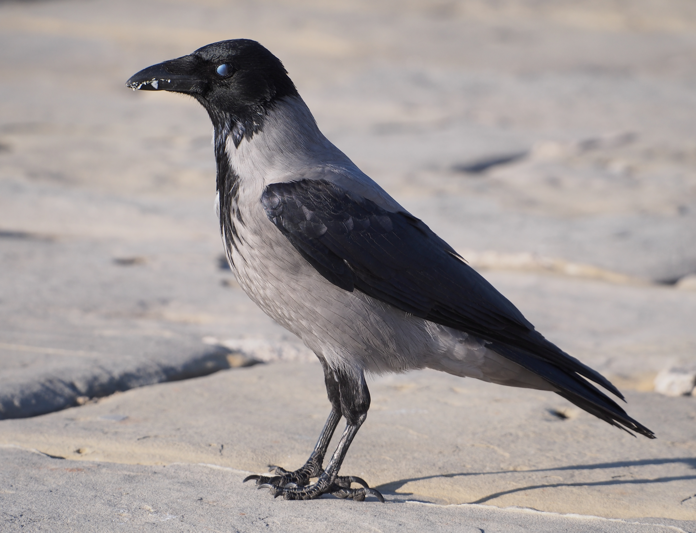

# Animals in the Bible

## License Information

Animals in the Bible © United Bible Societies, 2025. Adapted from: <cite>All Creatures Great and Small: Living Things in the Bible</cite>, by Edward R. Hope © 2005 United Bible Societies. This work is licensed under Creative Commons Attribution-ShareAlike 4.0 International (<a href="https://creativecommons.org/licenses/by-sa/4.0/">https://creativecommons.org/licenses/by-sa/4.0/</a>).

--------------------------------

## 標題：烏鴉、渡鴉（crow, raven） (id: FAUNA:3.6)

3\.6 標題：烏鴉、渡鴉（crow, raven）
==========================

經文出處
----

Hebrew 來：עוֹרֵב (音譯：‘orev)

[GEN 8:7](https://ref.ly/Gen8:7), [LEV 11:15](https://ref.ly/Lev11:15), [DEU 14:14](https://ref.ly/Deut14:14), [1KI 17:4](https://ref.ly/1Kgs17:4), [1KI 17:6](https://ref.ly/1Kgs17:6), [JOB 38:41](https://ref.ly/Job38:41), [PSA 147:9](https://ref.ly/Ps147:9), [PRO 30:17](https://ref.ly/Prov30:17), [SNG 5:11](https://ref.ly/Song5:11), [ISA 34:11](https://ref.ly/Isa34:11)

Greek 希：κόραξ (音譯：korax)

[LUK 12:24](https://ref.ly/Mark12:24)

Greek 希：κορώνη (音譯：korōnē)

[LJE 1:54](https://ref.ly/Bar1:54)

討論
--

學者對於這些詞語的含義意見一致。希伯來文*‘orev* 和兩個希臘文詞語是鴉科鳥類的通稱，這包括在以色列發現的三種渡鴉、兩種烏鴉和禿鼻烏鴉。其中褐頸渡鴉（學名*Corvus ruficolllis* ）、扇尾渡鴉（學名*Corvus rhipidurus* ）和冕鴉（學名*Corvus corone cornix* ）是常見的留鳥。坎斯代爾（G. S. Cansdale）稱扇尾渡鴉是「所有這些烏鴉中最罕見的」，這與大多數鳥類觀察者的經驗和大多數以色列鳥類一覽表中的官方看法相反。渡鴉（學名*Corvus corax* ）是留鳥，但在今天的以色列已經不像在古代那樣常見。在以色列發現的其他烏鴉種類只是遷徙時經過，停留時間並不長。

描述
--

烏鴉和渡鴉是大型的黑色鳥類，喙粗壯，腿較短。牠們非常聰明，似乎很喜歡飛行。通常，如果有合適的熱氣流，牠們就會乘風盤旋翱翔，並發出叫聲。有些種類的烏鴉會在這些熱氣流中群集，一起在空中盤旋。在陽光明媚的風天，牠們有時乘風展翅，但並不去什麽地方；有時甚至會用一隻腳掛在樹梢，以穩住身體。牠們幾乎什麽都吃，包括穀物、水果、昆蟲、蜥蜴、青蛙、蛋、雛鳥和動物的死屍等。在[PRO 30:17](https://ref.ly/Prov30:17) 中，NEB (New English Bible (1970)) 將*‘orev* 譯為"magpie"（「喜鵲」）令人費解，因為烏鴉和渡鴉啄食已死或垂死的動物的眼睛十分常見。挪亞放出的烏鴉沒有返回方舟，這表明有些地面已經從洪水中露出來，烏鴉已經找到了食物，可能是在洪水中淹死的人類和動物的屍體。

烏鴉也經常出現在剛播撒種子的田地裡，有些國家的農民會製作人形的「稻草人」，有時候做成鷹和雕的形狀。這些稻草人是舊麻袋塞上稻草製成的，目的是嚇跑烏鴉。

烏鴉和渡鴉用樹枝和草在樹杈或懸崖上築巢，鳥巢非常大，而且零亂不整。烏鴉一般會待在多石的山上。在靠近加利利、猶太地的曠野、死海海岸、尼革夫等地方，以及毗鄰阿拉瓦裂谷的懸崖上，都有牠們的身影。

特殊意義或象徵意義
---------

烏鴉屬於禮儀上不潔淨的鳥類，在聖經文化中與死亡聯繫在一起。因此，牠們象徵著戰爭造成的破壞。另外，牠們的食物是由上帝預備的（[JOB 38:41](https://ref.ly/Job38:41) ）。即使烏鴉不潔淨，並且有一些可怕的習性，上帝也沒有忘記牠們。因此，牠們也象徵著上帝的仁慈。最後，對於以色列民來說，沒有比烏鴉更黑的東西；實際上，烏鴉不僅黑，而且通常很有光澤。

翻譯
--

烏鴉和渡鴉在世界各地非常普遍。有些種類並非全身黑色，而是黑白相間、黑灰相間，或黑棕相間。世界各地總共有一百多種烏鴉，通常生活在山區或城鎮附近，但很少在茂密的雨林中。在撒哈拉以南的非洲，最常見的種類是非洲白頸鴉（學名*Corvus albus* ）；但在非洲東部和南部的山區，還生活著體型更大的非洲渡鴉（學名*Corvus albicollis* ）。澳洲渡鴉（學名*Corvus coronoides* ）分佈在澳大利亞的大部分地區，與中東冠鴉有親緣關係。原產印度的家鴉（學名*Corvus splendens* ），現在已經遠佈澳大利亞和南非等國家。

因此，除了那些沒有城鎮的雨林地區之外，世界大部分地區都有烏鴉和渡鴉。

[1KI 17:4](https://ref.ly/1Kgs17:4) ：有些解經家認為希伯來文*‘orvim* 指一個沙漠部落，因為這個希伯來文詞語與「阿拉伯人」一詞具有相同的輔音。然而，幾乎所有聖經譯本都保留了「烏鴉」這個傳統譯法。

[ZEP 2:14](https://ref.ly/Zeph2:14) ：在這節經文中，大多數現代譯本遵循的是古代譯本而非希伯來文本；希伯來文本讀作*‘orev* （「烏鴉」）而不是*chorev* （「荒涼、毀壞」）。

* **Associated Passages:** 創世記 8:7; 利未記 11:15; 申命記 14:14; 列王紀上 17:4; 列王紀上 17:6; 約伯記 38:41; 詩篇 147:9; 箴言 30:17; 雅歌 5:11; 以賽亞書 34:11; 路加福音 12:24; 耶利米書信 1:54; 西番雅書 2:14

