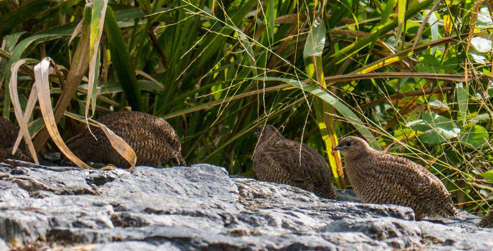

# Animals in the Bible

## License Information

Animals in the Bible © United Bible Societies, 2025. Adapted from: <cite>All Creatures Great and Small: Living Things in the Bible</cite>, by Edward R. Hope © 2005 United Bible Societies. This work is licensed under Creative Commons Attribution-ShareAlike 4.0 International (<a href="https://creativecommons.org/licenses/by-sa/4.0/">https://creativecommons.org/licenses/by-sa/4.0/</a>).

--------------------------------

## 標題：鵪鶉（quail） (id: FAUNA:3.19)

3\.19 標題：鵪鶉（quail）
==================

經文出處
----

Hebrew 來：שְׂלָו (音譯：selav)

[EXO 16:13](https://ref.ly/Exod16:13), [NUM 11:31](https://ref.ly/Num11:31), [NUM 11:32](https://ref.ly/Num11:32), [PSA 105:40](https://ref.ly/Ps105:40)

Greek 希：ὀρτυγομήτρα (音譯：ortugomētra)

[WIS 16:2](https://ref.ly/EsthGr16:2), [WIS 19:12](https://ref.ly/EsthGr19:12)

Latin 拉：coturnix

[2ES 1:15](https://ref.ly/1Esd1:15)

討論
--

各聖經譯本和解經家一致同意這個詞是指西鵪鶉（學名*Coturnix coturnix* ）。幾百年以來，這種鳥在埃及有數百萬隻，一直到20世紀初期都是這樣。人們用網大量捕捉這種鳥，在陽光下曬乾並出口。埃及鵪鶉的遷徙路線相當固定，穿過埃及東部到西奈半島，然後向南進入蘇丹。其他從南歐遷徙到非洲的鵪鶉也穿過西奈。在這些遷徙的過程中，鳥兒會在距離地面只有幾英呎的空中飛行，此時就被人用網捕獲。

描述
--

西鵪鶉是一種棕色的小鳥，身上有白色條紋，是最小的獵鳥。外形看起來像一隻迷你鷓鴣，喙下面有一個白色小斑點，眼睛上方有一條白色條紋，繞著脖子還有一條白色條紋。雄性在胸部有一塊栗色斑，上方有一條黑色的胸紋。

特殊意義或象徵意義
---------

在以色列人出埃及之後的曠野漂流期間，仁慈的上帝賜下鵪鶉給他們作食物。

翻譯
--

西鵪鶉遍佈非洲、南歐、東南歐和中東。後來，在橫貫亞洲大陸到日本的不連續地帶中也發現有牠們的存在。其他非常相似的物種，花臉鵪鶉（學名*Coturnix delegorguei* ）和中國鵪鶉（又稱「藍胸鶉」；學名*Coturnix chinensis* ），在非洲和亞洲同樣很常見。藍胸鶉在澳大利亞也有，被稱為王鵪鶉。在北美洲，加州鵪鶉（又稱「珠頸斑鶉」）廣為人知。在其他不知道真正鵪鶉的地區，可以使用「小鷓鴣」之類的短語來表示這種鳥。[NUM 11:31](https://ref.ly/Num11:31) 中經文的字面意思是「離地面約有二肘」，應該解作「牠們在距離地面約一米的高度飛行。」下一節經文應該解作「他們把鵪鶉鋪開放在地上」，意即在陽光下曬乾。

* **Associated Passages:** 出埃及記 16:13; 民數記 11:31; 民數記 11:32; 詩篇 105:40; 智慧篇 16:2; 智慧篇 19:12; 厄斯德拉下 1:15

