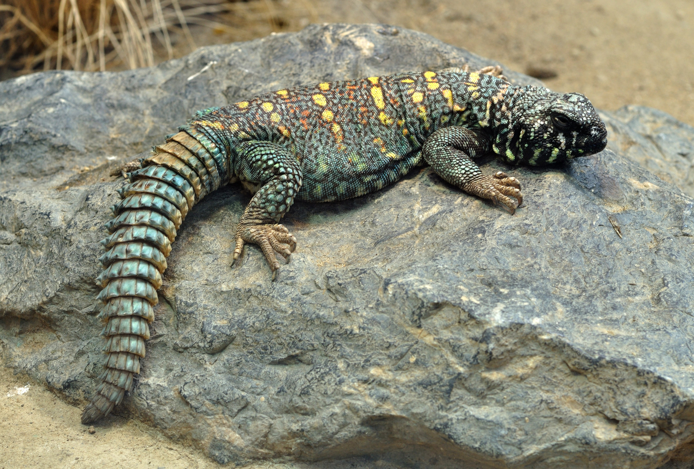
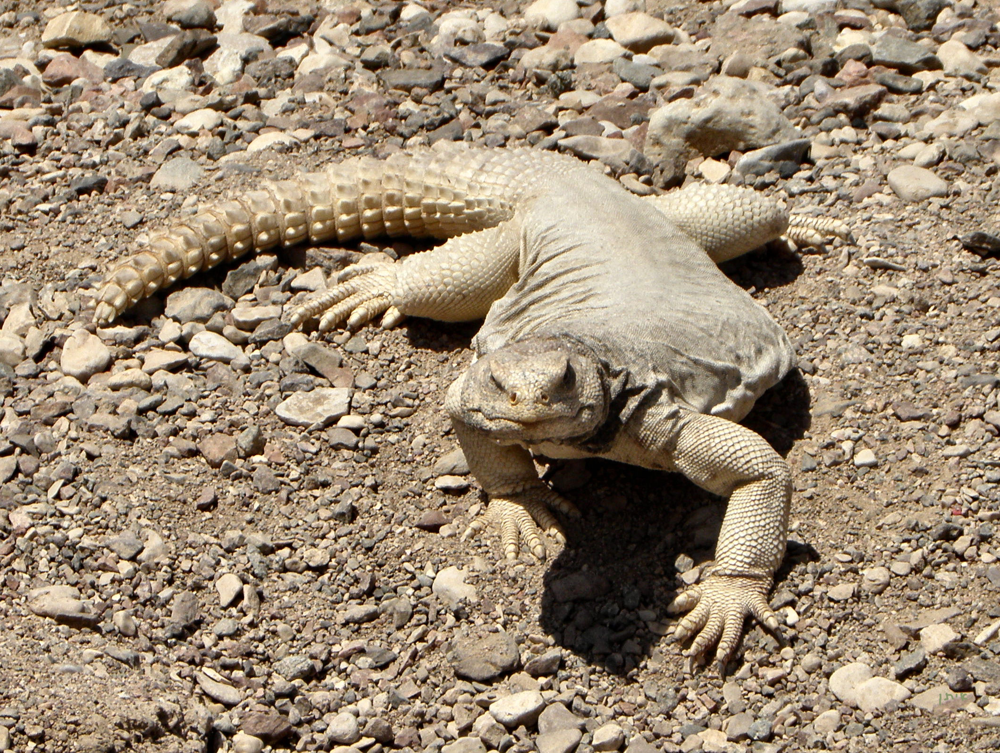

# Animals in the Bible

## License Information

Animals in the Bible © United Bible Societies, 2025. Adapted from: <cite>All Creatures Great and Small: Living Things in the Bible</cite>, by Edward R. Hope © 2005 United Bible Societies. This work is licensed under Creative Commons Attribution-ShareAlike 4.0 International (<a href="https://creativecommons.org/licenses/by-sa/4.0/">https://creativecommons.org/licenses/by-sa/4.0/</a>).

--------------------------------

## 標題：蜥蜴（lizard） (id: FAUNA:4.6)

4\.6 標題：蜥蜴（lizard）
==================

經文出處
----

Hebrew 來：לְטָאָה (音譯：leta’ah)

[LEV 11:30](https://ref.ly/Lev11:30)

Hebrew 來：צָב (音譯：tsav)

[LEV 11:29](https://ref.ly/Lev11:29)

討論
--

學者一致同意，希伯來文*leta’ah* 指的是正蜥和飛蜥，這兩種蜥蜴在以色列很常見，也很顯眼。正蜥的皮膚柔軟，棲息在靠近道路和房屋的地方。其中一種色彩比較鮮艷的正蜥是敘利亞綠蜥蜴（學名*Lacerta trilineata* ），生活在果園和樹林中。最常見的飛蜥是彩虹飛蜥（學名*Agama stellio* ），常出沒在房屋周圍、牆壁和岩石上。

大多數學者認為，希伯來文*tsav* 是刺尾蜥蜴（dab lizard）的名稱，以色列有很多種這樣的蜥蜴。最常見的兩種是埃及刺尾蜥（學名*Uromastyx aegyptia* ）和飾紋刺尾蜥（學名*Uromastyx ornata* ）。刺尾蜥的阿拉伯文名稱是*dhubb* 或*dhabb* ，英文形式是dab；這個阿拉伯文名稱反映在希伯來文*tsav* 中。

描述
--

正蜥（希伯來文*leta’ah* ）體型很小，體長約15—20厘米（6—8英吋），皮膚光滑亮澤。敘利亞綠蜥蜴呈淺綠色，身上佈有深綠色斑點，腹部為黃綠色。正蜥以蒼蠅、小蟲子、蚊子和螞蟻為食。

彩虹飛蜥的體型要大得多，長達50—60厘米（20—24英吋）。在繁殖季節，雄性會變為明亮的顏色，有藍色的尾巴，綠色的身體，頭部的顏色則根據各亞種有所不同，有的是亮橙色，有的是亮綠色。雌性和非交配期的雄性呈暗灰色。所有飛蜥都有這樣的特點：用前腿做「俯臥撐」，使頭部有力地上下擺動。牠們的尾巴又長又硬，快速爬行的時候會豎起來。以多種昆蟲為食，也捕食較小的蜥蜴。在大部分說阿拉伯語的地方，牠們被稱為*hardoun* 蜥蜴。一些飛蜥能夠改變顏色以融入周圍環境，就像變色龍那樣。

刺尾蜥（希伯來文*tsav* ）是相對較大的沙漠蜥蜴，體長約65厘米（26英吋）。這些蜥蜴的軀幹粗壯，尾巴粗短，上面覆蓋著尖刺，尖刺實際上是錐形的鱗片。刺尾蜥用尾巴來進行防禦。牠們經常爬進岩石洞穴或裂縫裡，然後用帶刺的尾巴堵住入口。刺尾蜥是素食者，以各種多汁的沙漠植物為食。儘管刺尾蜥被列為不潔淨的動物，阿拉伯人和貝都因人還是會把牠們關在籠子裡養肥，然後當作食物。

特殊意義或象徵意義
---------

這些蜥蜴被列為禮儀上不潔淨的動物。

翻譯
--

飛蜥遍佈非洲和亞洲熱帶地區。正蜥分佈於歐洲各地。在其他地方，翻譯者可以採用一個蜥蜴的總稱。

翻譯希伯來文*tsav* 時，採用「帶刺的大蜥蜴」或「尾巴帶刺的大蜥蜴」等短語通常是最好的譯法。如果目標語言區分了較小的蜥蜴和巨蜥，那麼使用「帶刺的巨蜥」或「尾巴帶刺的巨蜥」等短語更為合適，可以把體型很大的特點更好地傳達出來。

* **Associated Passages:** 利未記 11:30; 利未記 11:29

