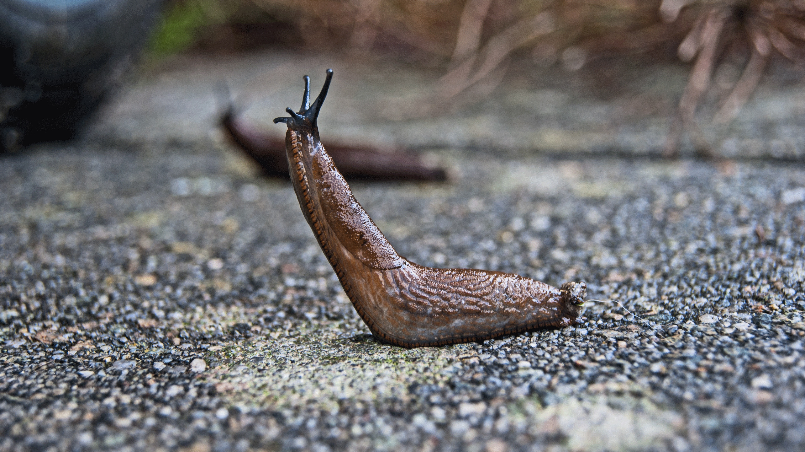

# Animals in the Bible

## License Information

Animals in the Bible © United Bible Societies, 2025. Adapted from: <cite>All Creatures Great and Small: Living Things in the Bible</cite>, by Edward R. Hope © 2005 United Bible Societies. This work is licensed under Creative Commons Attribution-ShareAlike 4.0 International (<a href="https://creativecommons.org/licenses/by-sa/4.0/">https://creativecommons.org/licenses/by-sa/4.0/</a>).

--------------------------------

## 標題：蝸牛（snail） (id: FAUNA:5.4)

5\.4 標題：蝸牛（snail）
=================

經文出處
----

Hebrew 來：שַׁבְּלוּל (音譯：shablul)

[PSA 58:9](https://ref.ly/Ps58:9)

討論
--

將這個詞譯為「蝸牛」的傳統非常悠久。該詞在平行詩句中對應「早產」，因此有些學者認為*shablul* 的意思是流產或是墮胎的胎兒，然而只有NEB (New English Bible (1970)) 和REB (Revised English Bible (1989)) 採納了這種解釋。

描述
--

蝸牛是一種軟體動物，然而有許多種類的蝸牛生活在陸地上，通常是在潮濕的環境中。蝸牛通常長著螺旋形的殼，在移動時拖著殼前行。以色列地區的土壤主要是由石灰岩形成的。蝸牛具有非常堅固的外殼，因此只要能夠找到躲避極度高溫的藏身之地，那麼即使在沙漠條件下也能生存。有些肉食蝸牛以其他種類的蝸牛為食，但大多數都是素食。蝸牛的身體有一部分稱為足，伸出殼外，以波浪式的運動向前爬行。頭也會伸出殼外。蝸牛在爬行時會分泌黏液，沿著移動的路徑留下一道黏滑的痕跡。古代以色列人似乎認為蝸牛一邊爬行一邊溶化，可能就是這個原因。

蛞蝓是一種沒有殼的蝸牛。

翻譯
--

儘管蝸牛或無殼蛞蝓在有些地方會冬眠，但是這些動物在世界上大多數地方都很常見。因此，在翻譯聖經中唯一一次提到蝸牛的這句經文時，應該不難找到合適的譯詞。

* **Associated Passages:** 詩篇 58:9

