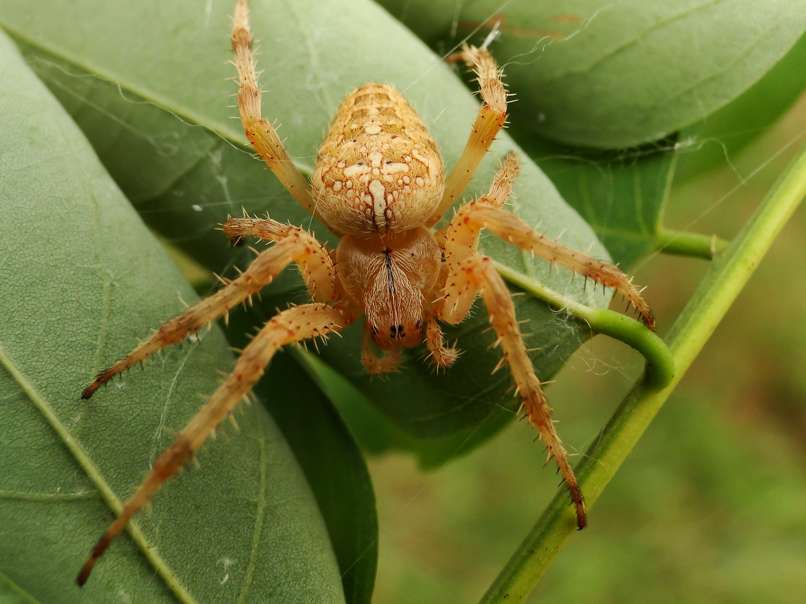

# Animals in the Bible

## License Information

Animals in the Bible © United Bible Societies, 2025. Adapted from: <cite>All Creatures Great and Small: Living Things in the Bible</cite>, by Edward R. Hope © 2005 United Bible Societies. This work is licensed under Creative Commons Attribution-ShareAlike 4.0 International (<a href="https://creativecommons.org/licenses/by-sa/4.0/">https://creativecommons.org/licenses/by-sa/4.0/</a>).

--------------------------------

## 標題：蜘蛛（spider） (id: FAUNA:6.12)

6\.12 標題：蜘蛛（spider）
===================

經文出處
----

Hebrew 來：עַכָּבִישׁ (音譯：‘akavish)

[JOB 8:14](https://ref.ly/Job8:14), [ISA 59:5](https://ref.ly/Isa59:5)

討論
--

這個詞在《希伯來聖經》中出現兩次，都是在短語「蜘蛛網」裡面。學者對這個詞的解釋持一致的意見。

描述
--

蜘蛛是長著八條腿的動物，通常會吐絲，絲可用來織網（如：圓蛛）、做巢的內層，以及覆蓋卵；活板門蜘蛛還會用絲來製造活板門的樞紐。圓蛛似乎就是聖經中提到的蜘蛛，牠們會吐絲結網，以捕捉獵物，主要是蒼蠅、蚱蜢等飛蟲。以色列有幾十種不同的蜘蛛，但*‘akavish* 不是指其中的任何一種，而是所有蜘蛛的統稱。

特殊意義或象徵意義
---------

在聖經中，蜘蛛網象徵脆弱、短暫、容易被破壞的東西。

翻譯
--

蜘蛛遍佈世界各地。然而，在目標語言的文化中，蜘蛛網有可能不被視為短暫或容易破壞的東西。因此，NEB (New English Bible (1970)) 將[ISA 59:5](https://ref.ly/Isa59:5) 翻譯為「他們編織討厭的、無用的蜘蛛網」（"cobwebs"），而不是譯為「他們編織蜘蛛網」（"spider’s web"）。對於許多的語言，像「他們編織脆弱的蜘蛛網」之類的表達，應該是比較好的對等譯法。[JOB 8:14](https://ref.ly/Job8:14) 中有一個含義不明的希伯來文詞語，但所要表達的意思相當清楚：

他所仰賴的對象十分脆弱；

他所倚靠的不過是一張脆弱的蜘蛛網。

* **Associated Passages:** 約伯記 8:14; 以賽亞書 59:5

