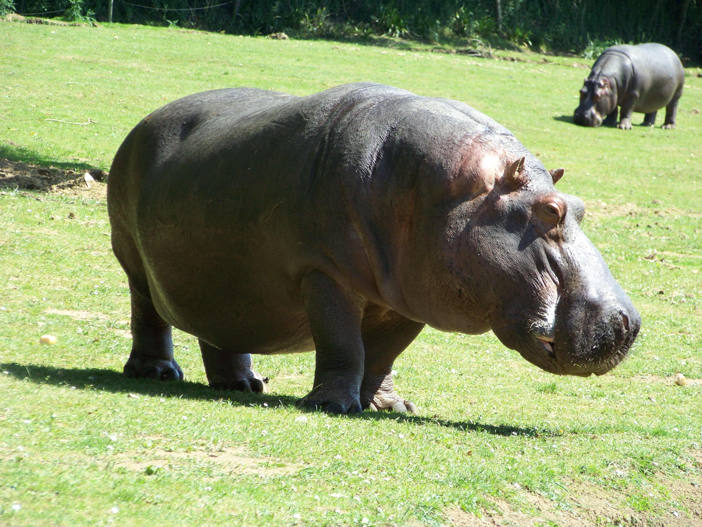

# Animals in the Bible

## License Information

Animals in the Bible © United Bible Societies, 2025. Adapted from: <cite>All Creatures Great and Small: Living Things in the Bible</cite>, by Edward R. Hope © 2005 United Bible Societies. This work is licensed under Creative Commons Attribution-ShareAlike 4.0 International (<a href="https://creativecommons.org/licenses/by-sa/4.0/">https://creativecommons.org/licenses/by-sa/4.0/</a>).

--------------------------------

## 標題：貝希摩斯（behemoth） (id: FAUNA:7.1)

7\.1 標題：貝希摩斯（behemoth）
======================

經文出處
----

Hebrew 來：בְּהֵמוֹת (音譯：behemoth)

[JOB 40:15](https://ref.ly/Job40:15)

討論
--

在其他語境中，希伯來文*behemah* （「貝希摩斯」）通常泛指任何大型動物，特別指牲畜（參[1 動物概述](#FAUNA:1) ），但[JOB 40:15](https://ref.ly/Job40:15) （*behemah* 以復數形式出現）對這種動物進行了描述，從而將其確定為一種特定的動物。關於*behemah* 一詞在這處經文中具體指什麼動物，主要有三種意見：

（1）一個象徵邪惡力量的神秘怪獸。後來的拉比著作中提到過這種怪獸，講述它與另一個怪獸力威亞探（Leviathan）進行了一場激烈的交戰。其中的一些作品還講到，末後的日子在亞伯拉罕大宴席上擺設的就是這個貝希摩斯的肉。有人將這個怪獸與[GEN 1:21](https://ref.ly/Gen1:21) 中提到的「巨大的海獸」（中文譯本作「大魚」）聯想在一起。

（2）河馬（學名*Hippopotamus amphibious* ）。這個提議已被廣泛接受，並且列在多種英文譯本的腳註裡。河馬在埃及，也許還有美索不達米亞的部分地區，必定是為人所熟知的。但是，[JOB 40:15–JOB 40:20](https://ref.ly/Job40:15-Job40:20) 中的許多描述與河馬並不相符：

首先，[JOB 40:16](https://ref.ly/Job40:16) 提到貝希摩斯具有極大的力量和強壯的肌肉，然而這很難與河馬聯繫起來。河馬大部分時間都是在安靜地吃草，或是在水中休息。河馬的雙顎極其有力，公河馬也很危險，但總體來說，即使是細心的觀察者也不會對牠的肌肉和力量心生畏懼。

其次，河馬的尾巴小而短粗，不能直立起來，僅僅是用來把排出的糞便撥向四周。因此，河馬的尾巴很難像[JOB 40:17](https://ref.ly/Job40:17) 所述的那樣被比作香柏樹。

最後，[JOB 40:20](https://ref.ly/Job40:20) 提到貝希摩斯是以山上的草為食，但河馬通常是在河的岸邊、洪氾平原或是河谷附近進食。河馬即使曾經出現在山上，也是極其罕見，因為河馬的腿極短，身軀龐大，很難跨越岩石或爬上陡坡。JB (Jerusalem Bible (1966)) 、NEB (New English Bible (1970)) 和REB (Revised English Bible (1989)) 基本上重新解釋了第20節，以解決這個問題；這節經文的希伯來文本並不十分清楚。

（3）大象。在舊約時期，生活在埃及南部的尼羅河谷、蘇丹和埃塞俄比亞的非洲象（學名*Loxodonta Africana* ），以及生活在美索不達米亞北部的印度象（學名*Elephas maximus* ）都為人所熟知。經文對貝希摩斯的描述更貼近大象而非河馬。大象的力量顯而易見，並且奔跑時會伸直尾巴。另外，翻譯為「尾巴」的希伯來文詞語也可能是指象鼻。[JOB 40:21](https://ref.ly/Job40:21) 說，「牠伏在蓮葉之下，在蘆葦和沼澤的隱密處」，這可能是指大象洗泥浴、在泥坑和河裡打滾的習性。

有人提出異議說，經常光顧河流和吃草的描述並不符合大象的習性。但事實上，大象非常喜歡吃河邊的草，而且經常在河裡或水坑中待上好幾個小時。另參[2\.14 象(elephant)](#FAUNA:2.14) 。

翻譯
--

這個詞最好的譯法也許是：在正文中採用「怪獸貝希摩斯」這樣的表述，並在腳註中註明這種怪獸可能是大象，當然，前提是大象為讀者所熟知，如果讀者不知道，最好省略腳註。

備註：NEB (New English Bible (1970)) 和REB (Revised English Bible (1989)) 將*behemoth* 譯為"crocodile"（「鱷魚」），只是因為[JOB 40:15–JOB 40:20](https://ref.ly/Job40:15-Job40:20) （《和》41:1—6）被移到了39:30的後面。這樣調換順序後，[JOB 40:21](https://ref.ly/Job40:21) —[JOB 41:25](https://ref.ly/Job41:25) （《和》41:7—41:34）描述的動物似乎和[JOB 40:15](https://ref.ly/Job40:15) 所述的是同一個。但是，幾乎沒有學者支持這種順序的調換，因為這需要對希伯來文本進行大幅度修訂才能使其中的描述符合鱷魚。

* **Associated Passages:** 約伯記 40:15; 創世記 1:21; 約伯記 40:20; 約伯記 40:16; 約伯記 40:17; 約伯記 40:21; 約伯記 41:25

