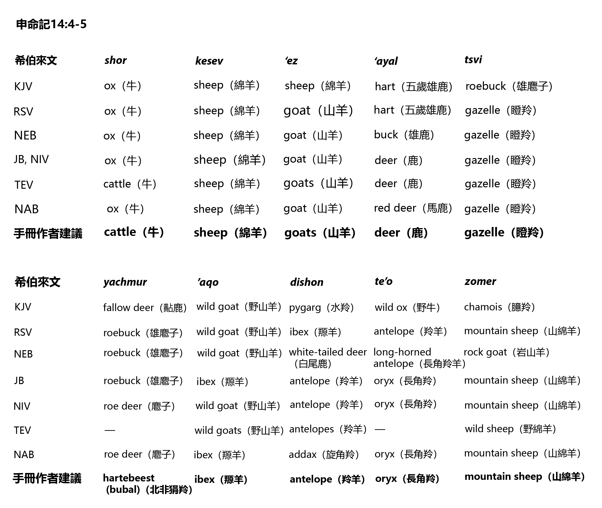

# Animals in the Bible

## License Information

Animals in the Bible © United Bible Societies, 2025. Adapted from: <cite>All Creatures Great and Small: Living Things in the Bible</cite>, by Edward R. Hope © 2005 United Bible Societies. This work is licensed under Creative Commons Attribution-ShareAlike 4.0 International (<a href="https://creativecommons.org/licenses/by-sa/4.0/">https://creativecommons.org/licenses/by-sa/4.0/</a>).

--------------------------------

## 標題：潔淨的動物（申14:4–6） (id: FAUNA:2.1)

2\.1 標題：潔淨的動物（申14:4–6）
======================

[DEU 14:4–DEU 14:6](https://ref.ly/Deut14:4-Deut14:6) 記載了一份在禮儀上潔淨的動物的清單，學者對其中三種家畜的看法一致，但對另外七種植食動物，則有很大的分歧。

首先，我們可以根據考古學的證據，推斷出聖經時期的人們所熟悉的植食動物，這會有助於確認清單上的動物。可以確定的是，瞪羚、劍羚、野山羊、黇鹿和山綿羊必定是他們所熟悉的，因為這些動物在該地區都可找到。牠們分別與希伯來文*tsvi* 、*te’o* 、*’aqo* 、*’ayal* 和*zemer* 配對，這就确定了七種植食動物中的五種，但剩下兩種還不能完全確定。

在聖地所見的野生動物中，赤狷羚和水羚屬的羚羊很早就被視為潔淨的動物。上文所述的一個還未確定的希伯來文詞語*yachmur* 很可能就是指這兩種動物之一，很可能就是狷羚。如果情況確實是這樣，那麼所羅門晚年在以色列飼養了一群狷羚（[1KI 4:23](https://ref.ly/1Kgs4:23) ）。飼養野生狷羚在美索不達米亞和埃及都很常見。

另外一個還未確定的希伯來文詞語*dishon* 指的可能是水羚屬羚羊，或者是旋角羚，埃及人也會飼養這種動物。

*表1*

以色列人熟知的所有「狩獵動物」，即鹿、羚羊、瞪羚、野山羊和野綿羊，顯然都列在潔淨動物的清單裡。在譯文中保留這個事實，可能比確定每一個希伯來文詞語的具體所指更加重要。

---

申命記14:4–5
---------

| 希伯來文 | *shor* | *kesev* | *‘ez* | *’ayal* | *tsvi* |
| --- | --- | --- | --- | --- | --- |
| KJV (King James Version (1611)) | ox（牛） | sheep（綿羊） | sheep（綿羊） | hart（五歲雄鹿） roebuck（雄麅子） |
| RSV (Revised Standard Version (1952)) | ox（牛） | sheep（綿羊） | goat（山羊） | hart（五歲雄鹿） | gazelle（瞪羚） |
| NEB (New English Bible (1970)) ox（牛） | sheep（綿羊） | goat（山羊） | buck（雄鹿） | gazelle（瞪羚） |
| JB (Jerusalem Bible (1966)), NIV (New International Version (1984)) | ox（牛） | sheep（綿羊） | goat（山羊） | deer（鹿） | gazelle（瞪羚） |
| TEV (Today's English Version (Good News Bible)) | cattle（牛） | sheep（綿羊） | goats（山羊） | deer（鹿） | —— |
| NAB (New American Bible (1970)) | ox（牛） | sheep（綿羊） | goat（山羊） | red deer（馬鹿） | gazelle（瞪羚） |
| 手冊作者建議 | **cattle（牛）** | **sheep（綿羊）** | **goats（山羊）** | **deer（鹿）** | **gazelle（瞪羚）** |
| 希伯來文 | *yachmur* | *’aqo* | *dishon* | *te’o* | *zomer* |
| KJV (King James Version (1611)) | fallow deer（黇鹿） | wild goat（野山羊） | pygarg（水羚） | wild ox（野牛） | chamois（臆羚） |
| RSV (Revised Standard Version (1952)) | roebuck（雄麅子） | wild goat（野山羊） | ibex（羱羊） | antelope（羚羊） | mountain sheep（山綿羊） |
| NEB (New English Bible (1970)) | roebuck（雄麅子） | wild goat（野山羊） | white\-tailed deer（白尾鹿） | long\-horned antelope（長角羚羊） | rock goat（岩山羊） |
| JB (Jerusalem Bible (1966)) | roebuck（雄麅子） | ibex（羱羊） | antelope（羚羊） | oryx（長角羚） | mountain sheep（山綿羊） |
| NIV (New International Version (1984)) | roe deer（麅子） | wild goat（野山羊） | antelope（羚羊） | oryx（長角羚） | mountain sheep（山綿羊） |
| TEV (Today's English Version (Good News Bible)) | —— | wild goats（野山羊） | antelopes（羚羊） | —— | wild sheep（野綿羊） |
| NAB (New American Bible (1970)) | roe deer（麅子） | ibex（羱羊） | addax（旋角羚） | oryx（長角羚） | mountain sheep（山綿羊） |
| 手冊作者建議 | **hartebeest (bubal)（北非狷羚）** | **ibex（羱羊）** | **antelope（羚羊）** | **oryx（長角羚）** | **mountain sheep（山綿羊）** |

---

* **Associated Passages:** 申命記 14:4; 申命記 14:6; 列王紀上 4:23

