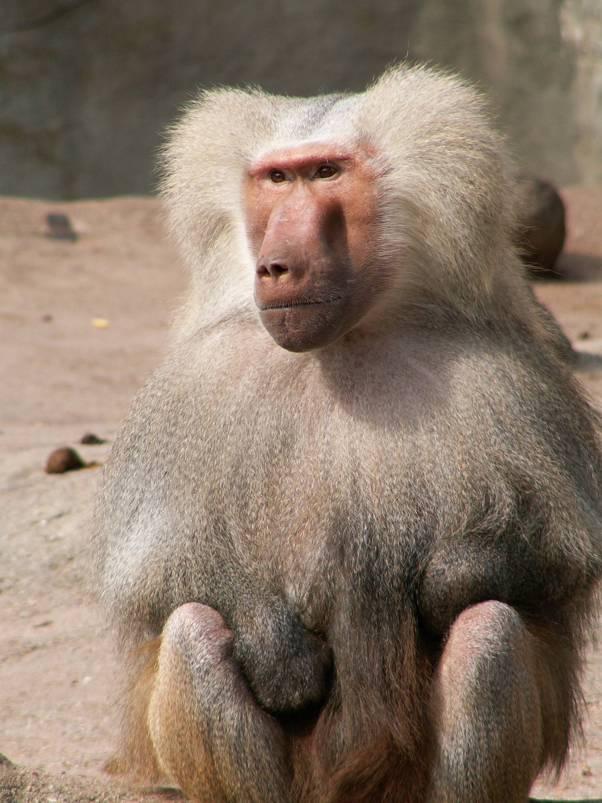
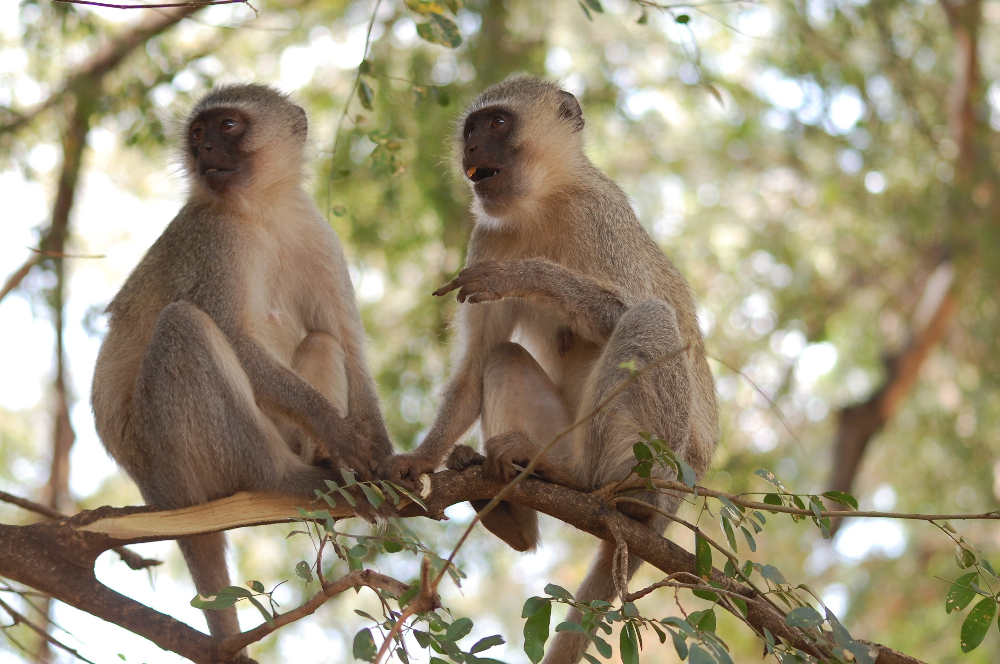

# Animals in the Bible

## License Information

Animals in the Bible © United Bible Societies, 2025. Adapted from: <cite>All Creatures Great and Small: Living Things in the Bible</cite>, by Edward R. Hope © 2005 United Bible Societies. This work is licensed under Creative Commons Attribution-ShareAlike 4.0 International (<a href="https://creativecommons.org/licenses/by-sa/4.0/">https://creativecommons.org/licenses/by-sa/4.0/</a>).

--------------------------------

## 標題：猿猴（apes） (id: FAUNA:2.3)

2\.3 標題：猿猴（apes）
================

* [2\.3\.1 狒狒（baboon）](#FAUNA:2.3.1)
* [2\.3\.2 猴子（monkey）](#FAUNA:2.3.2)

## 標題：狒狒（baboon） (id: FAUNA:2.3.1)

2\.3\.1 標題：狒狒（baboon）
=====================

經文出處
----

Hebrew 來：קוֹף (音譯：qof)

[1KI 10:22](https://ref.ly/1Kgs10:22), [2CH 9:21](https://ref.ly/2Chr9:21)

討論
--

*阿拉伯狒狒 (Public domain (Wikimedia Commons))*

非洲、亞洲和歐洲有兩個靈長類動物科，分別是有尾巴的猴科（學名*Cercopithecidae* ）和沒有尾巴的猩猩科（學名*Pongidae* ）。有充分的證據顯示，古埃及和古代中東的人們很熟悉猴子和狒狒，但在文學或藝術作品中卻完全沒有提到過沒有尾巴的類人猿。因此，儘管所有英文譯本都譯為"apes"（意為「類人猿」，在16和17世紀用來指任何非人類的靈長類動物），但它可能並不是現代英文中的最佳譯詞。

博登海默（Bodenheimer）認為，希伯來文*qof* 作為一個單詞和字母表中的一個字母，就是古埃及文的詞根*g\-f* 和象形文字*kafu* ，兩者都是指狒狒。其他學者認為，跟許多動物名稱一樣，*qof* 和*kafu* 都是擬聲詞（意即名稱的發音就像是動物發出的聲音）。在古代中東，草原狒狒（黃狒狒；學名*Papio cynocephalus* ）、阿努比斯狒狒（東非狒狒；學名*Papio anubis doguerra* ）和獻祭用的阿拉伯狒狒（學名*Papio hamdryas* ）都是人們所熟知的，因此上述辨識似乎非常合理。

描述
--

狒狒（狒狒屬*papio* 的各個種）是大型靈長類動物，尾巴長，口鼻部像狗。通常，成年狒狒的大小和一隻大狗差不多。有些體型大的公狒狒長著獅子那樣的鬃毛。狒狒大部分時間都在地面上活動，吃各種植物的根、嫩芽、果實和葉子，也吃昆蟲和小型爬行動物。在某些地區，狒狒還會抓一些小型哺乳動物來吃，比如老鼠、野兔，甚至小瞪羚。狒狒群居生活，每群約有30—80隻，有明確的社會結構，由一隻居於統治地位的母狒狒領導全群。狒狒通常是淺棕色的，但年老的公狒狒有時候會變成灰色。

在非洲，除了撒哈拉沙漠和非洲西北部以外，大部分多石丘陵地區都有狒狒或其近緣物種，比如山魈。

翻譯
--

在非洲，狒狒、山魈或獅尾狒（埃塞俄比亞）的當地名稱是很好的對等詞。在其他地方，如果當地有體型較大、長時間在地面上活動的猴子，那麼採用這個物種的名稱是不錯的選擇。在南亞、東亞和東南亞地區，多種獼猴和恆河猴在許多方面與狒狒相似。在南美洲，採用大型吼猴的通用名稱是很合適的譯法；如果沒有通稱，可以採用其中一種吼猴的名稱。

在沒有上述猴類的地方，可以採用「大猴子」之類短語，也可以按照希伯來文原文或當地的主要語言進行音譯。

* **Associated Passages:** 列王紀上 10:22; 歷代志下 9:21

## 標題：猴子（monkey） (id: FAUNA:2.3.2)

2\.3\.2 標題：猴子（monkey）
=====================

經文出處
----

Hebrew 來：תֻּכִּי (音譯：tuki)

[1KI 10:22](https://ref.ly/1Kgs10:22), [2CH 9:21](https://ref.ly/2Chr9:21)

討論
--

*長尾黑顎猴 (Pixabay)*

有些譯本將這個詞譯作「孔雀」（"peacocks"；KJV (King James Version (1611)) 、RSV (Revised Standard Version (1952)) ），這幾乎肯定是不正確的。因為除此之外，所羅門船上的其他貨物都來自東非（迄今為止，考古學家在聖地發現的古象牙製品都是用非洲象牙製成的），但孔雀卻是來自印度和緬甸。

如果希伯來文*qof* 指的是狒狒，那麼*tuki* 可能是指長尾猴屬的一種小型長尾猴，這些長尾猴中最常見的是「綠色」和「藍色」的長尾黑顎猴（學名*Cercopithecus aethiops* ），遍佈撒哈拉沙漠以南的非洲、蘇丹和埃塞俄比亞。古時，這些猴子因為很容易捕獲，所以常被當成寵物，出口到整個中東和歐洲。

描述
--

*赤猴 (© Rhythmasharmad (Wikimedia Commons))*

長尾黑顎猴是一種體型較小的長尾猴，皮毛呈灰色，帶點綠色或藍色，眼皮和雄性生殖器也呈綠色或藍色。牠們基本上是素食的動物，吃水果和嫩葉，偶爾也吃昆蟲和蜘蛛。大部分時間都在樹上，偶爾也會到草地上覓食草籽和掉落的果實。牠們以家族群居的方式生活，成員多達20隻左右。

翻譯
--

在非洲大部分地區，較合適的譯詞是長尾猴屬在當地的屬名，或者是長尾黑顎猴、白額長尾猴（學名*Cercopithecus mona* ）或赤猴（*erythrocebus patas* ）的種名。在亞洲，可以使用長尾葉猴的屬名，或任一種常見葉猴的種名。在拉丁美洲，小型卷尾猴的屬名或種名是很合適的譯詞。如果當地語言的選擇有限，或者只有一個表示猴子的詞語，那麼*tuki* 可以翻譯為「小猴子」。在猴子不為人知的地方，翻譯者應該音譯*tuki* ，或者按照主要語言或貿易語言中的詞語進行音譯。

因此，我們建議將[1KI 10:22](https://ref.ly/1Kgs10:22) 和[2CH 9:21](https://ref.ly/2Chr9:21) 中的希伯來文*veqofim vetukiyim* 譯成「狒狒和猴子」。

* **Associated Passages:** 列王紀上 10:22; 歷代志下 9:21

