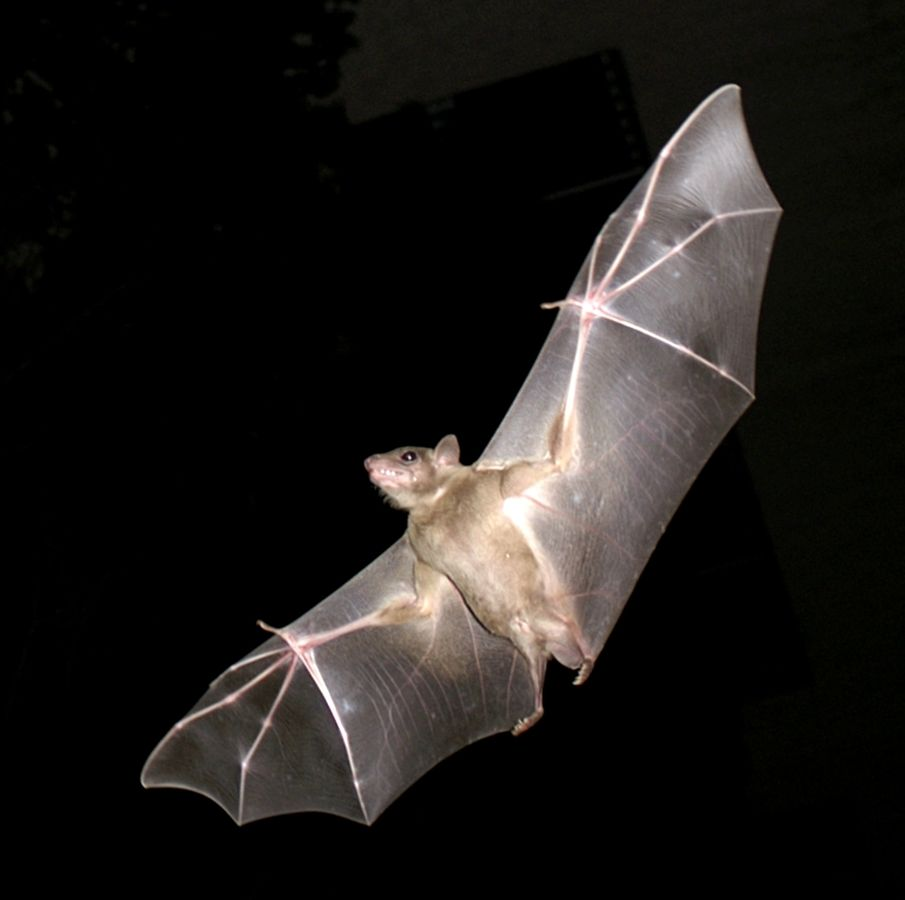

# Animals in the Bible

## License Information

Animals in the Bible © United Bible Societies, 2025. Adapted from: <cite>All Creatures Great and Small: Living Things in the Bible</cite>, by Edward R. Hope © 2005 United Bible Societies. This work is licensed under Creative Commons Attribution-ShareAlike 4.0 International (<a href="https://creativecommons.org/licenses/by-sa/4.0/">https://creativecommons.org/licenses/by-sa/4.0/</a>).

--------------------------------

## 標題：蝙蝠（bat） (id: FAUNA:2.5)

2\.5 標題：蝙蝠（bat）
===============

經文出處
----

Hebrew 來：עֲטַלֵּף (音譯：‘atalef)

[LEV 11:19](https://ref.ly/Lev11:19), [DEU 14:18](https://ref.ly/Deut14:18), [ISA 2:20](https://ref.ly/Isa2:20)

Greek 希：νυκτερίς (音譯：nukteris)

[LJE 1:22](https://ref.ly/EpJer1:22)

討論
--

和世界上許多其他民族一樣，古代以色列人因蝙蝠會飛而將其歸為鳥類。其實，蝙蝠是隸屬於翼手目（學名*Chiroptera* ）的哺乳動物。這個希伯來文詞語是一個統稱，可以指以色列地32種蝙蝠中的任何一種。除了極北地區和南極的苔原，世界上所有地區都有蝙蝠。聖地本土的蝙蝠有兩類：一類吃果實，另一類吃昆蟲。

描述
--

蝙蝠是唯一能夠真正飛翔的哺乳動物（儘管有些哺乳動物也能夠從高處滑翔到低處）。蝙蝠有毛，但沒有羽毛，不生蛋，而是產幼崽。牠們長著細長的前肢和手指，支撐著一片連接手指和腳趾的翼膜，這片翼膜就起到了翅膀的作用。牠們在夜間飛來飛去，白天倒掛在樹上或突出的岩石上。蝙蝠的耳朵和大腦非常特別，能夠通過聆聽自己發出的聲音碰到周圍物體後產生的回聲，來準確地判斷距離。

在以色列地，蝙蝠的大小約在小鼠和大鼠之間。

特殊意義或象徵意義
---------

在舊約中，以果實為食和以昆蟲為食的兩類蝙蝠都被認為是在禮儀上不潔淨的。以色列境內有許多種類的蝙蝠生活在洞穴、墓穴、空房和廢墟裡，因此人們將牠們與死亡、荒涼、毀滅和巫術聯繫在一起。

翻譯
--

由於蝙蝠隨處可見，找到一個譯詞並不困難。翻譯者可以使用表示吃昆蟲或果實的蝙蝠的詞語，但不應當使用表示熱帶拉丁美洲的吸血蝙蝠、食魚蝙蝠或食鳥蝙蝠的詞語。在許多文化中，蝙蝠與毀滅和荒涼沒有關聯，因此在[ISA 2:20](https://ref.ly/Isa2:20) 中，可能需要使用「將……遺棄給蝙蝠」等類短語。

* **Associated Passages:** 利未記 11:19; 申命記 14:18; 以賽亞書 2:20; 耶利米書信 1:22

