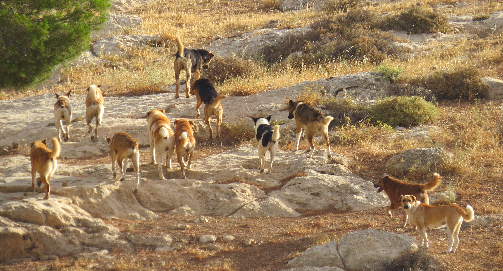
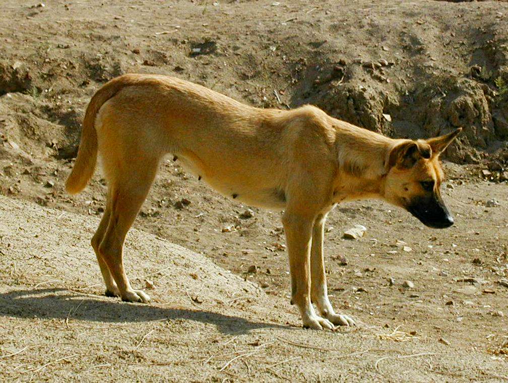

# Animals in the Bible

## License Information

Animals in the Bible © United Bible Societies, 2025. Adapted from: <cite>All Creatures Great and Small: Living Things in the Bible</cite>, by Edward R. Hope © 2005 United Bible Societies. This work is licensed under Creative Commons Attribution-ShareAlike 4.0 International (<a href="https://creativecommons.org/licenses/by-sa/4.0/">https://creativecommons.org/licenses/by-sa/4.0/</a>).

--------------------------------

## 標題：狗（dog） (id: FAUNA:2.12)

2\.12 標題：狗（dog）
===============

經文出處
----

Hebrew 來：כֶּלֶב (音譯：kelev)

[EXO 11:7](https://ref.ly/Exod11:7), [EXO 22:30](https://ref.ly/Exod22:30), [DEU 23:19](https://ref.ly/Deut23:19), [JDG 7:5](https://ref.ly/Judg7:5), [1SA 17:43](https://ref.ly/1Sam17:43), [1SA 24:15](https://ref.ly/1Sam24:15), [2SA 3:8](https://ref.ly/2Sam3:8), [2SA 9:8](https://ref.ly/2Sam9:8), [2SA 16:9](https://ref.ly/2Sam16:9), [1KI 14:11](https://ref.ly/1Kgs14:11), [1KI 16:4](https://ref.ly/1Kgs16:4), [1KI 21:19](https://ref.ly/1Kgs21:19), [1KI 21:19](https://ref.ly/1Kgs21:19), [1KI 21:23](https://ref.ly/1Kgs21:23), [1KI 21:24](https://ref.ly/1Kgs21:24), [1KI 22:38](https://ref.ly/1Kgs22:38), [2KI 8:13](https://ref.ly/2Kgs8:13), [2KI 9:10](https://ref.ly/2Kgs9:10), [2KI 9:36](https://ref.ly/2Kgs9:36), [JOB 30:1](https://ref.ly/Job30:1), [PSA 22:17](https://ref.ly/Ps22:17), [PSA 22:21](https://ref.ly/Ps22:21), [PSA 59:7](https://ref.ly/Ps59:7), [PSA 59:15](https://ref.ly/Ps59:15), [PSA 68:24](https://ref.ly/Ps68:24), [PRO 26:11](https://ref.ly/Prov26:11), [PRO 26:17](https://ref.ly/Prov26:17), [ECC 9:4](https://ref.ly/Eccl9:4), [ISA 56:10](https://ref.ly/Isa56:10), [ISA 56:11](https://ref.ly/Isa56:11), [ISA 66:3](https://ref.ly/Isa66:3), [JER 15:3](https://ref.ly/Jer15:3)

Greek 希：κύων (音譯：kuōn)

[MAT 7:6](https://ref.ly/Matt7:6), [LUK 16:21](https://ref.ly/Luke16:21), [PHP 3:2](https://ref.ly/Phil3:2), [2PE 2:22](https://ref.ly/2Pet2:22), [REV 22:15](https://ref.ly/Rev22:15), [TOB 5:16](https://ref.ly/Tob5:16), [TOB 11:4](https://ref.ly/Tob11:4), [JDT 11:19](https://ref.ly/Jdt11:19), [SIR 13:18](https://ref.ly/Sir13:18)

Greek 希：κυνάριον (音譯：kunarion)

[MAT 15:26](https://ref.ly/Matt15:26), [MAT 15:27](https://ref.ly/Matt15:27), [MRK 7:27](https://ref.ly/Mark7:27), [MRK 7:28](https://ref.ly/Mark7:28)

討論和描述
-----

狗很早就被馴化，古時用於狩獵和看門。早在主前4,000年，埃及陶器上就描繪有皮毛光滑、速度飛快的獵犬，看起來很像現代的灰狗。從巴比倫雕塑得知，美索不達米亞人約在主前2,500年就飼養了大型獵犬，樣子像是現代的鬥牛獒。

猶太人雖然也養狗，主要用於看門，但卻輕視牠們，讓牠們在垃圾堆裡自行覓食。因著狗這種食腐的習性，以及狗在當時還可能與一些埃及神明有聯繫，所以猶太人將狗視為非常不潔淨的動物。在聖經時期，猶太人居住地所見的狗可能是流浪狗（學名*Canis familiaris putiatini* ），外表很像體型較小的淺棕色德國牧羊犬。野生和家養的流浪狗在中東地區隨處可見，在南亞和東南亞的大陸沿海地區也被稱為食蟹狗。這種狗也和澳洲野狗十分相似。

依循希臘和羅馬文化的外邦人會在家中飼養小型寵物狗，但猶太人不這樣做。這種寵物狗可能就是[MAT 15:26](https://ref.ly/Matt15:26) 和[MRK 7:27](https://ref.ly/Mark7:27) 中提到的*kunarion* 。

特殊意義或象徵意義
---------

如上所述，狗被猶太人視為禮儀上不潔淨的動物。因此，稱某人為「狗」是非常貶義的說法，如果將某人稱為「死狗」更是如此。以色列人認為，狗是僅次於豬的第二不潔淨的動物。流浪狗遊蕩在村莊周圍，吃的東西包括動物屍體和人的糞便，甚至還吃戰死後沒有及時掩埋的人的屍體。此外，狗還可能是古埃及死神阿努比斯（Anubis）的象徵（儘管許多現代學者認為應該是豺狼）。

綜上不難理解，死後被狗吞吃被猶太人視為最糟糕的結局。

在主後1世紀，猶太人認為外邦人是禮儀上不潔淨的，因此貶稱他們為「狗」。因此，[PHP 3:2](https://ref.ly/Phil3:2) 將猶太派基督徒比作狗，具有強烈的諷刺意味。

在聖經中，狗還有一個隱含意思，與性變態和濫交有關，這可能是因為發情的公狗在尋求交配時並不總能區分公母，而且公狗和母狗會與不同的狗多次交配。

翻譯
--

在[EXO 11:7](https://ref.ly/Exod11:7) 中，有一句話的字面意思是「沒有一隻狗會搖舌」，意思是沒有一隻狗會吠叫或咆哮，並且翻譯者也應該這樣翻譯。

[DEU 23:18](https://ref.ly/Deut23:18) 把那些在迦南神廟裡面賣淫的男妓稱為「狗」，並且[REV 22:15](https://ref.ly/Rev22:15) 中的「犬類」似乎是指性變態或亂交的人。這兩節經文如果按照字面翻譯就會喪失這個象徵意義，因此最好在前一節經文中譯成「男廟妓」，在後一節經文中使用「肆意苟合的人」等表述。

關於[2SA 3:8](https://ref.ly/2Sam3:8) 中「猶大的狗頭」一語，有解經家認為指的是事奉古埃及死神阿努比斯的祭司所戴的神聖狗頭面具，因此這裡是指「披著偽裝的猶大人」，即「猶大間諜」。還有解經家認為這個表述是指濫交（從狗的習性而來的象徵意義），因此經文是指「猶大的性欲旺盛之人」。在這節經文的語境中，兩種解釋都有可能，也許兩種言外之意都有，這樣該短語的意思就是「性欲旺盛的猶大間諜」。

[JOB 30:1](https://ref.ly/Job30:1) ：「看守我羊群的狗」指的是幫助牧人看守羊群的看門狗。

[ISA 66:3](https://ref.ly/Isa66:3) ：「獻羊羔，好像打折狗項」這個分句應該理解為，第4節提到有些百姓不順服上帝，因此他們即使獻上羔羊等蒙上帝悅納的祭物，也與獻上最不被上帝悅納、最不潔淨的祭物一樣。「打折狗項」是上帝不悅納的祭物這點可以從兩個方面來理解：首先，狗是一種不潔淨的動物，其次以打斷脖子的方式殺狗是錯誤的，因為血會留在狗的身體裡面，按照猶太律法這是不潔淨的。

在[PHP 3:2](https://ref.ly/Phil3:2) 中，如果把過度重視禮儀上的潔淨和割禮的基督徒譯作「狗」，幾乎不可能讓讀者領略到這個比喻的諷刺意味。如果目標語言的文化並不把狗視為特別不乾淨的動物，那麼翻譯時應該使用「髒狗」等表述。

* **Associated Passages:** 出埃及記 11:7; 出埃及記 22:30; 申命記 23:19; 士師記 7:5; 撒母耳記上 17:43; 撒母耳記上 24:15; 撒母耳記下 3:8; 撒母耳記下 9:8; 撒母耳記下 16:9; 列王紀上 14:11; 列王紀上 16:4; 列王紀上 21:19; 列王紀上 21:23; 列王紀上 21:24; 列王紀上 22:38; 列王紀下 8:13; 列王紀下 9:10; 列王紀下 9:36; 約伯記 30:1; 詩篇 22:17; 詩篇 22:21; 詩篇 59:7; 詩篇 59:15; 詩篇 68:24; 箴言 26:11; 箴言 26:17; 傳道書 9:4; 以賽亞書 56:10; 以賽亞書 56:11; 以賽亞書 66:3; 耶利米書 15:3; 馬太福音 7:6; 路加福音 16:21; 腓立比書 3:2; 彼得後書 2:22; 啟示錄 22:15; 多俾亞傳 5:16; 多俾亞傳 11:4; 友弟德傳 11:19; 德訓篇 13:18; 馬太福音 15:26; 馬太福音 15:27; 馬可福音 7:27; 馬可福音 7:28; 申命記 23:18

