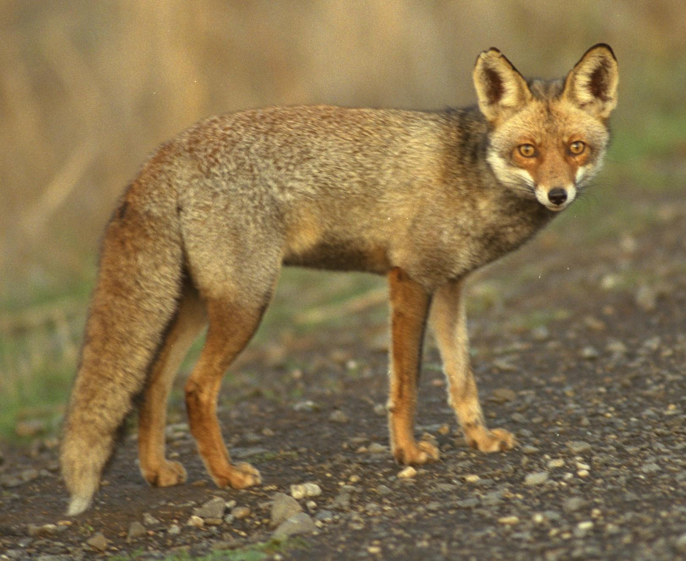
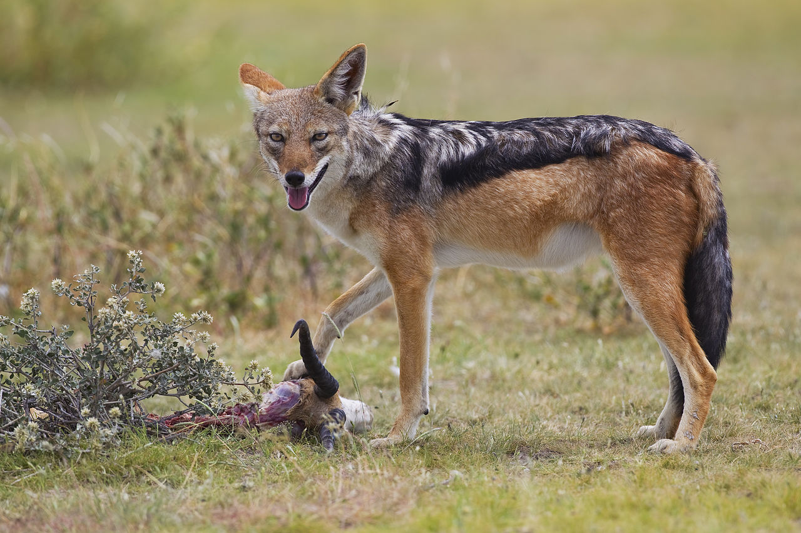

# Animals in the Bible

## License Information

Animals in the Bible © United Bible Societies, 2025. Adapted from: <cite>All Creatures Great and Small: Living Things in the Bible</cite>, by Edward R. Hope © 2005 United Bible Societies. This work is licensed under Creative Commons Attribution-ShareAlike 4.0 International (<a href="https://creativecommons.org/licenses/by-sa/4.0/">https://creativecommons.org/licenses/by-sa/4.0/</a>).

--------------------------------

## 標題：土狼、豺狼、野狗、狐狸（jackal, fox） (id: FAUNA:2.22)

2\.22 標題：土狼、豺狼、野狗、狐狸（jackal, fox）
=================================

經文出處
----

Hebrew 來：אֹחַ (音譯：’ochim)

[ISA 13:21](https://ref.ly/Isa13:21)

Hebrew 來：אִי (音譯：’iy)

[ISA 13:22](https://ref.ly/Isa13:22), [ISA 34:14](https://ref.ly/Isa34:14), [JER 50:39](https://ref.ly/Jer50:39)

Hebrew 來：שׁוּעָל (音譯：shu‘al)

[JDG 15:4](https://ref.ly/Judg15:4), [NEH 3:35](https://ref.ly/Neh3:35), [PSA 63:11](https://ref.ly/Ps63:11), [SNG 2:15](https://ref.ly/Song2:15), [SNG 2:15](https://ref.ly/Song2:15), [LAM 5:18](https://ref.ly/Lam5:18), [EZK 13:4](https://ref.ly/Ezek13:4)

Hebrew 來：תַּן (音譯：tan)

[NEH 2:13](https://ref.ly/Neh2:13), [JOB 30:29](https://ref.ly/Job30:29), [PSA 44:20](https://ref.ly/Ps44:20), [ISA 13:22](https://ref.ly/Isa13:22), [ISA 34:13](https://ref.ly/Isa34:13), [ISA 35:7](https://ref.ly/Isa35:7), [ISA 43:20](https://ref.ly/Isa43:20), [JER 9:10](https://ref.ly/Jer9:10), [JER 10:22](https://ref.ly/Jer10:22), [JER 14:6](https://ref.ly/Jer14:6), [JER 49:33](https://ref.ly/Jer49:33), [JER 51:37](https://ref.ly/Jer51:37), [LAM 4:3](https://ref.ly/Lam4:3), [LAM 4:3](https://ref.ly/Lam4:3), [MIC 1:8](https://ref.ly/Mic1:8), [MAL 1:3](https://ref.ly/Mal1:3)

Greek 希：ἀλώπηξ (音譯：alōpēx)

[MAT 8:20](https://ref.ly/Matt8:20), [LUK 9:58](https://ref.ly/Luke9:58), [LUK 13:32](https://ref.ly/Luke13:32)

討論
--

*狐狸 (© Doron Horovitz, Israel Government Press Office (IGPO))*

在聖經時期，甚至是在現今，以色列有三種狐狸和一種豺狼。另外在埃及還有一種狐狸。在聖經中，希伯來文*shu‘al* 及其希臘文對等詞*alōpēx* 指的是這些動物中的任何一種。這些動物屬於同一個科，並且這個科還包括狼和狗。「豺狼」（"jackal"）借用自阿拉伯文*jakal* ，而*jakal* 與希伯來文*shu‘al* 同根同源。在KJV (King James Version (1611)) 翻譯時期，"jackal"一詞還沒有被引入到英文中，因此這個譯本全部用"fox"（「狐狸」）來翻譯*shu‘al* 。

現代學者幾乎一致認為，*’iyim* （*’iy* 的複數形式）源自一個意為「嚎叫」的詞根，尤其是指嚎叫的豺狼。這個詞通常和*tsiyim* （「鬣狗」）一起出現，並且*tsiyim* 一詞的詞根意為「哀號」。兩者合在一起，可以合理地解作「哀號嚎叫的野獸」。學者們認為這通常是指鬣狗和豺狼。

根據上下文，翻譯者通常能夠確定這些詞語在特定經文中指的是哪種動物。有可能狐狸是小*shu‘al* ，而豺狼是大*shu‘al* 。

在早期希伯來文中，*tan* 的複數形式*tanin* 是指一種蛇。這個用法見於[EXO 7:9](https://ref.ly/Exod7:9); [EXO 7:10](https://ref.ly/Exod7:10); [EXO 7:12](https://ref.ly/Exod7:12); [DEU 32:33](https://ref.ly/Deut32:33); [PSA 91:13](https://ref.ly/Ps91:13) 。同一個詞語也是某種神秘怪獸或海蛇的名字。這種用法見於[GEN 1:21](https://ref.ly/Gen1:21); [JOB 7:12](https://ref.ly/Job7:12); [PSA 74:13](https://ref.ly/Ps74:13); [PSA 148:7](https://ref.ly/Ps148:7); [ISA 27:1](https://ref.ly/Isa27:1); [ISA 51:9](https://ref.ly/Isa51:9); [JER 51:34](https://ref.ly/Jer51:34); [EZK 29:3](https://ref.ly/Ezek29:3); [EZK 32:2](https://ref.ly/Ezek32:2) 。然而，現在人們普遍認為，在後期希伯來文中，*tan* 是豺狼的詩歌體名稱，源於一個意為「朗誦」或「哀悼」的詞根。在提到蛇或怪獸*tanin* 的經文中，上下文通常會表明這個詞不是指豺狼。[4\.9 蛇 (snake)](#FAUNA:4.9) 和[7\.2 龍、海獸 (dragon, sea monster)](#FAUNA:7.2) 將進一步討論這些經文。

描述
--

*耳廓狐 (© ladypine (Wikimedia Commons))*

**狐狸** ：所有狐狸看起來都像是長著尖鼻子的小長毛狗。赤狐（學名*Vulpes vulpes* 、*Vulpes flavescens* ）現今在整個歐洲、北非、中東、中亞、中國、日本、北美洲和大洋洲都十分常見；牠們被引入北美洲和大洋洲，供人們帶著狗群騎馬狩獵。赤狐是一種體型較小的動物，從鼻子到尾巴尖長約1米（3英呎）。身體的上部通常是紅色，下部是白色，有一根毛茸茸的尾巴。赤狐主要以老鼠為食，但也吃雞、野禽和掉落的果實。牠們可能偶爾會吃死屍（死了的動物），但不是通常意義上的食腐動物。

路氏沙狐（學名*Vulpes ruppelli* ）和埃及狐狸（學名*Vulpes nilotica* ）體型略小，毛呈黃褐色，但在其他方面與赤狐非常相似。耳廓狐（學名*Vulpes zerda* ）是一種非常小的狐狸，耳朵很大，現今在中東和埃及有發現，可能在更早以前也生活在以色列。耳廓狐以昆蟲和老鼠為食。

狐狸成對、獨自或者在有幼崽之後以小家庭方式生活。白天，牠們躲在通常由其他動物挖的洞裡，晚上出來覓食。被狗追趕時，狐狸能夠非常狡猾地逃脫，比如沿原路折返一段距離，然後跳到旁邊，朝新的方向逃跑，從而混亂牠們留下的氣味。另外，牠們還會向著溪流的上游跑，這樣便不會留下任何氣味。

**豺狼** ：在以色列發現的豺狼是金豺或亞洲胡狼（學名*Canis aureus* ），有時也被稱為印度豺狼。這種動物比狐狸大，呈棕黃色，背部長毛的尖端為黑色。

豺狼幾乎什麼都吃，是非常精明的機會主義者，必要時行動非常迅速、策略狡黠。牠們會從人類的住家裡偷食物，甚至從危險的野豬那裡偷幼崽。豺狼是食腐動物，吃家庭垃圾和腐肉，尤其是被獅子咬死的死屍的殘餘，不過牠們也吃甲蟲和鳥蛋，也會咬死小型哺乳動物、獵鳥和家養雞鴨。

有些文獻提到豺狼成群生活，這並不完全正確。牠們成對或以小家庭的方式生活。但當很多對豺狼被相同的洞穴、腐肉、垃圾堆或潛在獵物吸引時，可能會暫時結成較大的群體。在這些較大的臨時群體中，牠們可以像一個群體那樣合作和行動。

*豺狼和蛇 (© Yathin S Krishnappa (Wikimedia Commons))*

豺狼生活在其他動物挖的洞穴或者廢棄的房屋或棚子裡，晚上出來覓食。牠們在洞穴入口處長時間狂吠、嘶吼和哀號，特別是在有月光的夜晚，並且會接連引發鄰近豺狼的回應。

特殊意義或象徵意義
---------

狐狸和豺狼都是非常聰明的動物，在中東、非洲和歐洲以反應機敏、詭計多端的機會主義者而聲名遠播。非洲哲學家和故事作家伊索以狡猾的狐狸為主角的寓言故事可以追溯到但以理時期。狐狸也出現在希臘和羅馬寓言中。許多世紀以來，有關豺狼伺機獵食的類似寓言在非洲和中東地區廣為流傳。

在古代阿拉伯文學、《他勒目》和《米大示》中，「獅子」代表非常偉大和有能力的人。與此相反，「豺狼」指無足輕重但卻妄自尊大的人。由於「獅子」（或「母獅」）的比喻用法在聖經中很常見，因此當「豺狼」或「狐狸」在聖經中用來比喻一個人的時候，很有可能暗含妄自尊大實則無足輕重的意思。

然而，豺狼在聖經中的主要象徵意義與其生活在廢墟中、以屍體為食的習性有聯繫。經上說某個地方必要成為豺狼的住所，意思就是那個地方必因戰爭而被廢棄，成為荒場。因此，豺狼象徵死亡和荒涼，也表示無足輕重和隨時利用機會的狡詐。

翻譯
--

在人們知道豺狼但不知道狐狸的地區，可以用表示「豺狼」的詞來指稱這兩種動物。同樣，在知道狐狸但不知道豺狼的地方，使用「狐狸」這一個詞就足夠了。在狐狸和豺狼都不為人所知的地方，可能會有一些近緣動物，如郊狼（學名*Canis latrans* ），或者各種野狗或小狼。如果連這些動物都沒有，翻譯者可使用「野狗」等表述或進行音譯。

[ISA 13:21](https://ref.ly/Isa13:21); [ISA 13:22](https://ref.ly/Isa13:22) ：這兩節經文用了四個詞語來指那些待在廢棄建築物裡、不停咆哮的野獸：*tsiyim* 、*’ochim* 、*’iyim* 和*tanim* 。除了 *tsiyim* ，其餘三個詞語的意思可能都是「豺狼」；然而，為了保持希伯來詩歌的平行結構，最好把*tsiyim* 和*’iyim* 都譯為「鬣狗」。因此，這兩節經文可譯為：

哀嚎的鬣狗必在那裡居住，

嚎叫的豺狼必擠滿他們的房屋。

. … . … . … . … 

鬣狗必在他們的堡壘中哀嚎，

豺狼必在他們華美的宮殿嚎叫。

希伯來文*’ochim* 在整本聖經中僅出現在這裡，源於一個意為「嚎叫」的希伯來文。NEB (New English Bible (1970)) 和REB (Revised English Bible (1989)) 的譯法"porcupines"（「豪豬」）備受質疑。「貓頭鷹」是有可能的，但「豺狼」更符合上下文，因為這樣保留了「豺狼」和「鬣狗」的平行關係。

希伯來文*shu‘al* ：

[JDG 15:4](https://ref.ly/Judg15:4) ：豺狼比較容易受到肉類誘餌的誘惑，因此牠們相對容易被誘捕。大多數現代譯本都把這段經文中的*shu‘al* 譯為「豺狼」。

[NEH 3:35](https://ref.ly/Neh3:35) （《和》4:3）：由於狐狸比豺狼更小、更輕，因此這裡首選的解釋是狐狸。這樣，經文的意思是：「即使是一隻小狐狸爬上這些牆，它們也會倒塌。」在狐狸或豺狼不為人所知的地方，可以在這節經文中使用「小狗」。

[PSA 63:11](https://ref.ly/Ps63:11) （《和》63:10）：這裡指的是在戰爭中死去、變成腐屍（即未埋葬的屍體）的敵軍士兵，因此*shu‘al* 應該理解為「豺狼」。TEV (Today's English Version (Good News Bible)) 譯為「狼」，這並不符合語境，因為狼並不是食腐動物。

[SNG 2:15](https://ref.ly/Song2:15) ：這節經文很難理解。雖然狐狸偶爾會吃掉落下來或者葡萄藤上低垂的葡萄，但把牠們描述成「葡萄園的破壞者」並不準確。更有可能的是，這裡的重點是，豺狼對以色列人來說象徵著毀壞（參上面特殊意義和象徵意義 部分的說明）。因此，這節經文的大意是：「為我們抓住豺狼——那些象徵我們的葡萄園已被毀壞的小豺狼。因為我們的葡萄園正發旺。」

[LAM 5:18](https://ref.ly/Lam5:18); [EZK 13:4](https://ref.ly/Ezek13:4) ：這兩節經文的背景是毀壞和荒涼，「豺狼」是更好的解釋。

希伯來文*tan* ：

[JOB 30:29](https://ref.ly/Job30:29) ：這裡應該解作「豺狼是我的兄弟」，意思是作者和豺狼都生活在廢墟中。

[PSA 44:19](https://ref.ly/Ps44:19) （《和》44:20）：這節經文的第一行有三種解釋：

（1）把*tanim* 解作「海怪」，並依循NEB (New English Bible (1970)) 和REB (Revised English Bible (1989)) 的譯法：「你壓碎我們，就像壓碎海蛇（或譯：海怪）那樣。」

（2）解作「哭號」或「悲痛」（如NAB (New American Bible (1970)) ），譯為「你在困苦之地壓碎我們」（直譯：「在悲痛之中」）。

（3）解作「豺狼」（如TEV (Today's English Version (Good News Bible)) 、NIV (New International Version (1984)) ），譯為「你壓碎我們（或譯：使我們失望），我們就成為豺狼之地」，「你使我們在豺狼之中絕望無助」，或「你壓碎我們，使我們如同豺狼居住的荒場」。

上面第三種解釋反映了這個詞較晚的用法。

在*tan* 出現的所有其他地方，「豺狼」都是最符合語境的。

[JER 51:34](https://ref.ly/Jer51:34) ：許多譯本把*tan* 譯為「龍」或「蛇」，但「豺狼」似乎更好；豺狼常常不經仔細咀嚼就匆忙把食物吞下去，然後在牠們找到安全場所之後，再把食物吐出來，慢慢地吃第二遍。

[LUK 13:32](https://ref.ly/Luke13:32) ：在這節經文中，希臘文*alōpēx* 是比喻用法，因此，重要的是保留這個詞的引申含意，而不是指出確切的動物。*Alōpēx* 略帶侮辱，翻譯者要做的主要解經決定是：耶穌使用這個詞時，是指它的希臘文涵義「狡猾的機會主義者」，還是閃語涵義「無足輕重但自視很高的人」。兩者都符合這個語境。如果耶穌是指前者，那麼他是在說：即使希律•安提帕是一個狡猾的機會主義者，耶穌也知道他的計劃。如果是指後者，那麼耶穌是在說希律沒有能力阻止他要做的事情。有些解經家認為這兩種推斷都有，因為希臘文和希伯來文的隱喻都被猶太人所熟知。

如果翻譯者決定採用希臘文的喻義，那麼，*alōpēx* 可以翻譯為「狡猾的狐狸」或「狡猾的豺狼」。如果採用閃語喻義，可以翻譯為「無足輕重的豺狼」。在這兩種情況下，翻譯者都可以在文本中使用一個象徵狡猾的機會主義者的動物（如狒狒），或者一個象徵無足輕重但卻又自命不凡的動物（如兔子），並在腳註中註明原文詞語的意思是狐狸或豺狼。

* **Associated Passages:** 以賽亞書 13:21; 以賽亞書 13:22; 以賽亞書 34:14; 耶利米書 50:39; 士師記 15:4; 尼希米記 3:35; 詩篇 63:11; 雅歌 2:15; 耶利米哀歌 5:18; 以西結書 13:4; 尼希米記 2:13; 約伯記 30:29; 詩篇 44:20; 以賽亞書 34:13; 以賽亞書 35:7; 以賽亞書 43:20; 耶利米書 9:10; 耶利米書 10:22; 耶利米書 14:6; 耶利米書 49:33; 耶利米書 51:37; 耶利米哀歌 4:3; 彌迦書 1:8; 瑪拉基書 1:3; 馬太福音 8:20; 路加福音 9:58; 路加福音 13:32; 出埃及記 7:9; 出埃及記 7:10; 出埃及記 7:12; 申命記 32:33; 詩篇 91:13; 創世記 1:21; 約伯記 7:12; 詩篇 74:13; 詩篇 148:7; 以賽亞書 27:1; 以賽亞書 51:9; 耶利米書 51:34; 以西結書 29:3; 以西結書 32:2; 詩篇 44:19

