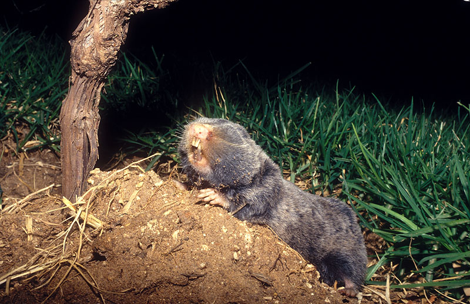

# Animals in the Bible

## License Information

Animals in the Bible © United Bible Societies, 2025. Adapted from: <cite>All Creatures Great and Small: Living Things in the Bible</cite>, by Edward R. Hope © 2005 United Bible Societies. This work is licensed under Creative Commons Attribution-ShareAlike 4.0 International (<a href="https://creativecommons.org/licenses/by-sa/4.0/">https://creativecommons.org/licenses/by-sa/4.0/</a>).

--------------------------------

## 標題：田鼠（mole rat） (id: FAUNA:2.25)

2\.25 標題：田鼠（mole rat）
=====================

經文出處
----

Hebrew 來：חֲפַרְפָּרָה (音譯：chafarparah)

[ISA 2:20](https://ref.ly/Isa2:20)

討論
--

*田鼠 (© Bassem18 (Wikimedia Commons))*

這個詞在《希伯來聖經》中只出現過一次，很難確定它指的是什麼。在《馬索拉文本》中，這個詞被寫作兩個詞語*lachpor perot* ，意思似乎是「挖洞」。但是，古譯本把《馬索拉文本》的這兩個詞語解作一個名詞*lachafarparot* ，字面意思是「給挖洞者」或「給搜索者」，所以古譯本認為這個詞意指「給田鼠」。動詞形式*chafar* 在聖經中出現的次數較多，意思是「挖」、「搜索」或「窺探」（[JOS 2:2](https://ref.ly/Josh2:2); [JOS 2:3](https://ref.ly/Josh2:3) ）。這個詞可能的名詞形式只出現在[ISA 2:20](https://ref.ly/Isa2:20) 中，與一個意思為「蝙蝠」的詞平行。「田鼠」和「蝙蝠」似乎是一對奇怪的組合，尤其是考慮到以色列人把蝙蝠歸為鳥類。

除了「田鼠」之外，解經家還把這個詞解作「食腐動物」（會在垃圾堆中搜尋和挖掘）、「木蛀蟲」（一種小甲蟲）和「啄木鳥」。

嚴格來說，以色列並沒有以蟲子為食的田鼠。最相近的對等詞是敘利亞鼴鼠（學名*Spalax leucodon ehrenbergi* ），牠們像田鼠一樣在地下挖洞，然而是一種以樹根和球莖為食的嚙齒動物。

有些學者和譯本把希伯來文*choled* 翻譯成「田鼠」或「鼴鼠」，但參[2\.26 獴、鼬鼠 (mongoose, weasel)](#FAUNA:2.26) 。KJV (King James Version (1611)) 把另一個希伯來文詞語*tinshemeth* 翻譯成「鼴鼠」，但參[4\.3 變色龍 (chameleon)](#FAUNA:4.3) 。

描述
--

*黑尾土撥鼠 (Pixabay)*

敘利亞鼴鼠是一種灰色的嚙齒動物，體長可達20厘米（8英吋），嘴巴前部有凸出來的大門牙。牠們幾乎完全在地下生活，用大門牙和扁平的前爪在地下挖掘地道，不時把多餘的土壤推到地面上，形成一個個小堆，也因此暴露了自己的蹤跡。敘利亞鼴鼠的眼睛看不見東西，以樹根為食。

翻譯
--

這個詞的所有譯法都是一種猜測。最安全的翻譯方法可能是依循一個著名的英文譯本，即使它的譯法也是基於猜測。為使譯詞更好地符合上下文，翻譯者可以採用上面提出的任何其他建議譯法，但應在腳註中說明這個希伯來文詞語的意思不確定。

如果接受田鼠的解釋，類似的動物在非洲的沙地隨處可見（屬於濱鼠科*Bathyergomorpha* ），翻譯者可以隨意使用一個當地品種的名字。蔗鼠（學名*Thryonomys swinderianus* ；在西非被稱為割草者）是另一種可選。在北美洲，平原囊鼠（學名*Geomys bursarius* ）或黑尾土撥鼠（黑尾草原犬鼠；學名*Cynomys ludovicianus* ）可能是當地最好的選擇；而在印度和東南亞，可以考慮使用當地的竹鼠（學名*Rhizomys* ）。在南美洲，翻譯者可以使用當地的栉鼠（學名*Ctenomys* ）、硬毛鼠（學名*Geocapromys* ）、兔鼠（學名*Lagostomus maximus* ）或豚鼠（學名*Cavia porcellus* ）之一。在其他地方，可以使用一種類似鼴鼠的名稱，或像老鼠一樣在地下挖洞的動物的名稱。

* **Associated Passages:** 以賽亞書 2:20; 約書亞記 2:2; 約書亞記 2:3

