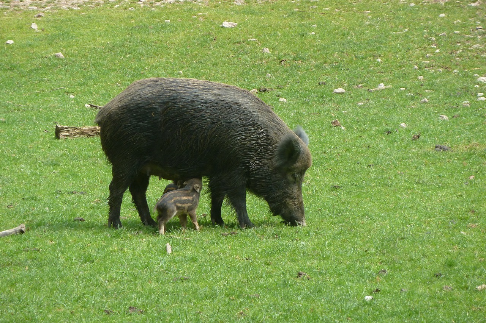

# Animals in the Bible

## License Information

Animals in the Bible © United Bible Societies, 2025. Adapted from: <cite>All Creatures Great and Small: Living Things in the Bible</cite>, by Edward R. Hope © 2005 United Bible Societies. This work is licensed under Creative Commons Attribution-ShareAlike 4.0 International (<a href="https://creativecommons.org/licenses/by-sa/4.0/">https://creativecommons.org/licenses/by-sa/4.0/</a>).

--------------------------------

## 標題：豬（pig） (id: FAUNA:2.30)

2\.30 標題：豬（pig）
===============

經文出處
----

Hebrew 來：חֲזִיר (音譯：chazir)

[LEV 11:7](https://ref.ly/Lev11:7), [DEU 14:8](https://ref.ly/Deut14:8), [PRO 11:22](https://ref.ly/Prov11:22), [ISA 65:4](https://ref.ly/Isa65:4), [ISA 66:3](https://ref.ly/Isa66:3), [ISA 66:17](https://ref.ly/Isa66:17)

Greek 希：χοῖρος (音譯：choiros)

[MAT 7:6](https://ref.ly/Matt7:6), [MAT 8:30](https://ref.ly/Matt8:30), [MAT 8:31](https://ref.ly/Matt8:31), [MAT 8:32](https://ref.ly/Matt8:32), [MRK 5:11](https://ref.ly/Mark5:11), [MRK 5:12](https://ref.ly/Mark5:12), [MRK 5:13](https://ref.ly/Mark5:13), [MRK 5:16](https://ref.ly/Mark5:16), [LUK 8:32](https://ref.ly/Luke8:32), [LUK 8:33](https://ref.ly/Luke8:33), [LUK 15:15](https://ref.ly/Luke15:15), [LUK 15:16](https://ref.ly/Luke15:16)

Greek 希：ὕειος (音譯：hueios)

[1MA 1:47](https://ref.ly/1Macc1:47), [2MA 6:18](https://ref.ly/2Macc6:18), [2MA 7:1](https://ref.ly/2Macc7:1)

Greek 希：ὗς (音譯：hus)

[2PE 2:22](https://ref.ly/2Pet2:22)

討論
--

*豬 (Pixabay)*

希伯來文*chazir* 指家豬和野豬。在主前2500年左右，埃及人就已經知道馴養的豬了；大概也是在那個時候，迦南地的人馴養了豬。野豬的馴化似乎與各地農業的發展是同步進行的。人們很可能把野豬圈養在很大的圍欄之內，餵以殘羹冷飯，從而使牠們遠離種植著莊稼的田地。後來，當野豬被完全馴化以後，人們更多是牧放豬群，而不是圈養牠們。豬幾乎什麼都吃，所以牧放豬群就不再需要餵牠們了。人們很快發現，當豬用鼻子掘地尋覓食物時，清除了大面積的樹根和灌木，從而促進了牧草的生長。因此，早期的豬倌把豬趕到想要在以後放牧牛羊的地方，使牠們遠離人工種植的田地。猶太人養豬可能不是為了吃豬肉，因為豬是禮儀上不潔淨的；他們養豬是為了促進牧草的生長，以及把豬賣給鄰近的其他族群。

歐洲野豬（學名*Sus scrofus* ）一度大量存在於以色列地，尤其是約旦河谷。由於猶太人和穆斯林都不吃野豬肉，也不獵取野豬，因此即使在現今，約旦河谷和許多其他有水及茂密灌木叢的地方依然有牠們的蹤影。

希臘文*choiros* 和*hueios* 的意思是「豬」或「豬肉」。*Hus* 的意思是母豬。

描述
--

聖經時期的馴養豬看起來更像野豬，而不太像現代品種的家豬。牠們呈棕色或灰色，而且毛很多。小豬可能有橫條紋。

特殊意義或象徵意義
---------

在所有動物中，豬被認為是禮儀上最不潔淨的。

翻譯
--

如果目標語言區分了野豬和家豬，應在[PSA 80:14](https://ref.ly/Ps80:14) （《和》80:13）使用表示野豬的詞。在[2PE 2:22](https://ref.ly/2Pet2:22) 中，雖然希臘文指明是母豬，但在這句俗語中，豬的公母並不重要。許多譯本都只是譯為「豬」。

[PSA 68:30](https://ref.ly/Ps68:30) （《和》68:31）中的希伯來文表達「蘆葦中的野生動物」可能是指野豬，可以譯為「蘆葦中的野豬」。

* **Associated Passages:** 利未記 11:7; 申命記 14:8; 箴言 11:22; 以賽亞書 65:4; 以賽亞書 66:3; 以賽亞書 66:17; 馬太福音 7:6; 馬太福音 8:30; 馬太福音 8:31; 馬太福音 8:32; 馬可福音 5:11; 馬可福音 5:12; 馬可福音 5:13; 馬可福音 5:16; 路加福音 8:32; 路加福音 8:33; 路加福音 15:15; 路加福音 15:16; 瑪加伯上 1:47; 瑪加伯下 6:18; 瑪加伯下 7:1; 彼得後書 2:22; 詩篇 80:14; 詩篇 68:30

