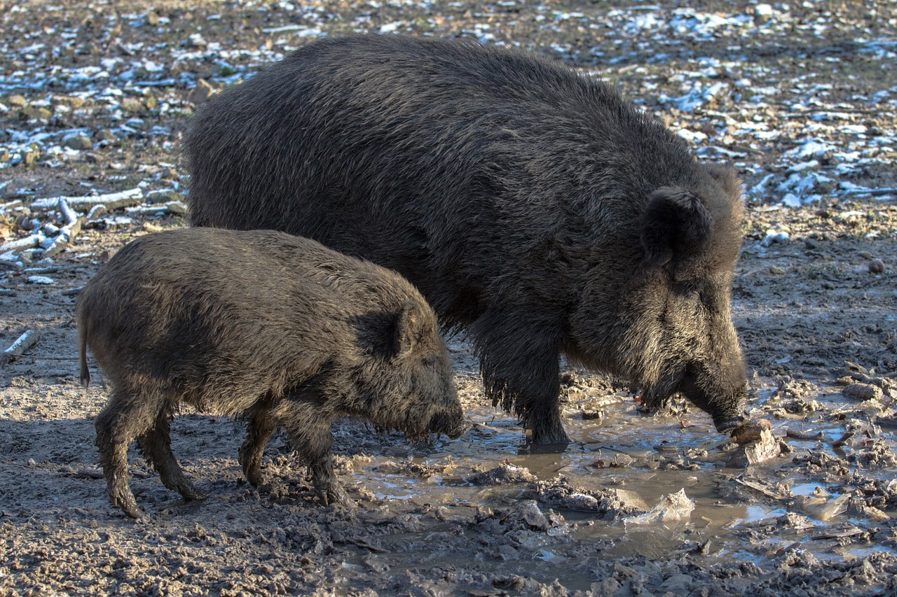

# Animals in the Bible

## License Information

Animals in the Bible © United Bible Societies, 2025. Adapted from: <cite>All Creatures Great and Small: Living Things in the Bible</cite>, by Edward R. Hope © 2005 United Bible Societies. This work is licensed under Creative Commons Attribution-ShareAlike 4.0 International (<a href="https://creativecommons.org/licenses/by-sa/4.0/">https://creativecommons.org/licenses/by-sa/4.0/</a>).

--------------------------------

## 標題：野豬（wild boar） (id: FAUNA:2.33)

2\.33 標題：野豬（wild boar）
======================

經文出處
----

Hebrew 來：חֲזִיר (音譯：chazir)

[PSA 80:14](https://ref.ly/Ps80:14)

Latin 拉：aper

[2ES 15:30](https://ref.ly/2Esd15:30)

*野豬和幼崽 (Pixabay)*

有些抄本的[2ES 15:30](https://ref.ly/2Esd15:30) 沒有「好像野豬」這幾個詞。

討論
--

關於拉丁文*aper* 的意思，學者擁有普遍的共識。這裡提到的動物是歐洲野豬（學名*Sus scrofa* ），曾大量存在於歐洲和中東的森林地區；從大西洋海岸一直到中國的天山山脈，都有牠們的蹤跡。

描述
--

野豬是家豬的祖先，但比家豬更好動和強壯，體型更高大，肩高幾乎有1米（3英呎）。野豬的毛也比家豬更多，遍佈全身，下腹部的毛比其他部位的毛更長。毛色多樣，從灰色到黑色不等。成年公豬長著短獠牙，可以用來挖地和防衛。扁平的口鼻部也可用來掘地。每窩小豬可多達12隻，小豬的毛從頭到尾都有深色的條紋和斑點。成年野豬非常保護小豬，為了小豬可以無所畏懼，極具攻擊性，因此是非常危險的動物。野豬是雜食動物，主食為根莖類，但牠們也吃草、樹葉、昆蟲、小動物、小鳥等。牠們需要傍水而居，依靠在泥水中打滾來降低體溫。在以色列，野豬曾在胡列沼澤活動，今日仍可在約旦河谷或一些偏僻的河谷中看到。

特殊意義或象徵意義
---------

猶太人認為野豬和家豬一樣，都是禮儀上不潔淨的。野豬還與兇猛和好鬥有關聯。在埃及、亞述、巴比倫，以及後來的波斯、希臘和羅馬，野豬頭是軍事力量的常用象徵。

翻譯
--

非洲和亞洲都有和*Sus scrofa* 相似的野豬，包括非洲赤道地區的巨林豬（學名*Hylochoerus meinertzerhageni* ），撒哈拉以南非洲大草原地區的灌木豬（紅河豬；學名*Potamochaerus porcus* ），以及印度次大陸、緬甸、泰國、老撾和中國西南部的印度野豬（學名*Sus cristatus* ）。所有這些野豬都很有攻擊性。

在印度尼西亞和菲律賓的一些島嶼上，與之最接近的動物是鹿豬（鹿豚；學名*Babyrousa babyrussa* ）。然而，鹿豬沒有野豬那麼大，也沒有那麼兇猛，所以這些地區的翻譯可能要使用「大而兇猛的鹿豬」等表達。

在美國南部、墨西哥和毗鄰拉丁美洲的地區，甚至遠至巴西南部和巴拉圭，與野豬最接近的動物是領西猯、西猯或麝香豬（學名*Tayassu angulatus* ）。這種動物既不像野豬那麼大，也沒有那麼兇猛，所以最好用「大而兇猛的西猯」之類比較描述性的表達來翻譯這個詞。

雖然[PSA 80:14](https://ref.ly/Ps80:14) （《和》80:13）有*chazir* 這個詞，通常翻譯為「豬」，但上下文清楚表明這是一種野生動物，因而翻譯成「野豬」更好。

* **Associated Passages:** 詩篇 80:14; 厄斯德拉下 15:30

