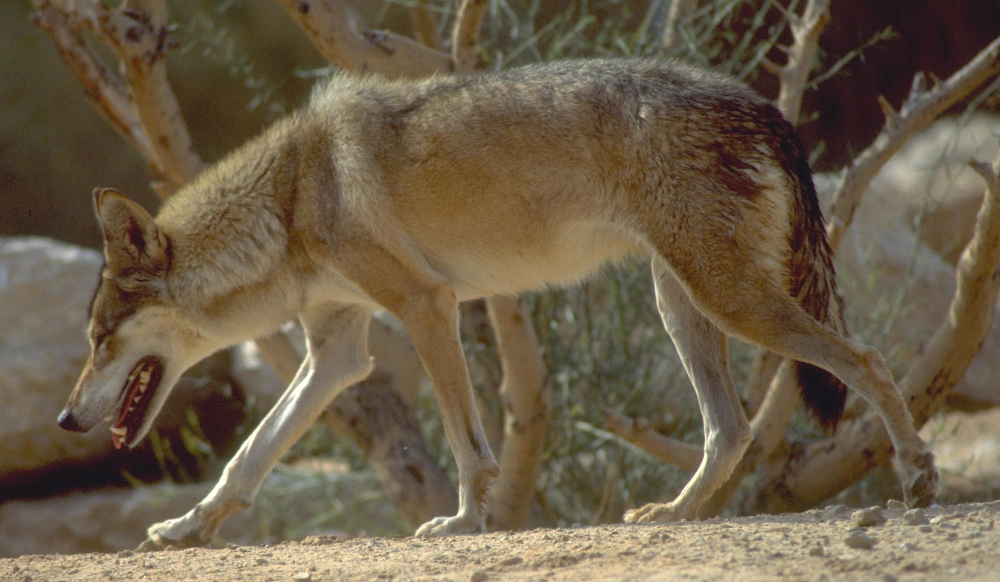

# Animals in the Bible

## License Information

Animals in the Bible © United Bible Societies, 2025. Adapted from: <cite>All Creatures Great and Small: Living Things in the Bible</cite>, by Edward R. Hope © 2005 United Bible Societies. This work is licensed under Creative Commons Attribution-ShareAlike 4.0 International (<a href="https://creativecommons.org/licenses/by-sa/4.0/">https://creativecommons.org/licenses/by-sa/4.0/</a>).

--------------------------------

## 標題：狼（wolf） (id: FAUNA:2.35)

2\.35 標題：狼（wolf）
================

經文出處
----

Hebrew 來：זְאֵב (音譯：ze’ev)

[GEN 49:27](https://ref.ly/Gen49:27), [ISA 11:6](https://ref.ly/Isa11:6), [ISA 65:25](https://ref.ly/Isa65:25), [JER 5:6](https://ref.ly/Jer5:6), [EZK 22:27](https://ref.ly/Ezek22:27), [HAB 1:8](https://ref.ly/Hab1:8), [ZEP 3:3](https://ref.ly/Zeph3:3)

Greek 希：λύκος (音譯：lukos)

[MAT 7:15](https://ref.ly/Matt7:15), [MAT 10:16](https://ref.ly/Matt10:16), [LUK 10:3](https://ref.ly/Luke10:3), [JHN 10:12](https://ref.ly/John10:12), [ACT 20:29](https://ref.ly/Acts20:29), [SIR 13:17](https://ref.ly/Sir13:17)

Latin 拉：lupus

[2ES 5:18](https://ref.ly/2Esd5:18)

討論
--

*狼 (© Doron Horovitz, Israel Government Press Office (IGPO))*

學者一致同意這個希伯來文詞語是指狼（學名*Canis lupus* ）。在聖經時期，狼是以色列全地常見的一種野獸。今天，狼在以色列幾乎已經絕種，但在黎巴嫩、敘利亞、伊拉克和伊朗仍有少量的狼存在。上面的希臘文和拉丁文詞語是狼的統稱，包括歐洲和敘利亞的品種。

描述
--

狼是德國牧羊犬和所有類似品種的祖先。然而，和歐洲及北美洲的品種不同，敘利亞狼沒有又長又厚的毛。牠的身體為淺棕色，長著典型的長臉，和德國牧羊犬差不多大。敘利亞狼看起來很像豺狼，但是要大得多。牠們獨自或成對生活，偶爾也會結成有三四個成員的小家庭。在獵物稀少的情況下，鄰近的狼有時會暫時聚在一起，互相合作捕捉獵物。然而，北美洲和歐洲的狼在冬天會聚在一起，一直到春色已深。

在聖經時期，敘利亞狼以野兔、小瞪羚和鷓鴣為主要獵物，但牠們對綿羊和山羊始終是一個威脅。只有在極其罕見的情況下，敘利亞狼才會攻擊人類。對人類來說，牠們遠遠沒有獅子或熊那麼危險。另一方面，牠們並不懼怕人類，如果咬死一隻羊，牠們會極力保護自己的獵物，需要一群人才能把牠們趕走。敘利亞狼極其聰明，能夠避開專為牠們設下的陷阱。牠們在晚上捕獵，並在夜晚通過大聲嚎叫來確定其他同類的位置。

敘利亞狼不固定待在一個區域，而是不停遊蕩。因此，牧羊人永遠無法確定附近有沒有狼。牠們隨時都可能突然出現，甚至會突然出現在村莊裡面，並且這時經常會被人誤以為是狗。

特殊意義或象徵意義
---------

對聖經作者來說，狼象徵著四處遊蕩、機會主義、危險、兇惡且狡猾的盜匪行徑。有些經文把人稱為狼，意指他是一個四處遊蕩、狡猾的盜匪；在其他語境中，意指某人是聰明、危險的機會主義者。後一種用法通常指某人利用領導地位，以犧牲他人的利益為代價來謀取私利。

翻譯
--

非洲地區沒有狼，但有斑鬣狗（學名*Crocula crocuta* ）、棕鬣狗（學名*Hyaena brunnea* ）和非洲野犬（學名*Lycaon pictus* ），許多譯本都使用牠們作為當地對等物。使用這些詞語來翻譯敘利亞狼存在一個問題：這些非洲動物對當地讀者來說可能具有象徵意義，而這些象徵意義可能與聖經作者的本意截然不同。例如，在一些社會中，斑鬣狗與巫術有關聯。在當地含意與聖經作者本意完全不同的情況下，翻譯者應使用腳註向讀者作出說明。

在阿根廷和巴西，美麗的鬃狼（學名*Chrysocyon jubatus* ）是一個很好的當地對等詞；或者，翻譯者也可以使用葡萄牙語或西班牙語中表示狼的詞語。土狼是另一種可供選擇的對等詞。

在印度、中亞和西南亞，印度野狗（紅野狗、豺；學名*Cuon alpinus* ）是狼在當地一種合宜的對等詞。

在沒有狼的相近物種的地區，翻譯者可以使用「大野狗」這樣的短語，或從該地區的主要語言中借用一個詞。

[GEN 49:27](https://ref.ly/Gen49:27) ：在這裡，狼的三個屬性與便雅憫支派聯繫在一起。表示第一個屬性的希伯來文詞語在古英文中經常譯為"ravening"（「兇猛的」）。這個詞的字面意思是「撕碎獵物」，因此RSV (Revised Standard Version (1952)) 的譯法"ravenous"語氣非常弱，這個詞在現代英文中只是「非常飢餓」的意思。TEV (Today's English Version (Good News Bible)) 的譯法"vicious"（「兇暴的」）要好得多。第二個屬性是「吞吃獵物」，側重於貪婪；第三個屬性是「搶奪一份」（REB (Revised English Bible (1989)) ），強調機會主義。狼在夜間捕食獵物，因此「搶奪」其實發生在「吞吃」之前，雖然在希伯來文詩歌中的順序是倒過來的。在許多語言中，如果按照正常的順序陳述，文章的風格會更好。因此，翻譯應傳達以下含義：

便雅憫是一隻兇暴地撕碎獵物的狼；

到了晚上，他便奪去自己的一份；

早上他仍在貪婪吃食。

在[JDG 7:25](https://ref.ly/Judg7:25) 、[JDG 8:3](https://ref.ly/Judg8:3) 和[PSA 83:11](https://ref.ly/Ps83:11) （《和》83:12）中，*ze’ev* 是一個專有名詞，可能指沙漠匪幫的領袖。

[JER 5:6](https://ref.ly/Jer5:6); [HAB 1:8](https://ref.ly/Hab1:8); [ZEP 3:3](https://ref.ly/Zeph3:3) ：KJV (King James Version (1611)) 的譯法「晚上的狼」最好改譯作「來自沙漠的狼」或「來自平原的狼」。許多學者認為這個希伯來文的意思是「阿拉瓦的狼」。阿拉瓦是一條大裂谷的名字，這條裂谷從死海向南幾乎一直延伸到亞喀巴灣；但這個詞也可以指沙漠平原。

[MAT 7:17](https://ref.ly/Matt7:17) ：這裡有一個著名的希伯來文表述，英文譯為"wolves in sheep’s clothing"（「穿著羊的衣服的狼」），該表述一直是許多翻譯者的難題，因為羊並不穿衣服。這個表達的意思顯然是「狼裝扮成羊」、「狼試圖看起來像羊」或「狼假裝是羊」。

[ACT 20:29](https://ref.ly/Acts20:29) ：保羅在這節經文中使用了比喻。「兇暴的狼」是指寡廉鮮恥、唯利是圖的人，他們利用自己在教會中的領導地位謀取私利，卻不考慮會眾的利益。

* **Associated Passages:** 創世記 49:27; 以賽亞書 11:6; 以賽亞書 65:25; 耶利米書 5:6; 以西結書 22:27; 哈巴谷書 1:8; 西番雅書 3:3; 馬太福音 7:15; 馬太福音 10:16; 路加福音 10:3; 約翰福音 10:12; 使徒行傳 20:29; 德訓篇 13:17; 厄斯德拉下 5:18; 士師記 7:25; 士師記 8:3; 詩篇 83:11; 馬太福音 7:17

