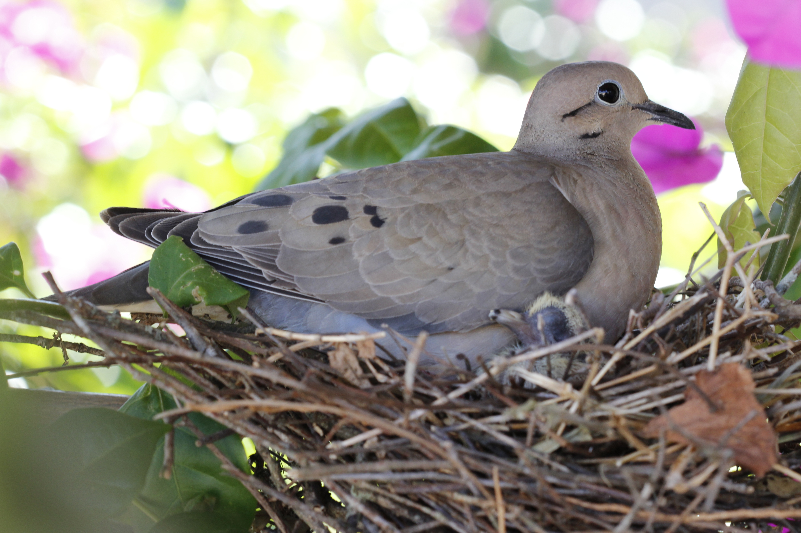

# Animals in the Bible

## License Information

Animals in the Bible © United Bible Societies, 2025. Adapted from: <cite>All Creatures Great and Small: Living Things in the Bible</cite>, by Edward R. Hope © 2005 United Bible Societies. This work is licensed under Creative Commons Attribution-ShareAlike 4.0 International (<a href="https://creativecommons.org/licenses/by-sa/4.0/">https://creativecommons.org/licenses/by-sa/4.0/</a>).

--------------------------------

## 標題：斑鳩、鴿子（dove, pigeon） (id: FAUNA:3.7)

3\.7 標題：斑鳩、鴿子（dove, pigeon）
===========================

經文出處
----

Hebrew 來：יוֹנָה (音譯：yonah)

[GEN 8:8](https://ref.ly/Gen8:8), [GEN 8:9](https://ref.ly/Gen8:9), [GEN 8:10](https://ref.ly/Gen8:10), [GEN 8:11](https://ref.ly/Gen8:11), [GEN 8:12](https://ref.ly/Gen8:12), [LEV 1:14](https://ref.ly/Lev1:14), [LEV 5:7](https://ref.ly/Lev5:7), [LEV 5:11](https://ref.ly/Lev5:11), [LEV 12:6](https://ref.ly/Lev12:6), [LEV 12:8](https://ref.ly/Lev12:8), [LEV 14:22](https://ref.ly/Lev14:22), [LEV 14:30](https://ref.ly/Lev14:30), [LEV 15:14](https://ref.ly/Lev15:14), [LEV 15:29](https://ref.ly/Lev15:29), [NUM 6:10](https://ref.ly/Num6:10), [2KI 6:25](https://ref.ly/2Kgs6:25), [PSA 55:7](https://ref.ly/Ps55:7), [PSA 56:1](https://ref.ly/Ps56:1), [PSA 68:14](https://ref.ly/Ps68:14), [SNG 1:15](https://ref.ly/Song1:15), [SNG 2:14](https://ref.ly/Song2:14), [SNG 4:1](https://ref.ly/Song4:1), [SNG 5:2](https://ref.ly/Song5:2), [SNG 5:12](https://ref.ly/Song5:12), [SNG 6:9](https://ref.ly/Song6:9), [ISA 38:14](https://ref.ly/Isa38:14), [ISA 59:11](https://ref.ly/Isa59:11), [ISA 60:8](https://ref.ly/Isa60:8), [JER 48:28](https://ref.ly/Jer48:28), [EZK 7:16](https://ref.ly/Ezek7:16), [HOS 7:11](https://ref.ly/Hos7:11), [HOS 11:11](https://ref.ly/Hos11:11), [NAM 2:8](https://ref.ly/Nah2:8)

Hebrew 來：תּוֹר (音譯：tor)

[GEN 15:9](https://ref.ly/Gen15:9), [LEV 1:14](https://ref.ly/Lev1:14), [LEV 5:7](https://ref.ly/Lev5:7), [LEV 5:11](https://ref.ly/Lev5:11), [LEV 12:6](https://ref.ly/Lev12:6), [LEV 12:8](https://ref.ly/Lev12:8), [LEV 14:22](https://ref.ly/Lev14:22), [LEV 14:30](https://ref.ly/Lev14:30), [LEV 15:14](https://ref.ly/Lev15:14), [LEV 15:29](https://ref.ly/Lev15:29), [NUM 6:10](https://ref.ly/Num6:10), [PSA 74:19](https://ref.ly/Ps74:19), [SNG 2:12](https://ref.ly/Song2:12), [JER 8:7](https://ref.ly/Jer8:7)

Greek 希：περιστερά (音譯：peristera)

[MAT 3:16](https://ref.ly/Matt3:16), [MAT 10:16](https://ref.ly/Matt10:16), [MAT 21:12](https://ref.ly/Matt21:12), [MRK 1:10](https://ref.ly/Mark1:10), [MRK 11:15](https://ref.ly/Mark11:15), [LUK 2:24](https://ref.ly/Luke2:24), [LUK 3:22](https://ref.ly/Luke3:22), [JHN 1:32](https://ref.ly/John1:32), [JHN 2:14](https://ref.ly/John2:14), [JHN 2:16](https://ref.ly/John2:16)

Greek 希：τρυγών (音譯：trugōn)

[LUK 2:24](https://ref.ly/Luke2:24)

Latin 拉：columba

[2ES 2:15](https://ref.ly/2Esd2:15), [2ES 5:26](https://ref.ly/2Esd5:26)

討論
--

*野鴿和幼鴿 (Pixabay)*

在15世紀的英文中，"pigeon"指的是幼鴿，而"dove"專指成年的鴿子。在現代英文中，這兩個詞幾乎可以互換。一般來說，"pigeon"用來指家養的鴿子，以及更多種類的野鴿，而"dove"主要用來指野鴿。但是，這個一般規則也有很多例外。例如，為家鴿建造的鴿房稱為"dovecotes"，用野鴿肉做的餡餅稱為"pigeon pies"。

家鴿和野鴿都屬於鳩鴿科（學名*Colombidae* ），該科包含200多個物種。人們在以色列和中東地區發現了真正的鳩鴿科鳥類，牠們與歐斑鳩（學名*Streptopelia* ）很好區分。

在中東，最常見的真正的鳩鴿科鳥類是亞洲原鴿（學名*Columba livia* ）。主前4500年左右，這種鳥在美索不達米亞開始被馴化。到主前2500年，牠們在埃及被馴養為家鳥。到主前1200年，有證據表明牠的歸巢能力已經眾所周知。這種鴿子是家養信鴿的祖先，一些信鴿已經逃離家養，變成野生，生活在世界各地的城市街道。現代建築的窗臺代替了牠們原來築巢的岩崖，成為理想的筑巢場所。迦南人和以色列人很可能是將這些鳥類當作食物和祭物來飼養的。這種鳥在《希伯來聖經》中被稱為*yonah* ，在希臘文新約中被稱為peristera 。

*家鴿 (Pixabay)*

另外，以色列地還發現了三種斑鳩，其中兩種是留鳥；第三種是候鳥，春天來到以色列，度過夏季然後離去。歐斑鳩（學名*Streptopelia turtur* ）這種候鳥，以及現在的留鳥灰斑鳩（學名*Streptopelia decaocto* ），就是聖經作者所稱的*tor* （希伯來文）和*trugōn* （希臘文）。（希伯來文和希臘文名稱都是根據斑鳩的叫聲得來的。）

在聖經希伯來文中，*gozal* 一詞通常指的是任何鳥類的雛鳥。在[GEN 15:9](https://ref.ly/Gen15:9) 中，這個詞顯然特指幼鴿。猶太人過去從岩崖上捕捉岩鴿的幼鳥。他們用籠子和鴿房來飼養鴿子和斑鳩，用網來捕獲野鴿和野斑鳩。這樣，猶太人就可以有充足的儲備用來獻祭。

描述
--

岩鴿身體為藍灰色，頸部羽毛呈粉紅色且有光澤，尾巴尖端為黑色；叫聲是重複的呻吟聲*oom* （希伯來文*yonah* 與一個意為「呻吟」的動詞有關），或者是一種快速的咕咕音*coo\-ROO\-coo\-coo* ，通常重複兩三次。這種叫聲是在鴿喙閉合時發出的，由胸腔發聲。求偶時，雄性岩鴿以拍打翅膀開始，然後落在雌鴿旁邊，不停點頭並轉動身體，胸部鼓脹，尾巴展開。

岩鴿通常大群生活。當一隊鴿子飛行時，牠們會作為一個整體行進，通常翅膀保持V形，做短距離的滑翔。

歐斑鳩是一種體型較小的藍灰色小鳥，胸部呈粉紅色。這種鳥於4月到達以色列，在陽光明媚的時候，到處都可以聽到牠們有節奏的*yoo\-ROO\-coo, yoo\-ROO\-coo, yoo\-ROO\-coo* 叫聲，一次要叫兩三分鐘。

鴿子吃種子的事實在關於洪水的敘事中可能十分重要。食腐肉的烏鴉因爲找到了食物沒有回到方舟。鴿子一開始返回了方舟，但後來沒有再返回，這表明牠找到了一些可以吃的種子，大地已經干了。

特殊意義或象徵意義
---------

鴿子和斑鳩以種子為食，被猶太人視爲禮儀上潔淨的鳥類。在有些聖經語境中，牠們因爲發行迅捷而成為速度的象徵，特別是在《詩篇》中。另外，這些鳥在一年中多次求偶、交配和筑巢，因而成為古埃及、迦南和希伯來文化中的情愛、性和生育的象徵。這種象徵意義在《雅歌》中十分重要。

在很早的時候，人們相信鴿子沒有膽汁，因此沒有憤怒，這使其成為和平及溫柔的象徵。（事實上，斑鳩和鴿子都很有攻擊性，經常攻擊其他鳥類，特別是在爭奪食物的時候。）

鴿子的名稱*yonah* 與人在痛苦或悲傷中發出呻吟聯繫在一起。這通常是鴿子在預言詩歌中的象徵意義。

翻譯
--

除了一些常年積雪的地區和一些偏遠島嶼之外，鴿子和斑鳩遍佈世界各地。在鴿子棲居的幾乎所有地方，牠們的種類都不止一種，並且幾乎所有的地方都有家鴿。一般來說，在翻譯時應當盡量使用指稱體型較小的野鴿的詞語；但是，在提到鴿子和斑鳩用於獻祭的經文中，表示家鴿的詞和表示野鴿的詞都可以使用。

[2KI 6:25](https://ref.ly/2Kgs6:25) 中有一個希伯來文表述，字面意思是「鴿子的糞便」，似乎是指人在應急時才吃的某種食物。學者對其所指意見不一：「鷹嘴豆」（"chickpeas"；外形有點像鴿子的糞便）、「刺槐豆」（"locust\-beans"；NEB (New English Bible (1970)) 、REB (Revised English Bible (1989)) ）、「野蔥」（"wild onions"；JB (Jerusalem Bible (1966)) 、TEV (Today's English Version (Good News Bible)) 腳註、NAB (New American Bible (1970)) ），以及某些野花的根。考慮到這詞的含義不確定，最好直譯為「鴿子糞」，並在腳註中説明，「這很可能是人在應急時才吃的某種野生食物。」

* **Associated Passages:** 創世記 8:8; 創世記 8:9; 創世記 8:10; 創世記 8:11; 創世記 8:12; 利未記 1:14; 利未記 5:7; 利未記 5:11; 利未記 12:6; 利未記 12:8; 利未記 14:22; 利未記 14:30; 利未記 15:14; 利未記 15:29; 民數記 6:10; 列王紀下 6:25; 詩篇 55:7; 詩篇 56:1; 詩篇 68:14; 雅歌 1:15; 雅歌 2:14; 雅歌 4:1; 雅歌 5:2; 雅歌 5:12; 雅歌 6:9; 以賽亞書 38:14; 以賽亞書 59:11; 以賽亞書 60:8; 耶利米書 48:28; 以西結書 7:16; 何西阿書 7:11; 何西阿書 11:11; 那鴻書 2:8; 創世記 15:9; 詩篇 74:19; 雅歌 2:12; 耶利米書 8:7; 馬太福音 3:16; 馬太福音 10:16; 馬太福音 21:12; 馬可福音 1:10; 馬可福音 11:15; 路加福音 2:24; 路加福音 3:22; 約翰福音 1:32; 約翰福音 2:14; 約翰福音 2:16; 厄斯德拉下 2:15; 厄斯德拉下 5:26

