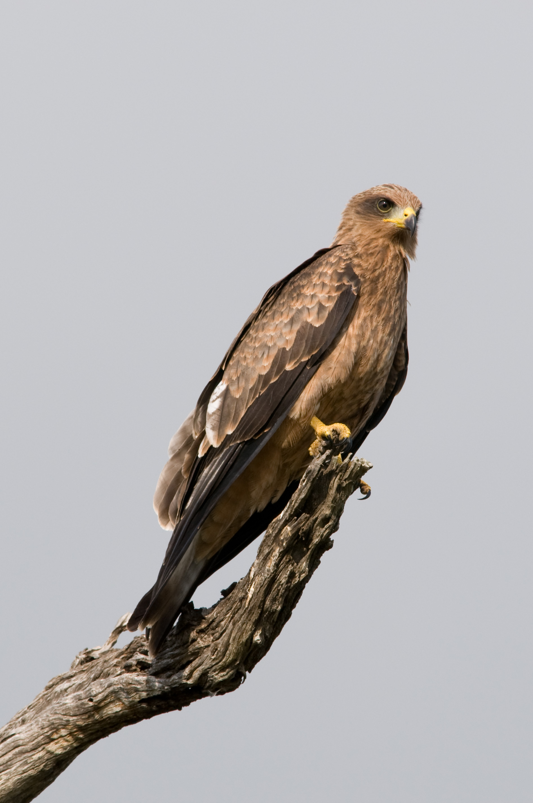

# Animals in the Bible

## License Information

Animals in the Bible © United Bible Societies, 2025. Adapted from: <cite>All Creatures Great and Small: Living Things in the Bible</cite>, by Edward R. Hope © 2005 United Bible Societies. This work is licensed under Creative Commons Attribution-ShareAlike 4.0 International (<a href="https://creativecommons.org/licenses/by-sa/4.0/">https://creativecommons.org/licenses/by-sa/4.0/</a>).

--------------------------------

## 標題：鳶（kite） (id: FAUNA:3.14)

3\.14 標題：鳶（kite）
================

經文出處
----

Hebrew 來：דָּאָה, דַּיָּה (音譯：da’ah, dayah)

[LEV 11:14](https://ref.ly/Lev11:14), [DEU 14:13](https://ref.ly/Deut14:13), [ISA 34:15](https://ref.ly/Isa34:15)

討論
--

*黑鳶 (© Chris Eason (Wikimedia Commons))*

這個詞顯然指的是中東和埃及的各種鳶，尤其是黑鳶（學名*Milvus migrans* ），這種鳶在這些地區十分常見。紅鳶（學名*Milvus milvus* ）是從以色列地區經過的候鳥，通常每年只在那裡停留幾天。

描述
--

根據鳶的飛行方式，可以將其與鷹、雕和其他鳥類區別開來。鳶飛得相當低而且緩慢，非常明顯地使用尾部控制方向。當牠們轉彎時，尾巴會扭動，這使其能夠極其精確地繞著很小的圓圈轉彎，並且經常能夠用短爪抓住正在飛行的昆蟲。

黑鳶的頭為淺灰色，身體其餘部分呈相當均勻的深棕色；尾巴很長，為三角形，當鳶操控兩支外羽時，尾巴看起來像一個V字。

黑鳶以昆蟲、青蛙、蜥蜴和人的殘羹剩飯為食，另外也沿著海洋、湖泊和河流的岸邊覓食死魚和貝類。另外，黑鳶還會啄食動物屍體中的小肉塊，經常可以看到牠們飛撲到道路上，抓起被車輛軋死的老鼠、鳥類和其他動物。牠們經常用一隻腳抓住獵物，然後邊飛邊吃。大多數種類的鳶非常溫順，通常可以在房屋周圍看到，並且會抓食人類扔給牠們的殘餘食物。當有大量的飛蟲出現，或是在遷徙時，鳶會聚成大群。

特殊意義或象徵意義
---------

這些鳥被列為禮儀上不潔淨的鳥類。

翻譯
--

黑鳶在歐洲東南部、非洲大部分地區、南亞和東南亞、澳大利亞和巴布亞新幾內亞都有發現。在非洲的一些地區，牠們的近親黃嘴鳶（學名*Milvus migrans parasitus* ）比較常見。另一種非常相似的鳶是栗鳶（學名*Haliastur Indus* ），在南亞和東南亞十分常見。在其他知道鷂鷹的地方，可以把「鷂鷹」用在《以賽亞書》的這節經文中，另外在不潔淨鳥類的清單中，可以使用像「各種鷹」這樣的集合性短語，而不必嘗試區分清單中的每個物種。

* **Associated Passages:** 利未記 11:14; 申命記 14:13; 以賽亞書 34:15

