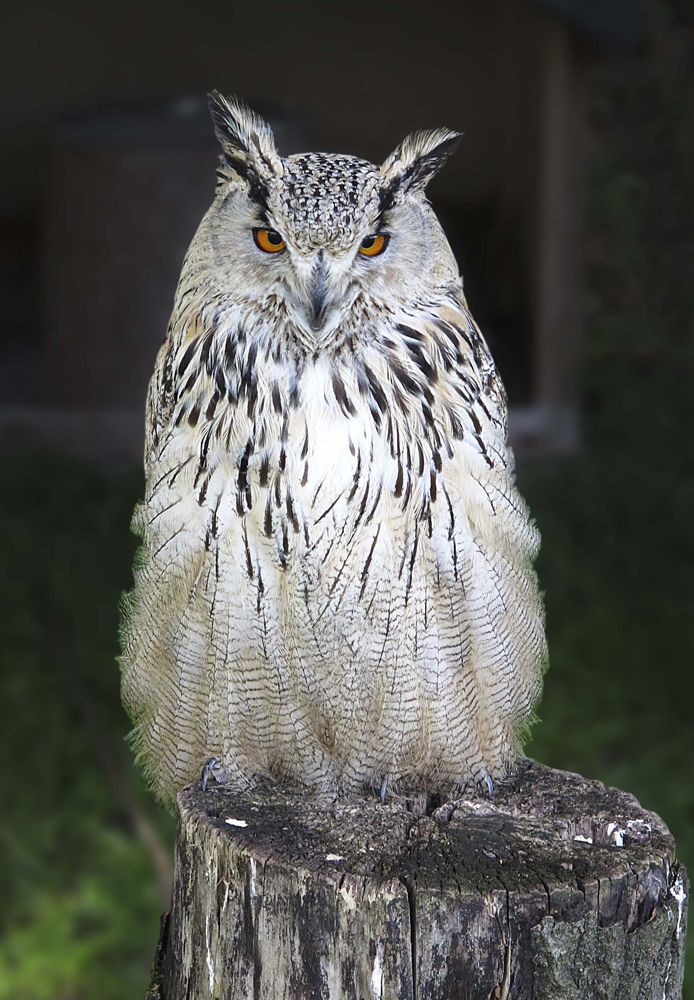

# Animals in the Bible

## License Information

Animals in the Bible © United Bible Societies, 2025. Adapted from: <cite>All Creatures Great and Small: Living Things in the Bible</cite>, by Edward R. Hope © 2005 United Bible Societies. This work is licensed under Creative Commons Attribution-ShareAlike 4.0 International (<a href="https://creativecommons.org/licenses/by-sa/4.0/">https://creativecommons.org/licenses/by-sa/4.0/</a>).

--------------------------------

## 標題：貓頭鷹、鴞（owl） (id: FAUNA:3.17)

3\.17 標題：貓頭鷹、鴞（owl）
===================

除了南極和一些島嶼之外，世界各地都有貓頭鷹。貓頭鷹在夜間十分活躍，特點是面部平坦，有短鈎狀的喙，可以張得很開。貓頭鷹會將獵物整個吞下，然後將未消化的部分以小球狀反芻吐出。貓頭鷹還可以把頭扭轉180度。

貓頭鷹有兩個科，在以色列地區都有。一個是草鴞科（學名*Tytonidae* ），包括倉鴞和草鴞。牠們的白色面盤為心形，臉型輪廓通常以深色線勾勒出來，另外還長著黑色的小眼睛。另一個是鴟鴞科（學名*Strigidae* ），這是典型的貓頭鷹。該科包含許多個物種，所有物種都長著大眼睛，顏色從淺棕色到橙色到黃色不一。這個科包括耳貓頭鷹，相當罕見的漁鴞，以及大小不一的各種貓頭鷹，從侏儒角鴞（小於20厘米或8英吋）一直到巨型雕鴞（超過70厘米或28英吋）。

以色列地有八種貓頭鷹比較常見，大多數很少被人看到，但是因其獨特的叫聲而廣為人知。在聖經時期，夜晚比現代大多數地方的晚上要安靜得多，而且夜晚的奇怪聲音肯定會引起人們的興趣，對於聲音的來源產生許多猜測。因此，即使人們未曾見過牠們，不同的貓頭鷹也可能有不同的名字。事實上，當時的人不太可能將大多數叫聲與看到的貓頭鷹對應起來。（記住，那時沒有手電筒。）另參[3\.2 禮儀上潔淨的鳥和不潔淨的鳥 (birds, clean and unclean)](#FAUNA:3.2) 和[3\.13 寒鴉 (jackdaw)](#FAUNA:3.13) 。

## 標題：Bath ya‘anah（希伯來文） (id: FAUNA:3.17.1)

3\.17\.1 標題：Bath ya‘anah（希伯來文）
==============================

經文出處
----

Hebrew 來：בַּת יַעֲנָה (音譯：bath ya‘anah)

[LEV 11:16](https://ref.ly/Lev11:16), [DEU 14:15](https://ref.ly/Deut14:15), [JOB 30:29](https://ref.ly/Job30:29), [ISA 13:21](https://ref.ly/Isa13:21), [ISA 34:13](https://ref.ly/Isa34:13), [ISA 43:20](https://ref.ly/Isa43:20), [JER 50:39](https://ref.ly/Jer50:39), [MIC 1:8](https://ref.ly/Mic1:8)

討論
--

有些學者將*bath ya‘anah* 與*ya‘en* （鴕鳥）聯繫起來。然而，考慮到這個詞出現的上下文，這種解釋似乎不大可能。在聖經的背景下，可以看到*bath ya‘anah* 與野狗、廢墟和哀號相關聯。另外，這種鳥似乎傍水生活（比較[ISA 43:20](https://ref.ly/Isa43:20) ）。這些都不太符合鴕鳥的情形。此外，雖然有些鳥根據其食物或者與外邦神明之間的聯繫，很容易看出牠們為什么被視為不潔淨，但卻很難看出為什麼鴕鳥也被列入不潔淨鳥類的清單。鴕鳥和家禽一樣，基本上素食。唯一可能的原因是，因為鴕鳥不能飛行，所以就如蝙蝠一樣，被認為有些「不自然」。

也有學者認為該名稱源於一個意為「沙漠」的阿拉伯文詞語，還有一些學者認為來自一個意為「貪婪」的亞蘭文詞語。德賴弗（G. R. Driver）在《哈斯丁聖經辭典》（*Hasting’s Dictionary of the Bible* ）中提出建議，這個詞指的是雕鴞；根據這種鳥在不潔淨的鳥類清單中的位置，這似乎是非常可能的。（參[3\.2 禮儀上潔淨的鳥和不潔淨的鳥 (birds, clean and unclean)](#FAUNA:3.2) 。）NEB (New English Bible (1970)) 和REB (Revised English Bible (1989)) 中譯成的"desert\-owl"（「沙漠貓頭鷹」）不是一個具體的物種，而是指棲息地遠離城鎮的貓頭鷹的統稱。

描述
--

雕鴞是鴟鸮科中的大塊頭。歐洲雕鴞（學名*Bubo bubo* ）是中東地區體型最大的貓頭鷹，身高超過75厘米（30英吋）。以色列地區相對應的貓頭鷹呈淺黃褐色，帶斑點，有耳羽簇，最為人所知的是牠在夜間發出低沉的嗚嗚叫聲。白天在金合歡樹、洞穴、墓地和殘垣破壁的陰涼處歇息。以小型哺乳動物為食，包括野兔、小瞪羚、羔羊、田鼠和家鼠，以及大型棲息鳥類，尤其是野生和家養的鴨子。當這種貓頭鷹在白天棲息，或者在洞穴或古墓中受到干擾時，有時可以見到牠們，但在夜間卻很少見到；在現代，有時會在夜晚的道路上看到牠們。

特殊意義或象徵意義
---------

在聖經中，貓頭鷹與死亡、哀悼和毀滅相關聯，並被列為禮儀上不潔淨的鳥類。

翻譯
--

在歐洲的南部和東部，以及整個非洲、南亞和東南亞，都發現有某種雕鴞。在澳大拉西亞，發現了一種略有不同的大型貓頭鷹。兩種最常見的非洲雕鴞是斑雕鴞（學名*Bubo africanus* ）和巨雕鴞（學名*Bubo lacteus* ；在東非稱為黑雕鴞）。亞洲雕鴞（學名*Bubo indicus* ）生活在遠離城鎮的多樹山村。最大的澳大利亞貓頭鷹是猛鷹鴞（學名*Ninox strenua* ）。任何指稱這些貓頭鷹的詞語，或者意為「巨型貓頭鷹」的短語，都可以用來翻譯不潔淨鳥類名單中的對應鳥類。在其他上下文中，採用「大型貓頭鷹」之類的短語就足夠了。

* **Associated Passages:** 利未記 11:16; 申命記 14:15; 約伯記 30:29; 以賽亞書 13:21; 以賽亞書 34:13; 以賽亞書 43:20; 耶利米書 50:39; 彌迦書 1:8

## 標題：Yanshuf（希伯來文） (id: FAUNA:3.17.2)

3\.17\.2 標題：Yanshuf（希伯來文）
=========================

經文出處
----

Hebrew 來：יַנְשׁוֹף (音譯：Yanshuf)

[LEV 11:17](https://ref.ly/Lev11:17), [DEU 14:16](https://ref.ly/Deut14:16), [ISA 34:11](https://ref.ly/Isa34:11)

討論
--

與大多數貓頭鷹一樣，各聖經譯本對這個詞的譯法並不完全一致。最早時候，*yanshuf* 譯作「角鴞」得到有力的支持。但是，這種譯法極具誤導性。在[LEV 11:18](https://ref.ly/Lev11:18) 和[DEU 13:16](https://ref.ly/Deut13:16) 的不潔淨鳥類清單中，下一個希伯來文名稱是*tinshemeth* ，NIV (New International Version (1984)) 將這個詞譯為"white owl"（「白鴞」），NAB (New American Bible (1970)) 譯為"barn owl"（「倉鴞」）。事實上，白鴞和倉鴞只是耳鴞的別稱，並且這兩個譯本已經在清單的前面提到了耳鴞。因此，這兩個譯本實際上列出了同一種貓頭鷹兩次。在猶太學者中，將*tinshemet* 譯為倉鴞由來已久，在現代希伯來文中，這是倉鴞的名稱。（參[3\.17\.8 Tinshemeth（希伯來文）](#FAUNA:3.17.8) 關於*tinshemet* 的進一步討論）。因此，最好以其他方式來翻譯*yanshuf* 。

有兩種可選譯法。如果翻譯者把清單前面的*tachmas* 譯成「耳鴞」，那麼可把*yanshuf* 譯為「灰林鴞」。如果翻譯者決定遵循現代希伯來文用法，將*tachmas* 譯為「夜鷹」（或「鴟」），那麼最好將*yanshuf* 譯為「耳鴞」，這也符合現代希伯來文的用法。

描述
--

在以色列地，灰林鴞（學名*Strix aluco* ）是一種相當罕見的鳥類，但是只要在牠棲息的地方，牠的叫聲肯定不會被人錯認。雄性發出一連串*HOO\-hoo\-hoo，hoo\-HOO\-hoo* 的叫聲，而雌性則用音調更高的單聲*HOO* 來回應。牠的眼睛周圍有灰白色的圓圈，看起來好像戴著眼鏡。顧名思義，這種鳥呈斑駁的灰褐色。灰林鴞比較喜歡樹木繁茂的地區或果園，以及靠近樹幹的棲息地。

特殊意義或象徵意義
---------

這種鳥被列為禮儀上不潔淨的鳥類。

翻譯
--

灰林鴞與林鴞（學名*Strigidae* ）屬於同一個科，並且世界上的許多地方都有和灰林鴞非常相像的貓頭鷹。在撒哈拉以南的非洲地區，非洲林鴞（學名*Strix woodfordii* ）與灰林鴞非常相似，而在澳大利亞，斑布克鷹鴞（學名*Ninox novaseelandiae* ）是個很合適的對等詞。在其他地方，可以採用中型林鴞的名稱或者「黃褐色貓頭鷹」等短語來翻譯這種貓頭鷹。

* **Associated Passages:** 利未記 11:17; 申命記 14:16; 以賽亞書 34:11; 利未記 11:18; 申命記 13:16

## 標題：Kos（希伯來文） (id: FAUNA:3.17.3)

3\.17\.3 標題：Kos（希伯來文）
=====================

經文出處
----

Hebrew 來：כּוֹס (音譯：kos)

[LEV 11:17](https://ref.ly/Lev11:17), [DEU 14:16](https://ref.ly/Deut14:16), [PSA 102:7](https://ref.ly/Ps102:7)

討論
--

傳統上，*kos* 被譯為「小貓頭鷹」（鴞鳥），這是該詞在現代希伯來文中的含義。這種譯法是最有可能的，雖然並不是毫無質疑。如果我們接受這種辨識，那麼不潔淨鳥類清單的結構就非常整齊，這種最小的貓頭鷹與最小的猛禽*nets* 配對。

描述
--

顧名思義，小貓頭鷹（又名「縱紋腹小鴞」；學名*Athene noctua* ）是一種體型較小的貓頭鷹，主要在夜間覓食昆蟲和雛鳥。長約25厘米（10英吋），短尾巴，沒有耳羽簇，以河岸的洞或白蟻丘為巢穴。小貓頭鷹常在白天被人看到，通常是被一群小鳥追逐著。

特殊意義或象徵意義
---------

這種鳥被列為禮儀上不潔淨的鳥類。

翻譯
--

小貓頭鷹（縱紋腹小鴞）分佈在歐洲東南部、中東和非洲東北部。在其他地方，翻譯者可以使用一種小型貓頭鷹的名稱或短語「小貓頭鷹」來指稱這種貓頭鷹。

* **Associated Passages:** 利未記 11:17; 申命記 14:16; 詩篇 102:7

## 標題：Lilith（希伯來文） (id: FAUNA:3.17.4)

3\.17\.4 標題：Lilith（希伯來文）
========================

經文出處
----

Hebrew 來：לִילִית (音譯：lilith)

[ISA 34:14](https://ref.ly/Isa34:14)

討論
--

有些解經家將這個詞與巴比倫傳說中提到的雌性鬼怪聯繫起來，因此RSV (Revised Standard Version (1952)) 、JB (Jerusalem Bible (1966)) 、TEV (Today's English Version (Good News Bible)) 和NAB (New American Bible (1970)) 都是這樣翻譯。然而，即使這種意見被人接受，該鬼怪也很可能與某種夜鳥有關。在許多中東文化中，惡魔和怪物被認定等同於貓頭鷹，這可能是因為牠們在夜間發出奇怪的聲音。

在現代希伯來文中，*lilith* 是灰林鴞的名稱。有些貝都因人說，另一種貓頭鷹西紅角鴞（學名*Otus scops* ；以色列最常見的貓頭鷹之一）發出的顫動的叫聲，是一個雌性惡魔竊喜她找到獵物而發出的怪叫。這個名稱的詞根與希伯來文中的「夜」字相似，但實際上這是一個巴比倫文詞語。它也與一些現代巴勒斯坦人描述的貓頭鷹叫聲相似。

描述
--

上文描述了灰林鴞，參[3\.17\.2 Yanshuf（希伯來文）](#FAUNA:3.17.2) 。西紅角鴞是一種體型很小的耳鴞，身體呈斑駁的灰色，白天靠近樹幹棲息，其斑駁的體色與樹皮渾然一體，看起來就像一根殘枝。西紅角鴞的叫聲柔和抖顫。

特殊意義或象徵意義
---------

這種鳥與厄運、毀滅和惡魔聯繫在一起。

翻譯
--

諸如「貓頭鷹惡魔」或「貓頭鷹女巫」之類短語可能是最好的表達方式。在撒哈拉以南的非洲地區，人們熟知西紅角鴞，可以使用其當地的名稱加上「惡魔」或「女巫」來翻譯。

* **Associated Passages:** 以賽亞書 34:14

## 標題：Qipod（希伯來文） (id: FAUNA:3.17.5)

3\.17\.5 標題：Qipod（希伯來文）
=======================

經文出處
----

Hebrew 來：קִפֹּד (音譯：qipod)

[ISA 14:23](https://ref.ly/Isa14:23), [ISA 34:11](https://ref.ly/Isa34:11), [ZEP 2:14](https://ref.ly/Zeph2:14)

討論
--

RSV (Revised Standard Version (1952)) 將這個詞翻譯成"hedgehog"（「刺猬」）或"porcupine"（「豪豬」），這是非常不可能的，因為在同一段落中一起提到的其他生物都是鳥類。從這個詞出現的三處經文的上下文來看，似乎是指一種與沼澤地、曠野和廢墟有關的鳥。譯為「葦鳽」和「鷺鷥」符合沼澤地的背景，但不適合與以東相關的荒地背景。在[ZEP 2:14](https://ref.ly/Zeph2:14) 中，「葦鳽」的可能性更小，那裡說到這種鳥在城裡的柱頂築巢。葦鳽是在茂密的草叢或蘆葦叢中築巢，幾乎是在地面上。（然而，這節經文的希伯來文本有很大的問題。）NEB (New English Bible (1970)) 和REB (Revised English Bible (1989)) 採納德賴弗（G. R. Driver）的建議譯為"bustard"（「鴇」），但這只符合以東的荒地背景，而不適合其他上下文。鴇棲息在半沙漠地區，並且在地面上築巢。

近期提出了其他一些建議，認為這種鳥實際上是白琵鷺（學名*Platalea leucorodia* ），現代希伯來文稱為*kapan* （可能是*qipod* 的一種形式），或者可能是寒鴉，因為在出現這個詞的兩處經文中，同一個句子裡面也提到了烏鴉。琵鷺不符合荒地背景，所以目前這一建議幾乎沒有被接受。寒鴉符合所有的上下文，但*qa’ath* 一詞更有可能是指這種鳥。

因此，這裡有可能是指某種貓頭鷹，貓頭鷹適合所有的語境，得到大多數解經家的支持。然而，確定地辨識這種鳥是不可能的。

描述
--

參前文[3\.17 貓頭鷹、鴞 (owl)](#FAUNA:3.17) 關於貓頭鷹的描述。

特殊意義或象徵意義
---------

這種動物與厄運和毀滅聯繫在一起。

翻譯
--

在大多數情況下，泛指貓頭鷹的詞語可能是最好的選擇。因此，[ZEP 2:14](https://ref.ly/Zeph2:14) 可以這樣翻譯：「群畜和各類的走獸必躺臥在其中，寒鴉和貓頭鷹要在柱頂築巢……。」

* **Associated Passages:** 以賽亞書 14:23; 以賽亞書 34:11; 西番雅書 2:14

## 標題：Qipoz（希伯來文） (id: FAUNA:3.17.6)

3\.17\.6 標題：Qipoz（希伯來文）
=======================

經文出處
----

Hebrew 來：קִפּוֹז (音譯：qipoz)

[ISA 34:15](https://ref.ly/Isa34:15)

討論
--

JB (Jerusalem Bible (1966)) 認為*Qipoz* 的意思是「箭頭蛇」，這是一種毒蛇，因此將其譯作"viper"（「毒蛇」）。然而，在希伯來詩歌中，這個詞與「鷂鷹」平行，因此更大可能是指某種猛禽。這也排除了「沙鶉」為正確譯法的可能性。某種貓頭鷹當然也符合這裡的上下文。*Qipoz* 和*qipod* 有可能是同一個詞的兩種形式。

描述
--

參[3\.17 貓頭鷹、鴞 (owl)](#FAUNA:3.17) 關於貓頭鷹的描述。

特殊意義或象徵意義
---------

這種鳥與厄運和毀滅聯繫在一起。

翻譯
--

參[3\.17\.5 Qipod（希伯來文）](#FAUNA:3.17.5) 中的建議。

* **Associated Passages:** 以賽亞書 34:15

## 標題：Tachmas（希伯來文） (id: FAUNA:3.17.7)

3\.17\.7 標題：Tachmas（希伯來文）
=========================

經文出處
----

Hebrew 來：תַּחְמָס (音譯：tachmas)

[LEV 11:16](https://ref.ly/Lev11:16), [DEU 14:15](https://ref.ly/Deut14:15)

討論
--

從各種英文譯本的譯法可以明顯看出，除了確定這是一種夜間活動的鳥類之外，人們對這個詞的意思沒有達成共識。

如果這種鳥是貓頭鷹的一種，根據牠在不潔淨鳥類清單中的位置，可以認為牠的大小介於雕鴞和小貓頭鷹之間。換句話說，可能是一種中等大小的貓頭鷹。

有四種可能：短耳鴞（學名*Asio flammeus* ），長耳鴞（學名*Asio otus* ），倉鴞（學名*Tyto alba* ；又名角鴞或白鴞）和灰林鴞（學名*Strix aluco* ；又名林鴞）。以色列人不太可能熟知長耳鴞，這是一種安靜的過境候鳥，生活在森林地區。即使他們知道長耳鴞的存在，也不會意識到長耳鴞與更加常見的短耳鴞之間的區別：即使是配備手電筒和雙筒望遠鏡的現代鳥類觀察者，也難以區分牠們。很有可能的是，如果以色列人對這些貓頭鷹取了名字，也會是一個名字，而非兩個。這將*tachmas* 的可能解釋減少到三個，其中短耳鴞最有可能。

但是，NAB (New American Bible (1970)) 把這個詞譯為"nightjar"（「夜鷹」或「鴟」）並不能認為有錯。KJV (King James Version (1611)) 和RSV (Revised Standard Version (1952)) 將這個詞譯為"nighthawk"（「夜鷹」）。在現代希伯來文中，夜鷹（nightjar）被稱為*tachmas* ，而耳鴞則稱為*yanshuf* （參上文[3\.17\.2 Yanshuf（希伯來文）](#FAUNA:3.17.2) 關於這個名稱的討論）。

描述
--

與耳鴞屬（學名*Asio* ）的許多其他貓頭鷹一樣，短耳鴞是一種中等大小的棕色貓頭鷹，面部顏色較淺，耳羽簇也不是很突出。短耳鴞生活在草原和半沙漠地區，會發出一種奇怪的聲音，像動物或人的鼾聲。

夜鷹是夜間活躍的飛鳥，以飛蟲為食，長著短喙，並且喙可以張得很開。白天，牠們棲息在地上或茂密的樹枝裡面，不發出聲音且偽裝得很好，所以很少被人看到。然而，根據牠們在晚上的叫聲，就可以知道牠們在那裡。以色列地區有兩種夜鷹最為常見，分別是努比亞夜鷹（學名*Caprimulgus nubicus* ）和歐洲夜鷹（學名*Caprimulgus europaeus* ）。這些鳥長約15厘米（6英吋），呈褐色，滿佈點斑。晚上經常可以聽到牠們的叫聲，特別是在繁殖季節。夜鷹的叫聲由四個雙音節聲音組成，中間沒有停頓，都在同一個音調，第一個和最後一個雙音節比其他音節更輕一些，像是*tuka\-TUKA\-TUKA\-tuka* 。

特殊意義或象徵意義
---------

這種鳥被列為禮儀上不潔淨的鳥類。

翻譯
--

短耳鴞遍佈地中海地區，而沼澤耳鴞（學名*Asio capensis* ）等類似的耳鴞則遍佈整個非洲。在這些地區，找到非常接近的對等詞應該並不困難。在其他地方，可以使用當地中型貓頭鷹的名稱，或者使用「有耳的貓頭鷹」等短語。

歐洲夜鷹遍佈歐洲和非洲。在非洲、亞洲和澳大拉西亞發現了許多其他種類的夜鷹，如果翻譯者決定將*tachmas* 譯為「夜鷹」，通常可以採用當地指稱這個物種的詞語。

* **Associated Passages:** 利未記 11:16; 申命記 14:15

## 標題：Tinshemeth（希伯來文） (id: FAUNA:3.17.8)

3\.17\.8 標題：Tinshemeth（希伯來文）
============================

經文出處
----

Hebrew 來：תִּנְשֶׁמֶת (音譯：tinshemeth)

[LEV 11:18](https://ref.ly/Lev11:18), [DEU 14:16](https://ref.ly/Deut14:16)

討論
--

如上所述，倉鴞、角鴞和白鴞等術語是同一種貓頭鷹的別稱。猶太和基督徒學者將*tinshemeth* 譯為「倉鴞」（"barn owl"，NAB (New American Bible (1970)) ；NIV (New International Version (1984)) 譯為"white owl"，「白鴞」）具有悠久的傳統。NEB (New English Bible (1970)) 和REB (Revised English Bible (1989)) 按照德賴弗（G. R. Driver）的建議譯為"little owl"（「小貓頭鷹」），但這並沒有像譯為「倉鴞」那樣在學者中得到廣泛的支持，這也是*tinshemeth* 的現代希伯來文含義。KJV (King James Version (1611)) 和RSV (Revised Standard Version (1952)) 將其分別譯為"swan"（「天鵝」）和"water hen"（「水雞」），這種意見可以置之不理。天鵝在以色列地極其罕見，「水雞」這個詞太過模糊。

希伯來文*tinshemeth* 一詞實際上在聖經中出現過三次。其中兩次可能是指倉鴞，但還有一次是指一種蜥蜴或變色龍。（參[4\.3 變色龍 (chameleon)](#FAUNA:4.3) 。）

描述
--

倉鴞（學名*Tyto alba* ）是世界上分佈最廣的貓頭鷹之一，除了北極和南極地區以及偏遠的島嶼外，幾乎無處不在。身體灰白色，翅膀和背部是淺黃褐色或灰色，在胸部和翅膀下方幾乎全為白色。眼睛很小，頭部很大，還有一個非常引人注目的心形白色面盤，邊緣是棕色線條。圓形面龐長著短鬃毛般的羽毛，可以幫助貓頭鷹感受微小的聲音。倉鴞經常棲息在穀倉、廢棄的房屋、洞穴和墓地中，會發出多種奇怪的聲音，從眾所周知的抽搐顫抖的尖叫聲到各種嘶嘶聲、唧喳聲和鼾聲。雌性比雄性更大，叫聲更響亮。這些貓頭鷹主要以田鼠、家鼠和其他小型夜行動物為食。

特殊意義或象徵意義
---------

這種鳥被列為禮儀上不潔淨的鳥類，與墳墓和死亡聯繫在一起。

翻譯
--

對於這種貓頭鷹，在當地找到對應的種類應該沒有多大問題。如果所有名稱都不合適，那麼可以使用「白臉貓頭鷹」這個短語，儘管嚴格來說，還有一種與倉鴞沒有密切關係並且更小的貓頭鷹被稱為「白臉貓頭鷹」。

* **Associated Passages:** 利未記 11:18; 申命記 14:16

