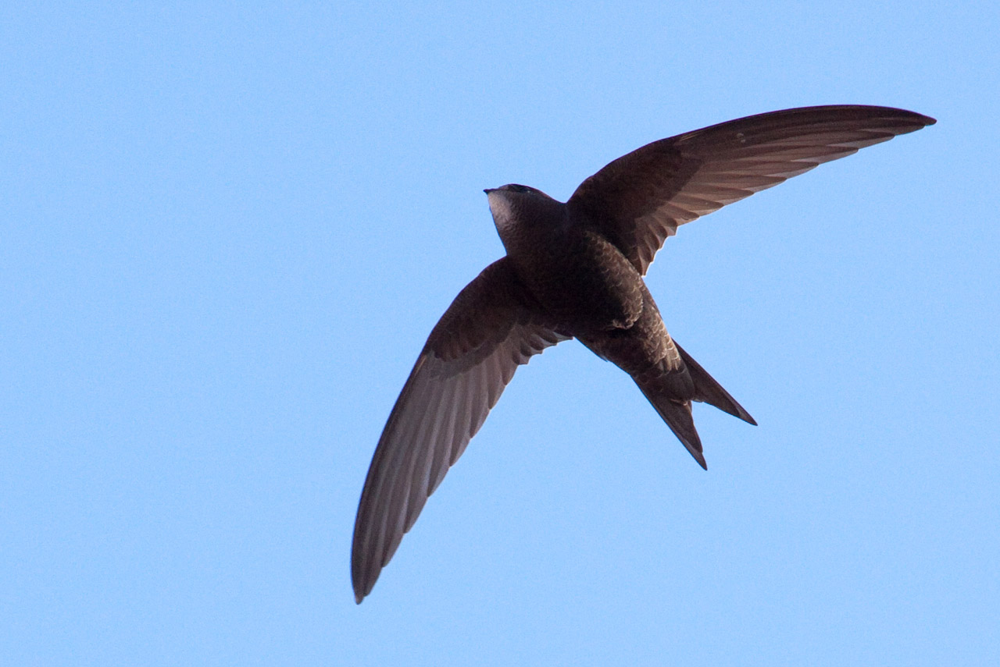

# Animals in the Bible

## License Information

Animals in the Bible © United Bible Societies, 2025. Adapted from: <cite>All Creatures Great and Small: Living Things in the Bible</cite>, by Edward R. Hope © 2005 United Bible Societies. This work is licensed under Creative Commons Attribution-ShareAlike 4.0 International (<a href="https://creativecommons.org/licenses/by-sa/4.0/">https://creativecommons.org/licenses/by-sa/4.0/</a>).

--------------------------------

## 標題：燕子、雨燕（swallow, swift） (id: FAUNA:3.23)

3\.23 標題：燕子、雨燕（swallow, swift）
==============================

經文出處
----

Hebrew 來：דְּרוֹר (音譯：deror)

[PSA 84:4](https://ref.ly/Ps84:4), [PRO 26:2](https://ref.ly/Prov26:2)

Hebrew 來：סוּס, סִיס (音譯：sus, sis)

[ISA 38:14](https://ref.ly/Isa38:14), [JER 8:7](https://ref.ly/Jer8:7)

Greek 希：χελιδών (音譯：chelidōn)

[LJE 1:22](https://ref.ly/EpJer1:22)

討論
--

*燕子 (© Helenabella (Wikimedia Commons))*

燕子、岩燕和雨燕在外形和習性上都非常相似，並且在許多發現牠們的地方，牠們就只用一個名字，在中文裡面也是這樣，因為除了專業的鳥類觀察者之外，一般人會把所有三種鳥通稱為「燕子」。在鳥類學上，燕子和岩燕有親緣關係，但雨燕屬於完全不同的科。

大多數英文譯本都把所有三個希伯來文詞語譯為「燕子」（"swallow"），這反映出一般人的用法。但是嚴格地說，*deror* 可能是指燕子和岩燕，而*sus* 和*sis* （同一個詞的不同發音形式）指雨燕。在現代希伯來文中，*sis* 是雨燕的名稱，而*deror* 是麻雀而不是燕子。

希臘文*chelidōn* 指燕子或雨燕。

以色列常見的有四種雨燕、三種岩燕和兩種燕子。雨燕（學名*Apus apus* ）、蒼雨燕（學名*Apus pallidus* ）、高山雨燕（學名*Apus melba* ）和小雨燕（學名*Apus affinis* ）都是候鳥，在以色列度過整個夏天。還有一種燕子，即金腰燕（學名*Hirundo daurica* ），以及岩燕白腹毛腳燕（學名*Delichon urbica* ），也是這樣。另一種岩燕灰喉燕（學名*Hirundo obsolete* ）則是當地的留鳥。其餘種類的岩燕和燕子都是候鳥，只在以色列逗留幾天；個別燕子可能會在整個夏天都留在以色列，但大多數都會繼續向前飛。

描述
--

*燕子和雨燕 (© pau.artigas (Wikimedia Commons))*

燕子、岩燕和雨燕都是小鳥，翅膀細長，腿短。牠們通常以相當大的群體規模，以極快的速度持續飛行很長的時間，旋轉著，翻滾著。牠們會邊飛邊捉空中的昆蟲。希伯來文*deror* 來自一個意為「自由」的詞根，大概是指這種鳥能夠快速而自如地飛翔、俯衝和轉彎，而不需要停下來休息。*Sus* 或*sis* 這個名稱模仿了雨燕在空中快速飛行所產生的嗖嗖聲。

在許多鳥類書籍中，普通雨燕的叫聲被描述為一種「高音調的尖叫」，特別是在繁殖季節，但牠也幾乎不停地發出嘰嘰喳喳的嘈雜聲音，特別是在棲息地附近。這也是一些其他種類的雨燕和許多岩燕的共同特徵。

雨燕、白腹毛腳燕、歐洲燕子、金腰燕和灰喉燕，都會在峭壁的懸岩下、洞穴裡或人類的建筑物中（如房屋和橋梁下面）築巢。[PSA 84:4](https://ref.ly/Ps84:4) （《和》84:3）提到*deror* 在聖殿裡築巢。雨燕用唾液將草和葉子粘在一起來筑巢（中國人採集這種燕窩來製作著名的燕窩湯）。燕子和岩燕把小塊濕泥與草混合做成巢穴。這兩種巢都是粘到岩石或牆壁上，通常靠近屋頂等懸伸物。

燕子和雨燕是令人驚嘆的候鳥。有些種類從中非遷徙到遠東和中國西南的部分地區，其他種類則從俄羅斯北部和斯堪的納維亞半島遷徙至南非。曾有一群燕子在35天內飛越了超過12,000公里（7,500英里）。當這些鳥聚集遷徙，或者途中短暫停留時，經常可以看到由數十萬隻鳥組成的鳥群。有一天晚上，曼谷的大學生數點了將近200萬隻遷徙的燕子在城市的電話線和電線上棲息，並且第二天就離開了。

特殊意義或象徵意義
---------

上面列出的參考經文都是詩歌體。從經文可見，人們注意到這些鳥類（1）定期遷徙，（2）不停飛行，（3）在人類住宅中築巢，（4）雨燕無休止的、也許是悲傷的叫聲。

翻譯
--

世界各地都有雨燕、燕子和岩燕。如果當地語言區分了雨燕和燕子，那麼*deror* 應翻譯為「燕子」，*sus* 和*sis* 應翻譯為「雨燕」。然而在大多數語言中，這兩個科都是同一個名稱，因此只用一個詞來翻譯三個希伯來文詞語。

[PRO 26:2](https://ref.ly/Prov26:2) 提到燕子可以整天飛行而一次不停的事實。

* **Associated Passages:** 詩篇 84:4; 箴言 26:2; 以賽亞書 38:14; 耶利米書 8:7; 耶利米書信 1:22

