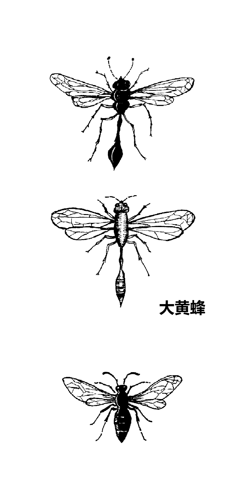
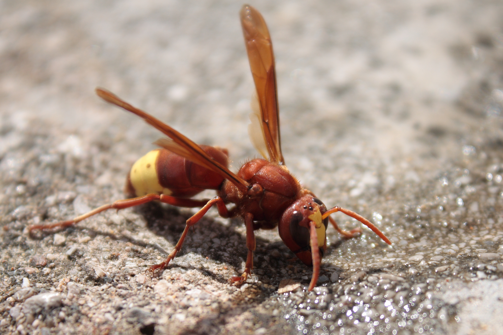

# Animals in the Bible

## License Information

Animals in the Bible © United Bible Societies, 2025. Adapted from: <cite>All Creatures Great and Small: Living Things in the Bible</cite>, by Edward R. Hope © 2005 United Bible Societies. This work is licensed under Creative Commons Attribution-ShareAlike 4.0 International (<a href="https://creativecommons.org/licenses/by-sa/4.0/">https://creativecommons.org/licenses/by-sa/4.0/</a>).

--------------------------------

## 標題：大黃蜂、黃蜂（hornet, wasp） (id: FAUNA:6.7)

6\.7 標題：大黃蜂、黃蜂（hornet, wasp）
============================

經文出處
----

Hebrew 來：צִרְעָה (音譯：tsir‘ah)

[EXO 23:28](https://ref.ly/Exod23:28), [DEU 7:20](https://ref.ly/Deut7:20), [JOS 24:12](https://ref.ly/Josh24:12)

Greek 希：σφήξ (音譯：sfēx)

[WIS 12:8](https://ref.ly/Wis12:8)

討論
--

*大黃蜂和黃蜂 ((Edward R. Hope))*

這些希伯來文和希臘文詞語都是指大黃蜂和黃蜂，學者對此幾乎沒有疑問。NEB (New English Bible (1970)) 和REB (Revised English Bible (1989)) 的譯詞是"panic"（「恐慌」），然而沒有得到太多支持，因為該譯法將這個詞溯源至阿拉伯文*dara'‘a* ，但這個說法是非常有爭議的。

描述
--

*亞洲大黃蜂 (© S. Rae from Scotland, UK (Wikimedia Commons))*

大黃蜂和黃蜂是近緣物種。大黃蜂的體型比黃蜂大。大黃蜂和黃蜂與蜜蜂同屬於動物學分類中的膜翅目（學名*Hymenoptera* ），這表示牠們具有堅韌、透明、薄膜狀的翅膀。大黃蜂通常是黑色或棕色的，有些種類有黃色條紋。黃蜂則常呈淡綠色，也可能有黃色或淺綠色的條紋。較大的大黃蜂身長可達30—40毫米（1—1\.5英吋）。

*德國黃蜂 (© Alvesgaspar (Wikimedia Commons))*

大黃蜂和黃蜂的胸腹之間長著很長的細腰。所有的黃蜂都有螫針；因為螫針很大，所以螫人會非常疼痛，甚至帶來危險。大黃蜂和黃蜂的螫針與蜜蜂不同，並不會與身體分離，因此可反覆叮刺。牠們以昆蟲、毛毛蟲和蜘蛛為食。許多種類的黃蜂會叮刺獵物，然後將已經麻痺但仍然活著的昆蟲或蜘蛛放在黃蜂的卵附近；這樣，幼蟲孵化出來之後，很容易就可獲得食物。有些種類的黃蜂就在已經麻痺的獵物身上產卵。

*東方大黃蜂 (© MattiPaavola (Wikimedia Commons))*

東方大黃蜂（學名*Vespa orientalis* ）通常生活在牠挖掘的地下巢穴中。一個巢穴包含多個蜂巢，蜂群生活在其中。雖然地下的巢穴最爲常見，但也有一些紙質的蜂巢建在保護性的空洞中，如空心樹內。東方大黃蜂呈紅褐色，腹部有明顯的黃色粗條紋，頭部兩眼之間有黃色斑塊。通過聲音振動來交流，捕食其他昆蟲，如蚱蜢、蒼蠅、蜜蜂、胡蜂等，並用來喂養蜂群的後代。另外，牠們還會爲幼蜂收集其他動物蛋白，如新鮮或變質的肉和魚。成蜂吃碳水化合物，如花蜜、蜜露和水果。大黃蜂是蜜蜂的主要害蟲，會攻擊蜜蜂群以獲取蜂蜜和動物蛋白。東方大黃蜂的螫刺對人類來說是相當痛苦的，並且有些人對螫刺過敏。東方大黃蜂的外表與歐洲大黃蜂（學名*Vespa crabro* ）相似，並且不應與東亞的亞洲大黃蜂（學名*Vespa mandarinia* ）相混淆。

特殊意義或象徵意義
---------

毫無疑問，大黃蜂在聖經中象徵危險的敵人或是前來攻擊的軍隊。

翻譯
--

雖然大多數氣候溫暖的國家都有大黃蜂或黃蜂，但是一些看起來很危險的大型大黃蜂相對來說是無害的。例如，在整個非洲都能發現的黑色家居大黃蜂並非成群生活，而是獨居。這種大黃蜂會在牆壁上或屋頂下築泥巢，牠們的體型很大，也有螫針，但沒有攻擊性，很少螫刺任何人或動物。因此，翻譯者需要謹慎選擇一種成群生活，且非常危險的大黃蜂的名稱作為譯詞。假如當地所有大黃蜂或黃蜂都相對無害的話，可以使用描述性的短語，例如「戰士大黃蜂」、「戰鬥大黃蜂」、「軍隊大黃蜂」、「死亡大黃蜂」，或類似的短語。

* **Associated Passages:** 出埃及記 23:28; 申命記 7:20; 約書亞記 24:12; 智慧篇 12:8

