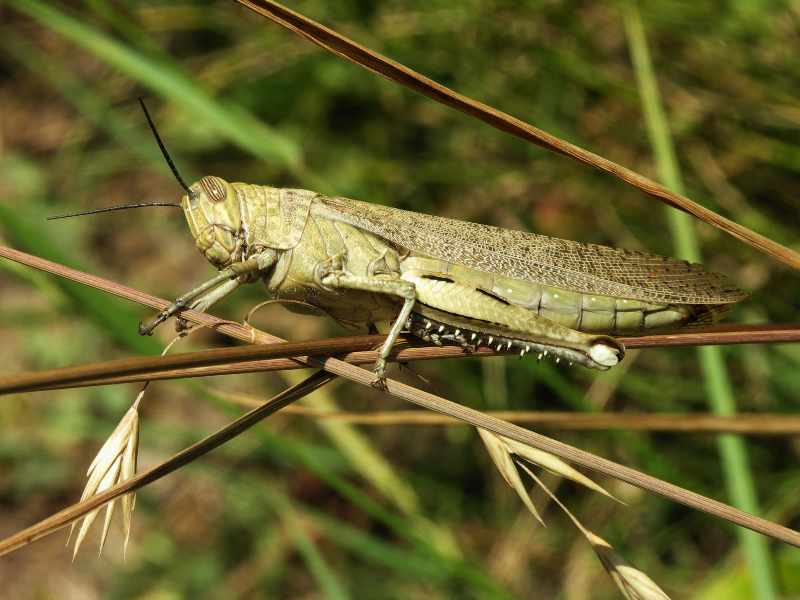
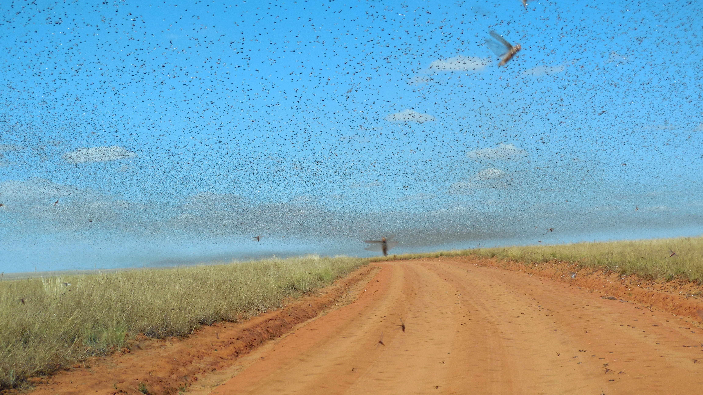
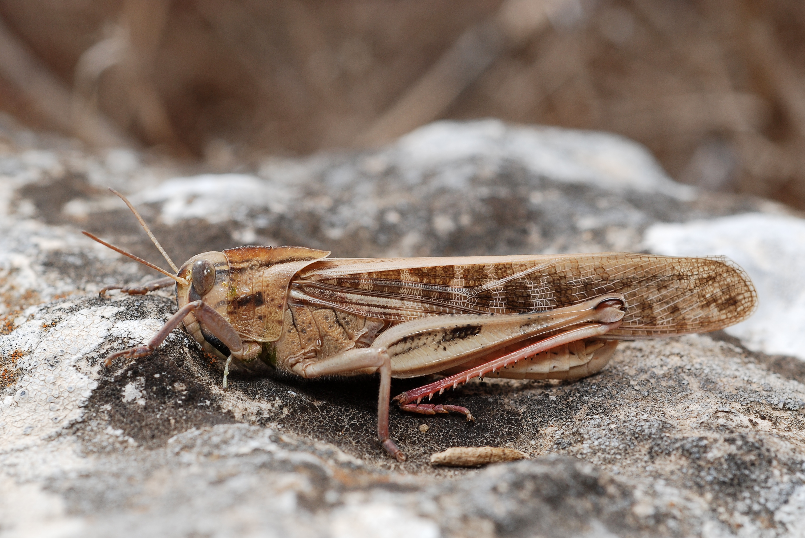

# Animals in the Bible

## License Information

Animals in the Bible © United Bible Societies, 2025. Adapted from: <cite>All Creatures Great and Small: Living Things in the Bible</cite>, by Edward R. Hope © 2005 United Bible Societies. This work is licensed under Creative Commons Attribution-ShareAlike 4.0 International (<a href="https://creativecommons.org/licenses/by-sa/4.0/">https://creativecommons.org/licenses/by-sa/4.0/</a>).

--------------------------------

## 標題：蝗蟲、蚱蜢、蟋蟀（locust, grasshopper, cricket） (id: FAUNA:6.9)

6\.9 標題：蝗蟲、蚱蜢、蟋蟀（locust, grasshopper, cricket）
==============================================

經文出處
----

Hebrew 來：אַרְבֶּה (音譯：’arbeh)

[EXO 10:4](https://ref.ly/Exod10:4), [EXO 10:12](https://ref.ly/Exod10:12), [EXO 10:13](https://ref.ly/Exod10:13), [EXO 10:14](https://ref.ly/Exod10:14), [EXO 10:14](https://ref.ly/Exod10:14), [EXO 10:19](https://ref.ly/Exod10:19), [EXO 10:19](https://ref.ly/Exod10:19), [LEV 11:22](https://ref.ly/Lev11:22), [DEU 28:38](https://ref.ly/Deut28:38), [JDG 6:5](https://ref.ly/Judg6:5), [JDG 7:12](https://ref.ly/Judg7:12), [1KI 8:37](https://ref.ly/1Kgs8:37), [2CH 6:28](https://ref.ly/2Chr6:28), [JOB 39:20](https://ref.ly/Job39:20), [PSA 78:46](https://ref.ly/Ps78:46), [PSA 105:34](https://ref.ly/Ps105:34), [PSA 109:23](https://ref.ly/Ps109:23), [PRO 30:27](https://ref.ly/Prov30:27), [JER 46:23](https://ref.ly/Jer46:23), [JOL 1:4](https://ref.ly/Joel1:4), [JOL 1:4](https://ref.ly/Joel1:4), [JOL 2:25](https://ref.ly/Joel2:25), [NAM 3:15](https://ref.ly/Nah3:15), [NAM 3:17](https://ref.ly/Nah3:17)

Hebrew 來：גֵּב, גּוֹב, גֹּבַי (音譯：gev, gov, govay)

[ISA 33:4](https://ref.ly/Isa33:4), [AMO 7:1](https://ref.ly/Amos7:1), [NAM 3:17](https://ref.ly/Nah3:17), [NAM 3:17](https://ref.ly/Nah3:17)

Hebrew 來：גָּזָם (音譯：gazam)

[JOL 1:4](https://ref.ly/Joel1:4), [JOL 2:25](https://ref.ly/Joel2:25), [AMO 4:9](https://ref.ly/Amos4:9)

Hebrew 來：חָגָב (音譯：chagav)

[LEV 11:22](https://ref.ly/Lev11:22), [NUM 13:33](https://ref.ly/Num13:33), [2CH 7:13](https://ref.ly/2Chr7:13), [ECC 12:5](https://ref.ly/Eccl12:5), [ISA 40:22](https://ref.ly/Isa40:22)

Hebrew 來：חָסִיל (音譯：chasil)

[1KI 8:37](https://ref.ly/1Kgs8:37), [2CH 6:28](https://ref.ly/2Chr6:28), [PSA 78:46](https://ref.ly/Ps78:46), [ISA 33:4](https://ref.ly/Isa33:4), [JOL 1:4](https://ref.ly/Joel1:4), [JOL 2:25](https://ref.ly/Joel2:25)

Hebrew 來：חַרְגֹּל (音譯：chargol)

[LEV 11:22](https://ref.ly/Lev11:22)

Hebrew 來：יֶלֶק (音譯：yeleq)

[PSA 105:34](https://ref.ly/Ps105:34), [JER 51:14](https://ref.ly/Jer51:14), [JER 51:27](https://ref.ly/Jer51:27), [JOL 1:4](https://ref.ly/Joel1:4), [JOL 1:4](https://ref.ly/Joel1:4), [JOL 2:25](https://ref.ly/Joel2:25), [NAM 3:15](https://ref.ly/Nah3:15), [NAM 3:15](https://ref.ly/Nah3:15), [NAM 3:16](https://ref.ly/Nah3:16)

Hebrew 來：סָלְעָם (音譯：sol‘am)

[LEV 11:22](https://ref.ly/Lev11:22)

Hebrew 來：צְלָצַל (音譯：tselatsal)

[DEU 28:42](https://ref.ly/Deut28:42), [ISA 18:1](https://ref.ly/Isa18:1)

Greek 希：ἀκρίς (音譯：akris)

[MAT 3:4](https://ref.ly/Matt3:4), [MRK 1:6](https://ref.ly/Mark1:6), [REV 9:3](https://ref.ly/Rev9:3), [REV 9:7](https://ref.ly/Rev9:7), [JDT 2:20](https://ref.ly/Jdt2:20), [WIS 16:9](https://ref.ly/Wis16:9), [SIR 43:17](https://ref.ly/Sir43:17)

Latin 拉：locusta

[2ES 4:24](https://ref.ly/2Esd4:24)

討論
--

蝗蟲是聖經中最重要的昆蟲，提及的次數比任何其他昆蟲都多。聖經中總共有九個希伯來文詞語都是指蝗蟲，其中最常用的是*’arbeh* ，在希臘文中的對等詞是*akris* ，拉丁文中的對等詞是*locusta* 。可以確定這些詞是指蝗蟲，而非蚱蜢。所有的蝗蟲和蚱蜢都屬於「直翅目」（學名*Orthoptera* ）下的蝗科（學名*Acrididae* ）。在以色列和埃及有許多種蝗蟲，其中最重要的是飛蝗（學名*Locusta migratoria* ）、沙漠蝗蟲（學名*Schistocerca gregaria* ），以及摩洛哥蝗蟲（學名*Dociostaurus moroccanus* ）。這三種蝗蟲都是當地重要的食物，在聖經中很可能都被稱作*’arbeh* 。

描述
--

*蚱蜢 (© Alvesgaspar (Wikimedia Commons))*

**蚱蜢和蝗蟲** 都是六足、有翅膀的昆蟲，特點是第三對足特別長，適合跳躍。這些足的下半部有一排釘刺，用於發出聲音和防禦。前翅狹長，直而堅韌。在不飛行的時候，前翅會遮蓋薄膜狀的後翅；後翅要大得多、顏色更深，像折扇一樣折疊在一起。當蝗蟲或蚱蜢要飛行時，會向空中一躍，同時展開翅膀。飛行時，堅韌的前翅會互相撞擊，發出輕微的咔噠聲。

蝗蟲與蚱蜢的不同之處主要在於：蝗蟲會在特定的時期群聚，並遷移到其他地區生存，其他時候則獨自生活，或是形成小群。蝗蟲的繁殖能力隨著氣候條件不同而變化。卵囊產在土壤中，孵化與濕度有關。在乾旱時期只有少數卵粒能夠孵化，但在降雨充沛的時候，會突然孵出大量的蝗蟲。

*蝗蟲吃葉子 (Pixabay)*

蝗蟲與大多數的昆蟲不同，並沒有幼蟲或毛蟲的階段，從卵孵化之後即成為若蟲，就是很小的無翅蝗蟲，跳躍足尚未發育完全。若蟲只能到處爬行，以綠色植被為食，每天所消耗的食物是自身體重的許多倍。隨著漸漸長大和發育，若蟲會蛻皮。牠們的跳躍足比翅膀更早發育，因此會經過一個只能跳、不會飛的階段。在這個階段，牠們被稱為「蝻子」，不像若蟲階段那麼密集群聚，而是稍微分散；但是，蝻子比若蟲階段吃得更多，所以仍然可能會對農作物造成相當大的損害。發育為成蟲之後，牠們就可以跳躍和飛翔。如果氣候條件合適，同時又有大量蝻子長到這個成熟的階段，便會徹底毀壞牠們成長環境中的植被。之後，牠們會開始聚集，準備成群行動。換句話說，牠們會聚集在一起，然後整群集體飛行，一同遷移到有著更多綠色植被的地方。在這個聚集的階段，也就是在遷移期間和之後，牠們會對作物和其他植被構成重大威脅，因為牠們會不停地進食。

*蝗蟲群 (© Iwoelbern (Wikimedia Commons))*

一個蝗蟲群可能有幾億隻蝗蟲。坎斯代爾引用了一份報告：1889年，一個蝗蟲群遮蓋了大約5,500平方公里（2,000平方英里）的面積。當然，即使在近現代，蝗蟲群也可能龐大到像巨大的黑雲那樣遮住太陽。當蝗蟲群迫近時，牠們的翅膀所發出的咔噠聲讓人一旦聽過就不會忘記。不管蝗蟲群落在何處，即使只是短暫歇腳，那個地方所有的綠色灌木或草叢都會被攻擊，並且牠們咀嚼樹葉的聲音清晰可聞，有時候會持續數小時。之後，幾乎看不到任何一片綠葉或草葉，甚至許多灌木因樹皮被吃掉而變得光禿禿的。

面對數目如此龐大的蝗蟲群，古代的人絕對會感到無助，他們完全沒有辦法阻止蝗蟲的破壞。把草點著所產生的火光，只能起非常小的作用。諷刺的是，當蝗蟲以這樣的密度群聚時，也很容易被大量捕捉和食用。人們經常用毯子、漁網和籃子抓住蝗蟲，先折斷蝗蟲後腿的下半截，然後可以烘、烤、炸或炒。有些地方的人也生吃蝗蟲。如果先烤再用鹽醃，味道會有點像鹹花生。

有些解經家指出，埃及的蝗災很可能為住在阿拉伯沙漠和西奈曠野的以色列人提供了食物，因為這是該地區的蝗蟲通常會走的遷移路線。

*蝗蟲 (© Gilles San Martin (Wikimedia Commons))*

幾個主要蝗蟲種類的生長發育週期摘要如下：若蟲，只能爬行，會繼續發育到跳蝻階段；等到蝻子發育出翅膀，就成為蝗蟲的成蟲；如果氣候條件合適，成蟲會聚集成群，並遷移到新的地方；雌蟲產卵，然後整個週期不斷重複。因此，蝗蟲有四個發育階段：若蟲、蝻子、定居的成蟲，以及成群飛行或遷移的成蟲。*Chasil* 可能是指爬行的若蟲，*yeleq* 指跳蝻，*’arbeh* 指定居的成蟲，*gazam* 指成群遷移的成蟲。然而，這種區分並沒有得到證實，因為在提到蝗災時，這些詞似乎可以互換使用。

**蟋蟀和螽斯** ：蟋蟀是蝗蟲和蚱蜢的無翅夜行近緣動物，通常呈黑色或棕色，身體相對較短、較圓，白天躲在石頭或原木下面，而常稱為螻蛄的昆蟲則躲在自己挖的洞中。晚上，蟋蟀會發出特有的高頻唧唧聲，可以傳到非常遠的地方。每種蟋蟀發出的聲音略有不同。牠們跟蝗蟲和蚱蜢一樣，以植物為食，通常是吃葉子。

*擬葉螽斯 (© Bernard DUPONT (Wikimedia Commons))*

螽斯與蟋蟀外形相似，但通常是綠色的，有翅膀，夜間活躍，會發出像蟋蟀一樣的唧唧聲，白天則在樹葉下歇息。螽斯的翅膀呈綠色，形狀很像葉子，形成極佳的偽裝。有些螽斯也以其他昆蟲為食。

蟋蟀和螽斯都有極長的觸角。

特殊意義或象徵意義
---------

蝗蟲數量眾多，且具有成群移動的特性，因此象徵龐大、完全沒有辦法抵禦的攻擊軍隊。蝗蟲也象徵著上帝的懲罰。

在出現*chagav* 的五節經文中，有兩處經文的用法是比喻性的，表示微小且無足輕重的東西。因此，TEV (Today's English Version (Good News Bible)) 在[ISA 40:22](https://ref.ly/Isa40:22) 中將這個詞譯為「像螞蟻一樣微小」。

在希伯來文本中，[ECC 12:5](https://ref.ly/Eccl12:5) 字面直譯作「蚱蜢只能爬行」，然而*chagav* 在這裡的意思是有爭議的。這句詩是在描繪老年人的光景，*chagav* 所指的顯然是人衰老的一個標記。解經家通常有兩種解釋：（1）指老年人的行動困難；（2）對男性喪失性能力的玩笑話。如果接受第一種解釋，「蚱蜢」就是形容人活力充沛（但現在已是步履蹣跚）；如果接受第二種解釋，這個詞便是指男性的性器官。

翻譯
--

除了北美洲，全世界許多地方都能見到飛蝗（學名*Locusta migratoria* ）。在這些地區，應該可以很容易找到一個合適的當地譯詞。然而，在一些降雨量很大的國家，飛蝗和其他蝗蟲種類並不像中東和非洲乾旱地區的蝗蟲那樣群聚。在這些國家中，有些上下文可能需要使用像「成群的蝗蟲」這樣的短語，而不是僅僅譯為「蝗蟲」。在不知道蝗蟲的地區，通常可以用「大型／巨型蚱蜢」這樣的短語來替代。

希伯來文*gev* 、*gov* 和*govay* 等詞與一個意為「群集」或「聚集在一起」的動詞有關，因此幾乎可以肯定這些詞是指蝗蟲。

在[DEU 28:42](https://ref.ly/Deut28:42) 和[ISA 18:1](https://ref.ly/Isa18:1) 中，*tselatsal* 一詞形容昆蟲翅膀發出的聲音，很可能是指一大群蝗蟲所發出的聲音。有些英文譯本將這個詞譯為「呼呼」或「嗡嗡」，就是想要反映出這一點，不過，「嗡嗡聲」並不足以形容一大群蝗蟲所發出的聲音。因此，「咔噠」、「刷刷」、「呼呼」或「啪啪」最接近希伯來文所表示的聲音。

NEB (New English Bible (1970)) 和REB (Revised English Bible (1989)) 將這個詞譯為"mole cricket"（「螻蛄」），然而其他譯本都沒有採用這種譯法。螻蛄這種昆蟲頂多帶來輕微的滋擾，不會像蝗蟲群那樣造成災害。在[ISA 18:1](https://ref.ly/Isa18:1) 中，這兩個譯本沒有依循《馬索拉文本》的譯法，而是遵循《七十士譯本》，將這個詞譯為「帆船」。

建議將這個詞譯為：（1）蝗蟲群；（2）大群蝗蟲發出的聲音。在英文譯本中，《申命記》和《以賽亞書》的兩處經文譯作「翅膀刷刷作響的蝗蟲群」。在非洲許多的班圖語中，以及其他用擬聲詞來表達成千上萬隻翅膀鼓動發聲的語言中，這樣的擬聲詞就是很好的對等詞。如果沒有這類擬聲詞，可以使用類似英文的名詞短語，並用一個狀語來修飾。

在大多數情況下，*chagav* 的意思似乎是「蚱蜢」，唯一的例外是[2CH 7:13](https://ref.ly/2Chr7:13) ，該處經文指的是蝗蟲。在[NUM 13:33](https://ref.ly/Num13:33) 和[ISA 40:22](https://ref.ly/Isa40:22) 這兩處經文中，蚱蜢象徵著小且無足輕重的東西，如果按字面翻譯，可能無法傳達正確的引申意。在這種情況下，翻譯者可以使用當地文化中象徵小且無足輕重的其他昆蟲的名稱，例如「螞蟻」、「蝨子」、「跳蚤」等。如果沒有任何昆蟲名稱帶有這種象徵意義，則可以使用具有正確涵義的某種動物的名稱，例如「老鼠」或「松鼠」。

經節中如果只出現一個表示「蝗蟲」的希伯來文詞語，通常沒有什麼問題，可以使用當地語言中表示「蚱蜢」或「蝗蟲」的詞語。然而，如果經文同時出現多個表示「蝗蟲」的詞語，則需要特別謹慎，如下文所述：

[LEV 11:22](https://ref.ly/Lev11:22) ：這節經文包含了四種禮儀上潔淨的昆蟲。在整本聖經中，*sol‘am* 和*chargol* 這兩個希伯來文詞語只在這裡出現了一次，所以很難確定其含義。因此，下文僅嘗試提出一些翻譯建議。

根據這段經文所述潔淨昆蟲的特徵，可以推斷這四種昆蟲全部都有專門用來跳躍的腿。這表明蝗蟲（*’arbeh* ）、蚱蜢（*chagav* ）和蟋蟀（可能是*chargol* ）可以被列入清單，因為這三種昆蟲的多個品種都是在中東、非洲和亞洲部分地區經常食用的。另外，清單中出現了第四個名稱*sol‘am* ，NIV (New International Version (1984)) 將其翻譯為"katydid"（「螽斯」），而NAB (New American Bible (1970)) 將*chargol* 翻譯為"katydids"（「螽斯」），將*sol‘am* 譯作"grasshoppers"（「蚱蜢」）。「螽斯」是一種夜間活動的、善跳躍的昆蟲，在許多方面與蚱蜢類似，但通常長著綠色的葉狀翅膀。然而，螽斯通常都是獨居，且不容易捕捉，因此通常不是食物來源。RSV (Revised Standard Version (1952)) （可能還有TEV (Today's English Version (Good News Bible)) ）認為*sol‘am* 是一種蝗蟲，因此這兩種譯本的清單中包含了兩種蝗蟲，再加上蚱蜢和蟋蟀。

NEB (New English Bible (1970)) 和REB (Revised English Bible (1989)) 則選擇了四種不同的蝗蟲，將其稱為「大蝗蟲」（"great locust"；*’arbeh* ）、「長頭蝗蟲」（"long\-headed locust"；*sol‘am* ）、「綠蝗蟲」（"green locust"；*chargol* ）和「沙漠蝗蟲」（"desert locust"；*chagav* ）。這些名稱的選擇是基於學者假定的這些詞的詞源，即這些希伯來文詞語所源於的古代閃族語言的詞根。然而，根據詞源來確定詞語的意思是非常不可靠的，並且這些詞源在學術界也基本沒有得到支持。NAB (New American Bible (1970)) 將*chagav* 譯為"cricket"（「蟋蟀」）。

關於這個在禮儀上潔淨的昆蟲的清單，可以肯定的只有一點：蝗蟲、蚱蜢和蟋蟀極有可能包含在內。將這個清單譯為「所有種類的蝗蟲，所有種類的蚱蜢，和所有種類的蟋蟀」，可能是最安全的；另外還應該加上一個腳註：「在希伯來文本中，這個清單有四種昆蟲。有些學者認為這些昆蟲是四種不同的蝗蟲。」

[1KI 8:37](https://ref.ly/1Kgs8:37) ；[2CH 6:28](https://ref.ly/2Chr6:28) ：在希伯來文本中，這兩節經文所記的災難清單中都有*’arbeh* 和*chasil* 這兩個詞，所指對象很可能是成年和幼年蝗蟲，因此常譯成「蝗蟲和蚱蜢」、「大小蝗蟲」、「成年和幼年蝗蟲」等。

[PSA 78:46](https://ref.ly/Ps78:46) ：在希伯來文本中，這節經文中也同樣出現了*’arbeh* 和*chasil* 這兩個詞，並且也很可能是指成年和幼年蝗蟲，因此可以翻譯如下：

他將他們的（或譯：新近發芽的）田地給了蚱蜢（或譯：幼年蝗蟲／小蝗蟲），

將他們（或譯：成熟的）的莊稼給了蝗蟲（或譯：成年蝗蟲／大蝗蟲）。

[PSA 105:34](https://ref.ly/Ps105:34) ：這節經文出現了*’arbeh* 和*yeleq* 兩個詞，意思與[PSA 78:46](https://ref.ly/Ps78:46) 類似：

他說話，蝗蟲就來了，

幼年的蝗蟲／蚱蜢不計其數。

[ISA 33:4](https://ref.ly/Isa33:4) ：在這節經文中，表示「蝗蟲」的兩個詞是*chasil* 和*gev* ，如上所述，這兩個詞似乎是指幼年和成年蝗蟲：

他們的財物被掠奪，好像被蚱蜢（或譯：幼年的蝗蟲）斂盡一樣，

人為他們的貨物聚集，好像（成年的）蝗蟲一樣。

[JOL 1:4](https://ref.ly/Joel1:4) ，[JOL 2:25](https://ref.ly/Joel2:25) ：在這兩節經文中，都有至少四個表示「蝗蟲」的詞語：*gazam* 、*’arbeh* 、*yeleq* 和*chasil* 。大多數解經家認為，這是指蝗蟲四個不同的發育階段：群集的成年蝗蟲、定居的成年蝗蟲、無翅的跳蝻，以及爬行的若蟲。然而從上文可見，雖然*yeleq* 和*chasil* 都用來指幼年蝗蟲，但卻不可能指出哪個是指若蟲，哪個是指跳蝻。

TEV (Today's English Version (Good News Bible)) 在[JOL 1:4](https://ref.ly/Joel1:4) 的英文意為，「一群蝗蟲留下的，被下一群蝗蟲吞噬了」；這種譯法基本上表達出了作者的意思，但嚴格來說是不準確的，因為這裡的希伯來文詞語並不一定都是指大量群集的蝗蟲。更為準確的翻譯是：

群集的蝗蟲所留下的，定居的蝗蟲吃了；

定居的蝗蟲所留下的，跳躍的蝻子吃了；

跳躍的蝻子所留下的，爬行的若蟲吃了。

[NAM 3:15](https://ref.ly/Nah3:15) ，[NAM 3:16](https://ref.ly/Nah3:16) ，[NAM 3:17](https://ref.ly/Nah3:17) ：這是一段希伯來詩歌，其中採用的平行修辭出現了三個表示蝗蟲的詞語：*’arbeh* 、*yeleq* 和*gov* 。經文中還有幾個表示不同官員的詞語，無論這些詞語的確切意思是什麼，那三個指蝗蟲的詞顯然是同義詞，喻指：（1）很大的數量，（2）破壞性，（3）短暫的事物（臨時訪客）。在許多語言中，表示蝗蟲的詞語只有一個。因此，為了避免過分重複同一個單詞，可以使用略微不同的短語。下面的翻譯示例不僅反映出詩歌體結構，而且使用了三個不同的短語來翻譯三個表示「蝗蟲」的詞語：

15在那裡，火要吞滅你，

刀必殺戮你。

它將吞噬你，如同蚱蜢吞吃植物。

你增多吧，

像蚱蜢一樣！

你增多吧，

像蝗蟲一樣！

16你增添商賈（或譯：部隊）的數目，

直到比天空中的星星還多。

蝗蟲襲擊，然後飛走。

17你的軍官（或譯：王子）好像蚱蜢，

你的外交官彷彿成群的蝗蟲

聚集在石牆上，

在寒冷的日子裡。

太陽出來，

牠們就飛走。

他們都去了哪裡？

無人知道。

大多數學者認為：*gazam* 是指成年蝗蟲，而*yeleq* 和*chasil* 是指成蟲前的形態。然而，少數學者相信，這些詞語是指不同種類的蝗蟲，而不是指蝗蟲的不同生長階段。在[JOL 1:4](https://ref.ly/Joel1:4) 、[JOL 2:25](https://ref.ly/Joel2:25) 、[NAM 3:16](https://ref.ly/Nah3:16) 和[NAM 3:16](https://ref.ly/Nah3:16) 中，KJV (King James Version (1611)) 採用了"palmerworm"（「突然成群出現吃莊稼的毛蟲」）和"cankerworm"（「尺蠖」），可以用來替代"caterpillar"（「蝶、蛾的幼蟲」）；幾乎可以肯定，"caterpillar"不是其中任何一個希伯來文詞語。

有些解經家和聖經譯本認為，在[MAT 3:4](https://ref.ly/Matt3:4) 和[MRK 1:6](https://ref.ly/Mark1:6) 的希臘文本中，*akris* （《和》、《和修》譯作「蝗蟲」）可能是誤寫了某個單詞，該詞意思是「角豆莢」，是當地的一種食物；參《聖經中的動物和植物》（*Fauna and Flora of the Bible* ），第103—104頁。然而，這種說法沒有任何抄本的支持。當前的文本完全合乎情理，因為這些蝗蟲無論出現在哪裡，都會被人當作食物享用。實際上，蝗蟲配上蜂蜜是相當好的飲食，含有蛋白質、碳水化合物、維生素和微量元素。

* **Associated Passages:** 出埃及記 10:4; 出埃及記 10:12; 出埃及記 10:13; 出埃及記 10:14; 出埃及記 10:19; 利未記 11:22; 申命記 28:38; 士師記 6:5; 士師記 7:12; 列王紀上 8:37; 歷代志下 6:28; 約伯記 39:20; 詩篇 78:46; 詩篇 105:34; 詩篇 109:23; 箴言 30:27; 耶利米書 46:23; 約珥書 1:4; 約珥書 2:25; 那鴻書 3:15; 那鴻書 3:17; 以賽亞書 33:4; 阿摩司書 7:1; 阿摩司書 4:9; 民數記 13:33; 歷代志下 7:13; 傳道書 12:5; 以賽亞書 40:22; 耶利米書 51:14; 耶利米書 51:27; 那鴻書 3:16; 申命記 28:42; 以賽亞書 18:1; 馬太福音 3:4; 馬可福音 1:6; 啟示錄 9:3; 啟示錄 9:7; 友弟德傳 2:20; 智慧篇 16:9; 德訓篇 43:17; 厄斯德拉下 4:24

