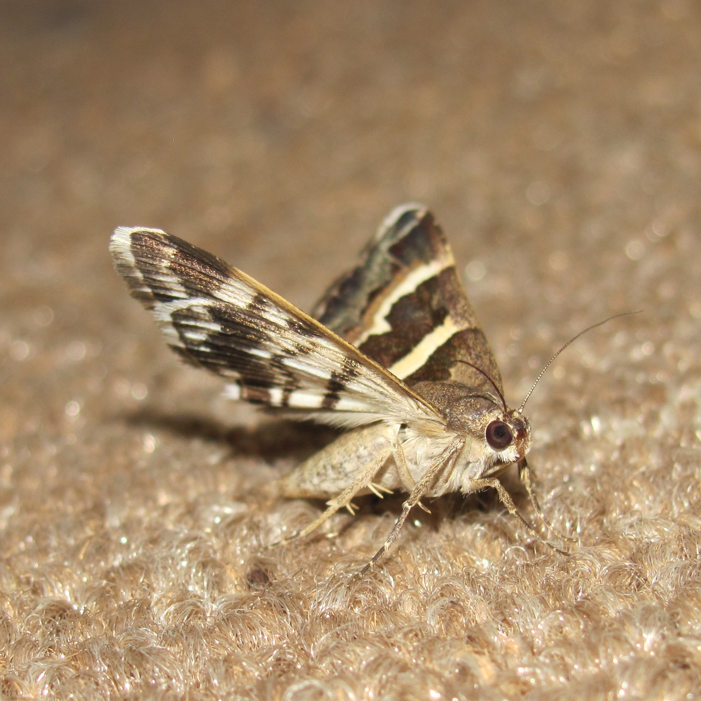

# Animals in the Bible

## License Information

Animals in the Bible © United Bible Societies, 2025. Adapted from: <cite>All Creatures Great and Small: Living Things in the Bible</cite>, by Edward R. Hope © 2005 United Bible Societies. This work is licensed under Creative Commons Attribution-ShareAlike 4.0 International (<a href="https://creativecommons.org/licenses/by-sa/4.0/">https://creativecommons.org/licenses/by-sa/4.0/</a>).

--------------------------------

## 標題：飛蛾（moth） (id: FAUNA:6.10)

6\.10 標題：飛蛾（moth）
=================

經文出處
----

Hebrew 來：עָשׁ (音譯：‘ash)

[JOB 4:19](https://ref.ly/Job4:19), [JOB 9:9](https://ref.ly/Job9:9), [JOB 13:28](https://ref.ly/Job13:28), [JOB 27:18](https://ref.ly/Job27:18), [PSA 39:12](https://ref.ly/Ps39:12), [ISA 50:9](https://ref.ly/Isa50:9), [ISA 51:8](https://ref.ly/Isa51:8), [HOS 5:12](https://ref.ly/Hos5:12)

Hebrew 來：סָס (音譯：sas)

[ISA 51:8](https://ref.ly/Isa51:8)

Greek 希：σής (音譯：sēs)

[MAT 6:19](https://ref.ly/Matt6:19), [MAT 6:20](https://ref.ly/Matt6:20), [LUK 12:33](https://ref.ly/Luke12:33), [SIR 42:13](https://ref.ly/Sir42:13)

討論
--

學者普遍認為，《希伯來聖經》中的*‘ash* 指的是飛蛾，*sas* 指的是飛蛾的幼蟲階段，而新約中的*sēs* 也是指飛蛾。提及飛蛾的上下文總是與破壞或損壞衣服有關，因此顯然是指一種在衣服上產卵的蛾，這就把該種飛蛾限定在谷蛾科（學名*Tineidae* ）裡的衣蛾中的一種，很可能就是網衣蛾（學名*Tineola biselliella* ）。雖然聖經將這種損害歸咎於飛蛾，但實際上是蛾的幼蟲破壞了衣物。聖經使用*‘ash* 一詞的時候，有可能是同時指蛾及其幼蟲。

描述
--

衣蛾是棕色或灰色的小飛蛾，會在衣服或衣料上面產卵。卵孵化成非常小的毛蟲，而且幾乎一孵化出來就立即開始吃布的纖維。毛蟲發育到一定程度後結繭，只有頭部伸出繭外，最後羽化成飛蛾。

特殊意義或象徵意義
---------

飛蛾是腐爛、荒廢和緩慢毀滅的象徵。

翻譯
--

[JOB 4:19](https://ref.ly/Job4:19) ：對於這節經文的最後一部分，大多數譯本都依照希伯來文本來翻譯，「他們像飛蛾一樣，很容易就被壓碎了。」

[JOB 27:18](https://ref.ly/Job27:18) ：對於這節經文的前半部分，大多數譯本都遵循《七十士譯本》和《敘利亞文譯本》，解作「他把房屋建造的像蜘蛛網一樣」，而不是像希伯來文所寫的：「他像蛾一樣建造房屋。」然而，如果蛾蛹也稱為*‘ash* ，那麼這段希伯來文可以解作「他把房屋建造的像蛾繭一樣」，基本上就與希臘文和敘利亞文譯本的詩歌意象相同。

[JAS 5:2](https://ref.ly/Jas5:2) ：這節經文使用了一個動詞，意思是「被飛蛾吃了」，其中包含*sēs* 這個名詞的衍生詞。

* **Associated Passages:** 約伯記 4:19; 約伯記 9:9; 約伯記 13:28; 約伯記 27:18; 詩篇 39:12; 以賽亞書 50:9; 以賽亞書 51:8; 何西阿書 5:12; 馬太福音 6:19; 馬太福音 6:20; 路加福音 12:33; 德訓篇 42:13; 雅各書 5:2

