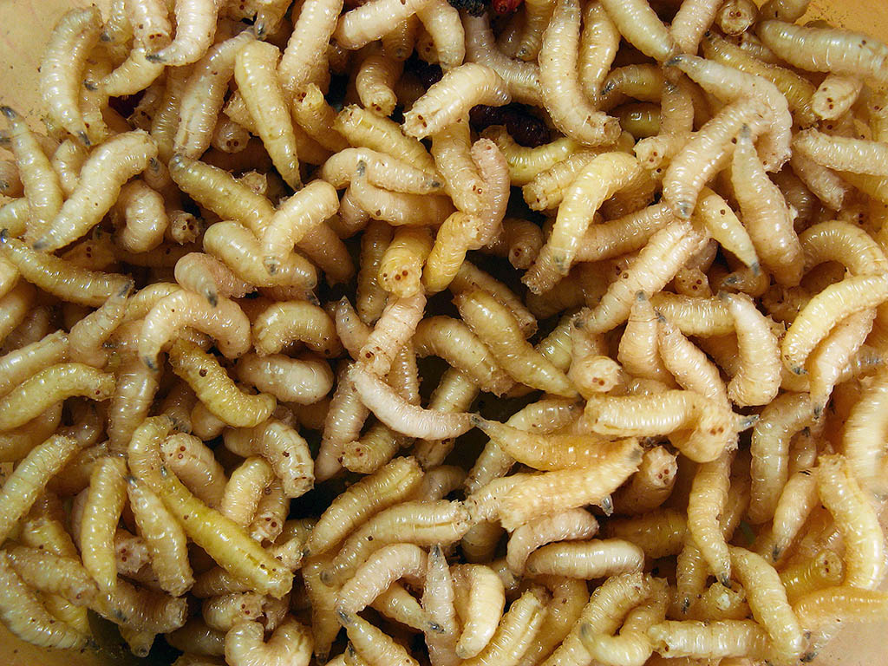

# Animals in the Bible

## License Information

Animals in the Bible © United Bible Societies, 2025. Adapted from: <cite>All Creatures Great and Small: Living Things in the Bible</cite>, by Edward R. Hope © 2005 United Bible Societies. This work is licensed under Creative Commons Attribution-ShareAlike 4.0 International (<a href="https://creativecommons.org/licenses/by-sa/4.0/">https://creativecommons.org/licenses/by-sa/4.0/</a>).

--------------------------------

## 標題：蠕蟲、蛆（worm, maggot） (id: FAUNA:6.13)

6\.13 標題：蠕蟲、蛆（worm, maggot）
===========================

經文出處
----

Hebrew 來：רִמָּה (音譯：rimah)

[EXO 16:24](https://ref.ly/Exod16:24), [JOB 7:5](https://ref.ly/Job7:5), [JOB 17:14](https://ref.ly/Job17:14), [JOB 21:26](https://ref.ly/Job21:26), [JOB 24:20](https://ref.ly/Job24:20), [JOB 25:6](https://ref.ly/Job25:6), [ISA 14:11](https://ref.ly/Isa14:11)

Hebrew 來：תּוֹלֵעָה, תּוֹלַעַת (音譯：tole‘ah, tola‘ath)

[EXO 16:20](https://ref.ly/Exod16:20), [DEU 28:39](https://ref.ly/Deut28:39), [JOB 25:6](https://ref.ly/Job25:6), [PSA 22:7](https://ref.ly/Ps22:7), [ISA 14:11](https://ref.ly/Isa14:11), [ISA 41:14](https://ref.ly/Isa41:14), [ISA 66:24](https://ref.ly/Isa66:24), [JON 4:7](https://ref.ly/Jonah4:7)

Greek 希：σκώληξ, σκωληκόβρωτος (音譯：skōlēx)

[MRK 9:48](https://ref.ly/Mark9:48), [ACT 12:23](https://ref.ly/Acts12:23), [JDT 16:17](https://ref.ly/Jdt16:17), [SIR 7:17](https://ref.ly/Sir7:17), [SIR 10:11](https://ref.ly/Sir10:11), [SIR 19:3](https://ref.ly/Sir19:3), [1MA 2:62](https://ref.ly/1Macc2:62), [2MA 9:9](https://ref.ly/2Macc9:9)

討論
--

在中文的用法裡，「蠕蟲」是一個統稱，「蛆」指的是蠕蟲狀的蒼蠅幼蟲，以腐爛的人體或動物的肉為食。希伯來文的*tole‘ah* 和*tola‘ath* 是統稱，指各種蠕蟲，無論以什麼為食。

在《出埃及記》、《利未記》和《民數記》中，出現了*tola‘ath shani* 這個短語，字面意思是「猩紅色的蠕蟲」。這個希伯來文名稱是指「猩紅色」以及「染製這種顏色的染料」。這種染料是用亞拉臘地區發現的胭脂蟲（學名*Coccus ilicis* ）製成的。腓尼基人販賣這種染料，將其運往中東、北非、歐洲南部和美索不達米亞，甚至更遠的地方。

希伯來文*tole‘ah* 和*tola‘ath* 是蠕蟲的統稱，然而*rimah* 及其希臘文對等詞*skōlēx* 在聖經中專指吃肉的蠕蟲，換句話說，就是指蛆。有些現代英文譯本使用了"worm"（「蠕蟲」）或"vermin"（「害蟲」）作為譯詞，主要是因為在英語文化中，若說自己的身體被蛆覆蓋，這是令人厭惡和不禮貌的。不過，這種顧慮在其他文化中可能並不存在。

描述
--

蠕蟲和蛆的身體很小、柔軟、無足、呈管狀，並且沒有骨頭或殼，牠們通常以過熟的水果、腐爛的肉類，以及其他類似的東西為食。這類生物中的大多數實際上是昆蟲的幼蟲，從蒼蠅或某些甲蟲產下的卵中孵化出來的。牠們大多數會發育成蛹，然後變為成蟲。

特殊意義或象徵意義
---------

在聖經中，蠕蟲和蛆是不潔、腐敗和無足輕重的象徵。在[PSA 22:7](https://ref.ly/Ps22:7) （《和》22:6）和[ISA 41:14](https://ref.ly/Isa41:14) 中，*tola‘ath* 用來表示一個非常微不足道的人甚或國家。在翻譯時，如果把一個人比作蠕蟲或蛆並不能傳達這個意思，那麼可能需要選擇其他象徵「無足輕重」的昆蟲。如果將人比作任何昆蟲都不能表達無足輕重的意思，則可以採用「像蠕蟲一樣軟弱無助」等譯法（參GECL (German Common Language Version (Gute Nachricht Bibel)) 對[ISA 41:14](https://ref.ly/Isa41:14) 的翻譯）。

蛆是不潔、腐爛和死亡的象徵。在[JOB 25:6](https://ref.ly/Job25:6) 中，蛆象徵令人厭惡、微不足道的人。

翻譯
--

蠕蟲和蛆各地都有，因此找到對等詞應該不會太難。然而在許多語言中，不同種類的蠕蟲或蛆是用特定的詞語來表達，但卻沒有包含全部種類的統稱。在這種情況下，翻譯者需要仔細考察上下文以找出合適的譯詞。如果經文是指破壞葡萄或橄欖的蠕蟲，則應採用適合這種情況的詞語；如果經文指的是以屍體為食的蛆，則應選用適合這些情境的詞。根據具體的上下文選擇合適的譯詞，優於每次都使用同一個譯詞來翻譯某個希伯來文或希臘文詞語。

在所有上下文中，都可以使用表示「吃肉的蠕蟲或蛆」的詞語。

在《馬索拉文本》中，[JOB 24:20](https://ref.ly/Job24:20) 非常模糊和難以理解，其中包含了*rimah* 一詞。RSV (Revised Standard Version (1952)) 支持修正希伯來文本的作法，將*rimah* （「蛆」）改為*shemo* （「他的名字」）。然而，許多解經家和大多數現代英文譯本並沒有作出這種改變，翻譯示例如下：

子宮（意即「他的母親」）忘記他，

蠕蟲飽餐他的肉（或譯：將他吸乾）。

邪惡的人也要如此被遺忘，

好像折斷的樹。

[MRK 9:44](https://ref.ly/Mark9:44) （參《和修》腳註）和[MRK 9:46](https://ref.ly/Mark9:46) （參《和修》腳註）也提到了蛆，不過，這兩節經文並沒有出現在最好的希臘文抄本中，因此通常只放在譯本的腳註中。

[ACT 12:23](https://ref.ly/Acts12:23) 中有一個希臘文動詞*skōlēkobrōtos* ，意思是「被蛆吃」。希律•亞基帕的死亡被視為上帝對邪惡生命的懲罰，因為他是被蛆吃掉的。經文這樣說可能是指亞基帕的瘡沒有痊愈，比如患了壞疽、糖尿病，梅毒或熱帶潰瘍，又因為環境不衛生而感染生蛆，最終導致血液感染而死。另一種解釋是這裡的「蛆」指腸道寄生蟲，例如絛蟲或肝吸蟲，從而導致亞基帕的健康狀況欠佳，最終致死。

另參[6\.4 蒼蠅 (fly)](#FAUNA:6.4) 。

* **Associated Passages:** 出埃及記 16:24; 約伯記 7:5; 約伯記 17:14; 約伯記 21:26; 約伯記 24:20; 約伯記 25:6; 以賽亞書 14:11; 出埃及記 16:20; 申命記 28:39; 詩篇 22:7; 以賽亞書 41:14; 以賽亞書 66:24; 約拿書 4:7; 馬可福音 9:48; 使徒行傳 12:23; 友弟德傳 16:17; 德訓篇 7:17; 德訓篇 10:11; 德訓篇 19:3; 瑪加伯上 2:62; 瑪加伯下 9:9; 馬可福音 9:44; 馬可福音 9:46

