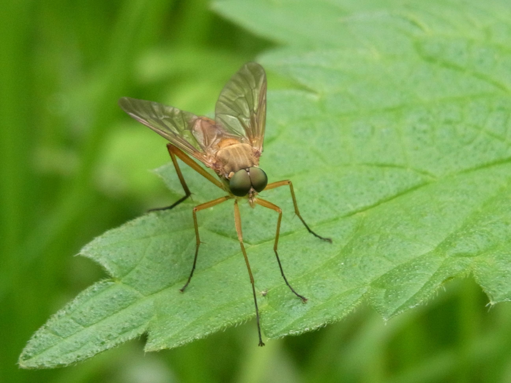
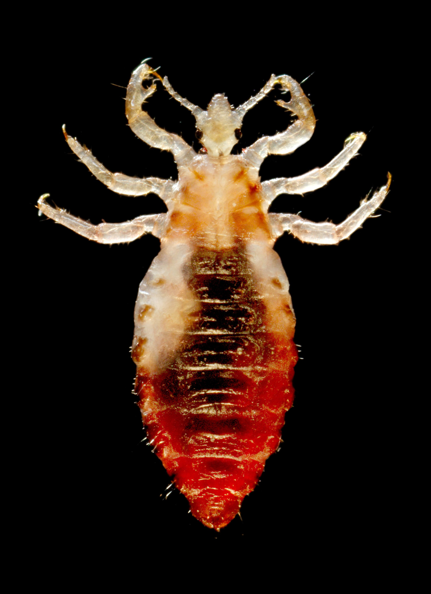

# Animals in the Bible

## License Information

Animals in the Bible © United Bible Societies, 2025. Adapted from: <cite>All Creatures Great and Small: Living Things in the Bible</cite>, by Edward R. Hope © 2005 United Bible Societies. This work is licensed under Creative Commons Attribution-ShareAlike 4.0 International (<a href="https://creativecommons.org/licenses/by-sa/4.0/">https://creativecommons.org/licenses/by-sa/4.0/</a>).

--------------------------------

## 標題：昆蟲、蜘蛛和蠕蟲 (id: FAUNA:6)

6 標題：昆蟲、蜘蛛和蠕蟲
=============

* [6\.1 螞蟻（ant）](#FAUNA:6.1)
* [6\.2 蜜蜂（bee）](#FAUNA:6.2)
* [6\.3 跳蚤、虼蚤（flea）](#FAUNA:6.3)
* [6\.4 蒼蠅（fly）](#FAUNA:6.4)
* [6\.5 牛虻（gadfly）](#FAUNA:6.5)
* [6\.6 蚊蚋、蚊子、蝨子（gnat, mosquito, mouse）](#FAUNA:6.6)
* [6\.7 大黃蜂、黃蜂（hornet, wasp）](#FAUNA:6.7)
* [6\.8 水蛭（leech）](#FAUNA:6.8)
* [6\.9 蝗蟲、蚱蜢、蟋蟀（locust, grasshopper, cricket）](#FAUNA:6.9)
* [6\.10 飛蛾（moth）](#FAUNA:6.10)
* [6\.11 蠍子（scorpion）](#FAUNA:6.11)
* [6\.12 蜘蛛（spider）](#FAUNA:6.12)
* [6\.13 蠕蟲、蛆（worm, maggot）](#FAUNA:6.13)

## 標題：螞蟻（ant） (id: FAUNA:6.1)

6\.1 標題：螞蟻（ant）
===============

經文出處
----

Hebrew 來：נְמָלָה (音譯：nemalah)

[PRO 6:6](https://ref.ly/Prov6:6), [PRO 30:25](https://ref.ly/Prov30:25)

討論
--

這個希伯來文名稱很可能涵蓋了所有種類的螞蟻，但最符合聖經背景的種類顯然是收穫蟻（學名*Messor semirufus* ），這種螞蟻在以色列各地很常見。夏天，收穫蟻收集成熟的穀物和草籽，並儲存在蟻穴中以備過冬。

描述
--

收穫蟻是一種體型較大的深褐色螞蟻。和大多數螞蟻一樣，收穫蟻的蟻穴是蟻后、工蟻和兵蟻的家；兵蟻的職責是保護蟻穴。蟻穴位於地下，入口很容易辨認，通常會有多條通向蟻穴的細小路徑，以及許多螞蟻留在入口附近的糠秕。螞蟻能扛起超過自身重量許多倍的東西。

特殊意義或象徵意義
---------

螞蟻是殷勤和努力工作的象徵。

翻譯
--

最好的譯法可能就是螞蟻的統稱，但是如果有必要，使用當地一種會將食物運回蟻穴的螞蟻名稱也很合適。

* **Associated Passages:** 箴言 6:6; 箴言 30:25

## 標題：蜜蜂（bee） (id: FAUNA:6.2)

6\.2 標題：蜜蜂（bee）
===============

經文出處
----

Hebrew 來：דְּבוֹרָה (音譯：devorah)

[DEU 1:44](https://ref.ly/Deut1:44), [JDG 14:8](https://ref.ly/Judg14:8), [PSA 118:12](https://ref.ly/Ps118:12), [ISA 7:18](https://ref.ly/Isa7:18)

Greek 希：μέλισσα (音譯：melissa)

[SIR 11:3](https://ref.ly/Wis11:3)

討論
--

聖經時期，在以色列地生存的蜜蜂顯然非常凶悍，因為大多數提到蜜蜂的經文都描述牠們成群地移動，並且會攻擊人。現今在蜂場飼養的蜜蜂都是通過特別挑選蜂王進行繁殖的，已經相當馴服，但是以前的蜜蜂很可能要凶猛得多。大多數聖經經文都是指「野蜂」，即天然蜂窩中的蜜蜂，而不是指養在人造蜂箱中的蜜蜂。然而，當時的以色列可能也有飼養蜜蜂的蜂場，因為在很早的時候，埃及、希臘和羅馬等地的人就經常養蜂。

希伯來文*devash* 指蜂蜜，也指從無花果、棗椰、葡萄或某些種類的棕櫚樹提取出來的糖漿。「流奶與蜜之地」這個短語指的是一片肥沃的土地，因此有豐富的牧草、水果、穀物，以及可供蜜蜂釀蜜的花。

描述
--

蜜蜂是一種會飛的昆蟲，採集各種花蜜，然後將其轉化為蜂蜜。蜜蜂群聚生活，每個蜂群通常有幾千隻蜜蜂，在空心原木、岩石縫隙、地底下的洞穴、白蟻棄置的蟻穴，或者其他地方築窩。在蜂窩裡面，蜜蜂用蜂蠟建造蜂巢。蜂巢中有很多小房間（蜂房），蜂王在最靠近蜂窩中心的蜂房產卵，幼蜂便在蜂房裡長大，蜂蜜則儲存在較靠外邊的蜂房。蜜蜂會螫人，當牠們感到自己的蜂窩受到威脅時就會採取行動。當一隻蜜蜂螫刺後，發出的氣味會使蜂窩中其他的蜜蜂也變得有攻擊性。

翻譯
--

由於全世界都有蜜蜂，因此翻譯時通常沒有什麼問題。在翻譯[JDG 14:8](https://ref.ly/Judg14:8) 時，如果目標語言沒有表示「蜂」的統稱，那麼可以使用表示「蜜蜂」的特定名稱，或是能釀造可食用蜂蜜的蜂類名稱。但在聖經其他所有提到蜂的地方，都應該使用群聚飛行，並且會螫刺入侵者的蜂類名稱。

備註：NEB (New English Bible (1970)) 英文意為「他們包圍我，就像蜜蜂圍著蜜一樣」，這肯定是錯誤的。這裡的意思不是蜜蜂圍繞著蜜，而是蜜蜂群集，準備攻擊。

* **Associated Passages:** 申命記 1:44; 士師記 14:8; 詩篇 118:12; 以賽亞書 7:18; 德訓篇 11:3

## 標題：跳蚤、虼蚤（flea） (id: FAUNA:6.3)

6\.3 標題：跳蚤、虼蚤（flea）
===================

經文出處
----

Hebrew 來：פַּרְעֹשׁ (音譯：par‘osh)

[1SA 24:15](https://ref.ly/1Sam24:15), [1SA 26:20](https://ref.ly/1Sam26:20)

描述
--

致癢蚤（學名*Pulex irritans* ）是一種寄生在人身上的跳蚤，但還有其他亞種會寄生在狗、駱駝和其他哺乳動物的身上。跳蚤非常小（長約1\.25毫米或0\.05英吋），身體呈黑色，能夠跳躍，在成蟲階段會吸食血液，叮咬的地方會致癢。如果搔抓被叮咬的地方，很容易引起感染。跳蚤的後腿很適合跳躍，跳躍所需的繃緊力是由一種特殊的黏性蛋白質產生的。跳蚤繃緊腿部以對抗這種黏性物質，而當牠雙腿猛然彈開時，就釋放出驚人的能量。身長不到一毫米的跳蚤可以跳躍超過一米，也就是身長的一千多倍。

跳蚤是一種很麻煩的害蟲，在泥土和灰塵中繁殖。聖經時代的人沒有防禦跳蚤的能力，尤其是在有泥地的房子裡，很難解決這個麻煩。如果跳蚤問題實在太嚴重，除了搬到另一間房子外，別無選擇。

另一種跳蚤是印度鼠蚤（學名*Xonopsylla cheopis* ），寄生在黑鼠身上，是淋巴腺鼠疫的帶菌者。參[2\.27 老鼠、耗子 (mouse, rat)](#FAUNA:2.27) 。

特殊意義或象徵意義
---------

跳蚤象徵無足輕重、愛惹麻煩的人，或是微不足道的討厭鬼。

翻譯
--

在翻譯[1SA 24:14](https://ref.ly/1Sam24:14) 時，應該表明大衛是在貶低自己，而不是在對掃羅王不敬。他是在稱自己為「跳蚤」。那些將大衛的整段話都譯成問句的譯本，通常都沒有充分傳達出這個自貶的意思。比較好的譯法是先提出一個問題，後面加上該問題的兩個回答：「王發現了什麼呢？一隻死狗！一隻跳蚤！」有些語言可能需要譯成：「我只是一隻死狗！我只是一隻跳蚤！」

[1SA 26:14](https://ref.ly/1Sam26:14) 有一個很難解決的文本問題，至於哪一個是更好的文本，學者的意見平分秋色。RSV (Revised Standard Version (1952)) 和JB (Jerusalem Bible (1966)) 遵循《七十士譯本》，把這個詞譯成「我的命」，而其他譯本遵循《馬索拉文本》，譯成「跳蚤」。如果譯成「跳蚤」，那麼最好增加一個腳註，指出《七十士譯本》不作「跳蚤」，而是作「我的命」。

* **Associated Passages:** 撒母耳記上 24:15; 撒母耳記上 26:20; 撒母耳記上 24:14; 撒母耳記上 26:14

## 標題：蒼蠅（fly） (id: FAUNA:6.4)

6\.4 標題：蒼蠅（fly）
===============

經文出處
----

Hebrew 來：זְבוּב (音譯：zevuv)

[2KI 1:2](https://ref.ly/2Kgs1:2), [2KI 1:3](https://ref.ly/2Kgs1:3), [2KI 1:6](https://ref.ly/2Kgs1:6), [2KI 1:16](https://ref.ly/2Kgs1:16), [ECC 10:1](https://ref.ly/Eccl10:1), [ISA 7:18](https://ref.ly/Isa7:18)

Hebrew 來：עָרֹב (音譯：‘arov)

[EXO 8:17](https://ref.ly/Exod8:17), [EXO 8:18](https://ref.ly/Exod8:18), [EXO 8:20](https://ref.ly/Exod8:20), [EXO 8:25](https://ref.ly/Exod8:25), [EXO 8:27](https://ref.ly/Exod8:27), [PSA 78:45](https://ref.ly/Ps78:45), [PSA 105:31](https://ref.ly/Ps105:31)

Greek 希：μυῖα (音譯：muia)

[WIS 16:9](https://ref.ly/EsthGr16:9)

討論
--

蒼蠅在埃及和中東很常見，並且種類很多。幾乎在每家的房子裡，以及所有養牛、綿羊或山羊的地方，都可以看到家蠅（學名*Musca domestica* ）。

描述
--

常見的家蠅是一種雙翅昆蟲，長著很大的複眼，以多種蔬菜和蛋白質物質為食，經常聚集在食物、腐爛的水果或肉類、糞便和生活垃圾上。因此，蒼蠅會把各種來源的細菌和病毒攜帶到人的食物上，並且可能引起與食物污染有關的疾病。

蒼蠅常在食物來源上面或附近產卵，例如在腐爛的植物或肉類等蛋白質物質上面產卵，肉的溫度會由於細菌的活動而升高。蠅卵孵化成蛆，然後蛆就以腐爛的物質為食。有幾種蒼蠅會在人類或動物皮膚上的瘡附近產卵，這時蛆就以瘡上的肉為食。

特殊意義或象徵意義
---------

蒼蠅與腐爛和不乾淨相關聯。

翻譯
--

家蠅遍佈世界各地，要找到當地語言的對等詞應該不難。

[2KI 1:2](https://ref.ly/2Kgs1:2) 記載，以革倫神明的名字叫巴力•西卜（Baal\-zebub），意思可能是「蒼蠅之王」；換句話說，巴力•西卜是保護人們免受蒼蠅引起的瘡和其他疾病傷害的神明。然而，這個名字可能與烏加列文\*zebul\*（西布勒，意為「至高者」）有關。因此，這個名字最初可能是巴力•西布勒，迦南話相當於「至高的主」，但是以色列人諷刺地將其改成巴力•西卜，即「蒼蠅之王」。因為對「巴力•西卜」一詞的正確詞源仍存疑問，所以最好音譯這個名稱，而不要嘗試翻譯出它的意思，並增加以下腳註：「這個名字的意思是『蒼蠅之王』，可能是有意篡改該神明的真名巴力•西布勒，以表示諷刺」（比較JB (Jerusalem Bible (1966)) ）。

希伯來文*‘arov* 的字面意思是「混合」，實際上並沒有指稱任何特定的昆蟲。由於這個原因，《新猶太譯本》和NASB (New American Standard Bible) 將這個詞譯為「成群的昆蟲」，而法文《大公聖經版本》（*Traduction oecuménique* de la Bible）和德文GECL (German Common Language Version (Gute Nachricht Bibel)) 都譯為「害蟲」。大多數的英文譯本將這個詞譯為「蒼蠅」，然而有些譯本譯作一種會叮咬的蒼蠅，如「馬蠅」或「牛虻」（比較《馬丁路德譯本》、DUCL (Dutch Common Language Version) 、NJB (New Jerusalem Bible (1985)) 和SPCL (Spanish Common Language Version (Dios Habla Hoy)) ）。在翻譯[EXO 8:17](https://ref.ly/Exod8:17) （《和》8:21）時，SPCL (Spanish Common Language Version (Dios Habla Hoy)) 加上了腳註：「經文所指的昆蟲種類不詳，很可能只是使用一個統稱來表示各種昆蟲的可怕侵襲。」

備註：在[ISA 51:6](https://ref.ly/Isa51:6) 中，NIV (New International Version (1984)) 和REB (Revised English Bible (1989)) 譯為「像蒼蠅一樣死亡」，這是一個正確的英語成語（意思是「成批死亡」），但請參考[6\.6 蚊蚋、蚊子、蝨子 (gnat, mosquito, mouse)](#FAUNA:6.6) 。

* **Associated Passages:** 列王紀下 1:2; 列王紀下 1:3; 列王紀下 1:6; 列王紀下 1:16; 傳道書 10:1; 以賽亞書 7:18; 出埃及記 8:17; 出埃及記 8:18; 出埃及記 8:20; 出埃及記 8:25; 出埃及記 8:27; 詩篇 78:45; 詩篇 105:31; 智慧篇 16:9; 以賽亞書 51:6

## 標題：牛虻（gadfly） (id: FAUNA:6.5)

6\.5 標題：牛虻（gadfly）
==================

經文出處
----

Hebrew 來：קֶרֶץ (音譯：qerets)

[JER 46:20](https://ref.ly/Jer46:20)

討論和描述
-----

牛虻，也稱為馬蠅和水蠅，有許多種類，屬於會叮咬的蠅類，以恆溫動物或人類的血液為食。有些種類會傳播疾病。聖經中提到的牛虻很可能是普通馬蠅（學名*Stomoxys calcitrans* ），在中東、西亞，澳大利亞和非洲很常見。這種馬蠅非常執著，除非被刷掉或打掉，否則絕對不離開宿主。牠們迅速地叮咬，然後被叮者只會發癢一會兒。

特殊意義或象徵意義
---------

「牛虻」在聖經中只出現一次，代表能成功製造麻煩的次要敵人。

翻譯
--

如果當地有會叮咬人的蒼蠅，就可以使用其中一種比較常見的蒼蠅種類的名稱。如果沒有這類蒼蠅，可以採用簡短的描述性短語，比如「叮人的蒼蠅」、「刺蠅」、「灼燒人的蒼蠅」等。

* **Associated Passages:** 耶利米書 46:20

## 標題：蚊蚋、蚊子、蝨子（gnat, mosquito, mouse） (id: FAUNA:6.6)

6\.6 標題：蚊蚋、蚊子、蝨子（gnat, mosquito, mouse）
=======================================

經文出處
----

Hebrew 來：כֵּן, כִּנָּם (音譯：ken, kinam)

[EXO 8:12](https://ref.ly/Exod8:12), [EXO 8:13](https://ref.ly/Exod8:13), [EXO 8:14](https://ref.ly/Exod8:14), [PSA 105:31](https://ref.ly/Ps105:31), [ISA 51:6](https://ref.ly/Isa51:6)

Greek 希：κώνωψ (音譯：kōnōps)

[MAT 23:24](https://ref.ly/Matt23:24)

Greek 希：σκνίψ (音譯：sknips)

[WIS 19:10](https://ref.ly/EsthGr19:10)

討論
--

學者對於希伯來文*ken* 的含義仍然存有很大的疑問。這個詞可能源於一個意為「使穩固」或「建立」，可能還有「牢牢依附」意思的詞根。英文譯本採用的幾種譯法都有根據。

這個詞在聖經中出現了五次，其中四次與以色列人出埃及之前，埃及遭受的災禍有關。下面討論的是學者認為可能的一些昆蟲：

**蚊蚋／蚊子** ：「蚊蚋」是一個相當古老的詞彙，指多種小飛蟲，例如蚊子、湖蠅，以及稱為「蠓蟲」的小蒼蠅。這些昆蟲在埃及的自然環境中有很多，特別是在尼羅河谷。因此，希伯來文*ken* 所指的害蟲可能是叮人的蚊子，在這裡應該是瘧蚊（學名*Anopheles* ）。霍特（Hort）贊同這種看法；他指出，一旦埃及的青蛙全部死亡，蚊子和蒼蠅必然會滋生到前所未有的數量。

蚊子是種小飛蟲，在飛行時會發出特有的嗡嗡聲。只要有積水和植被，蚊子就會滋生。有些種類在白天活動，其餘則在夜間較為活躍。蚊子在池塘和水坑的水面，或潮濕的植被上產卵。卵孵化成很小的、像蠕蟲一樣的幼蟲，稱為孑孓。孑孓長著毛髮般的尾巴，並且藉由尾巴來呼吸。大多數種類的孑孓生活在水中，但是必須升到水面上才能呼吸。幼蟲發育成熟後，會從水中出來，等待新長出的翅膀乾燥，然後飛走覓食。許多種類的雌蚊以人或動物的血液為食，有些蚊子會傳播瘧疾和登革熱等疾病。

**蝨子** ：這種無翅的微小昆蟲屬於蝨科（學名*Siphunculata (Anoplura)* ）。通常，這些微小、白色的蟲子寄生在人類、動物或鳥類的身上，從宿主的皮膚裡吸血。體蝨（學名*Pediculus humanus* ）通常出現在人的頭部和有毛髮的部位。蝨子會到處爬行，但不像跳蚤那樣會跳躍。如果人的居住狀況比較擁擠，那麼蝨子會極為常見，因為牠們很容易從一個人身上爬到另一個人身上。蝨子會把很小的卵產在毫不知情的宿主毛髮內。

蝨子在灰塵和污垢中繁殖，並且由於第一災的時候河水「變成了血」，埃及人很可能有一段時間沒沐浴，環境條件可能比平常更髒。另外，蝨子也是致命疾病斑疹傷寒的帶菌者。然而，有些學者反對*ken* 是蝨子的意見，因為經文指明*kinim* 同時攻擊人和牲畜，但蝨子通常不會對牲畜構成嚴重威脅，只會稍微造成煩擾。

KJV (King James Version (1611)) 譯為"lice"（「蝨子」），這種譯法有著名的動物考古學家博登海默（F.S. Bodenheimer）、拉比傳統，以及約瑟夫等古代評論家的支持。

**蛆** ：許多熱帶國家都有蛆，這些蛆是各種蠅類的幼蟲。蒼蠅將卵產在衣服上或皮膚的傷口裡。這些卵很快就孵化成為很小的蠕蟲，鑽進周圍的肉裡面，以肉為食。蠕蟲越長越大，在皮膚下面形成像癤子一樣的腫塊。然後，成熟的幼蟲爬出來，在皮膚表面形成瘡口。因此，這些蛆一方面與蒼蠅關聯，另一方面與癤子關聯。這點似乎很重要，因為埃及在蝨災之後，接下來三個災禍當中的兩個便是蠅災和瘡災（起泡或長癤子災）。這在邏輯上是可能的，因此成為NEB (New English Bible (1970)) 和REB (Revised English Bible (1989)) 所用譯法的主要支持。另參[6\.13 13 蠕蟲、蛆 (worm, maggot)](#FAUNA:6.13) 。

**壁蝨** 是蛛形綱（學名*Arachnida* ）的小型八足動物，蛛形綱還包括蜘蛛和蠍子等動物。然而，壁蝨比同綱中的其他物種小得多，並且外形不像蜘蛛或蠍子。牠們會非常牢固地附著在人、動物、爬行動物或鳥類的皮膚上，並且吸血（請跟「牢固附著」這個意思做比較，有些學者認為這是*ken* 的詞根）。吸血後，雌蟲會膨脹到約為原來大小的一百倍，然後掉落在地，並產下許多卵。卵孵化後，會冒出數百個壁蝨幼蟲，定居在灰塵中或附著在草莖上。幼蟲可以這樣存活許多個月，以等待適合的人、動物或鳥兒經過。一旦牠們附著在宿主身上，就會四處爬行，直到感覺到比較靠近皮膚表面的血管。然後，牠們就咬破宿主的皮膚，開始吸血，被牠們叮咬的地方會變得非常癢，甚至可能會變成瘡。

在埃及和其他許多亞熱帶及熱帶國家，壁蝨是常見的害蟲。人被叮咬之後，可能會出現熱帶壁蝨熱（也稱為回歸熱）等危險病症，動物可能會染上德克薩斯牛熱或犬瘟熱等。目前還沒有英文聖經譯本採用「蝨子」作為希伯來文*ken* 的譯詞，但其實這種譯法與NEB (New English Bible (1970)) 和REB (Revised English Bible (1989)) 的譯法一樣合理。伍德（J.G. Wood）和坎斯代爾（G.S. Cansdale）等學者都支持這種翻譯。

希臘文*sknips* 的意思是「蝨子」。

特殊意義或象徵意義
---------

*Ken* 象徵小規模但卻能致命的瘟疫，或者是一個影響不大，但卻相當難以解決的麻煩事。

在[MAT 23:24](https://ref.ly/Matt23:24) 中，*kōnōps* 是指那些非常瑣碎、無關緊要的事。

翻譯
--

除了一些沙漠地區之外，蚊子、蝨子、壁蝨和蛆蟲幾乎遍佈世界各地。翻譯者需要決定正文採用哪一種譯法，並在腳註中指出其他可能的譯法。腳註可以寫成：「這個希伯來文詞語的含義不確定，可能是……，或是……，或是……。」

[ISA 51:6](https://ref.ly/Isa51:6) ：在這節經文的中間部分，希伯來文本的內容如下：

雖然諸天必像煙雲消散

地必如衣服漸漸破舊

其上的居民要像*ken* 一樣消散……。

許多學者認為，這裡的希伯來文原稿應該是*kinim* ，而不是*ken* ，因此這句話應該是「像蚊子／蝨子／壁蝨一樣消散。」在這處經文中，這個詞應該是指很多（也許是令人厭惡的）壽命短暫的小昆蟲。因此，NIV (New International Version (1984)) 、TEV (Today's English Version (Good News Bible)) 、REB (Revised English Bible (1989)) 和NAB (New American Bible (1970)) 都譯為「像蒼蠅一樣死亡」；RSV (Revised Standard Version (1952)) 譯為「像蚊蚋一樣死亡」；JB (Jerusalem Bible (1966)) 譯為「像害蟲一樣死亡」。有些非英文譯本譯為「像螞蟻一樣死亡」或「像跳蚤一樣死亡」。

[MAT 23:24](https://ref.ly/Matt23:24) 中提到「濾掉蚊蚋」（RSV (Revised Standard Version (1952)) ；「蚊蚋」在《和》、《和修》作「蠓蟲」），古時的猶太人在喝酒或喝水之前通常會先過濾，以避免因為吞下蚊子或其他昆蟲而在禮儀上不潔淨，這是依照[LEV 11:0](https://ref.ly/Lev11:0) 的規定。TEV (Today's English Version (Good News Bible)) 將這個詞翻譯為「蒼蠅」，因為對於說英文的讀者來說，蒼蠅是一種骯髒的昆蟲。然而，耶穌的重點不在於這種昆蟲的不潔淨，而是在於牠既小又不重要。在許多語言中，譯為「蚊子」就足夠了；但在有些語言中，可能需要採用「極小的蚊子」等短語，以確保讀者正確理解經文的言外之意。

* **Associated Passages:** 出埃及記 8:12; 出埃及記 8:13; 出埃及記 8:14; 詩篇 105:31; 以賽亞書 51:6; 馬太福音 23:24; 智慧篇 19:10; 利未記 11:0

## 標題：大黃蜂、黃蜂（hornet, wasp） (id: FAUNA:6.7)

6\.7 標題：大黃蜂、黃蜂（hornet, wasp）
============================

經文出處
----

Hebrew 來：צִרְעָה (音譯：tsir‘ah)

[EXO 23:28](https://ref.ly/Exod23:28), [DEU 7:20](https://ref.ly/Deut7:20), [JOS 24:12](https://ref.ly/Josh24:12)

Greek 希：σφήξ (音譯：sfēx)

[WIS 12:8](https://ref.ly/EsthGr12:8)

討論
--

這些希伯來文和希臘文詞語都是指大黃蜂和黃蜂，學者對此幾乎沒有疑問。NEB (New English Bible (1970)) 和REB (Revised English Bible (1989)) 的譯詞是"panic"（「恐慌」），然而沒有得到太多支持，因為該譯法將這個詞溯源至阿拉伯文*dara'‘a* ，但這個說法是非常有爭議的。

描述
--

大黃蜂和黃蜂是近緣物種。大黃蜂的體型比黃蜂大。大黃蜂和黃蜂與蜜蜂同屬於動物學分類中的膜翅目（學名*Hymenoptera* ），這表示牠們具有堅韌、透明、薄膜狀的翅膀。大黃蜂通常是黑色或棕色的，有些種類有黃色條紋。黃蜂則常呈淡綠色，也可能有黃色或淺綠色的條紋。較大的大黃蜂身長可達30—40毫米（1—1\.5英吋）。

大黃蜂和黃蜂的胸腹之間長著很長的細腰。所有的黃蜂都有螫針；因為螫針很大，所以螫人會非常疼痛，甚至帶來危險。大黃蜂和黃蜂的螫針與蜜蜂不同，並不會與身體分離，因此可反覆叮刺。牠們以昆蟲、毛毛蟲和蜘蛛為食。許多種類的黃蜂會叮刺獵物，然後將已經麻痺但仍然活著的昆蟲或蜘蛛放在黃蜂的卵附近；這樣，幼蟲孵化出來之後，很容易就可獲得食物。有些種類的黃蜂就在已經麻痺的獵物身上產卵。

東方大黃蜂（學名*Vespa orientalis* ）通常生活在牠挖掘的地下巢穴中。一個巢穴包含多個蜂巢，蜂群生活在其中。雖然地下的巢穴最爲常見，但也有一些紙質的蜂巢建在保護性的空洞中，如空心樹內。東方大黃蜂呈紅褐色，腹部有明顯的黃色粗條紋，頭部兩眼之間有黃色斑塊。通過聲音振動來交流，捕食其他昆蟲，如蚱蜢、蒼蠅、蜜蜂、胡蜂等，並用來喂養蜂群的後代。另外，牠們還會爲幼蜂收集其他動物蛋白，如新鮮或變質的肉和魚。成蜂吃碳水化合物，如花蜜、蜜露和水果。大黃蜂是蜜蜂的主要害蟲，會攻擊蜜蜂群以獲取蜂蜜和動物蛋白。東方大黃蜂的螫刺對人類來說是相當痛苦的，並且有些人對螫刺過敏。東方大黃蜂的外表與歐洲大黃蜂（學名*Vespa crabro* ）相似，並且不應與東亞的亞洲大黃蜂（學名*Vespa mandarinia* ）相混淆。

特殊意義或象徵意義
---------

毫無疑問，大黃蜂在聖經中象徵危險的敵人或是前來攻擊的軍隊。

翻譯
--

雖然大多數氣候溫暖的國家都有大黃蜂或黃蜂，但是一些看起來很危險的大型大黃蜂相對來說是無害的。例如，在整個非洲都能發現的黑色家居大黃蜂並非成群生活，而是獨居。這種大黃蜂會在牆壁上或屋頂下築泥巢，牠們的體型很大，也有螫針，但沒有攻擊性，很少螫刺任何人或動物。因此，翻譯者需要謹慎選擇一種成群生活，且非常危險的大黃蜂的名稱作為譯詞。假如當地所有大黃蜂或黃蜂都相對無害的話，可以使用描述性的短語，例如「戰士大黃蜂」、「戰鬥大黃蜂」、「軍隊大黃蜂」、「死亡大黃蜂」，或類似的短語。

* **Associated Passages:** 出埃及記 23:28; 申命記 7:20; 約書亞記 24:12; 智慧篇 12:8

## 標題：水蛭（leech） (id: FAUNA:6.8)

6\.8 標題：水蛭（leech）
=================

經文出處
----

Hebrew 來：עֲלוּקָה (音譯：‘aluqah)

[PRO 30:15](https://ref.ly/Prov30:15)

討論
--

少數學者認為*‘aluqah* 是一個惡魔的名字，據說這個惡魔會吸人的血，但是這個意見並沒有得到太多的支持，因此可以置之不理。也有學者提出類似的看法，認為這個詞指的是吸血蝙蝠，這種建議也可以不予考慮。這些蝙蝠只能在拉丁美洲找到，因此聖經作者不會知道。對於這個詞，普遍接受的意見是指水蛭。這個希伯來文詞語的詞根意思是「附著」或「吮吸」。

描述
--

水蛭外形像蠕蟲，屬於蛭綱（學名*Hirudinea* ），生活在溪流、沼澤或潮濕的地面上，但也能夠生活在乾地。中東最大的水蛭是尼羅河水蛭（學名*Limnatis nilotica* ）。水蛭的嘴非常特別，能夠在受害者的皮膚上劃出小切口，受害者可能是人、動物、爬行動物，甚至魚類；然後，牠們會緊緊吸住切口周圍的皮膚，恣意吸血。水蛭的皮膚上有許多小皺褶。隨著不斷吸食，水蛭的身體會膨脹到原來的許多倍；吸飽之後，水蛭會自己鬆口掉落。

如果強行將水蛭從皮膚上扯下，小切口會大量出血。水蛭對放在牠們皮膚上的鹽份很敏感，因此從很早的時候人就已經懂得將鹽撒在牠們身上，然後水蛭便會自行脫落，傷口也幾乎不會出血。

自古以來，醫生就用水蛭使患者適量出血。

特殊意義或象徵意義
---------

聖經提到水蛭只有一次，象徵貪婪。

翻譯
--

水蛭遍佈世界各地，生活在溫暖潮濕的環境中，因此在這些地方，應該不難找到指稱水蛭的當地用語。在其他地方，可以使用意為「吸血蠕蟲」的短語，或者可以從當地的貿易語言或國際語言中借用詞語。

* **Associated Passages:** 箴言 30:15

## 標題：蝗蟲、蚱蜢、蟋蟀（locust, grasshopper, cricket） (id: FAUNA:6.9)

6\.9 標題：蝗蟲、蚱蜢、蟋蟀（locust, grasshopper, cricket）
==============================================

經文出處
----

Hebrew 來：אַרְבֶּה (音譯：’arbeh)

[EXO 10:4](https://ref.ly/Exod10:4), [EXO 10:12](https://ref.ly/Exod10:12), [EXO 10:13](https://ref.ly/Exod10:13), [EXO 10:14](https://ref.ly/Exod10:14), [EXO 10:14](https://ref.ly/Exod10:14), [EXO 10:19](https://ref.ly/Exod10:19), [EXO 10:19](https://ref.ly/Exod10:19), [LEV 11:22](https://ref.ly/Lev11:22), [DEU 28:38](https://ref.ly/Deut28:38), [JDG 6:5](https://ref.ly/Judg6:5), [JDG 7:12](https://ref.ly/Judg7:12), [1KI 8:37](https://ref.ly/1Kgs8:37), [2CH 6:28](https://ref.ly/2Chr6:28), [JOB 39:20](https://ref.ly/Job39:20), [PSA 78:46](https://ref.ly/Ps78:46), [PSA 105:34](https://ref.ly/Ps105:34), [PSA 109:23](https://ref.ly/Ps109:23), [PRO 30:27](https://ref.ly/Prov30:27), [JER 46:23](https://ref.ly/Jer46:23), [JOL 1:4](https://ref.ly/Joel1:4), [JOL 1:4](https://ref.ly/Joel1:4), [JOL 2:25](https://ref.ly/Joel2:25), [NAM 3:15](https://ref.ly/Nah3:15), [NAM 3:17](https://ref.ly/Nah3:17)

Hebrew 來：גֵּב, גּוֹב, גֹּבַי (音譯：gev, gov, govay)

[ISA 33:4](https://ref.ly/Isa33:4), [AMO 7:1](https://ref.ly/Amos7:1), [NAM 3:17](https://ref.ly/Nah3:17), [NAM 3:17](https://ref.ly/Nah3:17)

Hebrew 來：גָּזָם (音譯：gazam)

[JOL 1:4](https://ref.ly/Joel1:4), [JOL 2:25](https://ref.ly/Joel2:25), [AMO 4:9](https://ref.ly/Amos4:9)

Hebrew 來：חָגָב (音譯：chagav)

[LEV 11:22](https://ref.ly/Lev11:22), [NUM 13:33](https://ref.ly/Num13:33), [2CH 7:13](https://ref.ly/2Chr7:13), [ECC 12:5](https://ref.ly/Eccl12:5), [ISA 40:22](https://ref.ly/Isa40:22)

Hebrew 來：חָסִיל (音譯：chasil)

[1KI 8:37](https://ref.ly/1Kgs8:37), [2CH 6:28](https://ref.ly/2Chr6:28), [PSA 78:46](https://ref.ly/Ps78:46), [ISA 33:4](https://ref.ly/Isa33:4), [JOL 1:4](https://ref.ly/Joel1:4), [JOL 2:25](https://ref.ly/Joel2:25)

Hebrew 來：חַרְגֹּל (音譯：chargol)

[LEV 11:22](https://ref.ly/Lev11:22)

Hebrew 來：יֶלֶק (音譯：yeleq)

[PSA 105:34](https://ref.ly/Ps105:34), [JER 51:14](https://ref.ly/Jer51:14), [JER 51:27](https://ref.ly/Jer51:27), [JOL 1:4](https://ref.ly/Joel1:4), [JOL 1:4](https://ref.ly/Joel1:4), [JOL 2:25](https://ref.ly/Joel2:25), [NAM 3:15](https://ref.ly/Nah3:15), [NAM 3:15](https://ref.ly/Nah3:15), [NAM 3:16](https://ref.ly/Nah3:16)

Hebrew 來：סָלְעָם (音譯：sol‘am)

[LEV 11:22](https://ref.ly/Lev11:22)

Hebrew 來：צְלָצַל (音譯：tselatsal)

[DEU 28:42](https://ref.ly/Deut28:42), [ISA 18:1](https://ref.ly/Isa18:1)

Greek 希：ἀκρίς (音譯：akris)

[MAT 3:4](https://ref.ly/Matt3:4), [MRK 1:6](https://ref.ly/Matt1:6), [REV 9:3](https://ref.ly/Jude9:3), [REV 9:7](https://ref.ly/Jude9:7), [JDT 2:20](https://ref.ly/Tob2:20), [WIS 16:9](https://ref.ly/EsthGr16:9), [SIR 43:17](https://ref.ly/Wis43:17)

Latin 拉：locusta

[2ES 4:24](https://ref.ly/1Esd4:24)

討論
--

蝗蟲是聖經中最重要的昆蟲，提及的次數比任何其他昆蟲都多。聖經中總共有九個希伯來文詞語都是指蝗蟲，其中最常用的是*’arbeh* ，在希臘文中的對等詞是*akris* ，拉丁文中的對等詞是*locusta* 。可以確定這些詞是指蝗蟲，而非蚱蜢。所有的蝗蟲和蚱蜢都屬於「直翅目」（學名*Orthoptera* ）下的蝗科（學名*Acrididae* ）。在以色列和埃及有許多種蝗蟲，其中最重要的是飛蝗（學名*Locusta migratoria* ）、沙漠蝗蟲（學名*Schistocerca gregaria* ），以及摩洛哥蝗蟲（學名*Dociostaurus moroccanus* ）。這三種蝗蟲都是當地重要的食物，在聖經中很可能都被稱作*’arbeh* 。

描述
--

**蚱蜢和蝗蟲** 都是六足、有翅膀的昆蟲，特點是第三對足特別長，適合跳躍。這些足的下半部有一排釘刺，用於發出聲音和防禦。前翅狹長，直而堅韌。在不飛行的時候，前翅會遮蓋薄膜狀的後翅；後翅要大得多、顏色更深，像折扇一樣折疊在一起。當蝗蟲或蚱蜢要飛行時，會向空中一躍，同時展開翅膀。飛行時，堅韌的前翅會互相撞擊，發出輕微的咔噠聲。

蝗蟲與蚱蜢的不同之處主要在於：蝗蟲會在特定的時期群聚，並遷移到其他地區生存，其他時候則獨自生活，或是形成小群。蝗蟲的繁殖能力隨著氣候條件不同而變化。卵囊產在土壤中，孵化與濕度有關。在乾旱時期只有少數卵粒能夠孵化，但在降雨充沛的時候，會突然孵出大量的蝗蟲。

蝗蟲與大多數的昆蟲不同，並沒有幼蟲或毛蟲的階段，從卵孵化之後即成為若蟲，就是很小的無翅蝗蟲，跳躍足尚未發育完全。若蟲只能到處爬行，以綠色植被為食，每天所消耗的食物是自身體重的許多倍。隨著漸漸長大和發育，若蟲會蛻皮。牠們的跳躍足比翅膀更早發育，因此會經過一個只能跳、不會飛的階段。在這個階段，牠們被稱為「蝻子」，不像若蟲階段那麼密集群聚，而是稍微分散；但是，蝻子比若蟲階段吃得更多，所以仍然可能會對農作物造成相當大的損害。發育為成蟲之後，牠們就可以跳躍和飛翔。如果氣候條件合適，同時又有大量蝻子長到這個成熟的階段，便會徹底毀壞牠們成長環境中的植被。之後，牠們會開始聚集，準備成群行動。換句話說，牠們會聚集在一起，然後整群集體飛行，一同遷移到有著更多綠色植被的地方。在這個聚集的階段，也就是在遷移期間和之後，牠們會對作物和其他植被構成重大威脅，因為牠們會不停地進食。

一個蝗蟲群可能有幾億隻蝗蟲。坎斯代爾引用了一份報告：1889年，一個蝗蟲群遮蓋了大約5,500平方公里（2,000平方英里）的面積。當然，即使在近現代，蝗蟲群也可能龐大到像巨大的黑雲那樣遮住太陽。當蝗蟲群迫近時，牠們的翅膀所發出的咔噠聲讓人一旦聽過就不會忘記。不管蝗蟲群落在何處，即使只是短暫歇腳，那個地方所有的綠色灌木或草叢都會被攻擊，並且牠們咀嚼樹葉的聲音清晰可聞，有時候會持續數小時。之後，幾乎看不到任何一片綠葉或草葉，甚至許多灌木因樹皮被吃掉而變得光禿禿的。

面對數目如此龐大的蝗蟲群，古代的人絕對會感到無助，他們完全沒有辦法阻止蝗蟲的破壞。把草點著所產生的火光，只能起非常小的作用。諷刺的是，當蝗蟲以這樣的密度群聚時，也很容易被大量捕捉和食用。人們經常用毯子、漁網和籃子抓住蝗蟲，先折斷蝗蟲後腿的下半截，然後可以烘、烤、炸或炒。有些地方的人也生吃蝗蟲。如果先烤再用鹽醃，味道會有點像鹹花生。

有些解經家指出，埃及的蝗災很可能為住在阿拉伯沙漠和西奈曠野的以色列人提供了食物，因為這是該地區的蝗蟲通常會走的遷移路線。

幾個主要蝗蟲種類的生長發育週期摘要如下：若蟲，只能爬行，會繼續發育到跳蝻階段；等到蝻子發育出翅膀，就成為蝗蟲的成蟲；如果氣候條件合適，成蟲會聚集成群，並遷移到新的地方；雌蟲產卵，然後整個週期不斷重複。因此，蝗蟲有四個發育階段：若蟲、蝻子、定居的成蟲，以及成群飛行或遷移的成蟲。*Chasil* 可能是指爬行的若蟲，*yeleq* 指跳蝻，*’arbeh* 指定居的成蟲，*gazam* 指成群遷移的成蟲。然而，這種區分並沒有得到證實，因為在提到蝗災時，這些詞似乎可以互換使用。

**蟋蟀和螽斯** ：蟋蟀是蝗蟲和蚱蜢的無翅夜行近緣動物，通常呈黑色或棕色，身體相對較短、較圓，白天躲在石頭或原木下面，而常稱為螻蛄的昆蟲則躲在自己挖的洞中。晚上，蟋蟀會發出特有的高頻唧唧聲，可以傳到非常遠的地方。每種蟋蟀發出的聲音略有不同。牠們跟蝗蟲和蚱蜢一樣，以植物為食，通常是吃葉子。

螽斯與蟋蟀外形相似，但通常是綠色的，有翅膀，夜間活躍，會發出像蟋蟀一樣的唧唧聲，白天則在樹葉下歇息。螽斯的翅膀呈綠色，形狀很像葉子，形成極佳的偽裝。有些螽斯也以其他昆蟲為食。

蟋蟀和螽斯都有極長的觸角。

特殊意義或象徵意義
---------

蝗蟲數量眾多，且具有成群移動的特性，因此象徵龐大、完全沒有辦法抵禦的攻擊軍隊。蝗蟲也象徵著上帝的懲罰。

在出現*chagav* 的五節經文中，有兩處經文的用法是比喻性的，表示微小且無足輕重的東西。因此，TEV (Today's English Version (Good News Bible)) 在[ISA 40:22](https://ref.ly/Isa40:22) 中將這個詞譯為「像螞蟻一樣微小」。

在希伯來文本中，[ECC 12:5](https://ref.ly/Eccl12:5) 字面直譯作「蚱蜢只能爬行」，然而*chagav* 在這裡的意思是有爭議的。這句詩是在描繪老年人的光景，*chagav* 所指的顯然是人衰老的一個標記。解經家通常有兩種解釋：（1）指老年人的行動困難；（2）對男性喪失性能力的玩笑話。如果接受第一種解釋，「蚱蜢」就是形容人活力充沛（但現在已是步履蹣跚）；如果接受第二種解釋，這個詞便是指男性的性器官。

翻譯
--

除了北美洲，全世界許多地方都能見到飛蝗（學名*Locusta migratoria* ）。在這些地區，應該可以很容易找到一個合適的當地譯詞。然而，在一些降雨量很大的國家，飛蝗和其他蝗蟲種類並不像中東和非洲乾旱地區的蝗蟲那樣群聚。在這些國家中，有些上下文可能需要使用像「成群的蝗蟲」這樣的短語，而不是僅僅譯為「蝗蟲」。在不知道蝗蟲的地區，通常可以用「大型／巨型蚱蜢」這樣的短語來替代。

希伯來文*gev* 、*gov* 和*govay* 等詞與一個意為「群集」或「聚集在一起」的動詞有關，因此幾乎可以肯定這些詞是指蝗蟲。

在[DEU 28:42](https://ref.ly/Deut28:42) 和[ISA 18:1](https://ref.ly/Isa18:1) 中，*tselatsal* 一詞形容昆蟲翅膀發出的聲音，很可能是指一大群蝗蟲所發出的聲音。有些英文譯本將這個詞譯為「呼呼」或「嗡嗡」，就是想要反映出這一點，不過，「嗡嗡聲」並不足以形容一大群蝗蟲所發出的聲音。因此，「咔噠」、「刷刷」、「呼呼」或「啪啪」最接近希伯來文所表示的聲音。

NEB (New English Bible (1970)) 和REB (Revised English Bible (1989)) 將這個詞譯為"mole cricket"（「螻蛄」），然而其他譯本都沒有採用這種譯法。螻蛄這種昆蟲頂多帶來輕微的滋擾，不會像蝗蟲群那樣造成災害。在[ISA 18:1](https://ref.ly/Isa18:1) 中，這兩個譯本沒有依循《馬索拉文本》的譯法，而是遵循《七十士譯本》，將這個詞譯為「帆船」。

建議將這個詞譯為：（1）蝗蟲群；（2）大群蝗蟲發出的聲音。在英文譯本中，《申命記》和《以賽亞書》的兩處經文譯作「翅膀刷刷作響的蝗蟲群」。在非洲許多的班圖語中，以及其他用擬聲詞來表達成千上萬隻翅膀鼓動發聲的語言中，這樣的擬聲詞就是很好的對等詞。如果沒有這類擬聲詞，可以使用類似英文的名詞短語，並用一個狀語來修飾。

在大多數情況下，*chagav* 的意思似乎是「蚱蜢」，唯一的例外是[2CH 7:13](https://ref.ly/2Chr7:13) ，該處經文指的是蝗蟲。在[NUM 13:33](https://ref.ly/Num13:33) 和[ISA 40:22](https://ref.ly/Isa40:22) 這兩處經文中，蚱蜢象徵著小且無足輕重的東西，如果按字面翻譯，可能無法傳達正確的引申意。在這種情況下，翻譯者可以使用當地文化中象徵小且無足輕重的其他昆蟲的名稱，例如「螞蟻」、「蝨子」、「跳蚤」等。如果沒有任何昆蟲名稱帶有這種象徵意義，則可以使用具有正確涵義的某種動物的名稱，例如「老鼠」或「松鼠」。

經節中如果只出現一個表示「蝗蟲」的希伯來文詞語，通常沒有什麼問題，可以使用當地語言中表示「蚱蜢」或「蝗蟲」的詞語。然而，如果經文同時出現多個表示「蝗蟲」的詞語，則需要特別謹慎，如下文所述：

[LEV 11:22](https://ref.ly/Lev11:22) ：這節經文包含了四種禮儀上潔淨的昆蟲。在整本聖經中，*sol‘am* 和*chargol* 這兩個希伯來文詞語只在這裡出現了一次，所以很難確定其含義。因此，下文僅嘗試提出一些翻譯建議。

根據這段經文所述潔淨昆蟲的特徵，可以推斷這四種昆蟲全部都有專門用來跳躍的腿。這表明蝗蟲（*’arbeh* ）、蚱蜢（*chagav* ）和蟋蟀（可能是*chargol* ）可以被列入清單，因為這三種昆蟲的多個品種都是在中東、非洲和亞洲部分地區經常食用的。另外，清單中出現了第四個名稱*sol‘am* ，NIV (New International Version (1984)) 將其翻譯為"katydid"（「螽斯」），而NAB (New American Bible (1970)) 將*chargol* 翻譯為"katydids"（「螽斯」），將*sol‘am* 譯作"grasshoppers"（「蚱蜢」）。「螽斯」是一種夜間活動的、善跳躍的昆蟲，在許多方面與蚱蜢類似，但通常長著綠色的葉狀翅膀。然而，螽斯通常都是獨居，且不容易捕捉，因此通常不是食物來源。RSV (Revised Standard Version (1952)) （可能還有TEV (Today's English Version (Good News Bible)) ）認為*sol‘am* 是一種蝗蟲，因此這兩種譯本的清單中包含了兩種蝗蟲，再加上蚱蜢和蟋蟀。

NEB (New English Bible (1970)) 和REB (Revised English Bible (1989)) 則選擇了四種不同的蝗蟲，將其稱為「大蝗蟲」（"great locust"；*’arbeh* ）、「長頭蝗蟲」（"long\-headed locust"；*sol‘am* ）、「綠蝗蟲」（"green locust"；*chargol* ）和「沙漠蝗蟲」（"desert locust"；*chagav* ）。這些名稱的選擇是基於學者假定的這些詞的詞源，即這些希伯來文詞語所源於的古代閃族語言的詞根。然而，根據詞源來確定詞語的意思是非常不可靠的，並且這些詞源在學術界也基本沒有得到支持。NAB (New American Bible (1970)) 將*chagav* 譯為"cricket"（「蟋蟀」）。

關於這個在禮儀上潔淨的昆蟲的清單，可以肯定的只有一點：蝗蟲、蚱蜢和蟋蟀極有可能包含在內。將這個清單譯為「所有種類的蝗蟲，所有種類的蚱蜢，和所有種類的蟋蟀」，可能是最安全的；另外還應該加上一個腳註：「在希伯來文本中，這個清單有四種昆蟲。有些學者認為這些昆蟲是四種不同的蝗蟲。」

[1KI 8:37](https://ref.ly/1Kgs8:37) ；[2CH 6:28](https://ref.ly/2Chr6:28) ：在希伯來文本中，這兩節經文所記的災難清單中都有*’arbeh* 和*chasil* 這兩個詞，所指對象很可能是成年和幼年蝗蟲，因此常譯成「蝗蟲和蚱蜢」、「大小蝗蟲」、「成年和幼年蝗蟲」等。

[PSA 78:46](https://ref.ly/Ps78:46) ：在希伯來文本中，這節經文中也同樣出現了*’arbeh* 和*chasil* 這兩個詞，並且也很可能是指成年和幼年蝗蟲，因此可以翻譯如下：

他將他們的（或譯：新近發芽的）田地給了蚱蜢（或譯：幼年蝗蟲／小蝗蟲），

將他們（或譯：成熟的）的莊稼給了蝗蟲（或譯：成年蝗蟲／大蝗蟲）。

[PSA 105:34](https://ref.ly/Ps105:34) ：這節經文出現了*’arbeh* 和*yeleq* 兩個詞，意思與[PSA 78:46](https://ref.ly/Ps78:46) 類似：

他說話，蝗蟲就來了，

幼年的蝗蟲／蚱蜢不計其數。

[ISA 33:4](https://ref.ly/Isa33:4) ：在這節經文中，表示「蝗蟲」的兩個詞是*chasil* 和*gev* ，如上所述，這兩個詞似乎是指幼年和成年蝗蟲：

他們的財物被掠奪，好像被蚱蜢（或譯：幼年的蝗蟲）斂盡一樣，

人為他們的貨物聚集，好像（成年的）蝗蟲一樣。

[JOL 1:4](https://ref.ly/Joel1:4) ，[JOL 2:25](https://ref.ly/Joel2:25) ：在這兩節經文中，都有至少四個表示「蝗蟲」的詞語：*gazam* 、*’arbeh* 、*yeleq* 和*chasil* 。大多數解經家認為，這是指蝗蟲四個不同的發育階段：群集的成年蝗蟲、定居的成年蝗蟲、無翅的跳蝻，以及爬行的若蟲。然而從上文可見，雖然*yeleq* 和*chasil* 都用來指幼年蝗蟲，但卻不可能指出哪個是指若蟲，哪個是指跳蝻。

TEV (Today's English Version (Good News Bible)) 在[JOL 1:4](https://ref.ly/Joel1:4) 的英文意為，「一群蝗蟲留下的，被下一群蝗蟲吞噬了」；這種譯法基本上表達出了作者的意思，但嚴格來說是不準確的，因為這裡的希伯來文詞語並不一定都是指大量群集的蝗蟲。更為準確的翻譯是：

群集的蝗蟲所留下的，定居的蝗蟲吃了；

定居的蝗蟲所留下的，跳躍的蝻子吃了；

跳躍的蝻子所留下的，爬行的若蟲吃了。

[NAM 3:15](https://ref.ly/Nah3:15) ，[NAM 3:16](https://ref.ly/Nah3:16) ，[NAM 3:17](https://ref.ly/Nah3:17) ：這是一段希伯來詩歌，其中採用的平行修辭出現了三個表示蝗蟲的詞語：*’arbeh* 、*yeleq* 和*gov* 。經文中還有幾個表示不同官員的詞語，無論這些詞語的確切意思是什麼，那三個指蝗蟲的詞顯然是同義詞，喻指：（1）很大的數量，（2）破壞性，（3）短暫的事物（臨時訪客）。在許多語言中，表示蝗蟲的詞語只有一個。因此，為了避免過分重複同一個單詞，可以使用略微不同的短語。下面的翻譯示例不僅反映出詩歌體結構，而且使用了三個不同的短語來翻譯三個表示「蝗蟲」的詞語：

15在那裡，火要吞滅你，

刀必殺戮你。

它將吞噬你，如同蚱蜢吞吃植物。

你增多吧，

像蚱蜢一樣！

你增多吧，

像蝗蟲一樣！

16你增添商賈（或譯：部隊）的數目，

直到比天空中的星星還多。

蝗蟲襲擊，然後飛走。

17你的軍官（或譯：王子）好像蚱蜢，

你的外交官彷彿成群的蝗蟲

聚集在石牆上，

在寒冷的日子裡。

太陽出來，

牠們就飛走。

他們都去了哪裡？

無人知道。

大多數學者認為：*gazam* 是指成年蝗蟲，而*yeleq* 和*chasil* 是指成蟲前的形態。然而，少數學者相信，這些詞語是指不同種類的蝗蟲，而不是指蝗蟲的不同生長階段。在[JOL 1:4](https://ref.ly/Joel1:4) 、[JOL 2:25](https://ref.ly/Joel2:25) 、[NAM 3:16](https://ref.ly/Nah3:16) 和[NAM 3:16](https://ref.ly/Nah3:16) 中，KJV (King James Version (1611)) 採用了"palmerworm"（「突然成群出現吃莊稼的毛蟲」）和"cankerworm"（「尺蠖」），可以用來替代"caterpillar"（「蝶、蛾的幼蟲」）；幾乎可以肯定，"caterpillar"不是其中任何一個希伯來文詞語。

有些解經家和聖經譯本認為，在[MAT 3:4](https://ref.ly/Matt3:4) 和[MRK 1:6](https://ref.ly/Matt1:6) 的希臘文本中，*akris* （《和》、《和修》譯作「蝗蟲」）可能是誤寫了某個單詞，該詞意思是「角豆莢」，是當地的一種食物；參《聖經中的動物和植物》（*Fauna and Flora of the Bible* ），第103—104頁。然而，這種說法沒有任何抄本的支持。當前的文本完全合乎情理，因為這些蝗蟲無論出現在哪裡，都會被人當作食物享用。實際上，蝗蟲配上蜂蜜是相當好的飲食，含有蛋白質、碳水化合物、維生素和微量元素。

* **Associated Passages:** 出埃及記 10:4; 出埃及記 10:12; 出埃及記 10:13; 出埃及記 10:14; 出埃及記 10:19; 利未記 11:22; 申命記 28:38; 士師記 6:5; 士師記 7:12; 列王紀上 8:37; 歷代志下 6:28; 約伯記 39:20; 詩篇 78:46; 詩篇 105:34; 詩篇 109:23; 箴言 30:27; 耶利米書 46:23; 約珥書 1:4; 約珥書 2:25; 那鴻書 3:15; 那鴻書 3:17; 以賽亞書 33:4; 阿摩司書 7:1; 阿摩司書 4:9; 民數記 13:33; 歷代志下 7:13; 傳道書 12:5; 以賽亞書 40:22; 耶利米書 51:14; 耶利米書 51:27; 那鴻書 3:16; 申命記 28:42; 以賽亞書 18:1; 馬太福音 3:4; 馬可福音 1:6; 啟示錄 9:3; 啟示錄 9:7; 友弟德傳 2:20; 智慧篇 16:9; 德訓篇 43:17; 厄斯德拉下 4:24

## 標題：飛蛾（moth） (id: FAUNA:6.10)

6\.10 標題：飛蛾（moth）
=================

經文出處
----

Hebrew 來：עָשׁ (音譯：‘ash)

[JOB 4:19](https://ref.ly/Job4:19), [JOB 9:9](https://ref.ly/Job9:9), [JOB 13:28](https://ref.ly/Job13:28), [JOB 27:18](https://ref.ly/Job27:18), [PSA 39:12](https://ref.ly/Ps39:12), [ISA 50:9](https://ref.ly/Isa50:9), [ISA 51:8](https://ref.ly/Isa51:8), [HOS 5:12](https://ref.ly/Hos5:12)

Hebrew 來：סָס (音譯：sas)

[ISA 51:8](https://ref.ly/Isa51:8)

Greek 希：σής (音譯：sēs)

[MAT 6:19](https://ref.ly/Matt6:19), [MAT 6:20](https://ref.ly/Matt6:20), [LUK 12:33](https://ref.ly/Mark12:33), [SIR 42:13](https://ref.ly/Wis42:13)

討論
--

學者普遍認為，《希伯來聖經》中的*‘ash* 指的是飛蛾，*sas* 指的是飛蛾的幼蟲階段，而新約中的*sēs* 也是指飛蛾。提及飛蛾的上下文總是與破壞或損壞衣服有關，因此顯然是指一種在衣服上產卵的蛾，這就把該種飛蛾限定在谷蛾科（學名*Tineidae* ）裡的衣蛾中的一種，很可能就是網衣蛾（學名*Tineola biselliella* ）。雖然聖經將這種損害歸咎於飛蛾，但實際上是蛾的幼蟲破壞了衣物。聖經使用*‘ash* 一詞的時候，有可能是同時指蛾及其幼蟲。

描述
--

衣蛾是棕色或灰色的小飛蛾，會在衣服或衣料上面產卵。卵孵化成非常小的毛蟲，而且幾乎一孵化出來就立即開始吃布的纖維。毛蟲發育到一定程度後結繭，只有頭部伸出繭外，最後羽化成飛蛾。

特殊意義或象徵意義
---------

飛蛾是腐爛、荒廢和緩慢毀滅的象徵。

翻譯
--

[JOB 4:19](https://ref.ly/Job4:19) ：對於這節經文的最後一部分，大多數譯本都依照希伯來文本來翻譯，「他們像飛蛾一樣，很容易就被壓碎了。」

[JOB 27:18](https://ref.ly/Job27:18) ：對於這節經文的前半部分，大多數譯本都遵循《七十士譯本》和《敘利亞文譯本》，解作「他把房屋建造的像蜘蛛網一樣」，而不是像希伯來文所寫的：「他像蛾一樣建造房屋。」然而，如果蛾蛹也稱為*‘ash* ，那麼這段希伯來文可以解作「他把房屋建造的像蛾繭一樣」，基本上就與希臘文和敘利亞文譯本的詩歌意象相同。

[JAS 5:2](https://ref.ly/Heb5:2) ：這節經文使用了一個動詞，意思是「被飛蛾吃了」，其中包含*sēs* 這個名詞的衍生詞。

* **Associated Passages:** 約伯記 4:19; 約伯記 9:9; 約伯記 13:28; 約伯記 27:18; 詩篇 39:12; 以賽亞書 50:9; 以賽亞書 51:8; 何西阿書 5:12; 馬太福音 6:19; 馬太福音 6:20; 路加福音 12:33; 德訓篇 42:13; 雅各書 5:2

## 標題：蠍子（scorpion） (id: FAUNA:6.11)

6\.11 標題：蠍子（scorpion）
=====================

經文出處
----

Hebrew 來：עַקְרָב (音譯：‘aqrav)

[NUM 34:4](https://ref.ly/Num34:4), [DEU 8:15](https://ref.ly/Deut8:15), [JOS 15:3](https://ref.ly/Josh15:3), [JDG 1:36](https://ref.ly/Judg1:36), [1KI 12:11](https://ref.ly/1Kgs12:11), [1KI 12:14](https://ref.ly/1Kgs12:14), [2CH 10:11](https://ref.ly/2Chr10:11), [2CH 10:14](https://ref.ly/2Chr10:14), [EZK 2:6](https://ref.ly/Ezek2:6)

Greek 希：σκορπίος (音譯：scorpios)

[LUK 10:19](https://ref.ly/Mark10:19), [LUK 11:12](https://ref.ly/Mark11:12), [REV 9:3](https://ref.ly/Jude9:3), [REV 9:5](https://ref.ly/Jude9:5), [REV 9:10](https://ref.ly/Jude9:10), [SIR 26:7](https://ref.ly/Wis26:7), [SIR 39:30](https://ref.ly/Wis39:30)

討論
--

學者一致同意這些詞是指蠍子。許多學者認為，*‘aqrav* 也是一種用來懲罰罪犯的鞭子的別稱。

描述
--

蠍子是一種八足動物。在以色列地，蠍子的體長大約為13厘米（5英吋），但在一些熱帶國家，長度可達18厘米（7英吋）。蠍子的第一對足有螯，與螃蟹相似；尾巴可以拱起彎到頭部上方，上面長著毒刺。蠍子以其他的昆蟲和小型爬蟲為食，例如小蜥蜴。蠍子用螯抓住獵物，並用尾巴螫刺，這樣能殺死獵物，或者使其麻痺。

特殊意義或象徵意義
---------

在《希伯來聖經》中，蠍子代表著惡劣、不適合居住的生活環境。

翻譯
--

《列王紀上》和《歷代志下》經文中出現的「蠍子」一詞，很可能是指一種打人特別痛的鞭子，因此NEB (New English Bible (1970)) 將這個詞譯為"lash"（「鞭子」），JB (Jerusalem Bible (1966)) 譯為"loaded scourge"（「重重的鞭打」），TEV (Today's English Version (Good News Bible)) 譯為"bullwhips"（「趕牛鞭」）。許多非英文譯本譯為「蠍子鞭」之類的短語。

[NUM 34:4](https://ref.ly/Num34:4) 、[JOS 15:3](https://ref.ly/Josh15:3) 和[JDG 1:36](https://ref.ly/Judg1:36) 提到一個名為*ma‘aleh ‘aqrabim* （意為「蠍子通道」）的地方，但因為在翻譯地名時通常不將字義翻譯出來，因此通常譯成「亞克拉濱斜坡」。

除了北極苔原和一些島嶼之外，蠍子幾乎遍佈全球，因此在大多數地方，都可以找到對等的譯詞。

* **Associated Passages:** 民數記 34:4; 申命記 8:15; 約書亞記 15:3; 士師記 1:36; 列王紀上 12:11; 列王紀上 12:14; 歷代志下 10:11; 歷代志下 10:14; 以西結書 2:6; 路加福音 10:19; 路加福音 11:12; 啟示錄 9:3; 啟示錄 9:5; 啟示錄 9:10; 德訓篇 26:7; 德訓篇 39:30

## 標題：蜘蛛（spider） (id: FAUNA:6.12)

6\.12 標題：蜘蛛（spider）
===================

經文出處
----

Hebrew 來：עַכָּבִישׁ (音譯：‘akavish)

[JOB 8:14](https://ref.ly/Job8:14), [ISA 59:5](https://ref.ly/Isa59:5)

討論
--

這個詞在《希伯來聖經》中出現兩次，都是在短語「蜘蛛網」裡面。學者對這個詞的解釋持一致的意見。

描述
--

蜘蛛是長著八條腿的動物，通常會吐絲，絲可用來織網（如：圓蛛）、做巢的內層，以及覆蓋卵；活板門蜘蛛還會用絲來製造活板門的樞紐。圓蛛似乎就是聖經中提到的蜘蛛，牠們會吐絲結網，以捕捉獵物，主要是蒼蠅、蚱蜢等飛蟲。以色列有幾十種不同的蜘蛛，但*‘akavish* 不是指其中的任何一種，而是所有蜘蛛的統稱。

特殊意義或象徵意義
---------

在聖經中，蜘蛛網象徵脆弱、短暫、容易被破壞的東西。

翻譯
--

蜘蛛遍佈世界各地。然而，在目標語言的文化中，蜘蛛網有可能不被視為短暫或容易破壞的東西。因此，NEB (New English Bible (1970)) 將[ISA 59:5](https://ref.ly/Isa59:5) 翻譯為「他們編織討厭的、無用的蜘蛛網」（"cobwebs"），而不是譯為「他們編織蜘蛛網」（"spider’s web"）。對於許多的語言，像「他們編織脆弱的蜘蛛網」之類的表達，應該是比較好的對等譯法。[JOB 8:14](https://ref.ly/Job8:14) 中有一個含義不明的希伯來文詞語，但所要表達的意思相當清楚：

他所仰賴的對象十分脆弱；

他所倚靠的不過是一張脆弱的蜘蛛網。

* **Associated Passages:** 約伯記 8:14; 以賽亞書 59:5

## 標題：蠕蟲、蛆（worm, maggot） (id: FAUNA:6.13)

6\.13 標題：蠕蟲、蛆（worm, maggot）
===========================

經文出處
----

Hebrew 來：רִמָּה (音譯：rimah)

[EXO 16:24](https://ref.ly/Exod16:24), [JOB 7:5](https://ref.ly/Job7:5), [JOB 17:14](https://ref.ly/Job17:14), [JOB 21:26](https://ref.ly/Job21:26), [JOB 24:20](https://ref.ly/Job24:20), [JOB 25:6](https://ref.ly/Job25:6), [ISA 14:11](https://ref.ly/Isa14:11)

Hebrew 來：תּוֹלֵעָה, תּוֹלַעַת (音譯：tole‘ah, tola‘ath)

[EXO 16:20](https://ref.ly/Exod16:20), [DEU 28:39](https://ref.ly/Deut28:39), [JOB 25:6](https://ref.ly/Job25:6), [PSA 22:7](https://ref.ly/Ps22:7), [ISA 14:11](https://ref.ly/Isa14:11), [ISA 41:14](https://ref.ly/Isa41:14), [ISA 66:24](https://ref.ly/Isa66:24), [JON 4:7](https://ref.ly/Jonah4:7)

Greek 希：σκώληξ, σκωληκόβρωτος (音譯：skōlēx)

[MRK 9:48](https://ref.ly/Matt9:48), [ACT 12:23](https://ref.ly/John12:23), [JDT 16:17](https://ref.ly/Tob16:17), [SIR 7:17](https://ref.ly/Wis7:17), [SIR 10:11](https://ref.ly/Wis10:11), [SIR 19:3](https://ref.ly/Wis19:3), [1MA 2:62](https://ref.ly/Bel2:62), [2MA 9:9](https://ref.ly/1Macc9:9)

討論
--

在中文的用法裡，「蠕蟲」是一個統稱，「蛆」指的是蠕蟲狀的蒼蠅幼蟲，以腐爛的人體或動物的肉為食。希伯來文的*tole‘ah* 和*tola‘ath* 是統稱，指各種蠕蟲，無論以什麼為食。

在《出埃及記》、《利未記》和《民數記》中，出現了*tola‘ath shani* 這個短語，字面意思是「猩紅色的蠕蟲」。這個希伯來文名稱是指「猩紅色」以及「染製這種顏色的染料」。這種染料是用亞拉臘地區發現的胭脂蟲（學名*Coccus ilicis* ）製成的。腓尼基人販賣這種染料，將其運往中東、北非、歐洲南部和美索不達米亞，甚至更遠的地方。

希伯來文*tole‘ah* 和*tola‘ath* 是蠕蟲的統稱，然而*rimah* 及其希臘文對等詞*skōlēx* 在聖經中專指吃肉的蠕蟲，換句話說，就是指蛆。有些現代英文譯本使用了"worm"（「蠕蟲」）或"vermin"（「害蟲」）作為譯詞，主要是因為在英語文化中，若說自己的身體被蛆覆蓋，這是令人厭惡和不禮貌的。不過，這種顧慮在其他文化中可能並不存在。

描述
--

蠕蟲和蛆的身體很小、柔軟、無足、呈管狀，並且沒有骨頭或殼，牠們通常以過熟的水果、腐爛的肉類，以及其他類似的東西為食。這類生物中的大多數實際上是昆蟲的幼蟲，從蒼蠅或某些甲蟲產下的卵中孵化出來的。牠們大多數會發育成蛹，然後變為成蟲。

特殊意義或象徵意義
---------

在聖經中，蠕蟲和蛆是不潔、腐敗和無足輕重的象徵。在[PSA 22:7](https://ref.ly/Ps22:7) （《和》22:6）和[ISA 41:14](https://ref.ly/Isa41:14) 中，*tola‘ath* 用來表示一個非常微不足道的人甚或國家。在翻譯時，如果把一個人比作蠕蟲或蛆並不能傳達這個意思，那麼可能需要選擇其他象徵「無足輕重」的昆蟲。如果將人比作任何昆蟲都不能表達無足輕重的意思，則可以採用「像蠕蟲一樣軟弱無助」等譯法（參GECL (German Common Language Version (Gute Nachricht Bibel)) 對[ISA 41:14](https://ref.ly/Isa41:14) 的翻譯）。

蛆是不潔、腐爛和死亡的象徵。在[JOB 25:6](https://ref.ly/Job25:6) 中，蛆象徵令人厭惡、微不足道的人。

翻譯
--

蠕蟲和蛆各地都有，因此找到對等詞應該不會太難。然而在許多語言中，不同種類的蠕蟲或蛆是用特定的詞語來表達，但卻沒有包含全部種類的統稱。在這種情況下，翻譯者需要仔細考察上下文以找出合適的譯詞。如果經文是指破壞葡萄或橄欖的蠕蟲，則應採用適合這種情況的詞語；如果經文指的是以屍體為食的蛆，則應選用適合這些情境的詞。根據具體的上下文選擇合適的譯詞，優於每次都使用同一個譯詞來翻譯某個希伯來文或希臘文詞語。

在所有上下文中，都可以使用表示「吃肉的蠕蟲或蛆」的詞語。

在《馬索拉文本》中，[JOB 24:20](https://ref.ly/Job24:20) 非常模糊和難以理解，其中包含了*rimah* 一詞。RSV (Revised Standard Version (1952)) 支持修正希伯來文本的作法，將*rimah* （「蛆」）改為*shemo* （「他的名字」）。然而，許多解經家和大多數現代英文譯本並沒有作出這種改變，翻譯示例如下：

子宮（意即「他的母親」）忘記他，

蠕蟲飽餐他的肉（或譯：將他吸乾）。

邪惡的人也要如此被遺忘，

好像折斷的樹。

[MRK 9:44](https://ref.ly/Matt9:44) （參《和修》腳註）和[MRK 9:46](https://ref.ly/Matt9:46) （參《和修》腳註）也提到了蛆，不過，這兩節經文並沒有出現在最好的希臘文抄本中，因此通常只放在譯本的腳註中。

[ACT 12:23](https://ref.ly/John12:23) 中有一個希臘文動詞*skōlēkobrōtos* ，意思是「被蛆吃」。希律•亞基帕的死亡被視為上帝對邪惡生命的懲罰，因為他是被蛆吃掉的。經文這樣說可能是指亞基帕的瘡沒有痊愈，比如患了壞疽、糖尿病，梅毒或熱帶潰瘍，又因為環境不衛生而感染生蛆，最終導致血液感染而死。另一種解釋是這裡的「蛆」指腸道寄生蟲，例如絛蟲或肝吸蟲，從而導致亞基帕的健康狀況欠佳，最終致死。

另參[6\.4 蒼蠅 (fly)](#FAUNA:6.4) 。

* **Associated Passages:** 出埃及記 16:24; 約伯記 7:5; 約伯記 17:14; 約伯記 21:26; 約伯記 24:20; 約伯記 25:6; 以賽亞書 14:11; 出埃及記 16:20; 申命記 28:39; 詩篇 22:7; 以賽亞書 41:14; 以賽亞書 66:24; 約拿書 4:7; 馬可福音 9:48; 使徒行傳 12:23; 友弟德傳 16:17; 德訓篇 7:17; 德訓篇 10:11; 德訓篇 19:3; 瑪加伯上 2:62; 瑪加伯下 9:9; 馬可福音 9:44; 馬可福音 9:46

