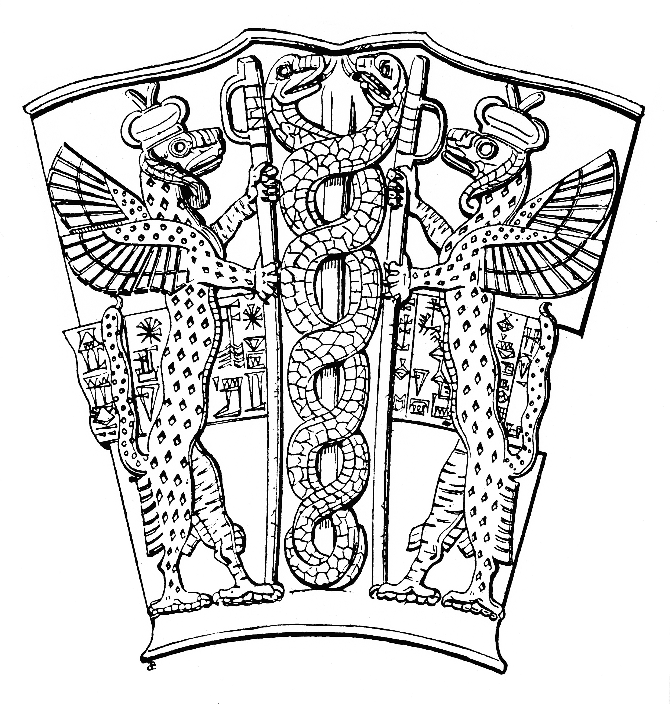

# Animals in the Bible

## License Information

Animals in the Bible © United Bible Societies, 2025. Adapted from: <cite>All Creatures Great and Small: Living Things in the Bible</cite>, by Edward R. Hope © 2005 United Bible Societies. This work is licensed under Creative Commons Attribution-ShareAlike 4.0 International (<a href="https://creativecommons.org/licenses/by-sa/4.0/">https://creativecommons.org/licenses/by-sa/4.0/</a>).

--------------------------------

## 標題：龍、海獸（dragon, sea monster） (id: FAUNA:7.2)

7\.2 標題：龍、海獸（dragon, sea monster）
=================================

經文出處
----

Hebrew 來：תַּנִּין (音譯：tannin)

[GEN 1:21](https://ref.ly/Gen1:21), [JOB 7:12](https://ref.ly/Job7:12), [PSA 74:13](https://ref.ly/Ps74:13), [PSA 148:7](https://ref.ly/Ps148:7), [ISA 27:1](https://ref.ly/Isa27:1), [ISA 51:9](https://ref.ly/Isa51:9), [JER 51:34](https://ref.ly/Jer51:34), [EZK 29:3](https://ref.ly/Ezek29:3), [EZK 32:2](https://ref.ly/Ezek32:2)

Greek 希：δράκων (音譯：drakōn)

[REV 12:3](https://ref.ly/Rev12:3), [REV 12:4](https://ref.ly/Rev12:4), [REV 12:7](https://ref.ly/Rev12:7), [REV 12:7](https://ref.ly/Rev12:7), [REV 12:9](https://ref.ly/Rev12:9), [REV 12:13](https://ref.ly/Rev12:13), [REV 12:16](https://ref.ly/Rev12:16), [REV 12:17](https://ref.ly/Rev12:17), [REV 13:2](https://ref.ly/Rev13:2), [REV 13:4](https://ref.ly/Rev13:4), [REV 13:11](https://ref.ly/Rev13:11), [REV 16:13](https://ref.ly/Rev16:13), [REV 20:2](https://ref.ly/Rev20:2), [ESG 1:1](https://ref.ly/EsthGr1:1), [ESG 10:3](https://ref.ly/EsthGr10:3), [SIR 25:16](https://ref.ly/Sir25:16), [BEL 1:23](https://ref.ly/Bel1:23), [BEL 1:25](https://ref.ly/Bel1:25), [BEL 1:27](https://ref.ly/Bel1:27), [BEL 1:27](https://ref.ly/Bel1:27), [BEL 1:28](https://ref.ly/Bel1:28)

Greek 希：κῆτος (音譯：kētos)

[SIR 43:25](https://ref.ly/Sir43:25), [3MA 6:8](https://ref.ly/3Macc6:8), [MAN 3:57](https://ref.ly/PrMan3:57)

Latin 拉：draco

[2ES 15:29](https://ref.ly/2Esd15:29), [2ES 15:31](https://ref.ly/2Esd15:31)

Latin 拉：monstrum

[2ES 5:8](https://ref.ly/2Esd5:8)

討論
--

[EXO 7:1](https://ref.ly/Exod7:1) 中的*tannin* 一詞傳統上被譯為「蛇」；在[DEU 32:33](https://ref.ly/Deut32:33) 和[PSA 91:13](https://ref.ly/Ps91:13) 中，這個詞被譯為「毒蛇」，與另一個表示「蛇」的詞平行。（參[4\.9 蛇 (snake)](#FAUNA:4.9) 。）在[NEH 2:13](https://ref.ly/Neh2:13) 和[LAM 4:3](https://ref.ly/Lam4:3) ，*tannin* 的意思是「野狗」。除此之外，*tannin* 在其他所有經文中都用來指神話中的海怪。很有可能，*tannin* 是所有這些神秘海獸的統稱，而貝希摩斯（*behemoth* ）和力威亞探（*livyathan* ）是兩個特定怪獸的名字。從後來的拉比文獻可見，人們對這些怪獸的觀念有了延伸和發展，並被用在啟示文學作品中，怪獸在這些作品中代表以色列的敵人。

猶太學者卡塞圖（Cassuto）和哈沙姆（Hacham）在所著《出埃及記》註釋中提出了另外一種可能性。他們注意到，雖然經文講到摩西的杖在曠野變成了一條*nahash* ，但是在尼羅河岸（[EXO 7:0](https://ref.ly/Exod7:0) ），亞倫的杖卻是變成了一個*tannin* 。根據他們的解釋，*tannin* 是指「鱷魚」。這樣，每一個神蹟都符合各自的情境：曠野中的蛇，河邊的鱷魚。哈沙姆還指出，在[EZK 29:3](https://ref.ly/Ezek29:3) ，法老被稱為「臥在自己江河中的海怪」（「海怪」原文為*tanim* ），並且埃及人過去敬拜鱷魚。雖然沒有一個譯本採用這個提議，但應該對此予以認真的考慮。（鱷魚的圖片參[7\.3 力威亞探 (leviathan)](#FAUNA:7.3) 。）

[SIR 25:16](https://ref.ly/Sir25:16) 中的希臘文*drakōn* 一詞在NEB (New English Bible (1970)) 被譯為"snake"（「蛇」），然而在所有其他英文譯本中都被譯為"dragon"（「龍」）。在《希伯來聖經》的希臘文《七十士譯本》中，通常用*drakōn* 一詞來翻譯希伯來文*tannin* 。

希臘文*kētos* 泛指任何巨大的受造物。在大多數情況下，這詞用來指海中的怪獸，但在[MAN 3:57](https://ref.ly/PrMan3:57) 中，NEB (New English Bible (1970)) 將這個詞翻譯為"whale"（「鯨魚」）。

描述
--

聖經中沒有關於這些神秘怪獸的詳細描述，但是有幾處經文略微提到它們的外形特徵，暗示它們被認爲是生活在海中的某種巨蛇。

特殊意義或象徵意義
---------

猶太人認為海獸或龍是：（1）存在於創世初期的混沌的化身；（2）象徵以色列的敵對邦國。新約取用了第二種看法並略加改變，使龍成為與耶穌基督的教會爭戰的邪惡勢力的象徵。

翻譯
--

大多數譯本使用了一個意為海獸的短語，或是一個描述性的短語，如「巨大的海洋動物」或「巨大的海蛇」。在有些文化中，龍象徵繁榮昌盛；而在其他一些文化中，海獸或巨蛇代表仁慈的靈，通常會帶來降雨。在這些文化背景中，有必要增加腳註，指出聖經經文中的怪獸象徵在創世初期存在的混沌（如果上下文清楚表明是這種情況），或者代表以色列或教會的敵人（如果上下文清楚表明是這種情況）。

在《七十士譯本》中，*kētos* 一詞用來指[JON 2:0](https://ref.ly/Jonah2:0) 中的「大魚」。另參[5\.1 魚 (fish)](#FAUNA:5.1) 。

[LAM 4:3](https://ref.ly/Lam4:3) ：這裡應作*tanim* 「野狗」而不是*tannin* 「海獸」（比較RSV (Revised Standard Version (1952)) 、JB (Jerusalem Bible (1966)) 、NIV (New International Version (1984)) 和HOTTP (Hebrew Old Testament Text Project (UBS)) ）。令人詫異的是，NEB (New English Bible (1970)) 和REB (Revised English Bible (1989)) 譯成了"whales"（「鯨魚」），這是不太可能的，而且也幾乎沒有解經家支持這種觀點。

* **Associated Passages:** 創世記 1:21; 約伯記 7:12; 詩篇 74:13; 詩篇 148:7; 以賽亞書 27:1; 以賽亞書 51:9; 耶利米書 51:34; 以西結書 29:3; 以西結書 32:2; 啟示錄 12:3; 啟示錄 12:4; 啟示錄 12:7; 啟示錄 12:9; 啟示錄 12:13; 啟示錄 12:16; 啟示錄 12:17; 啟示錄 13:2; 啟示錄 13:4; 啟示錄 13:11; 啟示錄 16:13; 啟示錄 20:2; 以斯帖記補篇 1:1; 以斯帖記補篇 10:3; 德訓篇 25:16; 彼勒與大龍 1:23; 彼勒與大龍 1:25; 彼勒與大龍 1:27; 彼勒與大龍 1:28; 德訓篇 43:25; 瑪加伯三書 6:8; 瑪納西禱文 3:57; 厄斯德拉下 15:29; 厄斯德拉下 15:31; 厄斯德拉下 5:8; 出埃及記 7:1; 申命記 32:33; 詩篇 91:13; 尼希米記 2:13; 耶利米哀歌 4:3; 出埃及記 7:0; 約拿書 2:0

