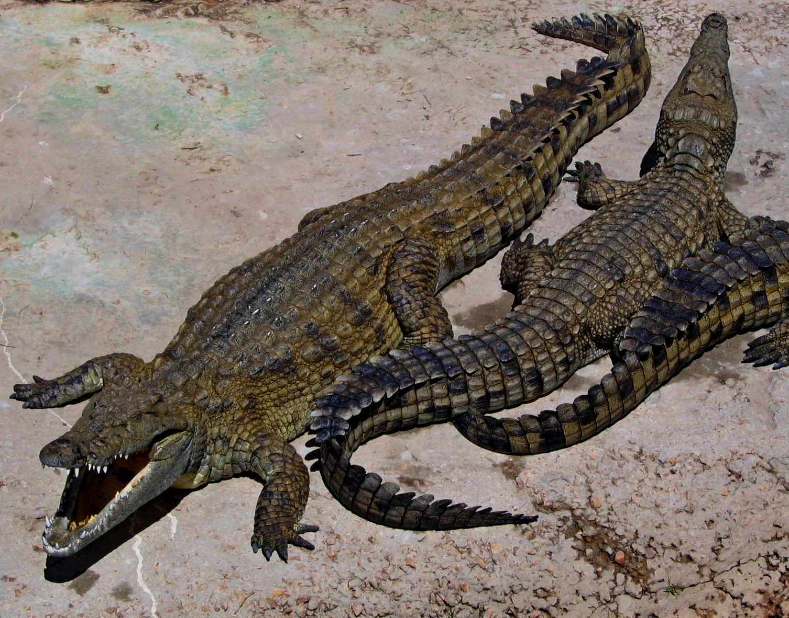

# Animals in the Bible

## License Information

Animals in the Bible © United Bible Societies, 2025. Adapted from: <cite>All Creatures Great and Small: Living Things in the Bible</cite>, by Edward R. Hope © 2005 United Bible Societies. This work is licensed under Creative Commons Attribution-ShareAlike 4.0 International (<a href="https://creativecommons.org/licenses/by-sa/4.0/">https://creativecommons.org/licenses/by-sa/4.0/</a>).

--------------------------------

## 標題：力威亞探（leviathan） (id: FAUNA:7.3)

7\.3 標題：力威亞探（leviathan）
=======================

經文出處
----

Hebrew 來：לִוְיָתָן (音譯：livyathan)

[JOB 3:8](https://ref.ly/Job3:8), [JOB 40:25](https://ref.ly/Job40:25), [PSA 74:14](https://ref.ly/Ps74:14), [PSA 104:26](https://ref.ly/Ps104:26), [ISA 27:1](https://ref.ly/Isa27:1), [ISA 27:1](https://ref.ly/Isa27:1)

Latin 拉：Leviathan

[2ES 6:49](https://ref.ly/2Esd6:49), [2ES 6:52](https://ref.ly/2Esd6:52)

討論
--

學者對這個詞的具體含義有分歧，但所有人都同意，這詞指的是一種生活在水中的怪獸。這個詞似乎與一個意為「扭曲」的希伯來文詞根有關。有些學者認為，力威亞探（*livyathan* ）這個概念與古埃及神話中的一隻巨大鱷魚有關；古埃及人相信，這隻鱷魚造成每年一次的尼羅河水氾濫，以及日食的出現。[JOB 40:25](https://ref.ly/Job40:25) （《和》41:1）和[PSA 74:14](https://ref.ly/Ps74:14) 支持這種看法。在[PSA 74:13](https://ref.ly/Ps74:13); [PSA 74:14](https://ref.ly/Ps74:14) ，*livyathan* （力威亞探）與另一個詞*tannin* （「大魚」）平行，後者指的是一種生活在水中的怪獸。根據[EZK 29:3](https://ref.ly/Ezek29:3) 的描繪，*tanim* 具有堅硬的腮頰和鱗片。許多解經家都指出了*tanim* 與鱷魚的相似之處。

還有學者將這個怪獸與巴比倫神話中的混沌龍提亞瑪特（Tiamat）聯繫起來。烏加列文獻提到一個類似的怪獸叫做羅坦（*lotan* ），即烏加列文化中的力威亞探（*livyathan* ）。這似乎是[ISA 27:1](https://ref.ly/Isa27:1) 所指的對象。可能聖經取了這個名稱的兩種含義。

在[JOB 40:25](https://ref.ly/Job40:25) （《和》41:1）中，NEB (New English Bible (1970)) 和REB (Revised English Bible (1989)) 將這個詞語譯為"whale"（「鯨魚」），這樣的做法太過激進，特別是這兩個譯本在前一章將貝希摩斯（*behemoth* ）翻譯為鱷魚。這些譯法幾乎沒有學術上的支持。

猶太學者普遍認為，*tannin* 是表示「海獸」的比較通用的名稱，而貝希摩斯（*behemoth* ）和力威亞探（*livyathan* ）是其中兩個怪獸的名稱。從[2ES 6:49](https://ref.ly/2Esd6:49); [2ES 6:52](https://ref.ly/2Esd6:52) 就可以看出這一點，這裡的力威亞探（*leviathan* ）顯然是其中一個怪獸的專有名稱。

描述
--

鱷魚是世界上體型最大的爬行動物。生活在尼羅河谷的鱷魚是尼羅鱷（學名*Crocodylus niloticus* ）。在聖經時期，這些鱷魚也生活在以色列地較大的河流裡；另一種鱷魚生活在美索不達米亞的底格里斯河和幼發拉底河。

鱷魚看起來像是長著很大牙齒的巨型蜥蜴，體長通常超過5米（16英呎），皮膚覆蓋著厚厚的肉質鱗片。鱷魚棲居在河流裡面以及河流的入海口，每天從水裡爬到陸地上，曬很長時間的太陽。鱷魚可以潛在水中10分鐘或更長時間。

鱷魚有時在水中捕食魚類，有時全身或部分潛在水下，等到有動物或人來喝水時，突然躍出水面咬住獵物，並將其拋進或拖進水中淹死。之後，鱷魚將獵物卡在木頭下面，或者卡在岩石或蘆葦之間，咬住獵物反覆扭動身軀，將肉大塊大塊地撕扯下來，然後直接囫圇吞下。在這些鱷魚生活的地區，每年都有人喪命鱷口。

然而，埃及人的巨鱷並不是一條真正的鱷魚，而是傳說中的一個龐然大物，與尼羅河每年的氾濫有關。人們相信牠大到一個地步，一爬進尼羅河，就使河水漫過河岸。

特殊意義或象徵意義
---------

力威亞探象徵埃及，可能還象徵埃及的神明；另外，牠還象徵亞述和巴比倫這兩個強大的國家。因此，力威亞探象徵著以色列的勁敵。

翻譯
--

大多數譯本都對這個希伯來文詞語採用音譯而非意譯，但名稱本身對普通讀者來説並沒有什麽意義。在熟知鱷魚的文化中，翻譯者可以在《約伯記》和《詩篇》的經文中採用「巨型鱷魚力威亞探」這種更有意義的表述。然而在《以賽亞書》，經文已經把力威亞探稱為蛇（或爬行動物），這個名稱就可以單獨使用，不必多作解釋。在有些社會中，人們相信某種神秘的怪蛇或鱷魚引起河水的氾濫，此時可以使用這個神話怪獸的當地名稱，並在腳註中説明這個怪獸在希伯來文中是力威亞探，代表以色列的敵人。

* **Associated Passages:** 約伯記 3:8; 約伯記 40:25; 詩篇 74:14; 詩篇 104:26; 以賽亞書 27:1; 厄斯德拉下 6:49; 厄斯德拉下 6:52; 詩篇 74:13; 以西結書 29:3

